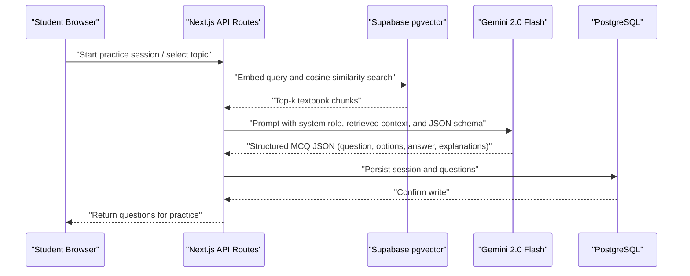
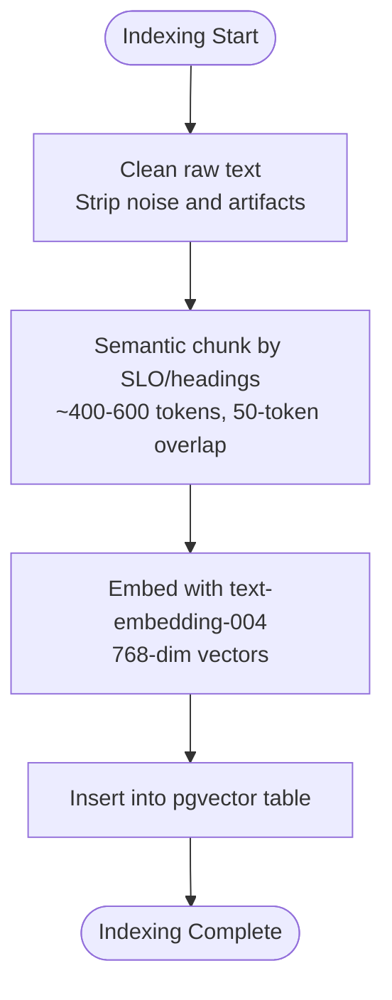
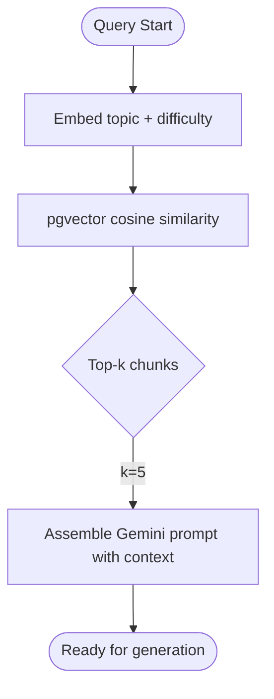
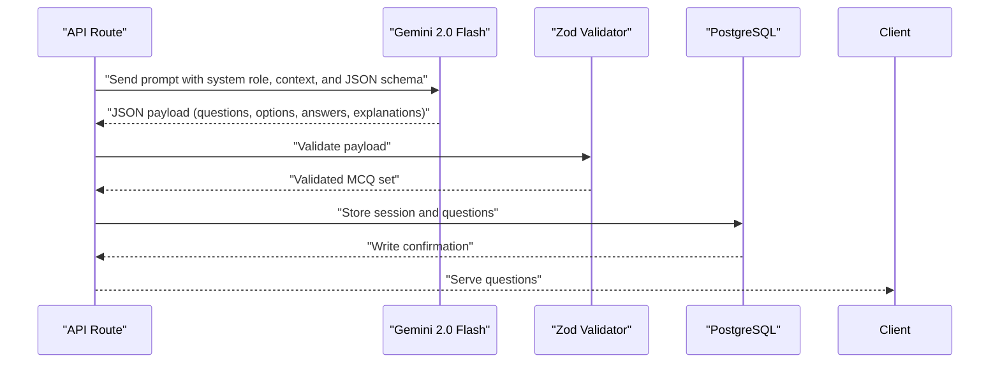
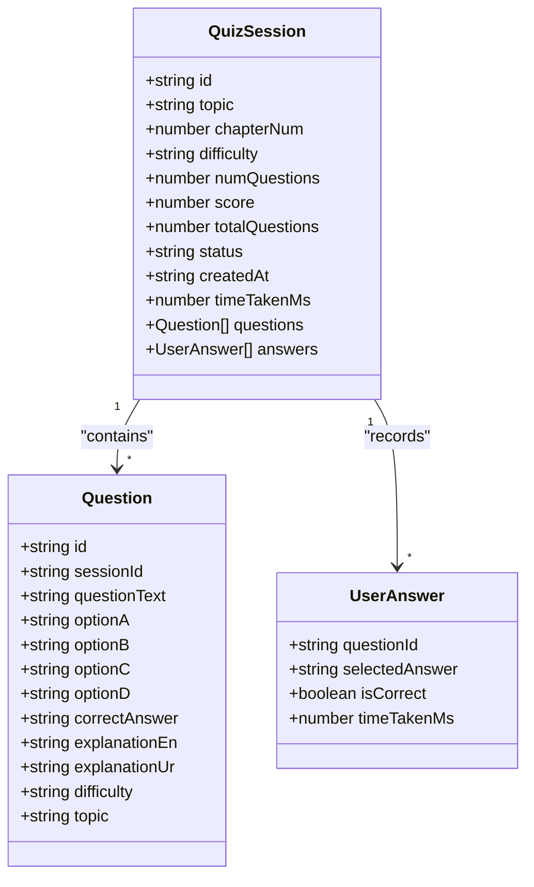
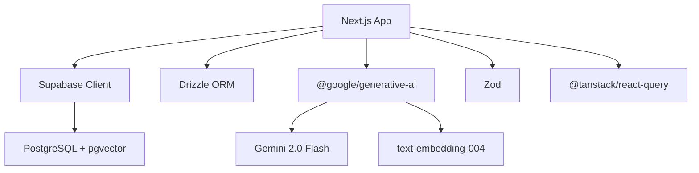

# AI Integration & RAG System

<cite>
**Referenced Files in This Document**
- [README.md](file://README.md)
- [package.json](file://package.json)
- [next.config.ts](file://next.config.ts)
- [src/middleware.ts](file://src/middleware.ts)
- [src/types/quiz.ts](file://src/types/quiz.ts)
- [src/lib/mock-data.ts](file://src/lib/mock-data.ts)
</cite>

## Table of Contents
1. Introduction
2. Project Structure
3. Core Components
4. Architecture Overview
5. Detailed Component Analysis
6. Dependency Analysis
7. Performance Considerations
8. Troubleshooting Guide
9. Conclusion

## Introduction
This document explains MedAce AI’s AI integration and Retrieval-Augmented Generation (RAG) system for generating MDCAT Biology multiple-choice questions grounded in the FSc Biology textbook corpus. It covers how 15 chapters are processed through text cleaning, semantic chunking by Student Learning Outcome (SLO) codes, embedding generation with Google’s text-embedding-004 model, vector storage in Supabase pgvector, similarity search at query time, and structured MCQ generation using Gemini 2.0 Flash with bilingual explanations. It also documents prompt engineering strategies that preserve exam authenticity while adding educational value, as well as technical details on vector storage, retrieval optimization, and quality assurance.

## Project Structure
The repository contains:
- Textbook source material under rag/textbooks for all 15 chapters used to build the RAG index.
- A Next.js application with pages for dashboard, practice sessions, results, and study planning.
- TypeScript types defining the data contracts for questions, sessions, and user answers.
- Configuration files for Next.js security headers and middleware for protected routes.
- A package manifest listing dependencies including Google Generative AI SDK, Drizzle ORM, Supabase client, Zod, and TanStack Query.

```mermaid
graph TB
subgraph "Textbook Corpus"
T1["Chapter_1_Digestive_System_of_Man_extracted.txt"]
T2["Chapter_2_Blood_Circulatory_System_of_Man_extracted.txt"]
T3["Chapter_3_Respiratory_System_of_Man_extracted.txt"]
T4["Chapter_4_Urinary_Sytem_of_Man_extracted.txt"]
T5["Chapter_5_Nervous_System_of_Man_extracted.txt"]
T6["Chapter_6_Endocrine_Sytem_of_Man_extracted.txt"]
T7["Chapter_7_Skeletal_System_of_Man_extracted.txt"]
T8["Chapter_8_Thermoregulation_Homeostasis_extracted.txt"]
T9["Chapter_9_Immunity_extracted.txt"]
T10["Chapter_10_Biotechnology_extracted.txt"]
T11["Chapter_11_Biostatistics_and_Data_Handling_extracted.txt"]
T12["Chapter_12_Structural_Computational_Biology_extracted.txt"]
T13["Chapter_13_Climate_Change_extracted.txt"]
T14["Chapter_14_Selected_Topics_extracted.txt"]
T15["Chapter_15_Pharmacological_Drugs_extracted.txt"]
end
subgraph "Next.js App"
Pages["Pages: dashboard, practice, results, study-plan"]
Types["Types: quiz.ts"]
Config["next.config.ts"]
MW["middleware.ts"]
end
T1 --> Pages
T2 --> Pages
T3 --> Pages
T4 --> Pages
T5 --> Pages
T6 --> Pages
T7 --> Pages
T8 --> Pages
T9 --> Pages
T10 --> Pages
T11 --> Pages
T12 --> Pages
T13 --> Pages
T14 --> Pages
T15 --> Pages
Pages --> Types
Pages --> Config
Pages --> MW
```

**Diagram sources**
- [README.md:163-226](file://README.md#L163-L226)

**Section sources**
- [README.md:163-226](file://README.md#L163-L226)
- [package.json:11-27](file://package.json#L11-L27)
- [next.config.ts:1-25](file://next.config.ts#L1-L25)
- [src/middleware.ts:1-41](file://src/middleware.ts#L1-L41)

## Core Components
- Data Source: 15 FSc Biology textbook chapters covering Human Physiology, Modern Topics, and Pharmacology.
- Build-Time Pipeline: Text cleaning, SLO-based semantic chunking, embedding via text-embedding-004, and upload into Supabase pgvector.
- Query-Time Pipeline: Embed a topic/difficulty query, retrieve top-k relevant chunks via cosine similarity, construct a Gemini prompt with retrieved context, generate structured MCQ JSON, validate with Zod, store, and serve.
- Storage: PostgreSQL with pgvector for embeddings; relational tables for users, sessions, questions, answers, weak topics, and study plans.
- Generation: Gemini 2.0 Flash for MCQs and bilingual explanations (English + Urdu).
- Validation: Zod schemas ensure consistent question structure and safe payloads.

Key implementation anchors:
- RAG pipeline description and steps
- Database schema overview
- Environment variables and dependencies

**Section sources**
- [README.md:83-122](file://README.md#L83-L122)
- [README.md:124-161](file://README.md#L124-L161)
- [README.md:228-244](file://README.md#L228-L244)
- [package.json:11-27](file://package.json#L11-L27)

## Architecture Overview
The system integrates a browser-based Next.js frontend with server-side API routes that orchestrate retrieval from pgvector and generation via Gemini. The flow ensures every generated question is grounded in syllabus-aligned textbook content.

**Diagram sources**
- [README.md:104-122](file://README.md#L104-L122)
- [README.md:124-161](file://README.md#L124-L161)

## Detailed Component Analysis

### Text Cleaning, Chunking, and Embedding (Build-Time Indexing)
- Input: 15 chapter .txt files under rag/textbooks.
- Cleaning: Remove watermarks, page markers, and OCR artifacts to produce clean text.
- Chunking: Split content by SLO codes and headings into ~400–600 token chunks with ~50-token overlap to preserve context boundaries aligned with MDCAT syllabus.
- Embedding: Use Google text-embedding-004 to produce 768-dimensional vectors per chunk.
- Upload: Insert chunks and embeddings into the textbook_chunks table in Supabase pgvector.

**Diagram sources**
- [README.md:90-102](file://README.md#L90-L102)

**Section sources**
- [README.md:90-102](file://README.md#L90-L102)

### Similarity Search and Retrieval Optimization (Query-Time)
- Query embedding: Convert the student’s topic and difficulty context into an embedding.
- Retrieval: Perform cosine similarity search over pgvector to fetch the most relevant textbook chunks.
- Top-k selection: Retrieve top 5 chunks to balance relevance and prompt length constraints.
- Optimization notes:
  - Use cosine similarity for semantic matching.
  - Keep chunk size within model context limits to avoid truncation.
  - Maintain small overlap to reduce redundancy while preserving continuity.

**Diagram sources**
- [README.md:104-122](file://README.md#L104-L122)

**Section sources**
- [README.md:104-122](file://README.md#L104-L122)

### MCQ Generation with Gemini 2.0 Flash and Structured Output
- Prompt construction:
  - System role defines the persona as an MDCAT biology MCQ generator.
  - Context includes retrieved textbook chunks to ground content.
  - Instruction specifies generating N MCQs with four options each.
  - Output format follows a strict JSON schema with fields for question, options, correct answer, and bilingual explanations.
- Model: Gemini 2.0 Flash selected for speed, cost efficiency, multilingual capability, and large context window.
- Validation: Zod validates the returned JSON against the expected schema before persisting or serving.

**Diagram sources**
- [README.md:104-122](file://README.md#L104-L122)
- [package.json:11-27](file://package.json#L11-L27)

**Section sources**
- [README.md:104-122](file://README.md#L104-L122)
- [package.json:11-27](file://package.json#L11-L27)

### Prompt Engineering Strategies for Exam Authenticity and Educational Value
- Exam authenticity:
  - English-only interface and MCQs mirror the real MDCAT experience.
  - Questions align with SLO codes to ensure direct syllabus coverage.
- Educational value:
  - Bilingual explanations (English + Urdu) help students who benefit from code-mixed language support.
  - Explanations clarify reasoning without altering the exam-style question format.
- Quality controls:
  - Strict JSON schema enforced by Zod to maintain consistency.
  - Grounding via retrieved textbook chunks reduces hallucination risk.

**Section sources**
- [README.md:15-22](file://README.md#L15-L22)
- [README.md:104-122](file://README.md#L104-L122)

### Data Models and Contracts
- Question model includes fields for question text, four options, correct answer, bilingual explanations, difficulty, and topic.
- Session model tracks topic, chapter number, difficulty, number of questions, score, status, timestamps, and associated questions/answers.
- Weak topic tracking supports adaptive learning by identifying areas needing more practice.

**Diagram sources**
- [src/types/quiz.ts:15-50](file://src/types/quiz.ts#L15-L50)

**Section sources**
- [src/types/quiz.ts:15-50](file://src/types/quiz.ts#L15-L50)

### Conceptual Overview
The RAG system bridges authoritative textbook content with dynamic question generation. By anchoring prompts in retrieved chunks, it maintains fidelity to the MDCAT syllabus while offering tailored explanations. The design balances performance (fast model, efficient retrieval) with pedagogical goals (clear, bilingual explanations).

[No sources needed since this diagram shows conceptual workflow, not actual code structure]

## Dependency Analysis
- Frontend: Next.js 15 with React 19 and Tailwind CSS v4.
- Backend integrations: Supabase client and SSR helpers; Drizzle ORM for type-safe queries; PostgreSQL with pgvector for vector storage.
- AI services: Google Generative AI SDK for Gemini 2.0 Flash and text-embedding-004.
- Validation and forms: Zod for runtime validation; React Hook Form with resolvers for type-safe forms.
- State management: TanStack Query for caching and optimistic updates.

**Diagram sources**
- [package.json:11-27](file://package.json#L11-L27)

**Section sources**
- [package.json:11-27](file://package.json#L11-L27)
- [README.md:23-77](file://README.md#L23-L77)

## Performance Considerations
- Model choice: Gemini 2.0 Flash provides faster inference and lower cost compared to larger models, with strong multilingual output suitable for bilingual explanations.
- Embeddings: text-embedding-004 produces compact 768-dim vectors, reducing storage and improving retrieval speed.
- Retrieval: Cosine similarity in pgvector enables SQL-native vector queries without external services.
- Chunking strategy: ~400–600 token chunks with 50-token overlap balance context preservation and prompt efficiency.
- Validation: Zod minimizes downstream errors and ensures consistent payloads, reducing retries and latency.

[No sources needed since this section provides general guidance]

## Troubleshooting Guide
- Authentication routing: Middleware currently allows all routes in development; when integrating Supabase Auth, enable session checks for protected routes to prevent unauthorized access.
- Security headers: next.config.ts sets restrictive security headers (X-Frame-Options, X-Content-Type-Options, Referrer-Policy, Permissions-Policy) to harden the app.
- Environment configuration: Ensure environment variables for Supabase, database URL, and Gemini API key are correctly set before running migrations and building the RAG index.

**Section sources**
- [src/middleware.ts:1-41](file://src/middleware.ts#L1-L41)
- [next.config.ts:1-25](file://next.config.ts#L1-L25)
- [README.md:228-244](file://README.md#L228-L244)

## Conclusion
MedAce AI’s RAG system grounds MCQ generation in verified textbook content, ensuring alignment with the MDCAT syllabus while enhancing understanding through bilingual explanations. The architecture leverages efficient vector retrieval in pgvector, robust validation with Zod, and a fast, multilingual model (Gemini 2.0 Flash) to deliver authentic exam practice with meaningful educational support. With clear chunking strategies, structured prompts, and secure configuration, the system balances performance, accuracy, and pedagogy.