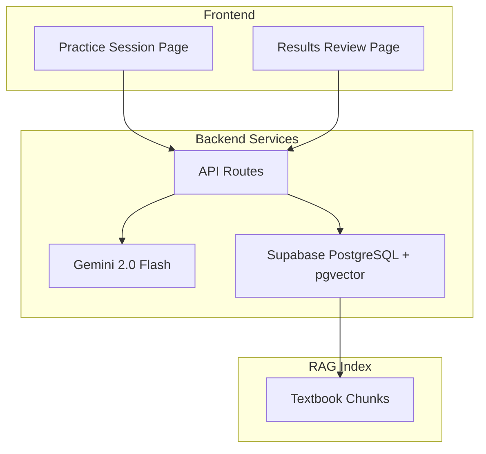
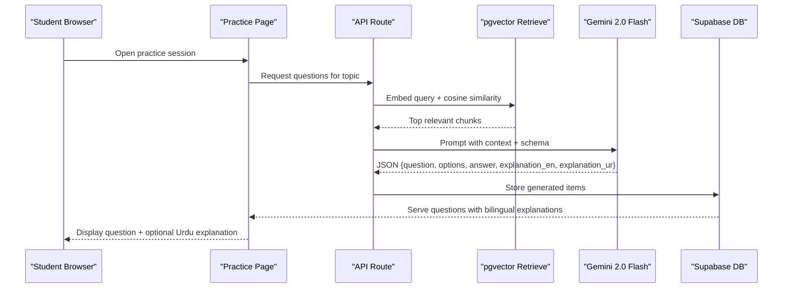
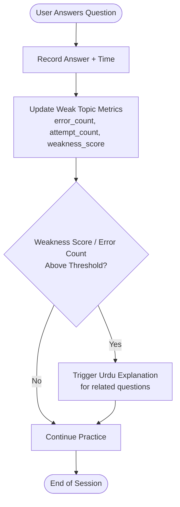
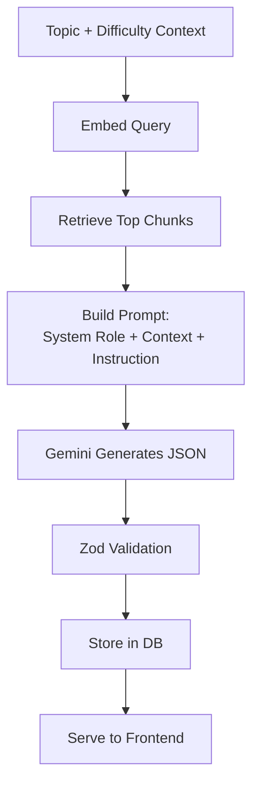
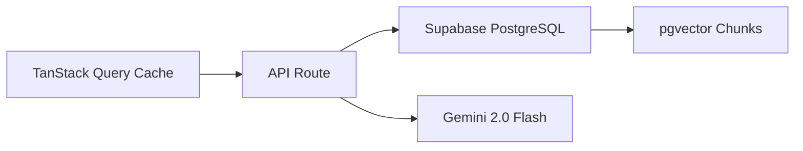
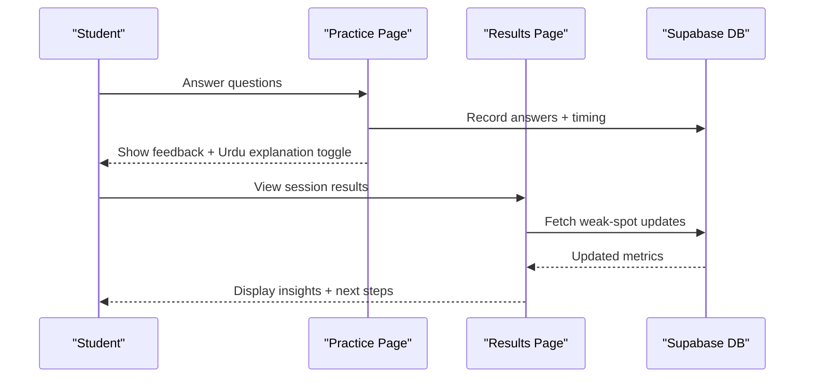
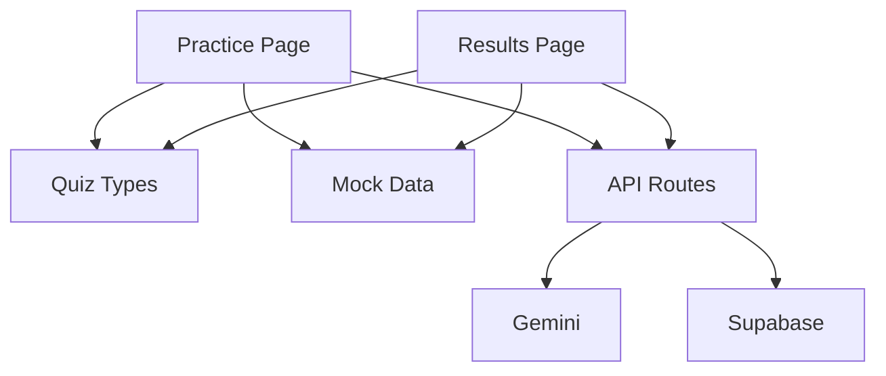

# Bilingual Explanation System

<cite>
**Referenced Files in This Document**
- [README.md](file://README.md)
- [page.tsx (practice session)](file://src/app/practice/[session]/page.tsx)
- [page.tsx (results session)](file://src/app/results/[session]/page.tsx)
- [mock-data.ts](file://src/lib/mock-data.ts)
- [quiz.ts](file://src/types/quiz.ts)
- [dashboard page.tsx](file://src/app/dashboard/page.tsx)
</cite>

## Table of Contents
1. [Introduction](#introduction)
2. [Project Structure](#project-structure)
3. [Core Components](#core-components)
4. [Architecture Overview](#architecture-overview)
5. [Detailed Component Analysis](#detailed-component-analysis)
6. [Dependency Analysis](#dependency-analysis)
7. [Performance Considerations](#performance-considerations)
8. [Troubleshooting Guide](#troubleshooting-guide)
9. [Conclusion](#conclusion)

## Introduction
This document explains MedAce AI’s bilingual explanation generation system for MDCAT Biology. The system provides English–Urdu code-mixed explanations that keep technical terms in English while explaining reasoning in Urdu. It is designed to activate when students struggle with specific topics or repeatedly answer incorrectly, and it integrates with adaptive weak-spot tracking to guide future practice. The documentation covers the adaptive triggering mechanism, prompt engineering approach, storage and caching strategies, and integration points with the weak spot system.

## Project Structure
The bilingual explanation feature spans UI components, data models, and backend services:
- Frontend pages expose “Explain in Urdu” toggles during practice and results review.
- Data models define question structures with both English and Urdu explanations.
- Backend architecture (documented in README) describes RAG-based MCQ generation and Urdu explanation generation via Gemini, retrieval from textbook chunks, and persistence in Supabase PostgreSQL with pgvector.

**Diagram sources**
- [README.md:23-55](file://README.md#L23-L55)
- [README.md:104-122](file://README.md#L104-L122)
- [page.tsx (practice session):190-213](file://src/app/practice/[session]/page.tsx#L190-L213)
- [page.tsx (results session):262-284](file://src/app/results/[session]/page.tsx#L262-L284)

**Section sources**
- [README.md:23-55](file://README.md#L23-L55)
- [README.md:104-122](file://README.md#L104-L122)
- [page.tsx (practice session):190-213](file://src/app/practice/[session]/page.tsx#L190-L213)
- [page.tsx (results session):262-284](file://src/app/results/[session]/page.tsx#L262-L284)

## Core Components
- Question model with bilingual explanations: Questions include fields for English and Urdu explanations, enabling on-demand display in the UI.
- Practice session UI: Provides an “Explain in Urdu” toggle per question to show Urdu reasoning alongside the English explanation after submission.
- Results review UI: Offers per-question Urdu explanation toggles to support post-session learning and reflection.
- Weak-spot tracking: Dashboard displays weak topics with error counts and weakness scores; results screen indicates updates to weak spots after sessions.

Key implementation references:
- Question structure includes explanation fields and topic metadata.
- Practice and results pages render bilingual explanations conditionally.
- Dashboard visualizes weak topics and progress metrics.

**Section sources**
- [mock-data.ts:69-210](file://src/lib/mock-data.ts#L69-L210)
- [quiz.ts:54-58](file://src/types/quiz.ts#L54-L58)
- [page.tsx (practice session):190-213](file://src/app/practice/[session]/page.tsx#L190-L213)
- [page.tsx (results session):262-284](file://src/app/results/[session]/page.tsx#L262-L284)
- [dashboard page.tsx:92-139](file://src/app/dashboard/page.tsx#L92-L139)

## Architecture Overview
MedAce AI uses Retrieval-Augmented Generation (RAG) to ground MCQs and explanations in real textbook content. The pipeline:
- Build-time indexing cleans, chunks, embeds, and uploads textbook content into pgvector.
- Query-time retrieval fetches relevant chunks based on topic/difficulty context.
- Gemini generates structured outputs including both English and Urdu explanations.
- Outputs are validated and stored in the database for later retrieval by the frontend.

**Diagram sources**
- [README.md:90-122](file://README.md#L90-L122)
- [page.tsx (practice session):190-213](file://src/app/practice/[session]/page.tsx#L190-L213)

**Section sources**
- [README.md:90-122](file://README.md#L90-L122)

## Detailed Component Analysis

### Adaptive Triggering Mechanism
The system determines when to surface Urdu explanations based on user performance patterns:
- Repeated incorrect answers increase a topic’s weakness score and error count.
- When a student struggles with a specific topic, the app can trigger Urdu explanations to bridge understanding gaps without compromising exam preparation quality.
- The dashboard highlights weak topics and encourages targeted practice; results screens indicate weak-spot updates post-session.

**Diagram sources**
- [dashboard page.tsx:92-139](file://src/app/dashboard/page.tsx#L92-L139)
- [mock-data.ts:36-42](file://src/lib/mock-data.ts#L36-L42)
- [page.tsx (results session):129-151](file://src/app/results/[session]/page.tsx#L129-L151)

**Section sources**
- [dashboard page.tsx:92-139](file://src/app/dashboard/page.tsx#L92-L139)
- [mock-data.ts:36-42](file://src/lib/mock-data.ts#L36-L42)
- [page.tsx (results session):129-151](file://src/app/results/[session]/page.tsx#L129-L151)

### Prompt Engineering Approach
The prompt strategy ensures pedagogically sound explanations that maintain exam relevance:
- System role defines the generator as an MDCAT biology MCQ expert.
- Context includes retrieved textbook chunks to ground content.
- Instruction requests structured output with both English and Urdu explanations, preserving technical terms in English while explaining reasoning in Urdu.
- Output validation via Zod ensures consistent schema for downstream use.

**Diagram sources**
- [README.md:104-122](file://README.md#L104-L122)

**Section sources**
- [README.md:104-122](file://README.md#L104-L122)

### Storage and Caching Strategies
- Storage: Generated questions and bilingual explanations are persisted in Supabase PostgreSQL, linked to sessions and source chunks.
- Caching: TanStack Query caches API responses, supports optimistic updates, and reduces redundant calls.
- Vector store: pgvector stores embeddings for efficient retrieval of relevant textbook chunks during generation.

**Diagram sources**
- [README.md:57-77](file://README.md#L57-L77)
- [README.md:124-161](file://README.md#L124-L161)

**Section sources**
- [README.md:57-77](file://README.md#L57-L77)
- [README.md:124-161](file://README.md#L124-L161)

### Integration with Weak Spot Tracking
- After each session, weak-spot metrics are updated based on answers and time taken.
- Dashboard surfaces weak topics with progress bars and error ratios.
- Results screen communicates improvements and directs users to targeted practice.

**Diagram sources**
- [page.tsx (results session):129-151](file://src/app/results/[session]/page.tsx#L129-L151)
- [dashboard page.tsx:92-139](file://src/app/dashboard/page.tsx#L92-L139)

**Section sources**
- [page.tsx (results session):129-151](file://src/app/results/[session]/page.tsx#L129-L151)
- [dashboard page.tsx:92-139](file://src/app/dashboard/page.tsx#L92-L139)

## Dependency Analysis
The bilingual explanation system depends on:
- Frontend pages for user interaction and toggling explanations.
- Backend API routes orchestrating retrieval and generation.
- Gemini for multilingual explanation generation.
- Supabase for persistence and vector search.
- Mock data and types for development and type safety.

**Diagram sources**
- [page.tsx (practice session):190-213](file://src/app/practice/[session]/page.tsx#L190-L213)
- [page.tsx (results session):262-284](file://src/app/results/[session]/page.tsx#L262-L284)
- [mock-data.ts:69-210](file://src/lib/mock-data.ts#L69-L210)
- [quiz.ts:54-58](file://src/types/quiz.ts#L54-L58)

**Section sources**
- [page.tsx (practice session):190-213](file://src/app/practice/[session]/page.tsx#L190-L213)
- [page.tsx (results session):262-284](file://src/app/results/[session]/page.tsx#L262-L284)
- [mock-data.ts:69-210](file://src/lib/mock-data.ts#L69-L210)
- [quiz.ts:54-58](file://src/types/quiz.ts#L54-L58)

## Performance Considerations
- Use TanStack Query to cache API responses and reduce redundant Gemini calls.
- Limit chunk retrieval to top relevant contexts to minimize token usage and latency.
- Validate outputs early with Zod to avoid unnecessary processing.
- Monitor weak-spot thresholds to balance explanation triggers with user experience.

[No sources needed since this section provides general guidance]

## Troubleshooting Guide
Common issues and resolutions:
- Urdu explanations not appearing: Ensure the question object contains both explanation fields and that the UI toggle state is correctly managed.
- Weak-spot metrics not updating: Verify answer recording and session completion flows update the database.
- Slow response times: Check retrieval efficiency and Gemini prompt size; consider caching frequently accessed explanations.

**Section sources**
- [page.tsx (practice session):190-213](file://src/app/practice/[session]/page.tsx#L190-L213)
- [page.tsx (results session):262-284](file://src/app/results/[session]/page.tsx#L262-L284)
- [dashboard page.tsx:92-139](file://src/app/dashboard/page.tsx#L92-L139)

## Conclusion
MedAce AI’s bilingual explanation system enhances MDCAT Biology preparation by providing on-demand Urdu explanations that preserve technical terminology while clarifying reasoning. The adaptive triggering mechanism ties language support directly to performance patterns, ensuring timely and relevant help. With RAG-backed generation, robust storage, and caching, the system delivers high-quality, exam-aligned explanations that improve understanding without compromising authenticity.

[No sources needed since this section summarizes without analyzing specific files]