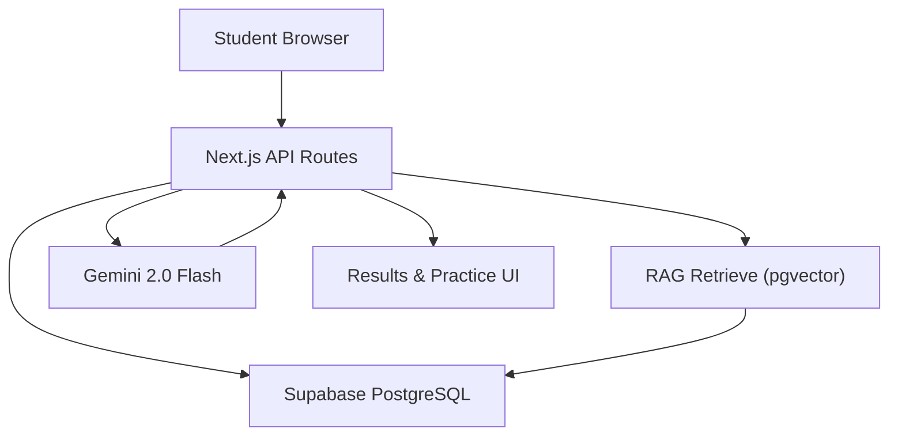
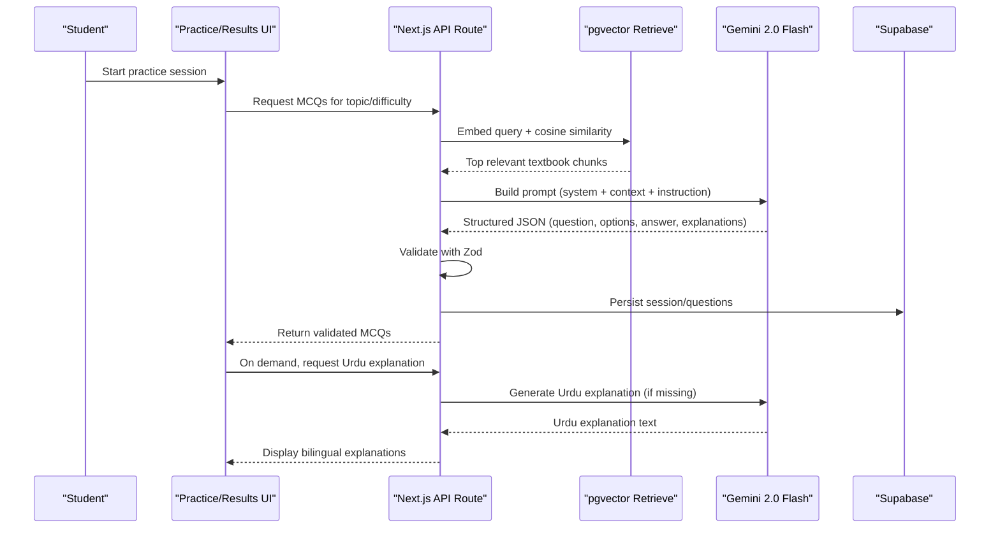
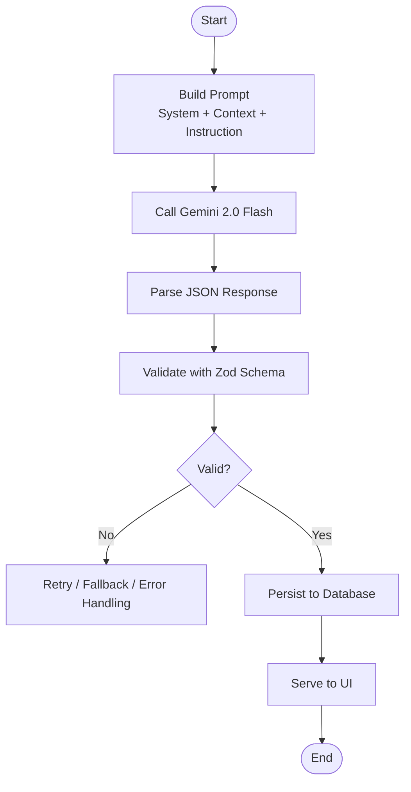
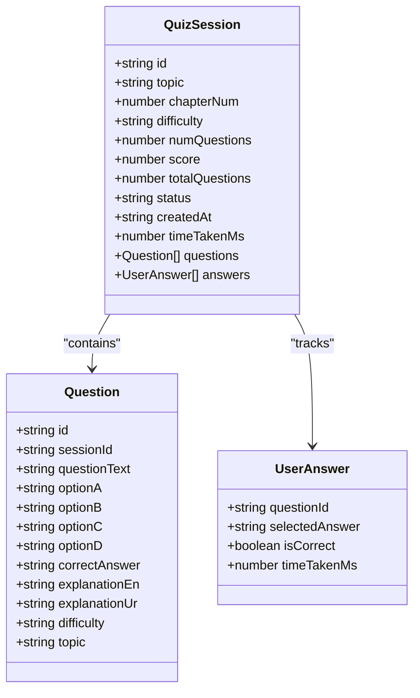
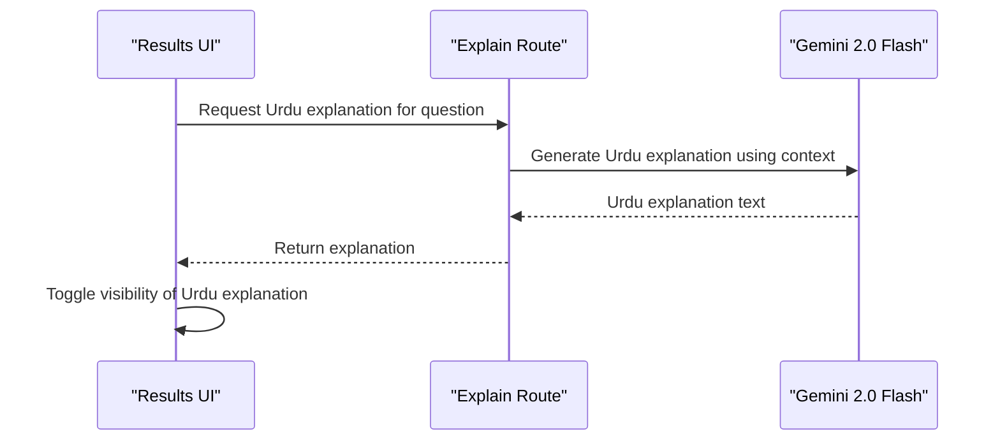
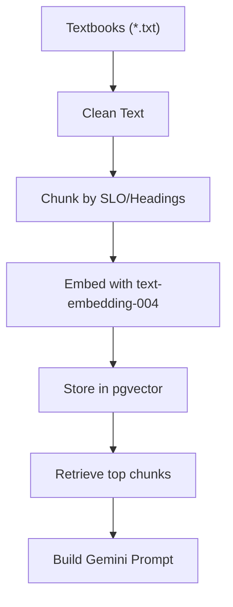
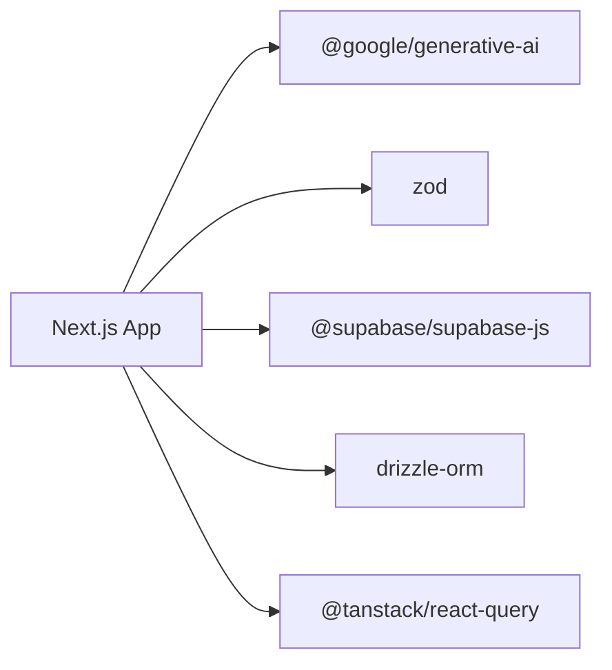

# Gemini API Integration

<cite>
**Referenced Files in This Document**
- [README.md](file://README.md)
- [quiz.ts](file://src/types/quiz.ts)
- [page.tsx (results)](file://src/app/results/[session]/page.tsx)
- [package.json](file://package.json)
</cite>

## Table of Contents
1. [Introduction](#introduction)
2. [Project Structure](#project-structure)
3. [Core Components](#core-components)
4. [Architecture Overview](#architecture-overview)
5. [Detailed Component Analysis](#detailed-component-analysis)
6. [Dependency Analysis](#dependency-analysis)
7. [Performance Considerations](#performance-considerations)
8. [Troubleshooting Guide](#troubleshooting-guide)
9. [Conclusion](#conclusion)

## Introduction
This document explains how MedAce AI integrates with Google Gemini 2.0 Flash to deliver two core capabilities:
- MCQ generation with structured JSON output grounded in MDCAT-aligned textbook content via Retrieval-Augmented Generation (RAG).
- Bilingual explanation generation that provides English and Urdu explanations for each question, enabling students to understand concepts while maintaining an authentic English-only exam experience.

The system uses prompt engineering to preserve MDCAT authenticity (English questions, four options, single correct answer) while adding educational value through concise, concept-focused explanations in both languages. Zod is used to validate generated outputs against a strict schema before storage or display.

**Section sources**
- [README.md:23-78](file://README.md#L23-L78)
- [README.md:104-122](file://README.md#L104-L122)

## Project Structure
MedAce AI’s integration spans the Next.js app routes, server-side logic, Gemini client, prompts, RAG retrieval, and validation layers. The repository structure indicates where these pieces live and how they interact during MCQ generation and explanation delivery.

**Diagram sources**
- [README.md:23-78](file://README.md#L23-L78)
- [README.md:163-226](file://README.md#L163-L226)

**Section sources**
- [README.md:163-226](file://README.md#L163-L226)

## Core Components
- Gemini 2.0 Flash usage: Powers MCQ generation and bilingual explanations.
- RAG pipeline: Retrieves relevant textbook chunks from pgvector to ground questions in syllabus-aligned content.
- Prompt templates: Define system instructions, context injection, and output constraints to ensure MDCAT authenticity and educational quality.
- Validation layer: Uses Zod to enforce a strict JSON schema for questions, options, correct answers, and explanations.
- Data models: TypeScript interfaces define the shape of questions, sessions, and answers consumed by the UI.

Key responsibilities:
- MCQ generation: Produce English-only questions with four options and one correct answer; include English and Urdu explanations.
- Explanation generation: Provide clear, code-mixed Urdu explanations when requested, preserving technical terms in English.
- Quality assurance: Validate all LLM outputs with Zod before persisting or rendering.

**Section sources**
- [README.md:104-122](file://README.md#L104-L122)
- [README.md:204-219](file://README.md#L204-L219)
- [quiz.ts:15-28](file://src/types/quiz.ts#L15-L28)

## Architecture Overview
The end-to-end flow for generating MCQs and explanations involves retrieval, prompting, generation, validation, and persistence.

**Diagram sources**
- [README.md:104-122](file://README.md#L104-L122)
- [README.md:163-226](file://README.md#L163-L226)

## Detailed Component Analysis

### Gemini 2.0 Flash Integration
- Purpose: Generate MDCAT-aligned MCQs and bilingual explanations.
- Inputs: Topic, difficulty, retrieved textbook chunks, and prompt templates.
- Outputs: Strictly structured JSON containing question text, four options, correct answer, and English/Urdu explanations.
- Constraints: Maintain English-only MCQs to mirror exam conditions; provide optional Urdu explanations for learning support.

**Diagram sources**
- [README.md:104-122](file://README.md#L104-L122)
- [README.md:204-219](file://README.md#L204-L219)

**Section sources**
- [README.md:104-122](file://README.md#L104-L122)
- [README.md:204-219](file://README.md#L204-L219)

### Prompt Engineering Strategies
- System role: Instructs the model to act as an MDCAT biology MCQ generator aligned with the curriculum.
- Context injection: Supplies retrieved textbook chunks to ground questions in real syllabus content.
- Output constraints: Enforces a fixed JSON schema with fields for question, options, correct answer, and bilingual explanations.
- Educational tone: Ensures explanations are concise, concept-focused, and avoid unnecessary verbosity.
- Language policy: Keeps MCQs and interface in English; offers Urdu explanations on demand to aid understanding without altering exam authenticity.

These strategies help maintain fidelity to MDCAT standards while delivering pedagogical value through explanations.

**Section sources**
- [README.md:104-122](file://README.md#L104-L122)
- [README.md:204-219](file://README.md#L204-L219)

### JSON Schema Validation with Zod
- Schema enforcement: All generated responses must conform to a strict schema defining question text, four options, a single correct answer, and bilingual explanations.
- Type safety: TypeScript interfaces define the expected shapes for questions and sessions, ensuring consistent data flow across the stack.
- Validation outcome: Responses failing validation are retried or rejected to prevent malformed content from reaching users.

**Diagram sources**
- [quiz.ts:15-50](file://src/types/quiz.ts#L15-L50)

**Section sources**
- [quiz.ts:15-50](file://src/types/quiz.ts#L15-L50)
- [README.md:104-122](file://README.md#L104-L122)

### Bilingual Explanation Generation (English–Urdu)
- English explanations: Always present to align with exam language and reinforce terminology.
- Urdu explanations: Provided on demand to improve comprehension for students who benefit from code-mixed language; technical terms remain in English.
- UI toggle: Results page includes a toggle to show/hide Urdu explanations per question.

**Diagram sources**
- [README.md:104-122](file://README.md#L104-L122)
- [page.tsx (results):258-284](file://src/app/results/[session]/page.tsx#L258-L284)

**Section sources**
- [page.tsx (results):258-284](file://src/app/results/[session]/page.tsx#L258-L284)
- [README.md:104-122](file://README.md#L104-L122)

### RAG-Powered Content Grounding
- Textbook source: 15 chapters of FSc Biology textbooks covering MDCAT domains.
- Chunking: Semantic chunking by SLO codes and headings ensures natural topic boundaries.
- Embeddings: Gemini text-embedding-004 produces vectors stored in pgvector.
- Retrieval: Cosine similarity returns top relevant chunks to inform prompt construction.

**Diagram sources**
- [README.md:83-102](file://README.md#L83-L102)
- [README.md:104-122](file://README.md#L104-L122)

**Section sources**
- [README.md:83-102](file://README.md#L83-L102)
- [README.md:104-122](file://README.md#L104-L122)

## Dependency Analysis
MedAce AI depends on several libraries and services to implement Gemini integration, validation, and data handling.

**Diagram sources**
- [package.json:249-277](file://package.json#L249-L277)

**Section sources**
- [package.json:249-277](file://package.json#L249-L277)

## Performance Considerations
- Model choice: Gemini 2.0 Flash is selected for speed, cost efficiency, and strong multilingual output, including Urdu.
- Context window: Large context capacity supports detailed prompts with rich textbook context.
- Retrieval efficiency: pgvector cosine similarity reduces token usage and improves relevance by limiting context to top chunks.
- Caching: TanStack Query can cache API responses to reduce redundant calls and improve perceived performance.
- Chunk size: ~400–600 tokens per chunk balances detail and efficiency while maintaining topical coherence.

[No sources needed since this section provides general guidance]

## Troubleshooting Guide
Common issues and mitigation strategies:
- Invalid JSON response: If Gemini returns malformed JSON, retry with stricter constraints or fallback to a simpler prompt. Ensure Zod validation catches schema mismatches early.
- Missing explanations: If Urdu explanations are absent, trigger on-demand generation via the explain route and cache results to avoid repeated calls.
- Rate limits: Implement retries with exponential backoff and queue requests if rate limits are hit. Monitor error responses and adjust concurrency accordingly.
- Poor relevance: Adjust retrieval parameters (top-k, threshold) and refine chunking strategy to improve context quality.
- UI state inconsistencies: Ensure the results page correctly toggles Urdu explanations and handles loading states gracefully.

**Section sources**
- [README.md:104-122](file://README.md#L104-L122)
- [page.tsx (results):258-284](file://src/app/results/[session]/page.tsx#L258-L284)

## Conclusion
MedAce AI’s Gemini 2.0 Flash integration delivers authentic MDCAT-style MCQs grounded in real textbook content, enhanced by bilingual explanations that support deeper understanding. The combination of RAG, strict prompt engineering, and Zod-based validation ensures high-quality, syllabus-aligned outputs. With careful attention to rate limiting, error handling, and response parsing, the system maintains reliability and educational integrity while providing a seamless student experience.

[No sources needed since this section summarizes without analyzing specific files]