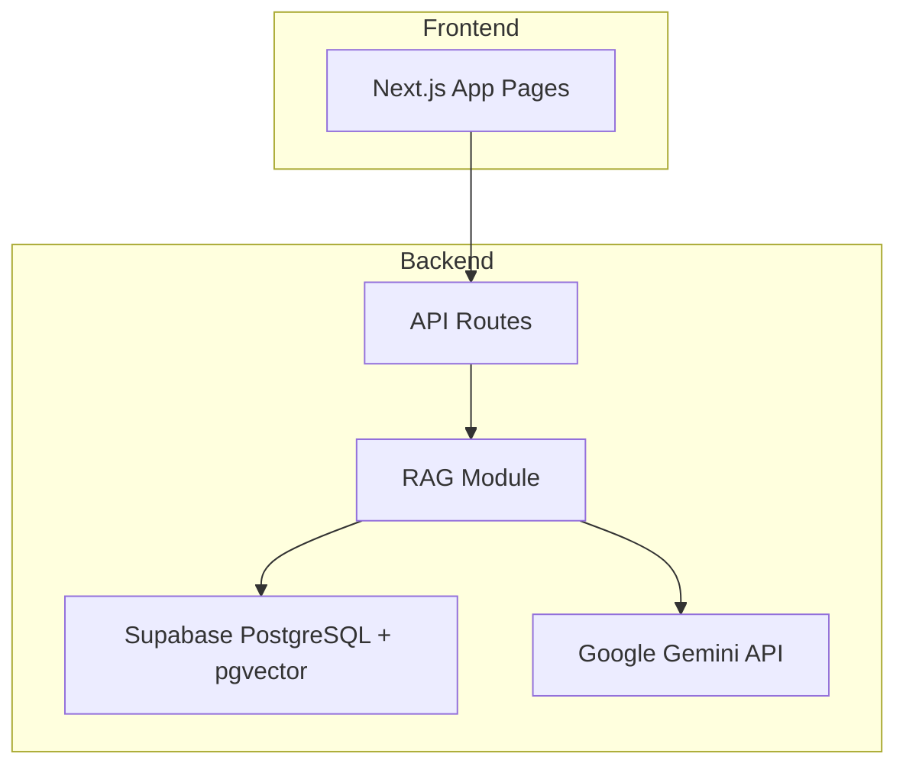
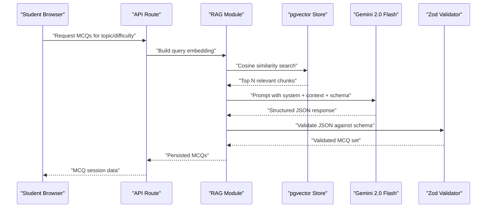
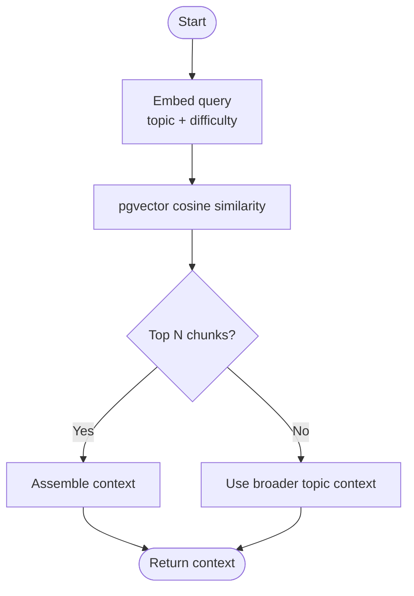
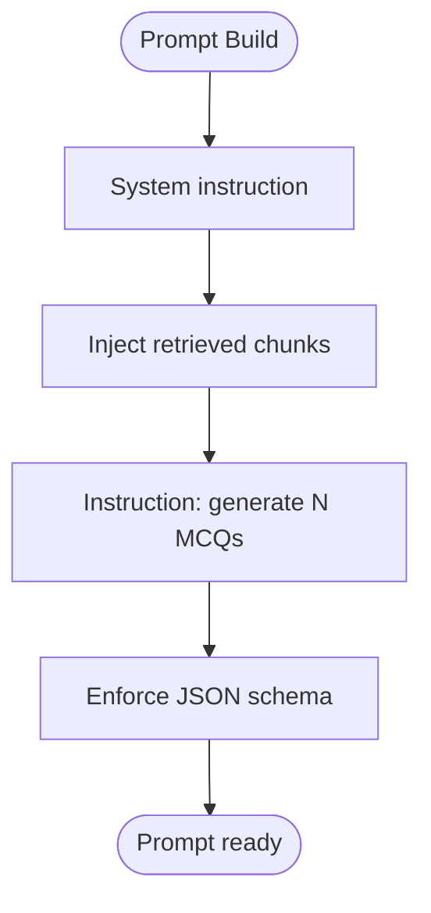
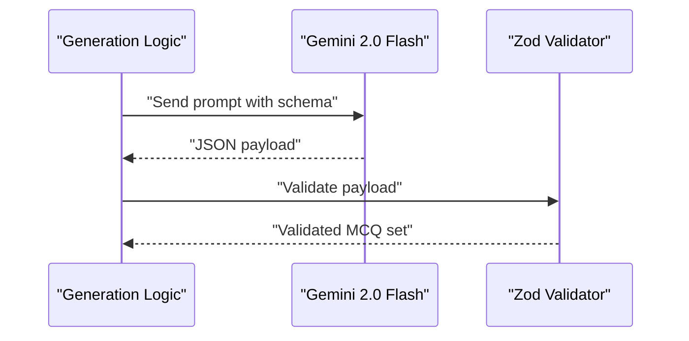
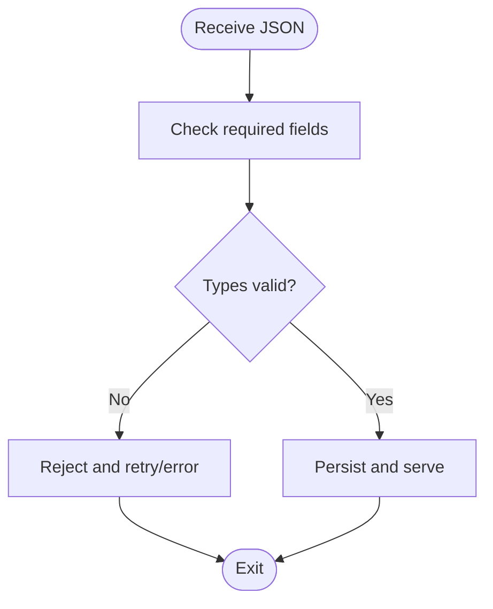
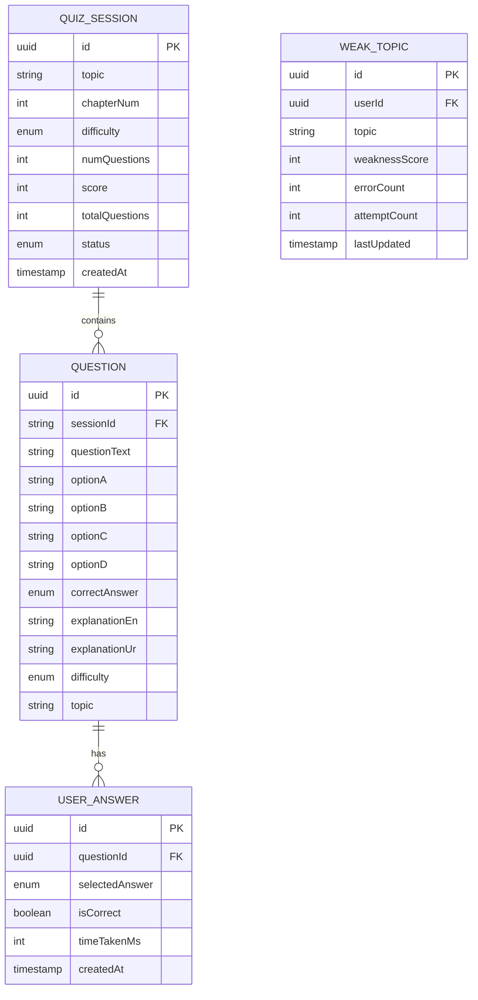
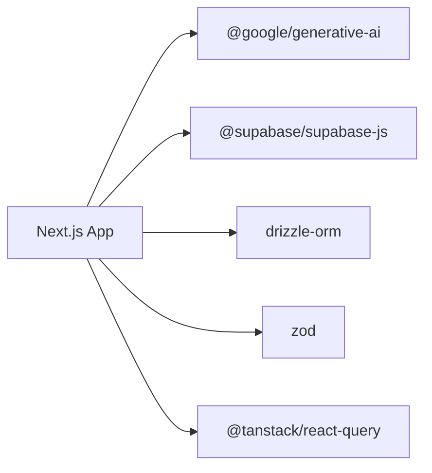

# MCQ Generation Engine

<cite>
**Referenced Files in This Document**
- [README.md](file://README.md)
- [package.json](file://package.json)
- [quiz.ts](file://src/types/quiz.ts)
</cite>

## Table of Contents
1. [Introduction](#introduction)
2. [Project Structure](#project-structure)
3. [Core Components](#core-components)
4. [Architecture Overview](#architecture-overview)
5. [Detailed Component Analysis](#detailed-component-analysis)
6. [Dependency Analysis](#dependency-analysis)
7. [Performance Considerations](#performance-considerations)
8. [Troubleshooting Guide](#troubleshooting-guide)
9. [Conclusion](#conclusion)
10. [Appendices](#appendices)

## Introduction
This document explains MedAce AI’s MCQ generation engine that uses Retrieval-Augmented Generation (RAG) with Google Gemini 2.0 Flash to produce MDCAT-aligned multiple-choice questions. The system retrieves relevant textbook chunks via pgvector similarity search, constructs prompts with system instructions and context, and returns structured JSON containing questions, options, correct answers, and bilingual explanations. A Zod-based validation layer ensures output conforms to MDCAT standards before storage and delivery.

The engine is designed for authenticity: questions mirror the real exam language and format, while explanations can be provided in English and Urdu to support deeper understanding. Difficulty adaptation and topic-specific customization are built into the prompt strategy and retrieval process.

## Project Structure
At a high level, the repository organizes content and code as follows:
- RAG data source: textbook chapters under rag/textbooks
- Application routes: Next.js app pages and API endpoints for quiz generation, explanation, study plan, and auth
- Library modules: Gemini client, prompt templates, RAG retrieval/generation logic, Drizzle schema/client, Supabase clients
- Types: TypeScript definitions for quiz entities and sessions
- Configuration: package dependencies and environment variables

**Diagram sources**
- [README.md:23-54](file://README.md#L23-L54)
- [README.md:163-226](file://README.md#L163-L226)

**Section sources**
- [README.md:163-226](file://README.md#L163-L226)

## Core Components
- RAG retrieval: Embeds the user query (topic + difficulty context) and performs cosine similarity search over textbook chunk embeddings stored in pgvector to retrieve the most relevant chunks.
- Prompt construction: Builds a Gemini prompt combining system instructions, retrieved context, and explicit output schema requirements to generate MCQs aligned with MDCAT standards.
- Generation: Calls Gemini 2.0 Flash to produce structured JSON with question text, four options, correct answer, and bilingual explanations.
- Validation: Uses Zod to validate the generated JSON against a strict schema ensuring correctness and completeness.
- Storage and serving: Persists validated results and serves them to the student interface.

Key data model elements used by the engine include Question, QuizSession, UserAnswer, and WeakTopic types, which define fields such as questionText, optionA–D, correctAnswer, explanationEn, explanationUr, difficulty, and topic.

**Section sources**
- [README.md:83-122](file://README.md#L83-L122)
- [quiz.ts:15-50](file://src/types/quiz.ts#L15-L50)

## Architecture Overview
The end-to-end flow from student interaction to MCQ delivery:

**Diagram sources**
- [README.md:104-122](file://README.md#L104-L122)
- [README.md:23-54](file://README.md#L23-L54)

## Detailed Component Analysis

### RAG Retrieval Pipeline
- Input: Topic selection or practice session parameters including difficulty context.
- Embedding: Query is embedded using the same embedding model used during indexing to ensure consistent vector space alignment.
- Similarity Search: Cosine similarity over pgvector returns top relevant textbook chunks.
- Output: Contextual excerpts that ground subsequent generation in syllabus-aligned content.

**Diagram sources**
- [README.md:90-122](file://README.md#L90-L122)

**Section sources**
- [README.md:90-122](file://README.md#L90-L122)

### Prompt Engineering Strategy
- System instruction: Establishes role as an MDCAT biology MCQ generator, enforcing exam-authentic style and structure.
- Context injection: Includes retrieved textbook chunks to keep content grounded in the official syllabus.
- Output schema: Requires JSON with fields for question, four options, correct answer, and bilingual explanations (English and Urdu).
- Difficulty adaptation: Adjusts complexity based on requested difficulty level while maintaining clarity and accuracy.
- Topic customization: Tailors questions to specific topics/chapters and aligns with SLO codes where applicable.

**Diagram sources**
- [README.md:113-122](file://README.md#L113-L122)

**Section sources**
- [README.md:113-122](file://README.md#L113-L122)

### Generation and Structured Output
- Model: Gemini 2.0 Flash generates MCQs with a strong emphasis on speed, cost-efficiency, and multilingual capability.
- Output: Structured JSON includes question text, four options, correct answer, and bilingual explanations.
- Quality guardrails: Schema enforcement ensures all required fields are present and correctly typed.

**Diagram sources**
- [README.md:113-122](file://README.md#L113-L122)

**Section sources**
- [README.md:113-122](file://README.md#L113-L122)

### Zod Schema Validation Process
- Purpose: Enforces that every generated MCQ conforms to MDCAT standards and application expectations.
- Fields validated: question text, four options, correct answer choice, bilingual explanations, difficulty, and topic.
- Outcome: Only validated MCQ sets are persisted and served; invalid responses are rejected and retried or handled via error pathways.

**Diagram sources**
- [README.md:117-122](file://README.md#L117-L122)
- [quiz.ts:15-50](file://src/types/quiz.ts#L15-L50)

**Section sources**
- [README.md:117-122](file://README.md#L117-L122)
- [quiz.ts:15-50](file://src/types/quiz.ts#L15-L50)

### Data Models and Relationships
The core types used across the pipeline include:
- Question: Contains identifiers, question text, options, correct answer, explanations, difficulty, and topic.
- QuizSession: Tracks session metadata, score, status, and associated questions and answers.
- UserAnswer: Records per-question selections, correctness, and timing.
- WeakTopic: Aggregates performance metrics to guide adaptive practice.

**Diagram sources**
- [quiz.ts:15-50](file://src/types/quiz.ts#L15-L50)

**Section sources**
- [quiz.ts:15-50](file://src/types/quiz.ts#L15-L50)

## Dependency Analysis
The engine depends on several key libraries and services:
- Google Generative AI SDK for calling Gemini models
- Supabase client for database and vector operations
- Drizzle ORM for type-safe queries and migrations
- Zod for runtime schema validation
- TanStack Query for state management and caching

**Diagram sources**
- [package.json:11-26](file://package.json#L11-L26)

**Section sources**
- [package.json:11-26](file://package.json#L11-L26)

## Performance Considerations
- Chunk size and overlap: Balanced to maximize retrieval relevance while minimizing token usage.
- Embedding dimensionality: 768-dim vectors reduce storage and improve query efficiency.
- Retrieval count: Limiting top chunks reduces prompt size and latency without sacrificing quality.
- Model selection: Gemini 2.0 Flash provides fast inference and lower cost compared to larger models.
- Caching: TanStack Query caches API responses to reduce redundant calls.

[No sources needed since this section provides general guidance]

## Troubleshooting Guide
Common issues and resolutions:
- Missing or invalid JSON fields: Ensure Zod schema matches expected fields; re-prompt if necessary.
- Low retrieval relevance: Adjust query embedding to include more precise topic/difficulty context; tune top-k retrieval.
- Rate limiting: Implement retries with exponential backoff; batch requests when possible; monitor quotas.
- Error handling: Log failures at each stage (retrieval, generation, validation); surface actionable errors to users.
- Response parsing: Validate and normalize outputs before persistence; handle partial or malformed responses gracefully.

[No sources needed since this section provides general guidance]

## Conclusion
MedAce AI’s MCQ generation engine combines RAG with Gemini 2.0 Flash to deliver authentic, syllabus-grounded questions tailored to MDCAT standards. The pipeline integrates pgvector retrieval, robust prompt engineering, and strict Zod validation to ensure quality and consistency. With thoughtful performance tuning and resilient error handling, the system supports scalable, personalized practice for students preparing for high-stakes exams.

[No sources needed since this section summarizes without analyzing specific files]

## Appendices

### Environment Variables
- Supabase URL and keys for database and authentication
- Database connection string for Drizzle ORM
- Gemini API key for model access
- Application base URL for frontend configuration

**Section sources**
- [README.md:228-244](file://README.md#L228-L244)