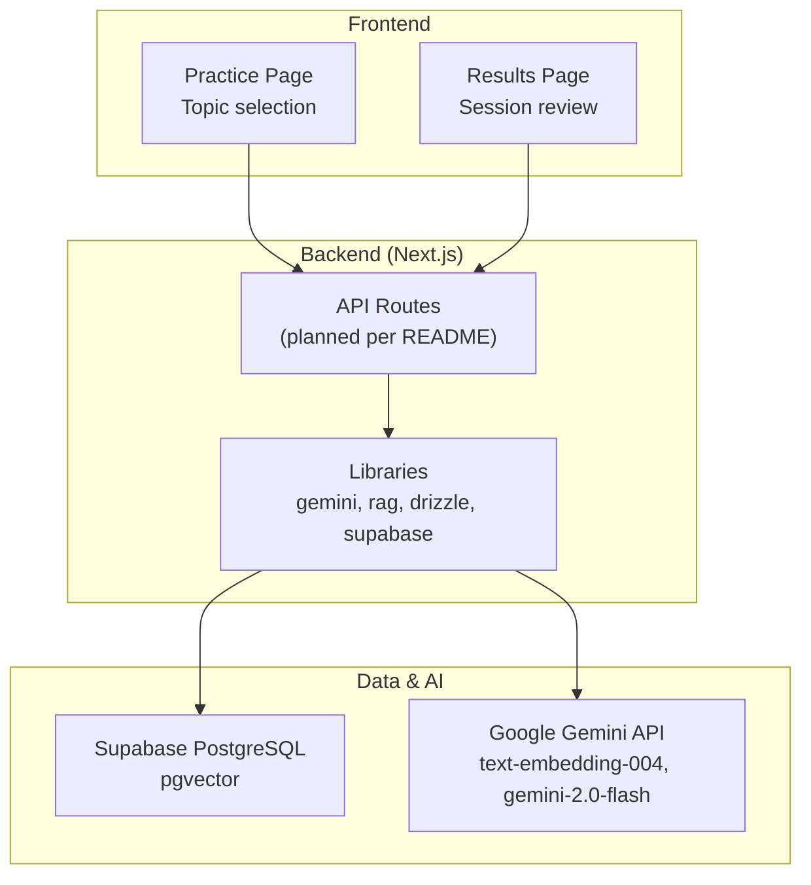
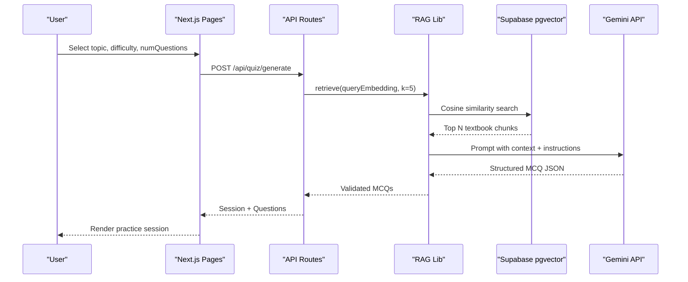
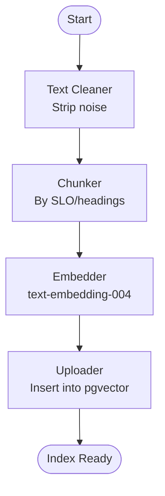
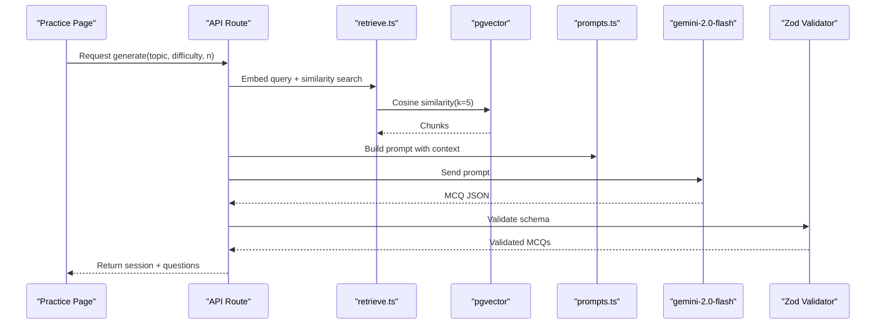
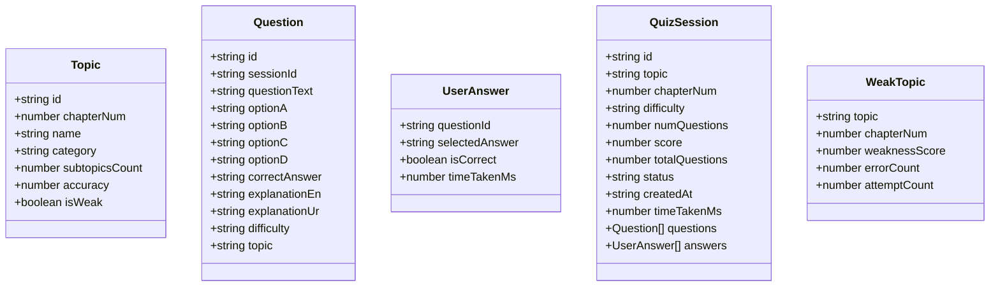
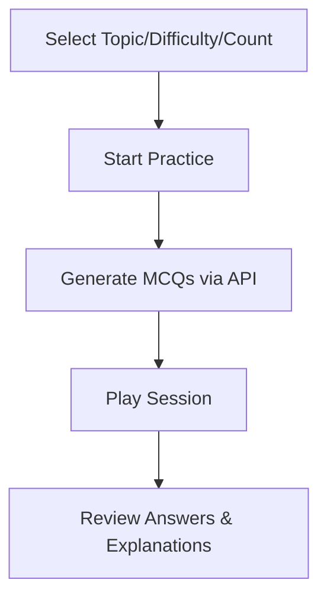
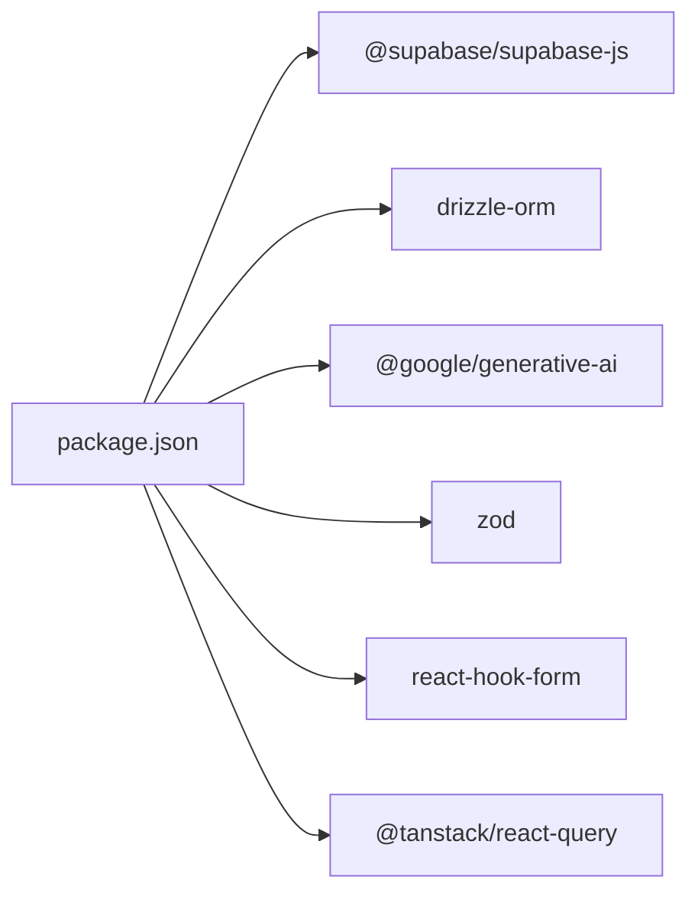

# RAG Pipeline Architecture

<cite>
**Referenced Files in This Document**
- [README.md](file://README.md)
- [package.json](file://package.json)
- [src/app/practice/page.tsx](file://src/app/practice/page.tsx)
- [src/types/quiz.ts](file://src/types/quiz.ts)
- [src/lib/mock-data.ts](file://src/lib/mock-data.ts)
</cite>

## Table of Contents
1. [Introduction](#introduction)
2. [Project Structure](#project-structure)
3. [Core Components](#core-components)
4. [Architecture Overview](#architecture-overview)
5. [Detailed Component Analysis](#detailed-component-analysis)
6. [Dependency Analysis](#dependency-analysis)
7. [Performance Considerations](#performance-considerations)
8. [Troubleshooting Guide](#troubleshooting-guide)
9. [Conclusion](#conclusion)

## Introduction
This document explains MedAce AI’s complete Retrieval-Augmented Generation (RAG) pipeline that powers MDCAT Biology MCQ generation. It covers the end-to-end flow from student topic selection to textbook chunk retrieval and AI-powered question generation, including both build-time indexing and query-time generation. The documentation highlights integration points between components, data flows, error handling strategies, and performance optimizations, with diagrams mapping to actual repository structure and documented behavior.

## Project Structure
The project is a Next.js 15 application with a clear separation between UI pages, shared components, types, and utilities. The RAG system integrates with Supabase (PostgreSQL + pgvector) for vector storage and Google Gemini for embeddings and generation. The README documents the intended API routes and library modules that implement the RAG logic; this section maps those concepts to the existing codebase and clarifies where each piece lives or will live.

**Diagram sources**
- [README.md:23-55](file://README.md#L23-L55)
- [README.md:163-226](file://README.md#L163-L226)

**Section sources**
- [README.md:23-55](file://README.md#L23-L55)
- [README.md:163-226](file://README.md#L163-L226)
- [package.json:1-42](file://package.json#L1-L42)

## Core Components
- Build-time indexing pipeline: text cleaning → chunking by SLO codes/headings → embedding via Gemini text-embedding-004 → upload into Supabase pgvector table textbook_chunks.
- Query-time generation pipeline: user selects topic/difficulty → embed query → cosine similarity search over pgvector → prompt construction with retrieved chunks → Gemini 2.0 Flash generates structured MCQ JSON → Zod validation → store and serve.
- Data models: Topic, Question, UserAnswer, QuizSession, WeakTopic define the shape of session data and questions used across the app.
- Frontend entry points: Practice page allows topic selection, difficulty, and number of questions; results page renders sessions and explanations.

Key responsibilities:
- Textbook ingestion and chunking are defined conceptually in the README and supported by the presence of chapter .txt files under rag/textbooks.
- Vector retrieval and generation are described as library functions in src/lib/rag and src/lib/gemini, integrated through API routes.
- Validation and persistence use Zod and Drizzle ORM against Supabase.

**Section sources**
- [README.md:83-122](file://README.md#L83-L122)
- [README.md:124-161](file://README.md#L124-L161)
- [README.md:163-226](file://README.md#L163-L226)
- [src/types/quiz.ts:1-58](file://src/types/quiz.ts#L1-L58)
- [src/app/practice/page.tsx:1-195](file://src/app/practice/page.tsx#L1-L195)

## Architecture Overview
The RAG architecture spans three layers:
- Client layer: Next.js pages for topic selection and session playback.
- Server layer: API routes orchestrate retrieval and generation using libraries for Gemini and database access.
- Data/AI layer: Supabase pgvector stores textbook chunk vectors; Gemini provides embeddings and generation.

**Diagram sources**
- [README.md:83-122](file://README.md#L83-L122)
- [README.md:163-226](file://README.md#L163-L226)

## Detailed Component Analysis

### Build-Time Indexing Pipeline
Purpose: Transform raw textbook chapters into indexed vectors for fast retrieval.

Steps:
1. Text Cleaning: Remove watermarks, page markers, OCR artifacts.
2. Chunking: Split content by SLO codes and headings into ~400–600 token chunks with overlap.
3. Embedding: Generate 768-dim vectors using Gemini text-embedding-004.
4. Upload: Insert into Supabase pgvector table textbook_chunks.

**Diagram sources**
- [README.md:90-102](file://README.md#L90-L102)

**Section sources**
- [README.md:90-102](file://README.md#L90-L102)

### Query-Time Generation Pipeline
Purpose: Generate syllabus-grounded MCQs based on student-selected topics and difficulty.

Flow:
1. Embed query (topic + difficulty).
2. Retrieve top 5 relevant chunks via pgvector cosine similarity.
3. Construct Gemini prompt with system instruction, context, and output schema.
4. Generate structured MCQ JSON.
5. Validate with Zod, persist, and return to client.

**Diagram sources**
- [README.md:104-122](file://README.md#L104-L122)
- [README.md:163-226](file://README.md#L163-L226)

**Section sources**
- [README.md:104-122](file://README.md#L104-L122)
- [README.md:163-226](file://README.md#L163-L226)

### Data Models and Types
The application defines core types for topics, questions, answers, sessions, and weak topics. These types ensure type safety across the frontend and inform the expected shape of generated MCQs.

**Diagram sources**
- [src/types/quiz.ts:1-58](file://src/types/quiz.ts#L1-L58)

**Section sources**
- [src/types/quiz.ts:1-58](file://src/types/quiz.ts#L1-L58)

### Frontend Integration Points
- Topic selection: The Practice page lets users choose a topic, difficulty, and number of questions, and indicates that questions are AI-generated via RAG.
- Session playback and results: Results page renders options, correctness, and explanations for each question.

**Diagram sources**
- [src/app/practice/page.tsx:1-195](file://src/app/practice/page.tsx#L1-L195)
- [README.md:163-226](file://README.md#L163-L226)

**Section sources**
- [src/app/practice/page.tsx:1-195](file://src/app/practice/page.tsx#L1-L195)
- [README.md:163-226](file://README.md#L163-L226)

## Dependency Analysis
External dependencies enable the RAG pipeline:
- Supabase client and SSR for database and auth.
- Drizzle ORM for schema and queries.
- Google Generative AI SDK for embeddings and generation.
- Zod for runtime validation.
- React Hook Form and resolvers for forms.
- TanStack Query for state management and caching.

**Diagram sources**
- [package.json:1-42](file://package.json#L1-L42)

**Section sources**
- [package.json:1-42](file://package.json#L1-L42)
- [README.md:23-78](file://README.md#L23-L78)

## Performance Considerations
- Chunk size and overlap: ~400–600 tokens per chunk with 50-token overlap balances retrieval precision and context window usage.
- Embedding dimensionality: 768-dim vectors reduce storage and improve query speed compared to higher dimensions.
- Retrieval count: Limiting to top 5 chunks reduces prompt size and latency while maintaining relevance.
- Model choice: Gemini 2.0 Flash offers faster, cheaper generation with strong multilingual support and large context windows.
- Database: pgvector enables native SQL-based similarity search within Supabase, avoiding extra services and reducing latency.
- Caching: TanStack Query can cache API responses and enable optimistic updates for smoother UX.

[No sources needed since this section provides general guidance]

## Troubleshooting Guide
Common issues and strategies:
- Missing environment variables: Ensure NEXT_PUBLIC_SUPABASE_URL, NEXT_PUBLIC_SUPABASE_ANON_KEY, SUPABASE_SERVICE_ROLE_KEY, DATABASE_URL, and GEMINI_API_KEY are set before running migrations and building the index.
- Index not built: Run the build-time scripts in order: clean → chunk → embed → upload. Verify textbook files exist under rag/textbooks and that pgvector extension is enabled.
- Retrieval failures: Confirm textbook_chunks table exists and contains embeddings; validate vector column type and index configuration.
- Generation errors: Check Gemini API key permissions and quotas; validate prompt templates and output schema; ensure Zod validation passes.
- Validation failures: Inspect Zod error messages to align generated JSON with expected schema; adjust prompts if necessary.

**Section sources**
- [README.md:228-244](file://README.md#L228-L244)
- [README.md:292-314](file://README.md#L292-L314)

## Conclusion
MedAce AI’s RAG pipeline grounds MCQ generation in real textbook content, ensuring syllabus-aligned practice. The build-time indexing pipeline prepares high-quality chunks and vectors, while the query-time pipeline retrieves relevant context and generates validated MCQs efficiently. Integrating Supabase pgvector with Gemini and a robust validation layer yields reliable, scalable, and cost-effective question generation tailored to MDCAT preparation.

[No sources needed since this section summarizes without analyzing specific files]