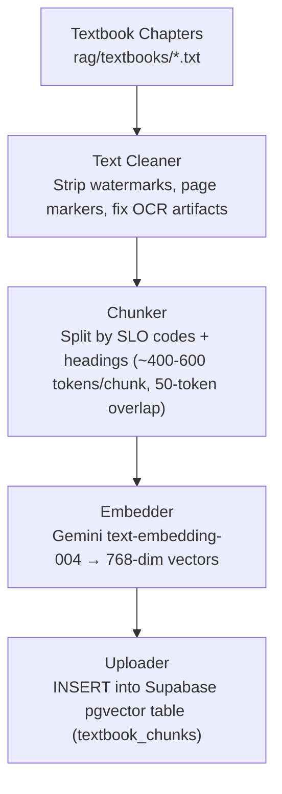
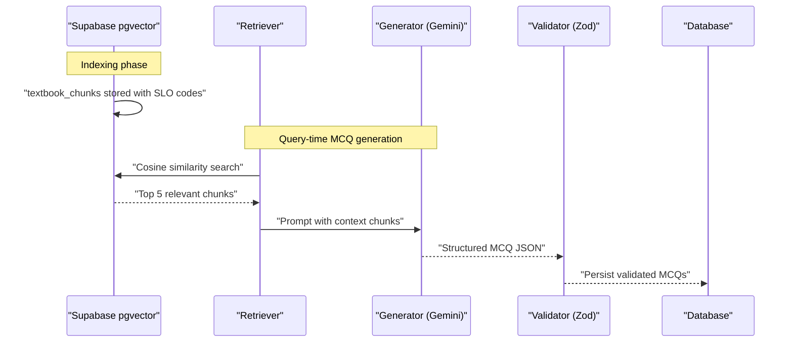
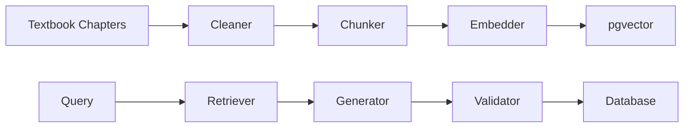

# Content Validation & Quality Assurance

<cite>
**Referenced Files in This Document**
- [README.md](file://README.md)
- [quiz.ts](file://src/types/quiz.ts)
</cite>

## Table of Contents
1. [Introduction](#introduction)
2. [Project Structure](#project-structure)
3. [Core Components](#core-components)
4. [Architecture Overview](#architecture-overview)
5. [Detailed Component Analysis](#detailed-component-analysis)
6. [Dependency Analysis](#dependency-analysis)
7. [Performance Considerations](#performance-considerations)
8. [Troubleshooting Guide](#troubleshooting-guide)
9. [Conclusion](#conclusion)

## Introduction
This document explains the content validation and quality assurance processes that underpin MedAce AI’s text processing pipeline for MDCAT Biology preparation. It focuses on how processed chunks are validated to preserve educational integrity, ensure Student Learning Outcome (SLO) codes remain intact, and maintain accurate biological terminology. It also covers completeness checks, terminology consistency, educational value assessment, validation rules that prevent data corruption, error handling, quality metrics tracking, and recovery procedures. Finally, it describes how the system preserves pedagogical structure while optimizing chunks for AI retrieval performance.

## Project Structure
The repository includes textbook chapters as plain text files and a documented RAG pipeline that cleans, chunks, embeds, and uploads content into a vector store. The build-time indexing pipeline is designed around SLO-based chunking to align with MDCAT syllabus boundaries. At query time, retrieved chunks drive MCQ generation, which is validated before storage and delivery.

**Diagram sources**
- [README.md:90-102](file://README.md#L90-L102)

**Section sources**
- [README.md:83-102](file://README.md#L83-L102)
- [README.md:163-225](file://README.md#L163-L225)

## Core Components
- Chunking strategy aligned with SLO codes ensures natural topic boundaries and direct alignment with MDCAT testing objectives.
- Embedding uses Gemini text-embedding-004 to produce multilingual, compact vectors suitable for efficient similarity search.
- Retrieval returns top relevant chunks to ground MCQ generation in verified textbook content.
- Output validation via Zod enforces schema compliance for generated MCQs prior to persistence.

Key responsibilities:
- Preserve SLO metadata per chunk for traceability and syllabus coverage.
- Maintain consistent biological terminology across chunks and generated content.
- Ensure each chunk meets size and overlap constraints for optimal retrieval.
- Validate all outputs (MCQs, explanations) against strict schemas before storage.

**Section sources**
- [README.md:83-122](file://README.md#L83-L122)
- [README.md:280-290](file://README.md#L280-L290)

## Architecture Overview
The end-to-end flow integrates indexing and retrieval with robust validation at critical checkpoints.

**Diagram sources**
- [README.md:90-122](file://README.md#L90-L122)

## Detailed Component Analysis

### Chunking and SLO Preservation
- Chunks are split using SLO codes and headings to create semantically coherent segments.
- Each chunk targets ~400–600 tokens with a 50-token overlap to balance context continuity and retrieval precision.
- SLO codes are preserved in chunk metadata to enable syllabus-aligned retrieval and reporting.

Quality checks:
- Completeness: Verify that each chunk contains a full concept or subtopic without abrupt truncation.
- Terminology consistency: Ensure biological terms are not altered or truncated during cleaning and chunking.
- Educational value: Confirm that chunks retain instructional clarity and relevance to MDCAT topics.

Validation rules:
- Enforce token count bounds and overlap thresholds.
- Require presence of SLO code and heading fields in chunk metadata.
- Reject chunks that fail structural or content integrity checks.

Recovery:
- On failure, re-run cleaner and chunker with adjusted parameters; log failures for review.
- Re-embed only affected chunks to minimize overhead.

**Section sources**
- [README.md:90-102](file://README.md#L90-L102)
- [README.md:280-290](file://README.md#L280-L290)

### Retrieval and Context Grounding
- Retrieval uses cosine similarity over pgvector to fetch the most relevant chunks for a given query.
- Retrieved chunks provide factual grounding for MCQ generation, reducing hallucination risk.

Quality checks:
- Relevance thresholding to exclude low-similarity results.
- Diversity checks to avoid redundant chunks from overlapping topics.
- Metadata verification to confirm SLO codes match expected domains.

Recovery:
- If insufficient chunks are found, broaden query scope or adjust similarity thresholds.
- Fallback to alternative retrieval strategies if needed.

**Section sources**
- [README.md:104-122](file://README.md#L104-L122)

### Generation and Schema Validation
- MCQ generation leverages Gemini 2.0 Flash with prompts that include retrieved textbook chunks.
- Outputs conform to a strict JSON schema enforced by Zod before storage.

Quality checks:
- Schema validation ensures required fields exist and types are correct.
- Content checks verify that options, answers, and explanations are complete and non-empty.
- Consistency checks ensure explanations reference concepts present in the source chunks.

Recovery:
- On validation failure, regenerate with adjusted prompts or retry with backoff.
- Log detailed error information for debugging and prompt tuning.

**Section sources**
- [README.md:104-122](file://README.md#L104-L122)
- [README.md:280-290](file://README.md#L280-L290)

### Data Models and Types
- TypeScript interfaces define the shape of questions, sessions, and user answers, ensuring type safety across the application.
- These models complement runtime validation by providing compile-time guarantees.

Key elements:
- Question model includes fields for question text, options, correct answer, explanations, difficulty, and topic.
- Session model tracks quiz metadata, scores, status, and associated questions/answers.
- UserAnswer captures selection correctness and timing metrics for analytics.

**Section sources**
- [quiz.ts:15-58](file://src/types/quiz.ts#L15-L58)

## Dependency Analysis
The validation and QA process depends on several integrated components:
- Textbook sources provide authoritative content boundaries and SLO codes.
- Cleaner and chunker prepare content for embedding while preserving structure.
- Embedder produces vectors for semantic retrieval.
- Retriever selects relevant chunks based on similarity.
- Generator creates MCQs grounded in retrieved content.
- Validator enforces schema and content rules before persistence.
- Database stores validated outputs and supports retrieval.

**Diagram sources**
- [README.md:90-122](file://README.md#L90-L122)

**Section sources**
- [README.md:90-122](file://README.md#L90-L122)

## Performance Considerations
- Token budgeting: Keep chunks within target ranges to optimize retrieval latency and cost.
- Overlap management: Use minimal overlap to reduce redundancy while maintaining context continuity.
- Vector dimensionality: Leverage 768-dim embeddings for balanced accuracy and storage efficiency.
- Batch operations: Process chunks and embeddings in batches to improve throughput.
- Caching: Cache frequent queries and popular topics to reduce repeated retrievals.

[No sources needed since this section provides general guidance]

## Troubleshooting Guide
Common issues and resolutions:
- Missing or malformed SLO codes:
  - Symptom: Retrieval fails to map to syllabus domains.
  - Resolution: Re-run chunker with stricter parsing; validate metadata before upload.
- Incomplete chunks:
  - Symptom: Concepts are truncated, leading to poor MCQ quality.
  - Resolution: Adjust chunk size and overlap; re-validate completeness.
- Schema validation failures:
  - Symptom: Generated MCQs rejected by validator.
  - Resolution: Inspect prompt output; refine prompts; retry with backoff.
- Low retrieval relevance:
  - Symptom: Irrelevant chunks returned.
  - Resolution: Tune similarity thresholds; expand query context; verify embeddings.

Error handling mechanisms:
- Validate all outputs with Zod before storage.
- Log errors with context (chunk ID, SLO code, prompt snippet) for diagnostics.
- Implement retries with exponential backoff for transient API failures.
- Provide fallback responses when retrieval or generation fails.

Quality metrics tracking:
- Track chunk token counts, overlap percentages, and SLO coverage rates.
- Monitor retrieval hit rates and average similarity scores.
- Measure MCQ schema pass rates and regeneration frequency.
- Record user performance indicators (accuracy, time taken) to inform adaptive improvements.

Recovery procedures:
- Re-index failed chunks and re-embed only affected segments.
- Roll back invalid MCQs and regenerate with corrected prompts.
- Escalate persistent failures to manual review for content correction.

**Section sources**
- [README.md:90-122](file://README.md#L90-L122)
- [README.md:280-290](file://README.md#L280-L290)

## Conclusion
MedAce AI’s content validation and quality assurance pipeline ensures that processed chunks preserve educational integrity, maintain accurate biological terminology, and adhere to MDCAT preparation standards. By anchoring retrieval in SLO-aligned chunks, enforcing strict schema validation, and implementing robust error handling and recovery, the system delivers reliable, high-quality MCQs grounded in verified textbook content. This approach maintains pedagogical structure while optimizing for AI retrieval performance, supporting effective learning outcomes for students preparing for the MDCAT.

[No sources needed since this section summarizes without analyzing specific files]