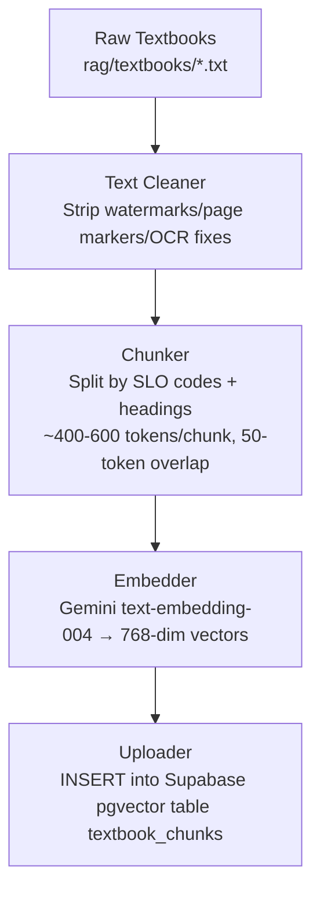
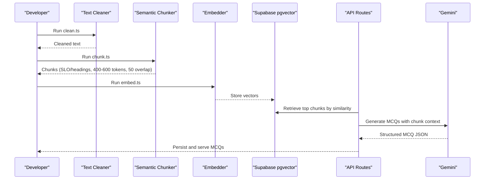
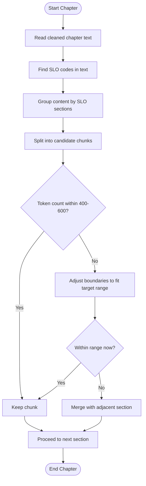
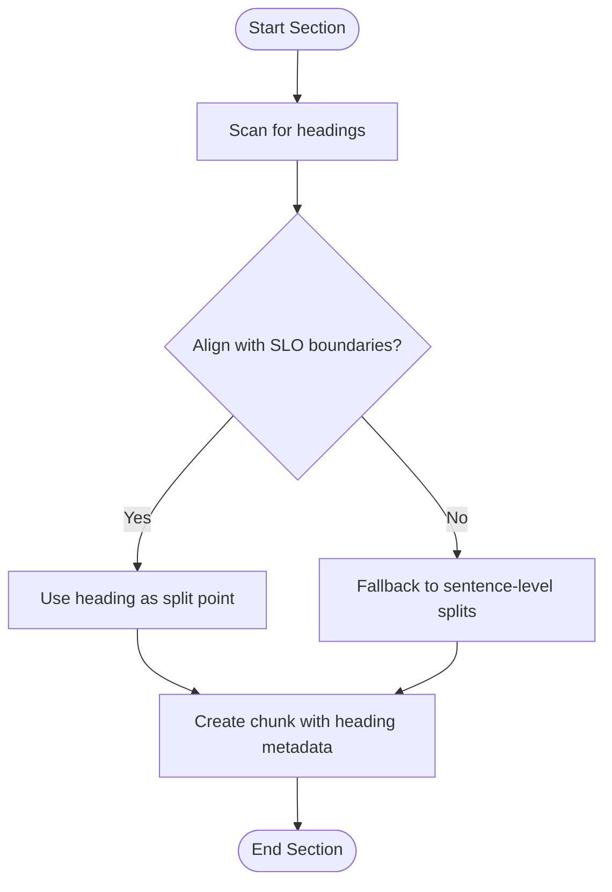
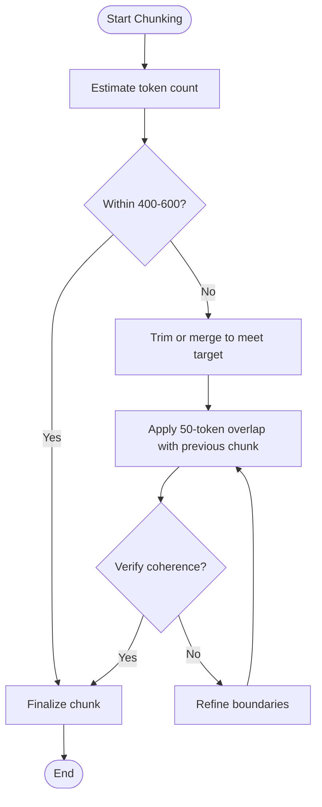
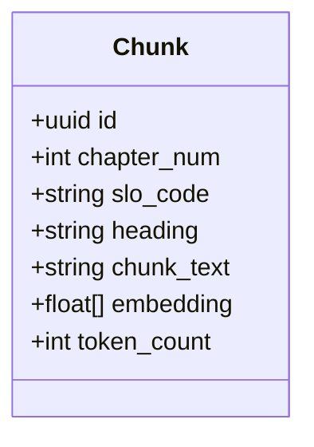
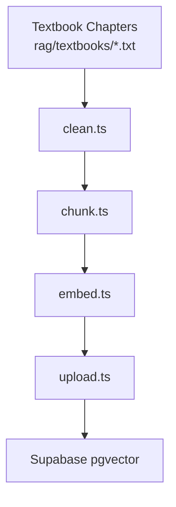

# Semantic Chunking Algorithm

<cite>
**Referenced Files in This Document**
- [README.md](file://README.md)
- [Chapter_1_Digestive_System_of_Man_extracted.txt](file://rag/textbooks/Chapter_1_Digestive_System_of_Man_extracted.txt)
- [Chapter_2_Blood_Circulatory_System_of_Man_extracted.txt](file://rag/textbooks/Chapter_2_Blood_Circulatory_System_of_Man_extracted.txt)
- [Chapter_3_Respiratory_System_of_Man_extracted.txt](file://rag/textbooks/Chapter_3_Respiratory_System_of_Man_extracted.txt)
- [Chapter_4_Urinary_Sytem_of_Man_extracted.txt](file://rag/textbooks/Chapter_4_Urinary_Sytem_of_Man_extracted.txt)
- [Chapter_5_Nervous_System_of_Man_extracted.txt](file://rag/textbooks/Chapter_5_Nervous_System_of_Man_extracted.txt)
- [Chapter_6_Endocrine_Sytem_of_Man_extracted.txt](file://rag/textbooks/Chapter_6_Endocrine_Sytem_of_Man_extracted.txt)
- [Chapter_7_Skeletal_System_of_Man_extracted.txt](file://rag/textbooks/Chapter_7_Skeletal_System_of_Man_extracted.txt)
- [Chapter_8_Thermoregulation_Homeostasis_extracted.txt](file://rag/textbooks/Chapter_8_Thermoregulation,Homeostasis_extracted.txt)
- [Chapter_9_Immunity_extracted.txt](file://rag/textbooks/Chapter_9_Immunity_extracted.txt)
- [Chapter_10_Biotechnology_extracted.txt](file://rag/textbooks/Chapter_10_Biotechnology_extracted.txt)
- [Chapter_11_Biostatistics_and_Data_Handling_extracted.txt](file://rag/textbooks/Chapter_11_Biostatistics_and_Data_Handling_extracted.txt)
- [Chapter_12_Structural_Computational_Biology_extracted.txt](file://rag/textbooks/Chapter_12_Structural_&_Computational_Biology_extracted.txt)
- [Chapter_13_Climate_Change_extracted.txt](file://rag/textbooks/Chapter_13_Climate_Change_extracted.txt)
- [Chapter_14_Selected_Topics_extracted.txt](file://rag/textbooks/Chapter_14_Selected_Topics_extracted.txt)
- [Chapter_15_Pharmacological_Drugs_extracted.txt](file://rag/textbooks/Chapter_15_Pharmacological_Drugs_extracted.txt)
</cite>

## Table of Contents
1. Introduction
2. Project Structure
3. Core Components
4. Architecture Overview
5. Detailed Component Analysis
6. Dependency Analysis
7. Performance Considerations
8. Troubleshooting Guide
9. Conclusion
10. Appendices

## Introduction
This document explains the semantic chunking algorithm used to convert biology textbook content into optimal retrieval units for MDCAT preparation. The system identifies natural content boundaries using Student Learning Outcome (SLO) codes and chapter headings, then splits text into chunks sized between 400 and 600 tokens with a 50-token overlap to preserve context across boundaries. These chunks are embedded and stored for retrieval-augmented generation (RAG), enabling high-quality MCQs grounded in the official syllabus.

The documentation covers:
- How SLO codes and headings define meaningful chunk boundaries
- The chunk size optimization strategy targeting 400–600 tokens with 50-token overlap
- Heading detection logic, SLO parsing, and boundary determination algorithms
- Chunk quality metrics, overlap strategies, and educational coherence
- Examples of chunk generation from actual textbook files
- Rationale behind sizing decisions for MDCAT effectiveness

## Project Structure
The project organizes raw textbook chapters under rag/textbooks and documents the build-time indexing pipeline that cleans, chunks, embeds, and uploads content. The README describes the end-to-end flow from raw text to vectorized chunks and query-time retrieval for MCQ generation.

**Diagram sources**
- [README.md:90-102](file://README.md#L90-L102)

**Section sources**
- [README.md:83-102](file://README.md#L83-L102)
- [README.md:163-226](file://README.md#L163-L226)

## Core Components
- Data source: 15 FSc Biology chapters covering Human Physiology, Modern Topics, and Pharmacology; ~1.7 MB text, ~420K tokens; structured with SLO codes for natural topic boundaries.
- Build-time pipeline:
  - Text cleaning removes noise and artifacts
  - Chunking uses SLO codes and headings to create semantically coherent units
  - Embedding converts chunks to 768-dimensional vectors
  - Uploading persists chunks and embeddings in Supabase pgvector
- Query-time pipeline:
  - Embed queries, retrieve top relevant chunks via cosine similarity
  - Generate MCQs with Gemini based on retrieved chunks
  - Validate outputs and store results

Key design choices:
- Chunking by SLO codes aligns with MDCAT testing structure
- Overlap preserves continuity across chunk boundaries
- Vector search ensures retrieval grounded in syllabus-aligned content

**Section sources**
- [README.md:83-122](file://README.md#L83-L122)
- [README.md:280-290](file://README.md#L280-L290)

## Architecture Overview
The semantic chunking system integrates with the broader RAG architecture. Raw textbooks are processed into chunks, embedded, and stored for retrieval during MCQ generation.

**Diagram sources**
- [README.md:90-122](file://README.md#L90-L122)
- [README.md:163-226](file://README.md#L163-L226)

## Detailed Component Analysis

### SLO Code Parsing and Boundary Detection
- Purpose: Identify natural topic boundaries aligned with MDCAT syllabus via SLO codes present in each chapter.
- Behavior:
  - Scan chapter text for SLO code patterns to mark logical sections
  - Use these markers to group sentences and paragraphs into cohesive units
  - Ensure each chunk corresponds to one or more SLOs for direct syllabus coverage
- Output: Each chunk carries metadata including chapter number, SLO code(s), heading, token count, and chunk text.

**Diagram sources**
- [README.md:83-102](file://README.md#L83-L102)

**Section sources**
- [README.md:83-102](file://README.md#L83-L102)

### Heading Detection Logic
- Purpose: Complement SLO-based segmentation with heading-based boundaries to maintain topical coherence.
- Behavior:
  - Detect headings (e.g., numbered or capitalized titles) to delineate subtopics
  - Prefer splitting at heading transitions when they align with SLO sections
  - Preserve heading metadata in chunk records for traceability
- Benefit: Improves interpretability and allows targeted retrieval by topic headings.

**Diagram sources**
- [README.md:83-102](file://README.md#L83-L102)

**Section sources**
- [README.md:83-102](file://README.md#L83-L102)

### Chunk Size Optimization Strategy
- Target size: 400–600 tokens per chunk
- Overlap: 50 tokens shared between consecutive chunks to retain context
- Rationale:
  - Balances retrieval precision with contextual continuity
  - Fits embedding model constraints while preserving key concepts
  - Supports effective MCQ generation by providing sufficient context without dilution

**Diagram sources**
- [README.md:90-102](file://README.md#L90-L102)

**Section sources**
- [README.md:90-102](file://README.md#L90-L102)

### Educational Coherence Across Boundaries
- Maintains conceptual continuity through:
  - SLO-aligned grouping ensuring topics remain intact
  - Heading-aware splits to avoid cutting mid-concept
  - 50-token overlap bridging adjacent chunks
- Metadata enrichment:
  - Each chunk stores chapter_num, slo_code, heading, chunk_text, token_count
  - Enables precise retrieval and explanation tracing back to source material

**Diagram sources**
- [README.md:124-161](file://README.md#L124-L161)

**Section sources**
- [README.md:124-161](file://README.md#L124-L161)

### Example Chunk Generation from Textbook Content
- Input: Raw textbook chapters under rag/textbooks (e.g., Digestive System, Blood Circulatory System, etc.)
- Process:
  - Clean OCR artifacts and page markers
  - Parse SLO codes and headings
  - Split into 400–600 token chunks with 50-token overlap
  - Embed and upload to pgvector
- Output: Indexed chunks ready for retrieval and MCQ generation

Note: Actual chunk contents are generated by the pipeline scripts referenced in the README.

**Section sources**
- [README.md:90-102](file://README.md#L90-L102)
- [README.md:163-226](file://README.md#L163-L226)

## Dependency Analysis
The chunking process depends on:
- Raw textbook files in rag/textbooks
- Cleaning script to normalize input
- Chunking script to segment by SLO/headings
- Embedding service (Gemini text-embedding-004)
- Database (Supabase pgvector) for storage and retrieval

**Diagram sources**
- [README.md:163-226](file://README.md#L163-L226)

**Section sources**
- [README.md:163-226](file://README.md#L163-L226)

## Performance Considerations
- Token budget: Target 400–600 tokens balances retrieval accuracy and context retention
- Overlap: 50 tokens provide continuity without excessive duplication
- Embedding dimension: 768-dim vectors reduce storage costs while maintaining multilingual support
- Retrieval efficiency: Cosine similarity over pgvector enables fast top-k retrieval
- Indexing throughput: Batch processing of chapters improves overall pipeline performance

[No sources needed since this section provides general guidance]

## Troubleshooting Guide
Common issues and resolutions:
- Poor chunk coherence:
  - Verify SLO code presence and alignment with headings
  - Adjust chunk boundaries to respect topic transitions
- Excessive fragmentation:
  - Increase target chunk size or reduce overlap if context loss occurs
- Retrieval mismatch:
  - Check embedding quality and ensure chunks are semantically complete
  - Validate metadata fields (chapter_num, slo_code, heading) for accurate filtering

**Section sources**
- [README.md:83-122](file://README.md#L83-L122)

## Conclusion
The semantic chunking algorithm transforms biology textbook content into retrieval-ready units aligned with MDCAT’s SLO framework. By combining SLO parsing, heading detection, and optimized chunk sizing with controlled overlap, the system maintains educational coherence and supports high-quality MCQ generation. The resulting indexed chunks enable efficient retrieval and grounded explanations tailored to student needs.

[No sources needed since this section summarizes without analyzing specific files]

## Appendices

### Appendix A: Textbook Sources Used
- Chapter files used as inputs for chunking and indexing:
  - [Chapter_1_Digestive_System_of_Man_extracted.txt](file://rag/textbooks/Chapter_1_Digestive_System_of_Man_extracted.txt)
  - [Chapter_2_Blood_Circulatory_System_of_Man_extracted.txt](file://rag/textbooks/Chapter_2_Blood_Circulatory_System_of_Man_extracted.txt)
  - [Chapter_3_Respiratory_System_of_Man_extracted.txt](file://rag/textbooks/Chapter_3_Respiratory_System_of_Man_extracted.txt)
  - [Chapter_4_Urinary_Sytem_of_Man_extracted.txt](file://rag/textbooks/Chapter_4_Urinary_Sytem_of_Man_extracted.txt)
  - [Chapter_5_Nervous_System_of_Man_extracted.txt](file://rag/textbooks/Chapter_5_Nervous_System_of_Man_extracted.txt)
  - [Chapter_6_Endocrine_Sytem_of_Man_extracted.txt](file://rag/textbooks/Chapter_6_Endocrine_Sytem_of_Man_extracted.txt)
  - [Chapter_7_Skeletal_System_of_Man_extracted.txt](file://rag/textbooks/Chapter_7_Skeletal_System_of_Man_extracted.txt)
  - [Chapter_8_Thermoregulation_Homeostasis_extracted.txt](file://rag/textbooks/Chapter_8_Thermoregulation,Homeostasis_extracted.txt)
  - [Chapter_9_Immunity_extracted.txt](file://rag/textbooks/Chapter_9_Immunity_extracted.txt)
  - [Chapter_10_Biotechnology_extracted.txt](file://rag/textbooks/Chapter_10_Biotechnology_extracted.txt)
  - [Chapter_11_Biostatistics_and_Data_Handling_extracted.txt](file://rag/textbooks/Chapter_11_Biostatistics_and_Data_Handling_extracted.txt)
  - [Chapter_12_Structural_Computational_Biology_extracted.txt](file://rag/textbooks/Chapter_12_Structural_&_Computational_Biology_extracted.txt)
  - [Chapter_13_Climate_Change_extracted.txt](file://rag/textbooks/Chapter_13_Climate_Change_extracted.txt)
  - [Chapter_14_Selected_Topics_extracted.txt](file://rag/textbooks/Chapter_14_Selected_Topics_extracted.txt)
  - [Chapter_15_Pharmacological_Drugs_extracted.txt](file://rag/textbooks/Chapter_15_Pharmacological_Drugs_extracted.txt)

**Section sources**
- [README.md:83-102](file://README.md#L83-L102)