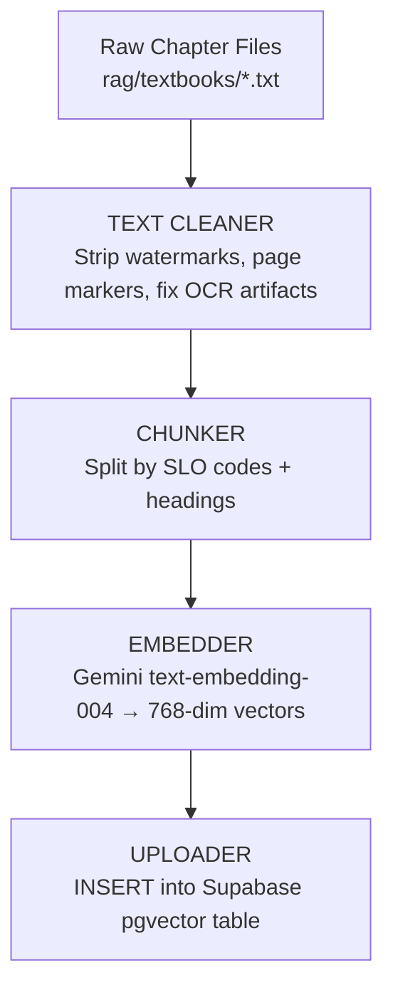
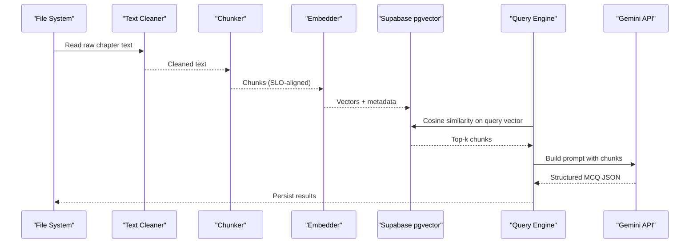
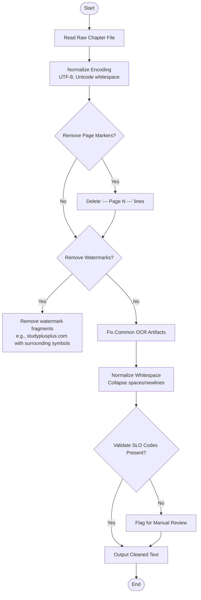
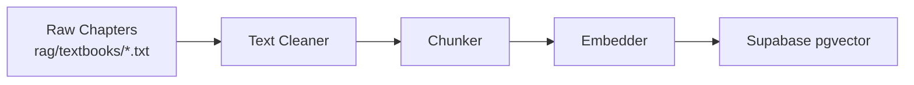

# Text Cleaning & Normalization

<cite>
**Referenced Files in This Document**
- [README.md](file://README.md)
- [Chapter_1_Digestive_System_of_Man_extracted.txt](file://rag/textbooks/Chapter_1_Digestive_System_of_Man_extracted.txt)
- [Chapter_2_Blood_Circulatory_System_of_Man_extracted.txt](file://rag/textbooks/Chapter_2_Blood_Circulatory_System_of_Man_extracted.txt)
- [Chapter_3_Respiratory_System_of_Man_extracted.txt](file://rag/textbooks/Chapter_3_Respiratory_System_of_Man_extracted.txt)
</cite>

## Table of Contents
1. Introduction
2. Project Structure
3. Core Components
4. Architecture Overview
5. Detailed Component Analysis
6. Dependency Analysis
7. Performance Considerations
8. Troubleshooting Guide
9. Conclusion

## Introduction
This document explains the text cleaning and normalization pipeline that prepares raw textbook content from 15 FSc Biology chapters for MedAce AI’s Retrieval-Augmented Generation (RAG) system. The goal is to remove watermarks, page markers, OCR artifacts, and formatting inconsistencies while preserving educational integrity—especially SLO codes and academic terminology essential for medical education.

The build-time indexing pipeline reads raw chapter files, cleans them, chunks by SLO codes and headings, embeds with Gemini, and stores vectors in Supabase pgvector. During query time, relevant chunks are retrieved and used to generate MCQs via Gemini.

**Section sources**
- [README.md:83-102](file://README.md#L83-L102)

## Project Structure
At the core of the pipeline are the raw textbook files under rag/textbooks. Each file corresponds to one chapter and contains mixed content: clean prose, SLO codes, figure captions, page markers, and watermark noise. These files are the input to the TEXT CLEANER stage before chunking and embedding.

**Diagram sources**
- [README.md:90-102](file://README.md#L90-L102)

**Section sources**
- [README.md:90-102](file://README.md#L90-L102)

## Core Components
- Raw Inputs: 15 chapter text files containing OCR artifacts, page markers, and watermarks.
- Text Cleaner: Removes non-content noise while preserving SLO codes and academic terms.
- Chunker: Segments cleaned text around SLO codes and headings for effective retrieval.
- Embedder: Converts chunks to vectors using Gemini embeddings.
- Uploader: Persists vectors into Supabase pgvector for similarity search.

Key responsibilities:
- Normalize character encoding and whitespace.
- Remove page markers and watermarks.
- Fix common OCR errors without altering meaning.
- Preserve SLO codes and technical terminology.

**Section sources**
- [README.md:83-102](file://README.md#L83-L102)

## Architecture Overview
The RAG pipeline integrates preprocessing with vector retrieval and generation. The cleaning step ensures high-quality context for downstream tasks.

**Diagram sources**
- [README.md:90-122](file://README.md#L90-L122)

## Detailed Component Analysis

### Noise Patterns Identified in Raw Chapters
Across multiple chapters, recurring noise includes:
- Page markers: lines like “--- Page N ---”
- Watermarks: repeated strings such as “studyplusplus.com” with surrounding symbols
- OCR artifacts: stray characters, broken punctuation, misrecognized symbols
- Inconsistent spacing and line breaks

Examples observed in the repository:
- Page markers appear at chapter starts and between sections.
- Watermark fragments appear near headings or figures.
- Some SLO references include malformed brackets or braces due to OCR.

These patterns must be removed or normalized while keeping SLO codes intact.

**Section sources**
- [Chapter_1_Digestive_System_of_Man_extracted.txt:3-58](file://rag/textbooks/Chapter_1_Digestive_System_of_Man_extracted.txt#L3-L58)
- [Chapter_2_Blood_Circulatory_System_of_Man_extracted.txt:3-56](file://rag/textbooks/Chapter_2_Blood_Circulatory_System_of_Man_extracted.txt#L3-L56)
- [Chapter_3_Respiratory_System_of_Man_extracted.txt:2689-2707](file://rag/textbooks/Chapter_3_Respiratory_System_of_Man_extracted.txt#L2689-L2707)

### Cleaning Rules and Algorithms

#### 1. Character Encoding Standardization
- Ensure consistent UTF-8 decoding across all inputs.
- Replace non-breaking spaces and other Unicode whitespace variants with standard spaces.
- Normalize smart quotes and dashes to ASCII equivalents where appropriate.

Impact:
- Prevents encoding-related tokenization issues.
- Improves consistency for downstream regex and splitting logic.

#### 2. Whitespace Normalization
- Collapse multiple consecutive spaces/newlines into a single newline.
- Trim leading/trailing whitespace per line.
- Preserve intentional paragraph breaks.

Impact:
- Reduces noise in chunk boundaries.
- Keeps readability and structure for human review.

#### 3. Special Character Handling
- Convert special bullets and list markers to plain text markers if needed.
- Fix common OCR substitutions (e.g., “©” vs bullet-like glyphs).
- Retain mathematical/scientific notation when meaningful.

Impact:
- Minimizes false positives in pattern matching.
- Preserves domain-specific symbols required for accuracy.

#### 4. Content Validation
- Validate that SLO codes remain present after cleaning.
- Ensure no critical educational content is accidentally removed.
- Flag anomalies for manual review.

Impact:
- Maintains alignment with curriculum objectives.
- Supports reliable chunking by SLO codes.

**Section sources**
- [Chapter_1_Digestive_System_of_Man_extracted.txt:3-58](file://rag/textbooks/Chapter_1_Digestive_System_of_Man_extracted.txt#L3-L58)
- [Chapter_2_Blood_Circulatory_System_of_Man_extracted.txt:3-56](file://rag/textbooks/Chapter_2_Blood_Circulatory_System_of_Man_extracted.txt#L3-L56)
- [Chapter_3_Respiratory_System_of_Man_extracted.txt:2689-2707](file://rag/textbooks/Chapter_3_Respiratory_System_of_Man_extracted.txt#L2689-L2707)

### Cleaning Workflow Flowchart

[No sources needed since this diagram shows conceptual workflow, not actual code structure]

### Before/After Transformations

- Page Marker Removal
  - Before: “--- Page 1 ---”
  - After: (line removed)

- Watermark Fragment Removal
  - Before: “cs) studyplusplus.com Ps)”
  - After: (line removed)

- OCR Artifact Cleanup
  - Before: “Ans. Please See SLO [B-12-R-04)}”
  - After: “Ans. Please See SLO (B-12-R-04)”

- Whitespace Normalization
  - Before: Multiple blank lines and irregular spacing
  - After: Single newline between paragraphs; consistent indentation

These transformations preserve SLO codes and academic terminology while removing noise.

**Section sources**
- [Chapter_1_Digestive_System_of_Man_extracted.txt:3-58](file://rag/textbooks/Chapter_1_Digestive_System_of_Man_extracted.txt#L3-L58)
- [Chapter_2_Blood_Circulatory_System_of_Man_extracted.txt:3-56](file://rag/textbooks/Chapter_2_Blood_Circulatory_System_of_Man_extracted.txt#L3-L56)
- [Chapter_3_Respiratory_System_of_Man_extracted.txt:2689-2707](file://rag/textbooks/Chapter_3_Respiratory_System_of_Man_extracted.txt#L2689-L2707)

### Preservation of SLO Codes and Academic Terminology
- SLO codes act as natural topic boundaries and must remain intact for accurate chunking and retrieval.
- Academic terms (e.g., enzyme, osmosis, pulmonary) are preserved to maintain domain fidelity.
- Cleaning rules avoid altering alphanumeric sequences that match SLO patterns.

**Section sources**
- [README.md:83-102](file://README.md#L83-L102)
- [Chapter_1_Digestive_System_of_Man_extracted.txt:9-35](file://rag/textbooks/Chapter_1_Digestive_System_of_Man_extracted.txt#L9-L35)
- [Chapter_2_Blood_Circulatory_System_of_Man_extracted.txt:9-42](file://rag/textbooks/Chapter_2_Blood_Circulatory_System_of_Man_extracted.txt#L9-L42)

## Dependency Analysis
The cleaning stage depends on the raw chapter files and outputs cleaned text consumed by the chunker. The README documents the end-to-end flow from raw files through cleaning, chunking, embedding, and storage.

**Diagram sources**
- [README.md:90-102](file://README.md#L90-L102)

**Section sources**
- [README.md:90-102](file://README.md#L90-L102)

## Performance Considerations
- Batch processing: Process chapters in parallel to reduce total indexing time.
- Regex efficiency: Use compiled patterns for page markers and watermarks to minimize overhead.
- Streaming reads: Read large files in chunks to manage memory usage.
- Idempotent cleaning: Ensure re-runs produce identical outputs for reproducibility.
- Validation checks: Early exit on missing SLO codes to prevent silent failures downstream.

[No sources needed since this section provides general guidance]

## Troubleshooting Guide
Common issues and resolutions:
- Missing SLO codes after cleaning:
  - Check over-aggressive regex that may have removed parts of SLO references.
  - Validate that bracket normalization preserves the code sequence.
- Over-removal of content:
  - Narrow watermark patterns to avoid capturing legitimate text.
  - Add allowlists for known academic phrases.
- Inconsistent whitespace:
  - Re-run whitespace normalization post-cleaning.
  - Inspect output for collapsed paragraphs that should be separate.
- OCR artifacts persist:
  - Expand artifact dictionary with new patterns discovered in later chapters.
  - Introduce fuzzy matching for similar-looking glyphs.

**Section sources**
- [Chapter_3_Respiratory_System_of_Man_extracted.txt:2689-2707](file://rag/textbooks/Chapter_3_Respiratory_System_of_Man_extracted.txt#L2689-L2707)

## Conclusion
The text cleaning and normalization pipeline transforms noisy, OCR-derived textbook content into clean, structured text suitable for chunking and embedding. By systematically removing watermarks, page markers, and artifacts while preserving SLO codes and academic terminology, the pipeline ensures high-quality retrieval and generation for MedAce AI’s RAG system. This foundation enables accurate MCQ generation grounded in real curriculum content.

[No sources needed since this section summarizes without analyzing specific files]