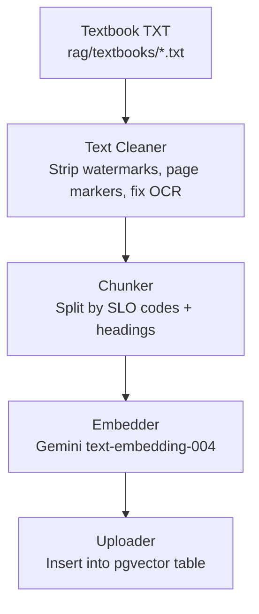
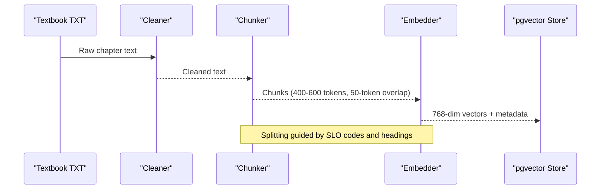
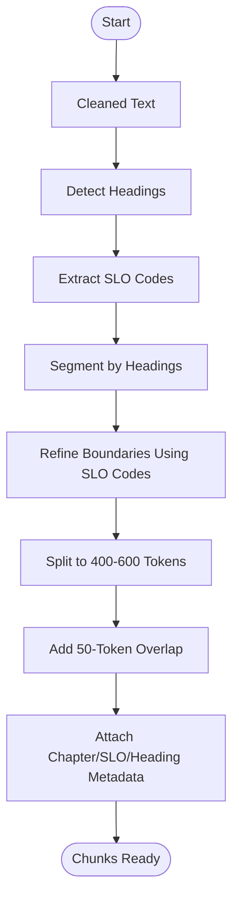

# Text Processing & Chunking

<cite>
**Referenced Files in This Document**
- [README.md](file://README.md)
- [Chapter_1_Digestive_System_of_Man_extracted.txt](file://rag/textbooks/Chapter_1_Digestive_System_of_Man_extracted.txt)
- [Chapter_15_Pharmacological_Drugs_extracted.txt](file://rag/textbooks/Chapter_15_Pharmacological_Drugs_extracted.txt)
</cite>

## Table of Contents
1. [Introduction](#introduction)
2. [Project Structure](#project-structure)
3. [Core Components](#core-components)
4. [Architecture Overview](#architecture-overview)
5. [Detailed Component Analysis](#detailed-component-analysis)
6. [Dependency Analysis](#dependency-analysis)
7. [Performance Considerations](#performance-considerations)
8. [Troubleshooting Guide](#troubleshooting-guide)
9. [Conclusion](#conclusion)

## Introduction
This document explains MedAce AI’s text processing and chunking system for 15 chapters of FSc Biology textbooks. It covers how raw textbook text is cleaned to remove watermarks, page markers, and OCR artifacts; how semantic chunking uses Student Learning Outcome (SLO) codes and headings to create well-scoped chunks; and how the pipeline prepares content for embedding and retrieval. The goal is to maintain educational content integrity while optimizing chunks for effective retrieval-augmented generation (RAG).

## Project Structure
The RAG indexing pipeline operates on plain-text textbook files under rag/textbooks. The build-time pipeline cleans, chunks, embeds, and uploads these texts into a vector store. The repository documents this pipeline and its parameters.

**Diagram sources**
- [README.md:90-102](file://README.md#L90-L102)

**Section sources**
- [README.md:90-102](file://README.md#L90-L102)

## Core Components
- Text Cleaning: Removes non-content noise such as watermarks, page markers, and OCR artifacts from raw textbook text.
- Semantic Chunking: Splits content using SLO codes and headings to produce semantically coherent chunks sized around 400–600 tokens with a 50-token overlap.
- Embedding and Storage: Vectorizes each chunk and stores it in Supabase pgvector for similarity search during query time.

These components are orchestrated as a build-time indexing pipeline that transforms raw textbook text into indexed chunks ready for retrieval.

**Section sources**
- [README.md:83-102](file://README.md#L83-L102)

## Architecture Overview
The end-to-end flow begins with raw textbook files and ends with vectorized chunks stored in the database. At query time, user topics are embedded and matched against stored chunks to retrieve relevant context for MCQ generation.

**Diagram sources**
- [README.md:90-102](file://README.md#L90-L102)

**Section sources**
- [README.md:90-102](file://README.md#L90-L102)

## Detailed Component Analysis

### Text Cleaning Pipeline
Purpose:
- Strip watermarks and page markers that appear in extracted textbook text.
- Fix OCR artifacts to improve downstream readability and chunk quality.

Evidence in data:
- Chapter files contain explicit page markers like “--- Page X ---” and repeated watermark-like strings.
- These markers interrupt natural reading flow and can confuse chunk boundaries if not removed.

Processing steps:
- Normalize whitespace and line breaks.
- Remove lines or segments matching page marker patterns.
- Remove watermark-like fragments and stray symbols introduced by OCR.
- Preserve meaningful headings, SLO lists, and body text.

Quality assurance:
- Verify that SLO lists remain intact after cleaning.
- Ensure no loss of educational content or meaning.
- Spot-check cleaned output for residual noise.

**Section sources**
- [Chapter_1_Digestive_System_of_Man_extracted.txt:1-120](file://rag/textbooks/Chapter_1_Digestive_System_of_Man_extracted.txt#L1-L120)
- [Chapter_15_Pharmacological_Drugs_extracted.txt:1-120](file://rag/textbooks/Chapter_15_Pharmacological_Drugs_extracted.txt#L1-L120)

### SLO Code Extraction and Heading Detection
Purpose:
- Identify natural topic boundaries using SLO codes and section headings present in the textbook structure.

How it works:
- Extract SLO codes from the “Student Learning Outcomes” section at the start of each chapter.
- Detect headings that demarcate major sections within the chapter.
- Use these signals to align chunk boundaries with curriculum-aligned topics.

Why it matters:
- Aligns chunks with MDCAT syllabus organization.
- Improves relevance when retrieving content for specific learning outcomes.

Examples in data:
- SLO codes appear as structured items under “Student Learning Outcomes.”
- Headings mark distinct topics such as “Mechanical and Chemical Digestion in the Oral Cavity.”

**Section sources**
- [Chapter_1_Digestive_System_of_Man_extracted.txt:9-35](file://rag/textbooks/Chapter_1_Digestive_System_of_Man_extracted.txt#L9-L35)
- [Chapter_1_Digestive_System_of_Man_extracted.txt:42-55](file://rag/textbooks/Chapter_1_Digestive_System_of_Man_extracted.txt#L42-L55)
- [Chapter_15_Pharmacological_Drugs_extracted.txt:9-20](file://rag/textbooks/Chapter_15_Pharmacological_Drugs_extracted.txt#L9-L20)

### Semantic Chunking Algorithm
Goal:
- Produce chunks of approximately 400–600 tokens with a 50-token overlap to balance context continuity and retrieval precision.

Algorithm outline:
- Input: Cleaned chapter text with detected SLO codes and headings.
- Step 1: Segment by headings to form coarse blocks aligned with topics.
- Step 2: Within each block, identify SLO code boundaries to further refine topic alignment.
- Step 3: Split blocks into chunks targeting 400–600 tokens.
- Step 4: Apply 50-token overlap between adjacent chunks to preserve continuity across boundaries.
- Step 5: Attach metadata (chapter number, SLO code, heading) to each chunk for traceability.

Chunk size optimization:
- Target range ensures embeddings capture sufficient context without exceeding model limits.
- Overlap mitigates boundary truncation effects and improves recall for queries spanning two chunks.

Boundary optimization strategies:
- Prefer splitting at paragraph or sentence boundaries near target token counts.
- Avoid mid-sentence splits when possible to preserve semantic coherence.
- Respect SLO and heading boundaries even if it slightly adjusts token count.

Quality assurance:
- Validate token counts per chunk.
- Confirm that SLO and heading metadata are correctly attached.
- Review edge cases where text density varies significantly.

**Diagram sources**
- [README.md:90-102](file://README.md#L90-L102)

**Section sources**
- [README.md:83-102](file://README.md#L83-L102)

### Preprocessing Pipeline Summary
- Text normalization: Standardize spacing and line breaks; remove noise.
- SLO extraction: Parse “Student Learning Outcomes” to capture curriculum-aligned topics.
- Heading detection: Identify structural headings to guide chunk segmentation.
- Chunk boundary optimization: Combine SLO and heading signals with token-based splitting and overlap.

This pipeline ensures that chunks are both educationally meaningful and optimized for retrieval performance.

**Section sources**
- [README.md:83-102](file://README.md#L83-L102)

## Dependency Analysis
The pipeline depends on:
- Textbook files as input.
- Cleaning rules to remove non-content elements.
- Structural signals (SLO codes and headings) to guide semantic chunking.
- Tokenization and embedding services for vectorization.
- Database storage for retrieval.

**Diagram sources**
- [README.md:90-102](file://README.md#L90-L102)

**Section sources**
- [README.md:90-102](file://README.md#L90-L102)

## Performance Considerations
- Chunk size: 400–600 tokens balances context richness with embedding efficiency.
- Overlap: 50-token overlap reduces information loss at chunk boundaries.
- Metadata: Attaching chapter, SLO, and heading metadata improves retrieval precision and explainability.
- Noise removal: Effective cleaning prevents wasted embedding capacity on irrelevant artifacts.

[No sources needed since this section provides general guidance]

## Troubleshooting Guide
Common issues and checks:
- Residual page markers or watermarks: Revisit cleaning rules to ensure all marker patterns are removed.
- Broken SLO lists: Verify that cleaning does not alter or truncate SLO entries.
- Inconsistent chunk sizes: Adjust token thresholds and boundary preferences to accommodate dense or sparse sections.
- Missing metadata: Confirm that chapter, SLO, and heading tags are consistently attached to each chunk.

Validation steps:
- Sample random chunks and verify token counts and metadata.
- Inspect cleaned text for residual noise.
- Test retrieval with known topics to confirm chunk relevance.

**Section sources**
- [Chapter_1_Digestive_System_of_Man_extracted.txt:1-120](file://rag/textbooks/Chapter_1_Digestive_System_of_Man_extracted.txt#L1-L120)
- [Chapter_15_Pharmacological_Drugs_extracted.txt:1-120](file://rag/textbooks/Chapter_15_Pharmacological_Drugs_extracted.txt#L1-L120)

## Conclusion
MedAce AI’s text processing and chunking system transforms raw textbook chapters into clean, semantically coherent chunks aligned with curriculum objectives. By leveraging SLO codes and headings, applying targeted cleaning, and optimizing chunk size and overlap, the pipeline produces high-quality inputs for embedding and retrieval. This approach supports accurate, syllabus-aligned MCQ generation and enhances student learning outcomes.

[No sources needed since this section summarizes without analyzing specific files]