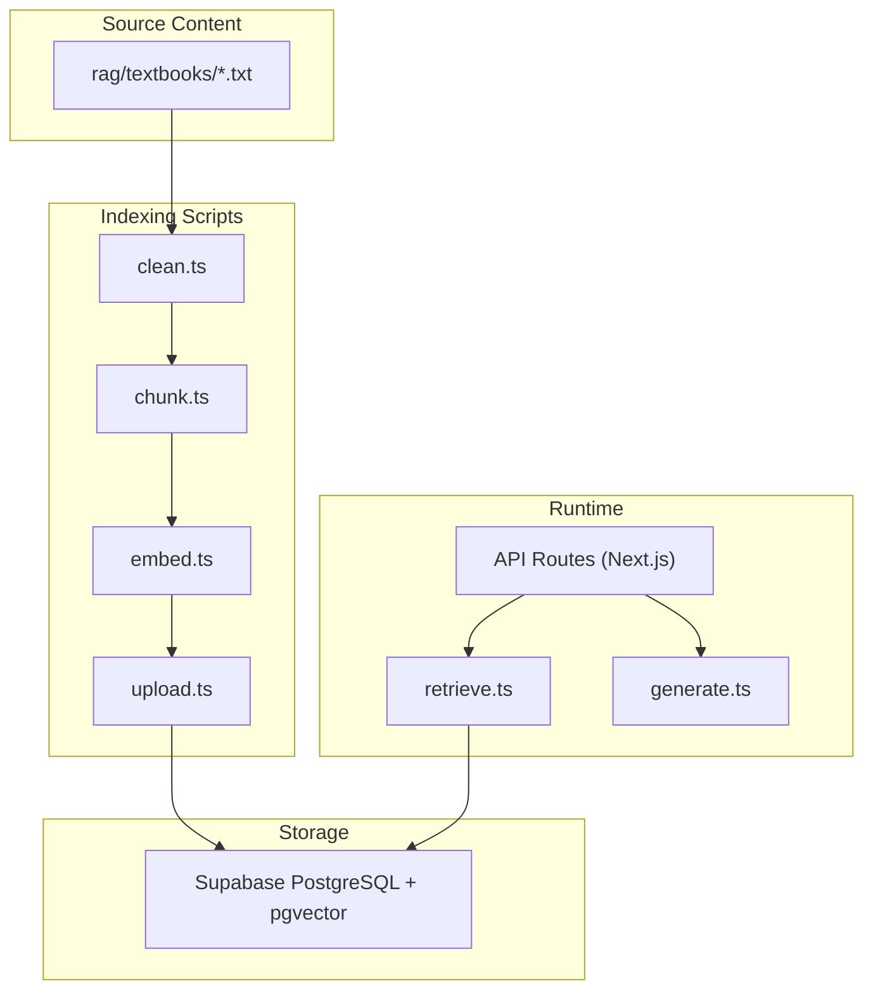
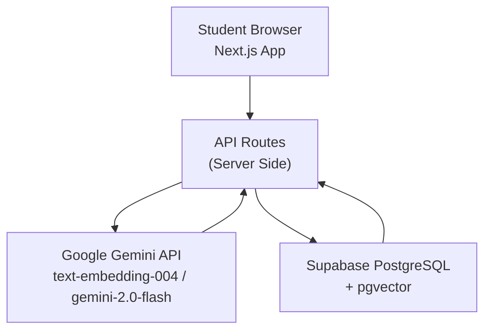
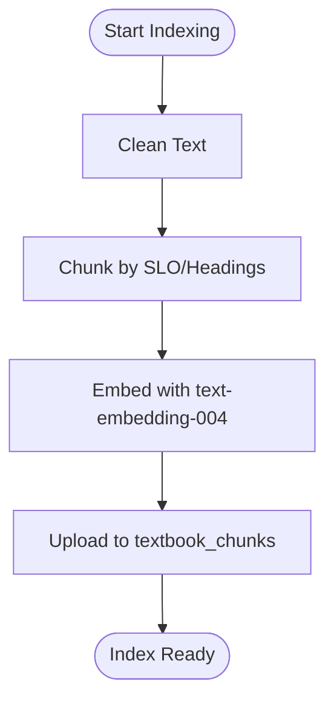
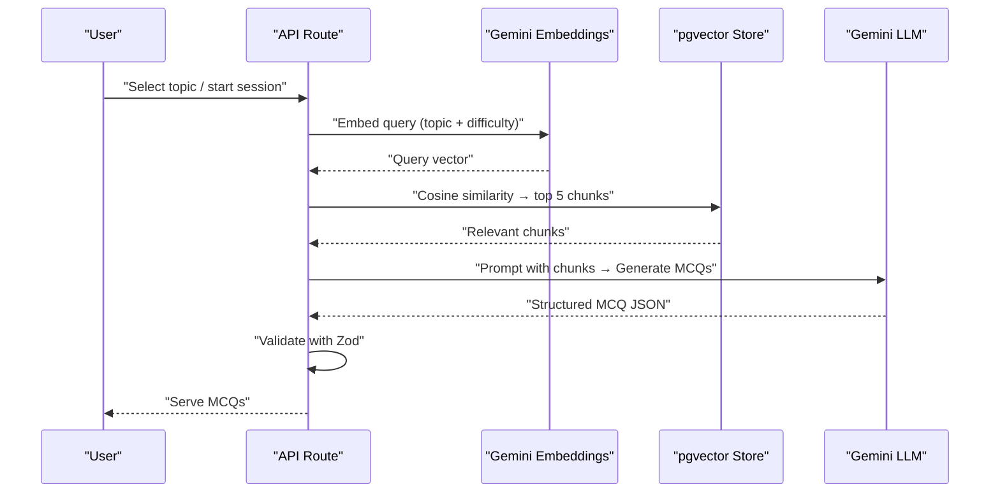
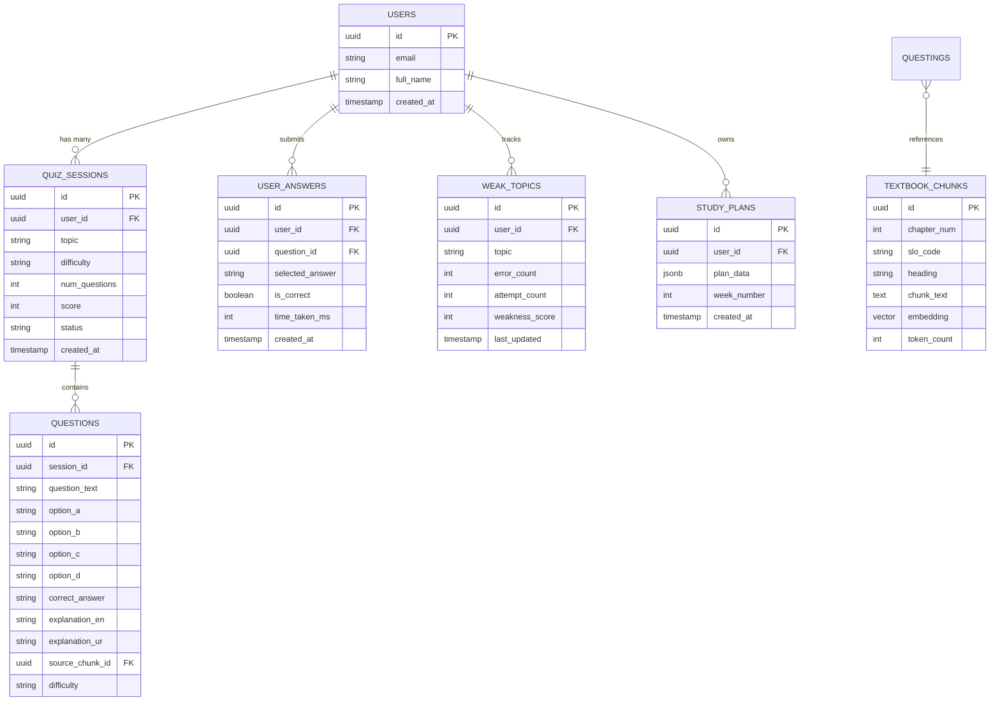
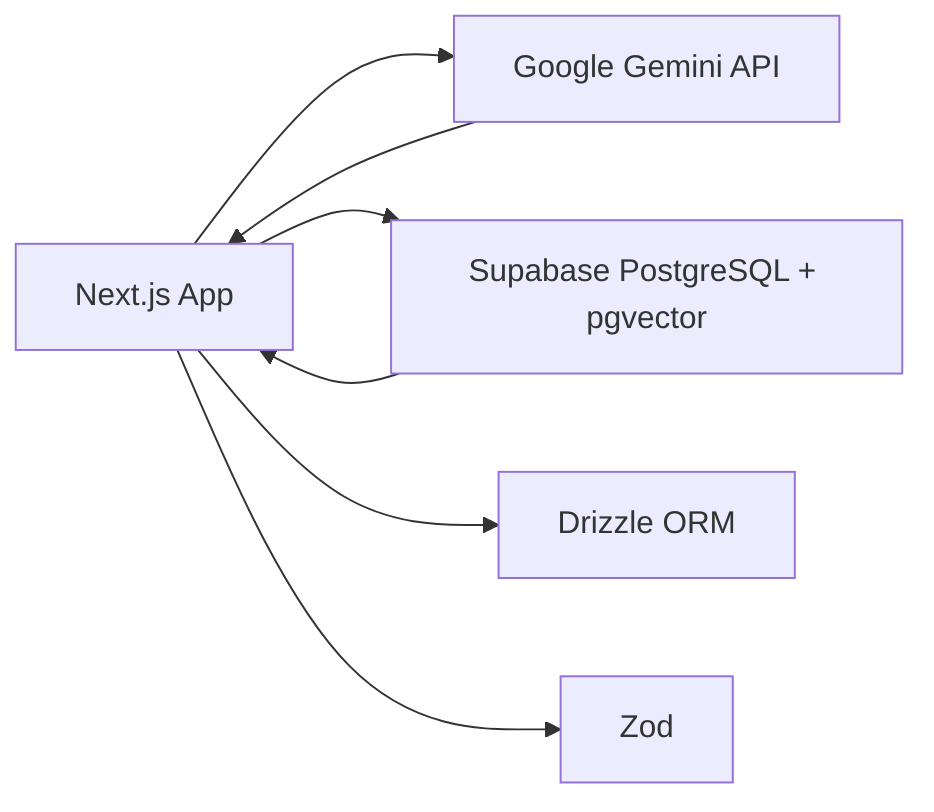

# Vector Search & Retrieval

<cite>
**Referenced Files in This Document**
- [README.md](file://README.md)
</cite>

## Table of Contents
1. [Introduction](#introduction)
2. [Project Structure](#project-structure)
3. [Core Components](#core-components)
4. [Architecture Overview](#architecture-overview)
5. [Detailed Component Analysis](#detailed-component-analysis)
6. [Dependency Analysis](#dependency-analysis)
7. [Performance Considerations](#performance-considerations)
8. [Troubleshooting Guide](#troubleshooting-guide)
9. [Conclusion](#conclusion)
10. [Appendices](#appendices)

## Introduction
This document explains MedAce AI’s vector search and retrieval system for textbook content using pgvector on Supabase PostgreSQL. It covers how textbook chapters are chunked, embedded with Google’s text-embedding-004 model into 768-dimensional vectors, stored in a dedicated table, and retrieved at query time via cosine similarity to power MCQ generation. It also documents the end-to-end indexing pipeline, query-time retrieval flow, schema design, and scalability considerations for large-scale textbook content.

## Project Structure
The repository organizes RAG-related assets under rag/textbooks for source material and references scripts for cleaning, chunking, embedding, and uploading vectors. The application layer includes API routes and libraries that orchestrate retrieval and generation. The README provides an architecture diagram, environment setup, and the build-time and query-time pipelines used by the system.

**Diagram sources**
- [README.md:163-225](file://README.md#L163-L225)

**Section sources**
- [README.md:163-225](file://README.md#L163-L225)

## Core Components
- Textbook chunks: Derived from 15 FSc Biology chapters, split by Student Learning Outcome (SLO) codes and headings into ~400–600 token segments with 50-token overlap.
- Embeddings: Generated using Google text-embedding-004 to produce 768-dimensional vectors per chunk.
- Vector storage: Stored in a Supabase PostgreSQL table named textbook_chunks with an embedding column and metadata such as chapter number, SLO code, heading, chunk text, and token count.
- Retrieval: At query time, the user’s topic/difficulty context is embedded and compared against stored vectors using cosine similarity to retrieve the top 5 most relevant chunks.
- Generation: Retrieved chunks are injected into a Gemini prompt to generate structured MCQs, validated with Zod, then persisted and served.

Key responsibilities:
- Indexing pipeline: clean → chunk → embed → upload
- Query-time pipeline: embed query → cosine similarity → top 5 chunks → prompt assembly → LLM generation → validation → persistence

**Section sources**
- [README.md:83-122](file://README.md#L83-L122)
- [README.md:124-161](file://README.md#L124-L161)
- [README.md:228-244](file://README.md#L228-L244)

## Architecture Overview
The system integrates a Next.js frontend and server-side API routes with Supabase (PostgreSQL + pgvector) and Google Gemini. During indexing, raw textbook files are processed into semantic chunks and embedded; during runtime, queries are embedded and matched against stored vectors to retrieve relevant context for MCQ generation.

**Diagram sources**
- [README.md:23-54](file://README.md#L23-L54)

**Section sources**
- [README.md:23-54](file://README.md#L23-L54)

## Detailed Component Analysis

### Build-Time Indexing Pipeline
The indexing pipeline transforms raw textbook text into indexed vectors ready for retrieval:
- Cleaning: Removes watermarks, page markers, and OCR artifacts.
- Chunking: Splits content by SLO codes and headings into semantically coherent chunks (~400–600 tokens, 50-token overlap).
- Embedding: Calls Gemini text-embedding-004 to create 768-dim vectors per chunk.
- Upload: Inserts chunks and embeddings into the textbook_chunks table in Supabase.

**Diagram sources**
- [README.md:90-102](file://README.md#L90-L102)

**Section sources**
- [README.md:90-102](file://README.md#L90-L102)

### Query-Time Retrieval and MCQ Generation
At query time, the system retrieves relevant textbook chunks to ground MCQ generation:
- Query embedding: The selected topic and difficulty context are embedded using the same model to ensure consistent vector space alignment.
- Similarity search: Cosine similarity over pgvector returns the top 5 most relevant chunks.
- Prompt assembly: Retrieved chunks are inserted into a Gemini prompt with instructions to generate MCQs in a strict JSON schema.
- Validation and storage: Output is validated with Zod and stored for serving to the student.

**Diagram sources**
- [README.md:104-122](file://README.md#L104-L122)

**Section sources**
- [README.md:104-122](file://README.md#L104-L122)

### Data Model and Schema
The textbook_chunks table stores each chunk’s metadata and its embedding vector. Related entities include users, quiz_sessions, questions, user_answers, weak_topics, and study_plans.

Notes:
- The vector column in textbook_chunks holds 768-dim embeddings produced by text-embedding-004.
- source_chunk_id in questions links generated MCQs back to their source chunk for traceability.

**Diagram sources**
- [README.md:124-161](file://README.md#L124-L161)

**Section sources**
- [README.md:124-161](file://README.md#L124-L161)

### Retrieval Optimization Techniques
- Cosine similarity: Used to rank chunks by relevance in the shared embedding space.
- Top-k selection: Retrieves the top 5 chunks to balance context richness and latency.
- Semantic chunking: SLO-based boundaries improve retrieval precision by aligning chunks with curriculum topics.
- Overlap strategy: 50-token overlap reduces boundary truncation effects while keeping chunks concise.

These techniques collectively enhance retrieval quality and reduce noise in prompts fed to the LLM.

**Section sources**
- [README.md:90-122](file://README.md#L90-L122)

## Dependency Analysis
The system depends on:
- Google Gemini API for both embeddings (text-embedding-004) and generation (gemini-2.0-flash).
- Supabase PostgreSQL with pgvector for vector storage and similarity search.
- Drizzle ORM for database migrations and client access.
- Zod for runtime validation of generated outputs.

**Diagram sources**
- [README.md:23-54](file://README.md#L23-L54)
- [README.md:246-278](file://README.md#L246-L278)

**Section sources**
- [README.md:23-54](file://README.md#L23-L54)
- [README.md:246-278](file://README.md#L246-L278)

## Performance Considerations
- Embedding dimensionality: 768-dim vectors minimize storage footprint while maintaining retrieval quality.
- Chunk size and overlap: ~400–600 tokens with 50-token overlap balances context completeness and retrieval efficiency.
- Similarity metric: Cosine similarity is well-suited for normalized embeddings and yields robust ranking.
- Top-k retrieval: Limiting to top 5 chunks reduces prompt size and latency without sacrificing relevance.
- Service choices: Using pgvector within Supabase avoids external vector databases, reducing latency and cost.

[No sources needed since this section provides general guidance]

## Troubleshooting Guide
Common issues and mitigations:
- Poor retrieval relevance:
  - Verify chunk boundaries align with SLO codes and headings.
  - Ensure consistent embedding model usage across indexing and query time.
- High latency or timeouts:
  - Reduce chunk size or adjust overlap if prompts become too large.
  - Monitor network calls to Gemini and Supabase; consider retries and caching strategies.
- Validation failures:
  - Confirm Zod schemas match expected LLM output structure.
  - Add fallback prompts or stricter constraints if outputs drift.

[No sources needed since this section provides general guidance]

## Conclusion
MedAce AI’s vector search leverages pgvector and Google’s text-embedding-004 to index textbook content into 768-dimensional vectors and retrieve the most relevant chunks at query time. The system uses cosine similarity to return top 5 chunks, which ground Gemini-generated MCQs. The design emphasizes simplicity, cost-effectiveness, and strong alignment with curriculum topics through SLO-based chunking. With careful tuning of chunking, embedding, and retrieval parameters, the system scales effectively to handle large textbook corpora while maintaining fast, accurate retrieval for MCQ generation.

[No sources needed since this section summarizes without analyzing specific files]

## Appendices

### Environment Variables
Ensure the following variables are configured for the system to operate correctly:
- Supabase URL and keys
- Database connection string for Drizzle
- Google Gemini API key
- Application URL

**Section sources**
- [README.md:228-244](file://README.md#L228-L244)