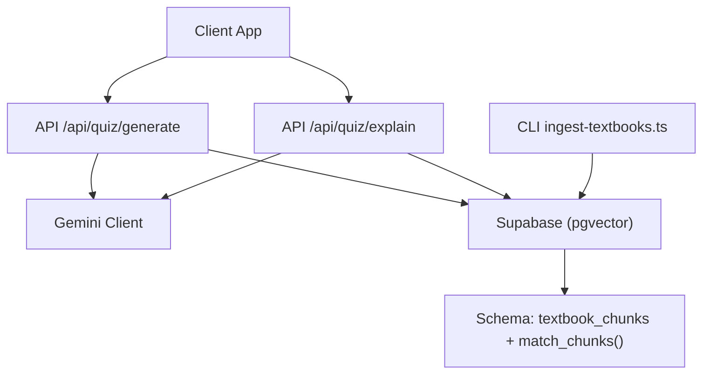
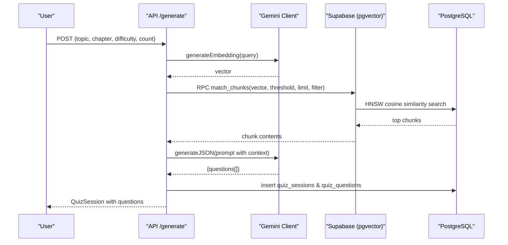
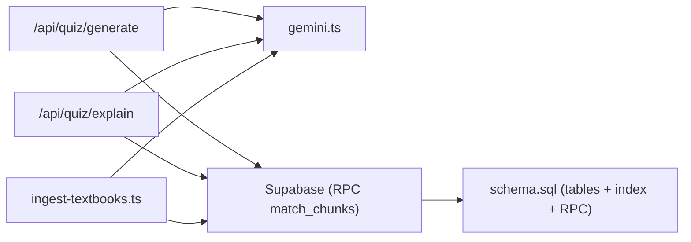

# AI Integration

<cite>
**Referenced Files in This Document**
- [gemini.ts](file://src/lib/ai/gemini.ts)
- [route.ts (Quiz Generate)](file://src/app/api/quiz/generate/route.ts)
- [route.ts (Quiz Explain)](file://src/app/api/quiz/explain/route.ts)
- [ingest-textbooks.ts](file://scripts/ingest-textbooks.ts)
- [schema.sql](file://supabase/schema.sql)
- [textbook-reader.ts](file://src/lib/textbook-reader.ts)
- [chapter-questions.ts](file://src/lib/chapter-questions.ts)
- [README.md](file://README.md)
</cite>

## Table of Contents
1. Introduction
2. Project Structure
3. Core Components
4. Architecture Overview
5. Detailed Component Analysis
6. Dependency Analysis
7. Performance Considerations
8. Troubleshooting Guide
9. Conclusion

## Introduction
This document explains MedAce-AI’s AI integration for generating high-quality MDCAT multiple-choice questions and providing bilingual explanations, powered by Google Gemini models and a Retrieval-Augmented Generation (RAG) pipeline. The system uses:
- A text generation model for MCQ creation and explanation
- An embedding model to vectorize textbook content
- A PostgreSQL + pgvector store with HNSW indexing for fast similarity search
- Robust fallbacks when the AI service is unavailable or rate-limited

The goal is to deliver accurate, syllabus-aligned questions with contextual explanations while keeping latency low and costs manageable in production.

## Project Structure
At a high level:
- Next.js API routes orchestrate request handling, validation, RAG retrieval, and AI calls
- A shared Gemini client module abstracts model access and JSON-mode responses
- A CLI ingestion script chunks textbooks, generates embeddings, and upserts them into Supabase
- PostgreSQL schema defines tables, vector indexes, and an RPC function for similarity search
- Textbook reader utilities load chapter context from local files as a baseline source

**Diagram sources**
- [route.ts (Quiz Generate):10-196](file://src/app/api/quiz/generate/route.ts#L10-L196)
- [route.ts (Quiz Explain):6-79](file://src/app/api/quiz/explain/route.ts#L6-L79)
- [gemini.ts:1-60](file://src/lib/ai/gemini.ts#L1-L60)
- [ingest-textbooks.ts:97-188](file://scripts/ingest-textbooks.ts#L97-L188)
- [schema.sql:26-41](file://supabase/schema.sql#L26-L41)
- [schema.sql:116-150](file://supabase/schema.sql#L116-L150)

**Section sources**
- [README.md:27-59](file://README.md#L27-L59)

## Core Components
- Gemini client: Provides model initialization, embedding generation, and structured JSON responses
- Quiz generation route: Builds prompts, retrieves relevant textbook chunks via RAG, calls Gemini, persists sessions/questions, and falls back to static bank if needed
- Quiz explanation route: Retrieves context via RAG and asks Gemini for bilingual explanations
- Textbook ingestion pipeline: Reads textbook files, cleans and chunks text, generates embeddings, and stores them in pgvector
- Database schema: Defines vector storage, HNSW index, and an RPC function for cosine similarity search

**Section sources**
- [gemini.ts:1-60](file://src/lib/ai/gemini.ts#L1-L60)
- [route.ts (Quiz Generate):10-196](file://src/app/api/quiz/generate/route.ts#L10-L196)
- [route.ts (Quiz Explain):6-79](file://src/app/api/quiz/explain/route.ts#L6-L79)
- [ingest-textbooks.ts:97-188](file://scripts/ingest-textbooks.ts#L97-L188)
- [schema.sql:26-41](file://supabase/schema.sql#L26-L41)
- [schema.sql:116-150](file://supabase/schema.sql#L116-L150)

## Architecture Overview
The system implements a dual-purpose AI architecture:
- Question generation: Uses a Gemini text model to produce MCQs aligned to topic, chapter, and difficulty
- Explanation generation: Uses a Gemini text model to provide English and Urdu explanations grounded in retrieved textbook context
- Embedding pipeline: Uses a Gemini embedding model to convert textbook chunks into vectors stored in pgvector

**Diagram sources**
- [route.ts (Quiz Generate):10-196](file://src/app/api/quiz/generate/route.ts#L10-L196)
- [gemini.ts:29-59](file://src/lib/ai/gemini.ts#L29-L59)
- [schema.sql:116-150](file://supabase/schema.sql#L116-L150)

## Detailed Component Analysis

### Gemini Client
Responsibilities:
- Initialize Gemini models for text and embeddings
- Generate embeddings with configurable dimensionality
- Return structured JSON from Gemini using responseMimeType configuration
- Centralized error handling for missing API keys and malformed responses

Key behaviors:
- JSON mode enabled for deterministic schema outputs
- Embedding output dimension set explicitly
- Retry-friendly usage at call sites for transient errors

**Section sources**
- [gemini.ts:1-60](file://src/lib/ai/gemini.ts#L1-L60)

### Quiz Generation Route
Flow:
- Validate input payload
- Load local textbook context for the chapter
- Enhance context with RAG: embed query, run similarity search, concatenate top chunks
- Build prompt with topic, chapter, difficulty, and context; enforce strict JSON schema
- Call Gemini to generate questions; map to internal question type
- Persist session and questions for authenticated users
- Fallback to static chapter question bank if AI fails or returns no results

Prompt engineering highlights:
- Explicit role and task definition
- Clear constraints on number of questions, options, correct answer format
- Bilingual explanation requirement (English and Urdu)
- Difficulty alignment instructions
- Strict JSON schema enforcement to ensure parseable output

Error handling and fallback:
- Optional vector search; continues even if RAG fails
- If AI generation fails or returns empty, use prebuilt chapter questions
- Graceful error responses with status codes

**Section sources**
- [route.ts (Quiz Generate):10-196](file://src/app/api/quiz/generate/route.ts#L10-L196)

### Quiz Explanation Route
Flow:
- Validate input payload
- Embed the question and topic, retrieve similar textbook chunks
- Build prompt with question, options, correct answer, and context
- Ask Gemini for bilingual explanation in strict JSON format
- Return explanation fields with safe defaults if parsing fails

Error handling:
- If RAG fails, uses a generic reference string
- Returns user-friendly defaults for explanation fields on failure

**Section sources**
- [route.ts (Quiz Explain):6-79](file://src/app/api/quiz/explain/route.ts#L6-L79)

### Textbook Ingestion Pipeline
Steps:
- Read all textbook files from rag/textbooks
- Clean text (normalize whitespace, remove artifacts)
- Chunk text into fixed-size segments
- For each chunk:
  - Generate embedding via Gemini
  - Upsert chunk record with metadata (chapter, index, token_count)
- Respect rate limits with delays and retries on 429 responses

Robustness:
- Retries up to a configured number of attempts on rate-limit errors
- Skips failed chunks but continues processing
- Logs progress and final counts

**Section sources**
- [ingest-textbooks.ts:97-188](file://scripts/ingest-textbooks.ts#L97-L188)

### Database Schema and Vector Search
- Enables vector extension and UUID helpers
- Defines textbook_chunks table with a vector(768) column
- Creates HNSW index for fast cosine similarity
- Exposes match_chunks RPC that:
  - Accepts query_embedding, threshold, count, optional chapter filter
  - Computes similarity and returns matching chunks with scores

Security:
- Row-level security policies allow reading textbook chunks for RAG

**Section sources**
- [schema.sql:26-41](file://supabase/schema.sql#L26-L41)
- [schema.sql:116-150](file://supabase/schema.sql#L116-L150)
- [schema.sql:175-179](file://supabase/schema.sql#L175-L179)

### Local Textbook Reader
- Finds and reads extracted textbook files per chapter
- Returns a bounded slice of content to fit within prompt size limits
- Used as a baseline context source before RAG enhancement

**Section sources**
- [textbook-reader.ts:1-45](file://src/lib/textbook-reader.ts#L1-L45)

### Static Chapter Questions (Fallback)
- Predefined question banks per chapter with bilingual explanations
- Used when AI generation is not available or fails
- Ensures consistent availability of practice content

**Section sources**
- [chapter-questions.ts:1-12](file://src/lib/chapter-questions.ts#L1-L12)

## Dependency Analysis

**Diagram sources**
- [route.ts (Quiz Generate):1-196](file://src/app/api/quiz/generate/route.ts#L1-L196)
- [route.ts (Quiz Explain):1-79](file://src/app/api/quiz/explain/route.ts#L1-L79)
- [gemini.ts:1-60](file://src/lib/ai/gemini.ts#L1-L60)
- [ingest-textbooks.ts:1-188](file://scripts/ingest-textbooks.ts#L1-L188)
- [schema.sql:26-41](file://supabase/schema.sql#L26-L41)
- [schema.sql:116-150](file://supabase/schema.sql#L116-L150)

**Section sources**
- [route.ts (Quiz Generate):10-196](file://src/app/api/quiz/generate/route.ts#L10-L196)
- [route.ts (Quiz Explain):6-79](file://src/app/api/quiz/explain/route.ts#L6-L79)
- [gemini.ts:1-60](file://src/lib/ai/gemini.ts#L1-L60)
- [ingest-textbooks.ts:97-188](file://scripts/ingest-textbooks.ts#L97-L188)
- [schema.sql:26-41](file://supabase/schema.sql#L26-L41)
- [schema.sql:116-150](file://supabase/schema.sql#L116-L150)

## Performance Considerations
- Context window management: Truncate injected context to fit within model limits (e.g., slicing context to a fixed maximum length)
- Similarity thresholds and limits: Tune match_threshold and match_count to balance relevance vs. latency and cost
- Rate limiting and retries: Implement exponential backoff and jitter for API rate limits; cap retry attempts
- Batch operations: When possible, batch upserts for ingestion to reduce database round-trips
- Caching: Cache frequent embeddings or popular contexts to reduce repeated AI calls
- Indexing: Ensure HNSW index is built and tuned for your dataset size and query patterns
- Prompt efficiency: Keep prompts concise and focused; avoid redundant instructions to reduce tokens and latency
- Fallback paths: Use static question banks when AI is unavailable to maintain responsiveness

[No sources needed since this section provides general guidance]

## Troubleshooting Guide
Common issues and resolutions:
- Missing API key: Ensure environment variable for Gemini API key is set; client throws explicit error if absent
- Rate limits (HTTP 429): Add delays between requests and implement retry logic with backoff
- Empty or invalid AI responses: Validate returned JSON against expected schema; fall back to static questions if necessary
- Vector search failures: If RPC fails, continue with local textbook context; log and monitor failures
- Chunk ingestion failures: Inspect logs for specific chunk errors; verify file encoding and content cleanliness

Operational checks:
- Verify chunk count after ingestion
- Confirm HNSW index exists and matches vector dimensions
- Validate RLS policies allow read access for RAG queries

**Section sources**
- [gemini.ts:29-43](file://src/lib/ai/gemini.ts#L29-L43)
- [ingest-textbooks.ts:129-165](file://scripts/ingest-textbooks.ts#L129-L165)
- [route.ts (Quiz Generate):32-53](file://src/app/api/quiz/generate/route.ts#L32-L53)
- [route.ts (Quiz Explain):20-35](file://src/app/api/quiz/explain/route.ts#L20-L35)
- [check-chunks.ts:24-27](file://scripts/check-chunks.ts#L24-L27)

## Conclusion
MedAce-AI’s AI integration combines Gemini-powered text generation and embedding with a robust RAG pipeline backed by pgvector. The design emphasizes reliability through fallback mechanisms, efficient retrieval via HNSW indexing, and clear prompt engineering to align outputs with MDCAT standards. With careful tuning of thresholds, context sizes, and rate-limit strategies, the system can deliver low-latency, cost-effective AI features suitable for production.

[No sources needed since this section summarizes without analyzing specific files]