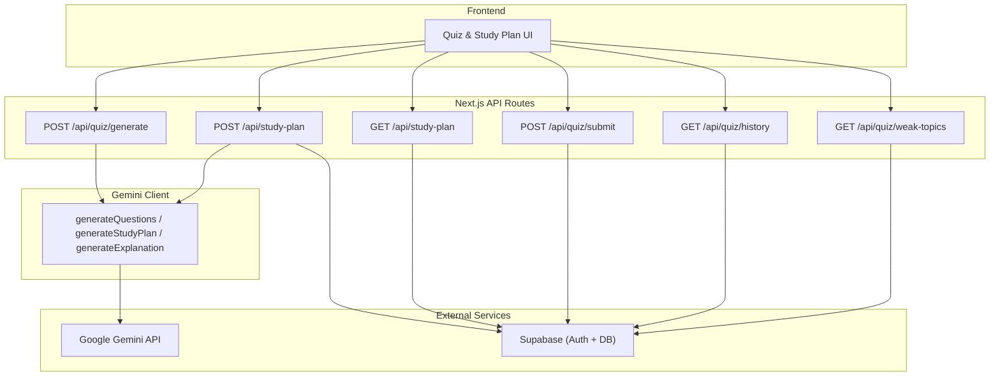
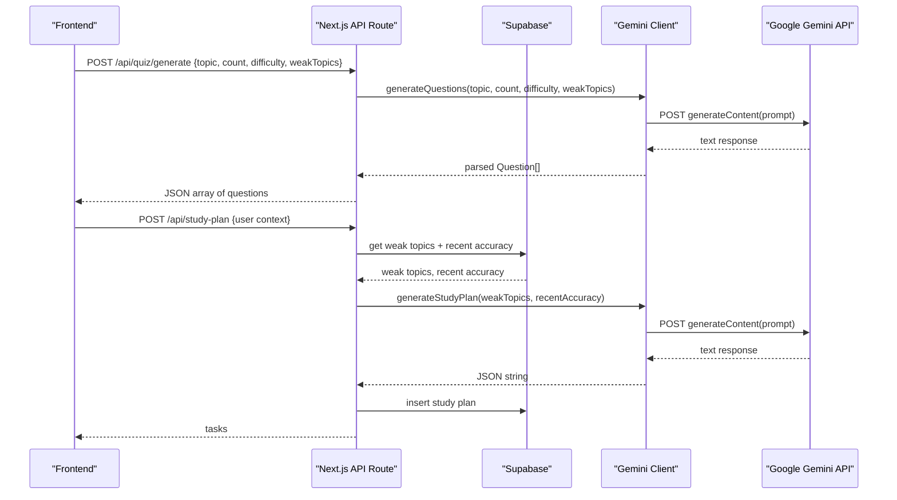
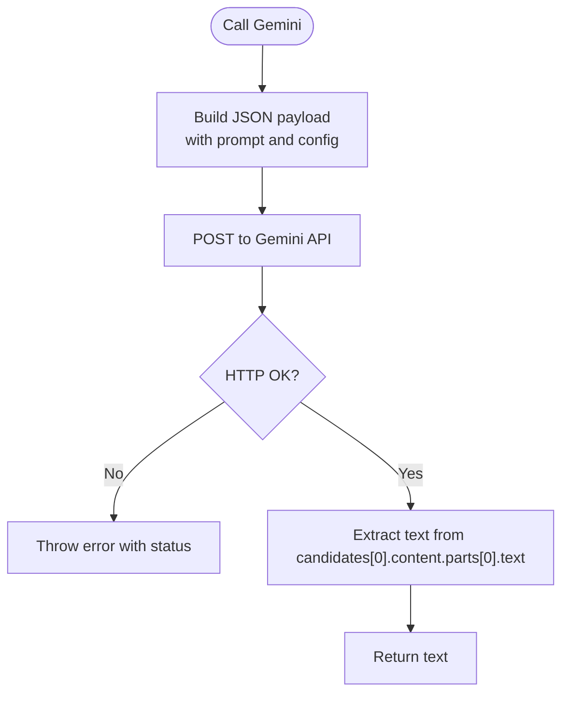
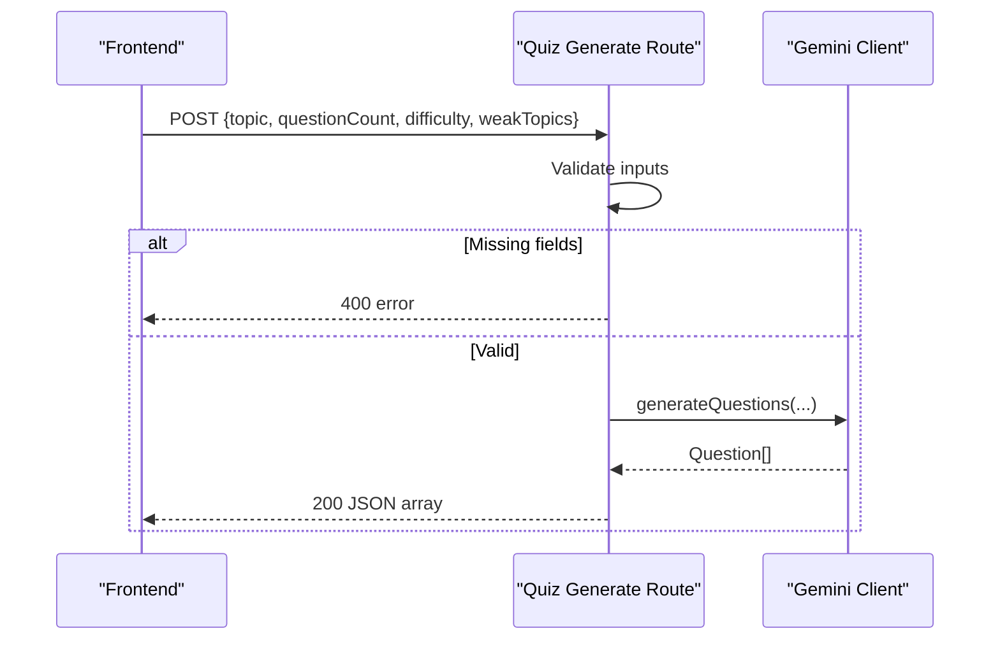
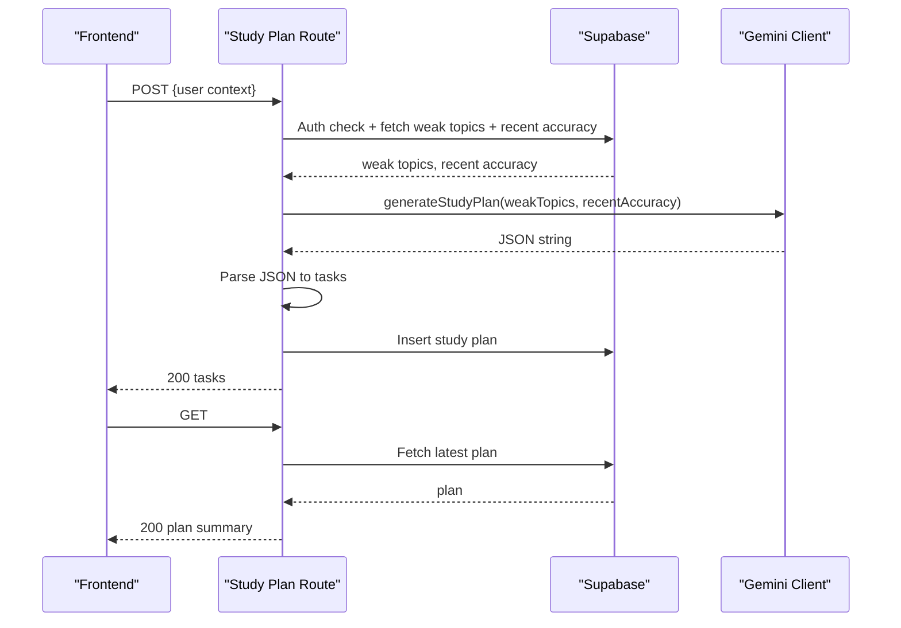
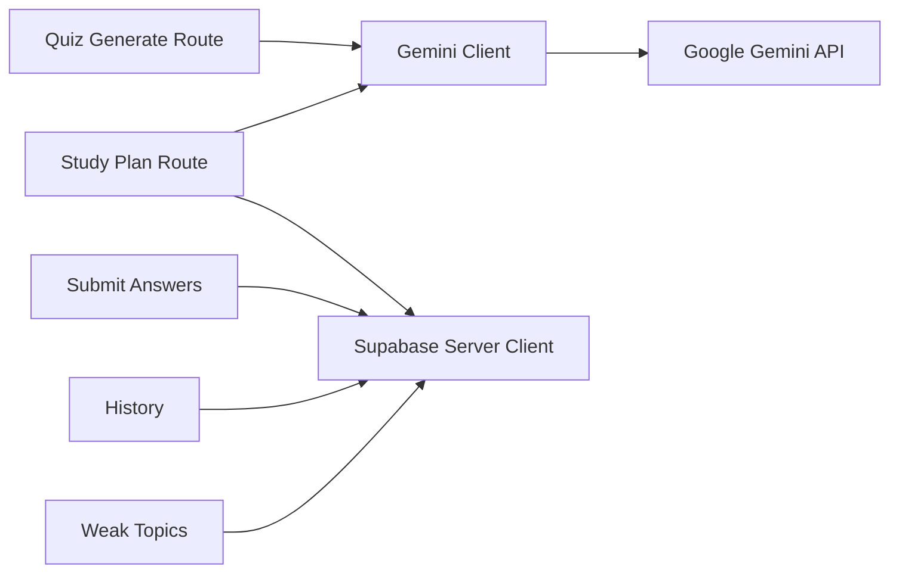

# AI Integration

<cite>
**Referenced Files in This Document**
- [client.ts](file://Next-app/src/lib/gemini/client.ts)
- [prompts.ts](file://Next-app/src/lib/gemini/prompts.ts)
- [quiz generate route](file://Next-app/src/app/api/quiz/generate/route.ts)
- [study plan route](file://Next-app/src/app/api/study-plan/route.ts)
- [quiz submit route](file://Next-app/src/app/api/quiz/submit/route.ts)
- [quiz history route](file://Next-app/src/app/api/quiz/history/route.ts)
- [weak topics route](file://Next-app/src/app/api/quiz/weak-topics/route.ts)
- [quiz types](file://Next-app/src/types/quiz.ts)
- [QueryProvider](file://Next-app/src/providers/QueryProvider.tsx)
- [Supabase server client](file://Next-app/src/lib/supabase/server.ts)
- [Project scope](file://Project-Scope.md)
</cite>

## Table of Contents
1. [Introduction](#introduction)
2. [Project Structure](#project-structure)
3. [Core Components](#core-components)
4. [Architecture Overview](#architecture-overview)
5. [Detailed Component Analysis](#detailed-component-analysis)
6. [Dependency Analysis](#dependency-analysis)
7. [Performance Considerations](#performance-considerations)
8. [Troubleshooting Guide](#troubleshooting-guide)
9. [Conclusion](#conclusion)
10. [Appendices](#appendices)

## Introduction
This document explains how the application integrates with Google Gemini to generate MDCAT quiz questions and personalized study plans. It covers client setup, prompt engineering strategies, API call patterns, request/response schemas, error handling, rate limiting considerations, caching strategies, security practices for API keys, input validation, output sanitization, and troubleshooting guidance for common integration issues.

## Project Structure
The Gemini integration is implemented as a small library under src/lib/gemini with two files:
- A client module that makes HTTP calls to Gemini’s generateContent endpoint and exposes functions for generating questions, explanations, and study plans.
- A prompts module containing reusable system and task prompts.

API routes in Next.js App Router expose endpoints for quiz generation and study plan creation, which orchestrate user input, database interactions (via Supabase), and Gemini calls.

**Diagram sources**
- [quiz generate route:1-32](file://Next-app/src/app/api/quiz/generate/route.ts#L1-L32)
- [study plan route:1-115](file://Next-app/src/app/api/study-plan/route.ts#L1-L115)
- [client.ts:1-135](file://Next-app/src/lib/gemini/client.ts#L1-L135)
- [Supabase server client:1-30](file://Next-app/src/lib/supabase/server.ts#L1-L30)

**Section sources**
- [quiz generate route:1-32](file://Next-app/src/app/api/quiz/generate/route.ts#L1-L32)
- [study plan route:1-115](file://Next-app/src/app/api/study-plan/route.ts#L1-L115)
- [client.ts:1-135](file://Next-app/src/lib/gemini/client.ts#L1-L135)
- [Supabase server client:1-30](file://Next-app/src/lib/supabase/server.ts#L1-L30)

## Core Components
- Gemini client: Centralizes HTTP calls to Gemini, builds payloads, handles basic errors, and extracts text responses. Exposes:
  - generateQuestions(topic, count, difficulty, weakTopics)
  - generateExplanation(questionText, correctAnswer, userAnswer)
  - generateStudyPlan(weakTopics, recentAccuracy, hoursPerDay)
- Prompts: Reusable system and task prompts for consistent behavior across features.
- API routes:
  - Quiz generation: Validates inputs, calls Gemini, returns structured JSON.
  - Study plan: Authenticates user, fetches weak topics and recent accuracy from Supabase, calls Gemini, parses JSON, persists to DB, returns tasks.
  - Additional routes: Submit answers, retrieve history, and fetch weak topics.

Key responsibilities:
- Input validation at route boundaries.
- Prompt construction using dynamic context (topic, difficulty, weak topics).
- Response parsing and schema enforcement via JSON extraction and TypeScript interfaces.
- Error propagation and user-friendly error responses.

**Section sources**
- [client.ts:1-135](file://Next-app/src/lib/gemini/client.ts#L1-L135)
- [prompts.ts:1-25](file://Next-app/src/lib/gemini/prompts.ts#L1-L25)
- [quiz generate route:1-32](file://Next-app/src/app/api/quiz/generate/route.ts#L1-L32)
- [study plan route:1-115](file://Next-app/src/app/api/study-plan/route.ts#L1-L115)
- [quiz types:1-47](file://Next-app/src/types/quiz.ts#L1-L47)

## Architecture Overview
The flow for both quiz generation and study plan creation follows a consistent pattern:
- Client sends a request to a Next.js API route.
- Route validates and authenticates (where required).
- Route may query Supabase for contextual data (e.g., weak topics, recent accuracy).
- Route invokes Gemini client with a tailored prompt.
- Gemini returns text; route parses into structured JSON.
- Route persists results or returns them to the client.

**Diagram sources**
- [quiz generate route:1-32](file://Next-app/src/app/api/quiz/generate/route.ts#L1-L32)
- [study plan route:1-115](file://Next-app/src/app/api/study-plan/route.ts#L1-L115)
- [client.ts:1-135](file://Next-app/src/lib/gemini/client.ts#L1-L135)
- [Supabase server client:1-30](file://Next-app/src/lib/supabase/server.ts#L1-L30)

## Detailed Component Analysis

### Gemini Client
- Base URL and model: Uses Gemini Flash model via generateContent endpoint.
- Authentication: API key passed as a query parameter from environment variable.
- Request payload: contents with parts containing the prompt; generationConfig sets temperature and maxOutputTokens.
- Response handling: Extracts first candidate’s first part text; throws on non-OK status.
- Functions:
  - generateQuestions: Builds a strict prompt requesting a JSON array of questions with specific fields and rules; parses JSON from response.
  - generateExplanation: Produces conversational Urdu explanation based on question, correct answer, and user answer.
  - generateStudyPlan: Builds a prompt including weak topics and recent accuracy; expects a JSON object with tasks.

**Diagram sources**
- [client.ts:6-28](file://Next-app/src/lib/gemini/client.ts#L6-L28)

**Section sources**
- [client.ts:1-135](file://Next-app/src/lib/gemini/client.ts#L1-L135)

### Quiz Generation API
- Inputs: topic, questionCount, difficulty (default medium), weakTopics (optional).
- Validation: Ensures topic and questionCount are present; otherwise returns 400.
- Processing: Calls generateQuestions with parameters; returns JSON array of questions.
- Errors: Catches exceptions and returns 500 with localized error message.

**Diagram sources**
- [quiz generate route:1-32](file://Next-app/src/app/api/quiz/generate/route.ts#L1-L32)
- [client.ts:30-75](file://Next-app/src/lib/gemini/client.ts#L30-L75)

**Section sources**
- [quiz generate route:1-32](file://Next-app/src/app/api/quiz/generate/route.ts#L1-L32)
- [client.ts:30-75](file://Next-app/src/lib/gemini/client.ts#L30-L75)

### Study Plan API
- Authentication: Requires authenticated user via Supabase; returns 401 if not authenticated.
- Data gathering: Fetches weak topics and recent accuracy from Supabase.
- Processing: Calls generateStudyPlan with aggregated performance data; parses JSON from Gemini response; computes current week start date.
- Persistence: Inserts plan into study_plans table with week_start and plan_data.
- Retrieval: GET returns latest plan per user with id, userId, weekStart, tasks, generatedAt.
- Errors: Catches exceptions and returns 500 with localized error message; GET returns null on errors.

**Diagram sources**
- [study plan route:1-115](file://Next-app/src/app/api/study-plan/route.ts#L1-L115)
- [client.ts:94-135](file://Next-app/src/lib/gemini/client.ts#L94-L135)
- [Supabase server client:1-30](file://Next-app/src/lib/supabase/server.ts#L1-L30)

**Section sources**
- [study plan route:1-115](file://Next-app/src/app/api/study-plan/route.ts#L1-L115)
- [client.ts:94-135](file://Next-app/src/lib/gemini/client.ts#L94-L135)
- [Supabase server client:1-30](file://Next-app/src/lib/supabase/server.ts#L1-L30)

### Supporting Routes
- Submit answers: Records session metrics, inserts questions and answers, updates weak topics.
- History: Returns recent quiz sessions for the authenticated user.
- Weak topics: Returns top weak topics by wrong count for the authenticated user.

These routes rely on Supabase authentication and provide data used by the study plan generator and UI analytics.

**Section sources**
- [quiz submit route:1-82](file://Next-app/src/app/api/quiz/submit/route.ts#L1-L82)
- [quiz history route:1-33](file://Next-app/src/app/api/quiz/history/route.ts#L1-L33)
- [weak topics route:1-33](file://Next-app/src/app/api/quiz/weak-topics/route.ts#L1-L33)

## Dependency Analysis
- API routes depend on:
  - Gemini client for LLM calls.
  - Supabase server client for auth and persistence.
- Gemini client depends on:
  - Environment variables for API key.
  - External Gemini API service.
- Types define contracts for questions and answers, ensuring consistency between routes and client code.

**Diagram sources**
- [quiz generate route:1-32](file://Next-app/src/app/api/quiz/generate/route.ts#L1-L32)
- [study plan route:1-115](file://Next-app/src/app/api/study-plan/route.ts#L1-L115)
- [client.ts:1-135](file://Next-app/src/lib/gemini/client.ts#L1-L135)
- [Supabase server client:1-30](file://Next-app/src/lib/supabase/server.ts#L1-L30)

**Section sources**
- [quiz generate route:1-32](file://Next-app/src/app/api/quiz/generate/route.ts#L1-L32)
- [study plan route:1-115](file://Next-app/src/app/api/study-plan/route.ts#L1-L115)
- [client.ts:1-135](file://Next-app/src/lib/gemini/client.ts#L1-L135)
- [Supabase server client:1-30](file://Next-app/src/lib/supabase/server.ts#L1-L30)

## Performance Considerations
- Token limits and latency: The client sets maxOutputTokens to control response size and cost; adjust based on expected content length.
- Temperature: Set to balance creativity and determinism; lower values produce more stable outputs.
- Parsing overhead: JSON extraction uses regex; ensure prompts enforce strict JSON to minimize retries.
- Frontend caching: QueryClient configured with staleTime and retry settings to reduce redundant requests and improve UX.
- Database queries: Study plan route fetches only necessary aggregates (weak topics and recent accuracy) to limit payload size and processing time.

Recommendations:
- Batch requests where possible (e.g., generate multiple questions in one call).
- Cache frequent prompts or results when appropriate.
- Monitor token usage and adjust maxOutputTokens and temperature per feature needs.

**Section sources**
- [client.ts:6-28](file://Next-app/src/lib/gemini/client.ts#L6-L28)
- [QueryProvider:1-23](file://Next-app/src/providers/QueryProvider.tsx#L1-L23)
- [study plan route:16-55](file://Next-app/src/app/api/study-plan/route.ts#L16-L55)

## Troubleshooting Guide
Common issues and resolutions:
- Invalid response format from Gemini:
  - Symptom: Parsing fails when extracting JSON.
  - Cause: Model returned unexpected text or markdown wrapping.
  - Resolution: Ensure prompts enforce strict JSON; add robust regex extraction; log raw responses for debugging.
- API key missing or invalid:
  - Symptom: Non-OK HTTP status from Gemini.
  - Cause: GOOGLE_GEMINI_API_KEY not set or incorrect.
  - Resolution: Verify environment configuration; confirm key has access to the specified model.
- Authentication failures:
  - Symptom: 401 Unauthorized on protected routes.
  - Cause: User not authenticated via Supabase.
  - Resolution: Ensure proper session handling and cookie management in server client.
- Database errors:
  - Symptom: Unexpected empty arrays or null responses.
  - Cause: Query failures or missing records.
  - Resolution: Log errors; handle gracefully; verify schema and permissions.
- Rate limiting:
  - Symptom: Throttling or quota exceeded errors from Gemini.
  - Cause: High request volume or insufficient quotas.
  - Resolution: Implement exponential backoff and retry logic; queue requests; monitor quotas.

Best practices:
- Always wrap external calls in try/catch and return user-friendly errors.
- Log detailed errors server-side while exposing minimal details to clients.
- Validate all inputs before sending to Gemini to avoid malformed prompts.
- Sanitize outputs before rendering in the UI to prevent injection risks.

**Section sources**
- [client.ts:22-28](file://Next-app/src/lib/gemini/client.ts#L22-L28)
- [quiz generate route:24-30](file://Next-app/src/app/api/quiz/generate/route.ts#L24-L30)
- [study plan route:71-77](file://Next-app/src/app/api/study-plan/route.ts#L71-L77)
- [Supabase server client:4-11](file://Next-app/src/lib/supabase/server.ts#L4-L11)

## Conclusion
The Gemini integration is centered around a concise client that constructs prompts and handles responses, paired with Next.js API routes that validate inputs, gather context from Supabase, and persist results. The design emphasizes clear schemas, robust error handling, and maintainable prompts. For production readiness, consider adding rate limiting, comprehensive caching, stricter input validation, and enhanced output sanitization.

## Appendices

### Request/Response Schemas

- Quiz Generation
  - Request body:
    - topic: string
    - questionCount: number
    - difficulty: "easy" | "medium" | "hard"
    - weakTopics: string[] (optional)
  - Response: Array of Question objects with fields id, questionText, options, correctAnswer, explanation, topic, difficulty.

- Study Plan
  - Request body: Authenticated user context (handled by Supabase).
  - Gemini prompt includes weak topics and recent accuracy.
  - Response: Object with tasks array; each task includes day, topic, activity, estimatedMinutes, completed, summary.
  - Storage: Persisted with week_start and plan_data; GET returns id, userId, weekStart, tasks, generatedAt.

- Explanation
  - Input: questionText, correctAnswer, userAnswer.
  - Output: Conversational Urdu explanation text.

**Section sources**
- [quiz types:1-47](file://Next-app/src/types/quiz.ts#L1-L47)
- [client.ts:30-75](file://Next-app/src/lib/gemini/client.ts#L30-L75)
- [client.ts:94-135](file://Next-app/src/lib/gemini/client.ts#L94-L135)
- [study plan route:53-70](file://Next-app/src/app/api/study-plan/route.ts#L53-L70)
- [study plan route:80-115](file://Next-app/src/app/api/study-plan/route.ts#L80-L115)

### Security Considerations
- API key management:
  - Store GOOGLE_GEMINI_API_KEY in environment variables; never hardcode or expose to client.
  - Use server-only routes to make Gemini calls.
- Input validation:
  - Validate required fields (topic, questionCount) before calling Gemini.
  - Enforce allowed values for difficulty and sanitize strings.
- Output sanitization:
  - Parse and validate JSON responses strictly; reject malformed outputs.
  - Escape or sanitize rendered content to prevent XSS.
- Authentication:
  - Protect sensitive routes with Supabase auth checks; return 401 for unauthenticated users.
- Least privilege:
  - Use anonymous Supabase keys for read/write operations scoped to user data via Row Level Security policies.

**Section sources**
- [client.ts:6-9](file://Next-app/src/lib/gemini/client.ts#L6-L9)
- [quiz generate route:9-14](file://Next-app/src/app/api/quiz/generate/route.ts#L9-L14)
- [study plan route:5-14](file://Next-app/src/app/api/study-plan/route.ts#L5-L14)
- [Supabase server client:4-11](file://Next-app/src/lib/supabase/server.ts#L4-L11)

### Prompt Engineering Strategies
- Role and tone: Define an expert tutor persona focused on MDCAT preparation and Urdu language.
- Strict formatting: Require exact JSON structures to simplify parsing and ensure consistency.
- Contextual personalization: Include weak topics and recent accuracy to tailor study plans.
- Language constraints: Enforce Urdu output for questions, explanations, and summaries.
- Difficulty alignment: Map difficulty levels to appropriate complexity and depth.

Examples of customization:
- Adjust difficulty by modifying the prompt’s difficulty instruction.
- Add subject-specific constraints (e.g., biology vs. chemistry) by appending syllabus-aligned rules.
- Emphasize weak topics by increasing their weight in the prompt.

**Section sources**
- [prompts.ts:1-25](file://Next-app/src/lib/gemini/prompts.ts#L1-L25)
- [client.ts:41-64](file://Next-app/src/lib/gemini/client.ts#L41-L64)
- [client.ts:106-131](file://Next-app/src/lib/gemini/client.ts#L106-L131)

### Error Handling Patterns
- Network errors: Catch non-OK responses and throw descriptive errors.
- Parsing errors: Detect invalid JSON and raise explicit errors.
- Route-level handling: Wrap logic in try/catch; return standardized error responses with status codes.
- Logging: Log detailed errors server-side for debugging without exposing internals to clients.

**Section sources**
- [client.ts:22-28](file://Next-app/src/lib/gemini/client.ts#L22-L28)
- [client.ts:68-74](file://Next-app/src/lib/gemini/client.ts#L68-L74)
- [quiz generate route:24-30](file://Next-app/src/app/api/quiz/generate/route.ts#L24-L30)
- [study plan route:71-77](file://Next-app/src/app/api/study-plan/route.ts#L71-L77)

### Rate Limiting and Caching Strategies
- Rate limiting:
  - Implement exponential backoff and retry on throttling responses.
  - Queue concurrent requests to respect API quotas.
  - Monitor usage and adjust concurrency based on observed limits.
- Caching:
  - Use frontend caching via QueryClient with staleTime and retry settings.
  - Consider server-side caching for repeated prompts or static content.
  - Cache weak topics and recent accuracy briefly to reduce DB load.

**Section sources**
- [QueryProvider:1-23](file://Next-app/src/providers/QueryProvider.tsx#L1-L23)
- [study plan route:16-55](file://Next-app/src/app/api/study-plan/route.ts#L16-L55)

### Endpoints Summary
- POST /api/quiz/generate
  - Purpose: Generate quiz questions via Gemini.
  - Inputs: topic, questionCount, difficulty, weakTopics.
  - Outputs: Array of questions.
- POST /api/study-plan
  - Purpose: Create weekly study plan via Gemini and persist to DB.
  - Inputs: Authenticated user context.
  - Outputs: Tasks array; persisted plan.
- GET /api/study-plan
  - Purpose: Retrieve latest study plan for user.
  - Outputs: Plan summary with tasks.
- POST /api/quiz/submit
  - Purpose: Record quiz session and answers.
  - Outputs: Session confirmation.
- GET /api/quiz/history
  - Purpose: Fetch recent quiz sessions.
  - Outputs: Sessions list.
- GET /api/quiz/weak-topics
  - Purpose: Fetch top weak topics.
  - Outputs: Weak topics list.

**Section sources**
- [quiz generate route:1-32](file://Next-app/src/app/api/quiz/generate/route.ts#L1-L32)
- [study plan route:1-115](file://Next-app/src/app/api/study-plan/route.ts#L1-L115)
- [quiz submit route:1-82](file://Next-app/src/app/api/quiz/submit/route.ts#L1-L82)
- [quiz history route:1-33](file://Next-app/src/app/api/quiz/history/route.ts#L1-L33)
- [weak topics route:1-33](file://Next-app/src/app/api/quiz/weak-topics/route.ts#L1-L33)