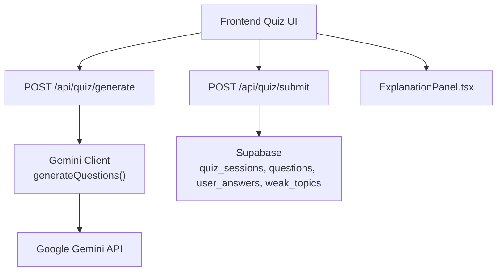
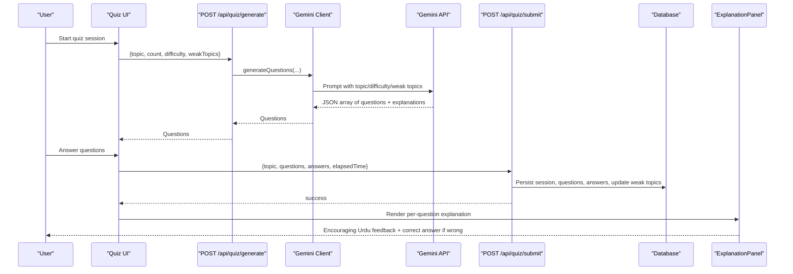
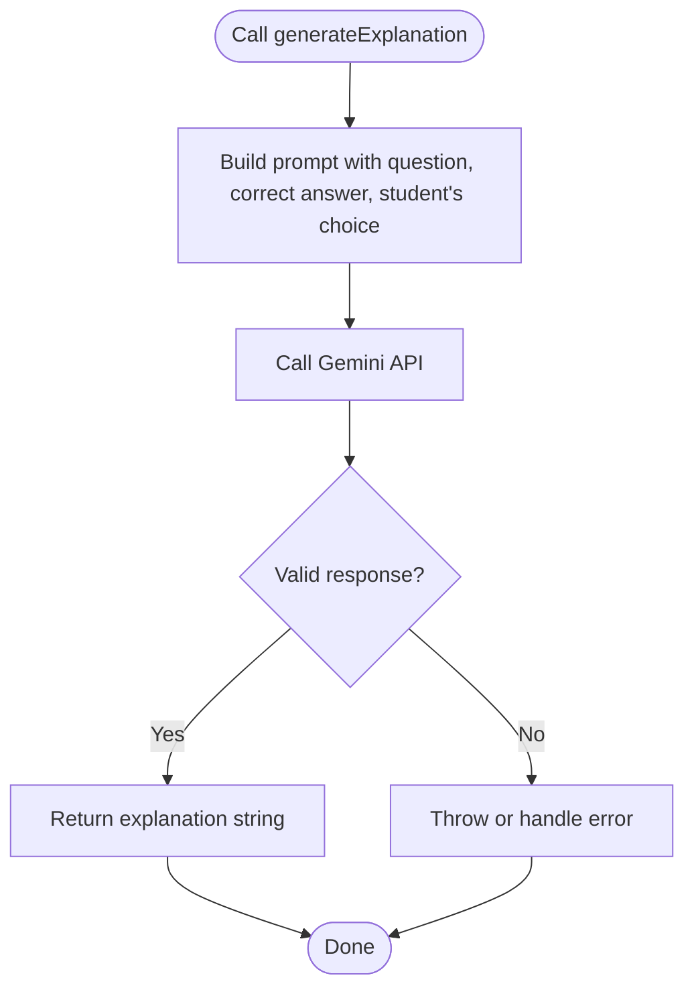
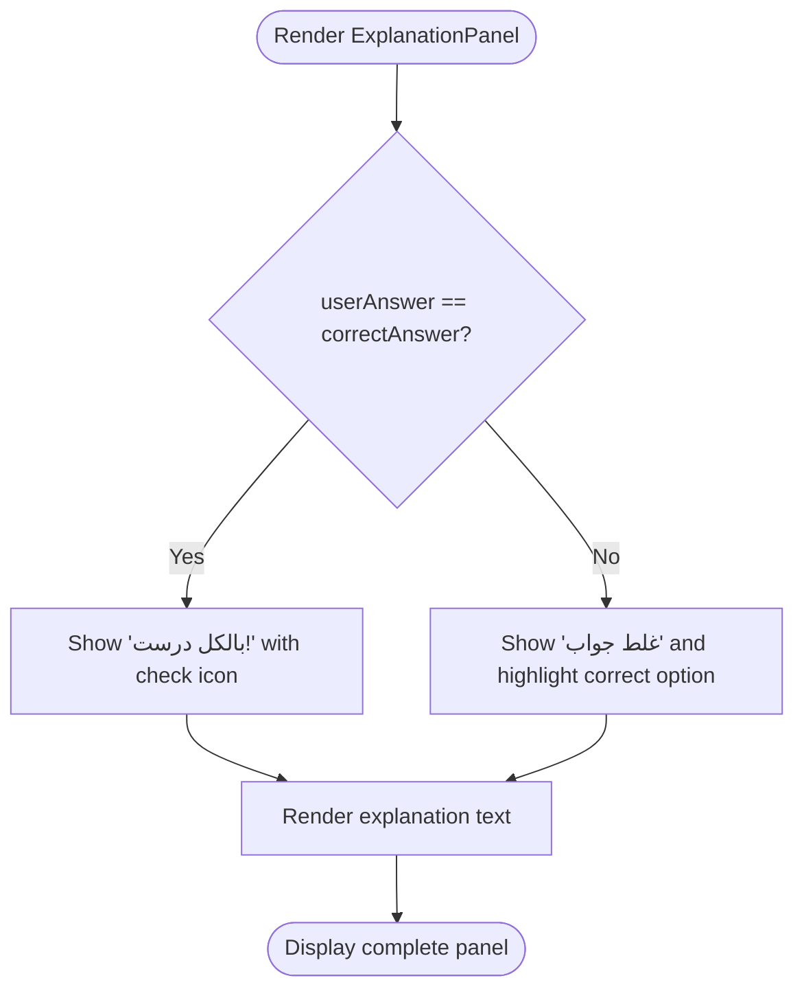
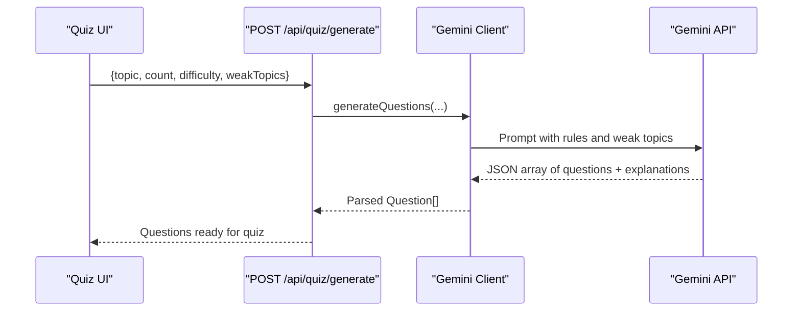
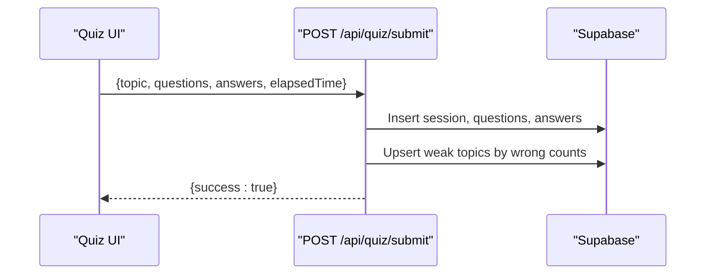
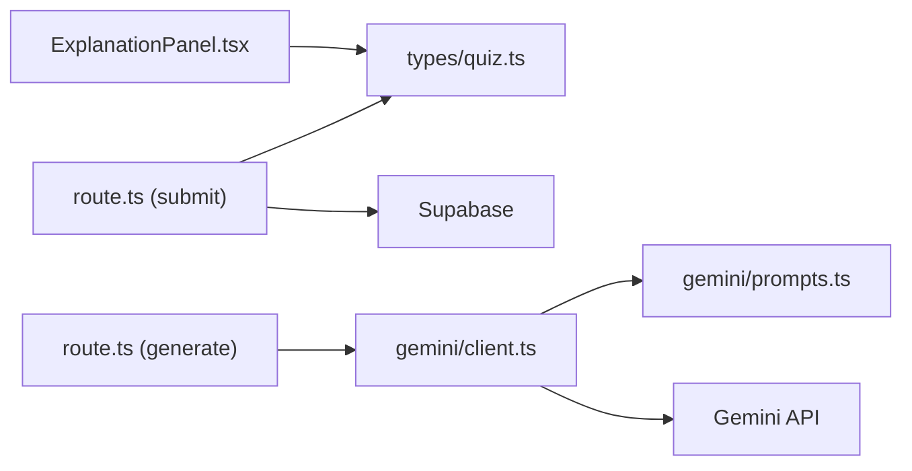

# Answer Explanation Generation

<cite>
**Referenced Files in This Document**
- [client.ts](file://Next-app/src/lib/gemini/client.ts)
- [prompts.ts](file://Next-app/src/lib/gemini/prompts.ts)
- [ExplanationPanel.tsx](file://Next-app/src/components/quiz/ExplanationPanel.tsx)
- [route.ts (submit)](file://Next-app/src/app/api/quiz/submit/route.ts)
- [route.ts (generate)](file://Next-app/src/app/api/quiz/generate/route.ts)
- [quiz.ts](file://Next-app/src/types/quiz.ts)
- [constants.ts](file://Next-app/src/lib/constants.ts)
- [Project-Scope.md](file://Project-Scope.md)
</cite>

## Table of Contents
1. [Introduction](#introduction)
2. [Project Structure](#project-structure)
3. [Core Components](#core-components)
4. [Architecture Overview](#architecture-overview)
5. [Detailed Component Analysis](#detailed-component-analysis)
6. [Dependency Analysis](#dependency-analysis)
7. [Performance Considerations](#performance-considerations)
8. [Troubleshooting Guide](#troubleshooting-guide)
9. [Conclusion](#conclusion)
10. [Appendices](#appendices)

## Introduction
This document explains the AI-powered answer explanation generation system used by MedAce AI to provide tutoring-style feedback for MDCAT practice questions. It focuses on how the system generates explanations, adapts to Urdu language and Pakistani cultural context, compares correct versus incorrect answers, encourages learners, and provides educational context. It also covers customization options for depth, subject-specific terminology, and guidance for improving explanation quality and personalizing feedback based on student performance patterns.

## Project Structure
The explanation feature spans a few key layers:
- API routes handle quiz submission and question generation.
- A Gemini client constructs prompts and calls the model to generate content, including explanations.
- UI components render the explanation panel with culturally appropriate messaging.
- Types define data contracts for questions and answers.
- Constants provide localized labels and configuration.

**Diagram sources**
- [route.ts (generate):1-32](file://Next-app/src/app/api/quiz/generate/route.ts#L1-L32)
- [route.ts (submit):1-113](file://Next-app/src/app/api/quiz/submit/route.ts#L1-L113)
- [client.ts:1-134](file://Next-app/src/lib/gemini/client.ts#L1-L134)
- [ExplanationPanel.tsx:1-44](file://Next-app/src/components/quiz/ExplanationPanel.tsx#L1-L44)

**Section sources**
- [route.ts (generate):1-32](file://Next-app/src/app/api/quiz/generate/route.ts#L1-L32)
- [route.ts (submit):1-113](file://Next-app/src/app/api/quiz/submit/route.ts#L1-L113)
- [client.ts:1-134](file://Next-app/src/lib/gemini/client.ts#L1-L134)
- [ExplanationPanel.tsx:1-44](file://Next-app/src/components/quiz/ExplanationPanel.tsx#L1-L44)

## Core Components
- Gemini client functions:
  - generateQuestions(topic, count, difficulty, weakTopics): Produces syllabus-aligned MCQs in Urdu with built-in explanations.
  - generateExplanation(questionText, correctAnswer, userAnswer): Generates conversational Urdu feedback tailored to the student’s choice.
  - generateStudyPlan(weakTopics, recentAccuracy, hoursPerDay): Creates a weekly plan focused on weak areas.
- Prompt library: Centralized system and task prompts that enforce tone, pedagogy, and Urdu-first communication.
- UI rendering: ExplanationPanel displays correctness, highlights the right answer when wrong, and shows the generated explanation.
- Data persistence: Quiz submit route records sessions, questions, answers, and updates weak topics for future personalization.

Key responsibilities:
- The Gemini client encapsulates prompt construction and API calls.
- Routes orchestrate requests and responses while persisting results.
- The UI ensures consistent, encouraging presentation aligned with Urdu conventions.

**Section sources**
- [client.ts:30-92](file://Next-app/src/lib/gemini/client.ts#L30-L92)
- [prompts.ts:1-24](file://Next-app/src/lib/gemini/prompts.ts#L1-L24)
- [ExplanationPanel.tsx:10-43](file://Next-app/src/components/quiz/ExplanationPanel.tsx#L10-L43)
- [route.ts (submit):18-101](file://Next-app/src/app/api/quiz/submit/route.ts#L18-L101)

## Architecture Overview
The explanation pipeline integrates AI generation with persistent tracking and UI display.

**Diagram sources**
- [route.ts (generate):1-32](file://Next-app/src/app/api/quiz/generate/route.ts#L1-L32)
- [client.ts:30-75](file://Next-app/src/lib/gemini/client.ts#L30-L75)
- [route.ts (submit):15-104](file://Next-app/src/app/api/quiz/submit/route.ts#L15-L104)
- [ExplanationPanel.tsx:10-43](file://Next-app/src/components/quiz/ExplanationPanel.tsx#L10-L43)

## Detailed Component Analysis

### generateExplanation Function
Purpose:
- Produces a tutoring-style explanation in conversational Urdu that compares the student’s chosen answer with the correct one, explains why the correct option is right, and gently clarifies why the selected option was wrong.

Inputs:
- questionText: The original question in Urdu.
- correctAnswer: The correct option text.
- userAnswer: The option the student selected.

Behavior:
- Constructs a prompt instructing the model to act as a friendly MDCAT tutor.
- Requests an encouraging, step-by-step explanation in simple Urdu.
- Returns a string explanation suitable for immediate display.

Pedagogical approach:
- Conversational tone to feel like a supportive teacher.
- Focus on conceptual clarity rather than rote correction.
- Gentle error analysis to help students understand misconceptions.

Integration points:
- Can be called after submission or during review to enrich explanations beyond what was generated at question creation time.
- Works alongside stored explanations from question generation; can replace or augment them dynamically.

**Diagram sources**
- [client.ts:77-92](file://Next-app/src/lib/gemini/client.ts#L77-L92)

**Section sources**
- [client.ts:77-92](file://Next-app/src/lib/gemini/client.ts#L77-L92)
- [prompts.ts:1-9](file://Next-app/src/lib/gemini/prompts.ts#L1-L9)

### ExplanationPanel UI
Responsibilities:
- Determines correctness by comparing userAnswer with question.correctAnswer.
- Displays a positive or corrective header in Urdu.
- Shows the correct answer when the user was wrong.
- Renders the explanation text provided by the question or generated dynamically.

Tone and localization:
- Uses Urdu headings and messages to align with learner expectations.
- Visual cues (success/error borders and icons) reinforce correctness without shaming.

**Diagram sources**
- [ExplanationPanel.tsx:10-43](file://Next-app/src/components/quiz/ExplanationPanel.tsx#L10-L43)

**Section sources**
- [ExplanationPanel.tsx:10-43](file://Next-app/src/components/quiz/ExplanationPanel.tsx#L10-L43)

### Question Generation and Built-in Explanations
- generateQuestions builds a prompt that enforces:
  - Urdu-only content.
  - Alignment with the official MDCAT syllabus.
  - Exactly four options per question.
  - A detailed Urdu explanation for each correct answer.
- Weak topics can be injected into the prompt to bias generation toward areas needing reinforcement.

**Diagram sources**
- [route.ts (generate):1-32](file://Next-app/src/app/api/quiz/generate/route.ts#L1-L32)
- [client.ts:30-75](file://Next-app/src/lib/gemini/client.ts#L30-L75)

**Section sources**
- [client.ts:30-75](file://Next-app/src/lib/gemini/client.ts#L30-L75)
- [route.ts (generate):1-32](file://Next-app/src/app/api/quiz/generate/route.ts#L1-L32)

### Submission Flow and Weak Topic Tracking
- On submission, the server computes accuracy and persists:
  - Quiz session metadata.
  - Questions and their explanations.
  - User answers with correctness and timing.
  - Aggregated weak topics for future adaptive behavior.

**Diagram sources**
- [route.ts (submit):15-104](file://Next-app/src/app/api/quiz/submit/route.ts#L15-L104)

**Section sources**
- [route.ts (submit):15-104](file://Next-app/src/app/api/quiz/submit/route.ts#L15-L104)

### Data Contracts
- Question includes fields for text, options, correct index, explanation, topic, and difficulty.
- UserAnswer captures selection, correctness, and time taken.
- SessionResult aggregates outcomes and identifies weak topics.

These types ensure consistent handling across API routes and UI components.

**Section sources**
- [quiz.ts:1-47](file://Next-app/src/types/quiz.ts#L1-L47)

## Dependency Analysis
- The explanation system depends on:
  - Gemini client for AI generation and prompt execution.
  - API routes for orchestrating flows and persistence.
  - UI components for presenting feedback in Urdu.
  - Type definitions for safe data exchange.
  - Constants for localized labels and configuration.

**Diagram sources**
- [ExplanationPanel.tsx:1-44](file://Next-app/src/components/quiz/ExplanationPanel.tsx#L1-L44)
- [route.ts (submit):1-113](file://Next-app/src/app/api/quiz/submit/route.ts#L1-L113)
- [route.ts (generate):1-32](file://Next-app/src/app/api/quiz/generate/route.ts#L1-L32)
- [client.ts:1-134](file://Next-app/src/lib/gemini/client.ts#L1-L134)
- [prompts.ts:1-24](file://Next-app/src/lib/gemini/prompts.ts#L1-L24)
- [quiz.ts:1-47](file://Next-app/src/types/quiz.ts#L1-L47)

**Section sources**
- [client.ts:1-134](file://Next-app/src/lib/gemini/client.ts#L1-L134)
- [prompts.ts:1-24](file://Next-app/src/lib/gemini/prompts.ts#L1-L24)
- [route.ts (generate):1-32](file://Next-app/src/app/api/quiz/generate/route.ts#L1-L32)
- [route.ts (submit):1-113](file://Next-app/src/app/api/quiz/submit/route.ts#L1-L113)
- [ExplanationPanel.tsx:1-44](file://Next-app/src/components/quiz/ExplanationPanel.tsx#L1-L44)
- [quiz.ts:1-47](file://Next-app/src/types/quiz.ts#L1-L47)

## Performance Considerations
- Token usage and latency:
  - Explanation generation uses a single-turn prompt; keep inputs concise to reduce token consumption.
  - Consider caching repeated explanations for identical question-answer pairs to avoid redundant calls.
- Prompt efficiency:
  - Use structured prompts to minimize retries and malformed outputs.
  - Extract JSON robustly to prevent parsing overhead.
- Database writes:
  - Batch inserts where possible (already implemented for questions and answers).
  - Upsert weak topics efficiently to avoid N+1 updates.
- UI responsiveness:
  - Show loading states while waiting for AI responses.
  - Stream or progressively render explanations if feasible.

[No sources needed since this section provides general guidance]

## Troubleshooting Guide
Common issues and mitigations:
- Invalid Gemini response format:
  - Ensure JSON extraction handles markdown code blocks.
  - Validate parsed output before use.
- API errors:
  - Catch non-OK responses and surface user-friendly messages in Urdu.
- Missing or incorrect data:
  - Validate required fields before calling APIs.
  - Guard against undefined values in UI rendering.
- Weak topic drift:
  - Periodically recompute weak topics from recent sessions to keep recommendations current.

Operational checks:
- Verify environment variables for API keys.
- Confirm database schema alignment with inserted fields.
- Log errors with context for faster debugging.

**Section sources**
- [client.ts:22-28](file://Next-app/src/lib/gemini/client.ts#L22-L28)
- [route.ts (generate):24-31](file://Next-app/src/app/api/quiz/generate/route.ts#L24-L31)
- [route.ts (submit):40-42](file://Next-app/src/app/api/quiz/submit/route.ts#L40-L42)

## Conclusion
MedAce AI’s explanation system combines targeted prompts, Urdu-first pedagogy, and persistent tracking to deliver encouraging, concept-focused feedback. The generateExplanation function enables dynamic, personalized tutoring responses that compare correct and incorrect answers, explain reasoning, and maintain a supportive tone. By leveraging weak-topic data and localized UI, the system adapts to individual learning needs and cultural context. Future enhancements can include deeper personalization, richer pedagogical strategies, and more granular controls over explanation depth and terminology.

[No sources needed since this section summarizes without analyzing specific files]

## Appendices

### Examples of Explanation Styles and Scenarios
- Correct answer scenario:
  - Reinforce understanding by briefly summarizing why the chosen option is correct and connecting it to core concepts.
- Incorrect answer scenario:
  - Acknowledge effort, identify the misconception, and clarify the correct reasoning in simple Urdu.
- Ambiguous or tricky options:
  - Highlight distinguishing features between close options and explain why one is superior.
- Time pressure cases:
  - Offer quick heuristics or memory aids that help students recognize correct patterns under exam conditions.

[No sources needed since this section provides general guidance]

### Customization Options
- Depth control:
  - Adjust temperature and max tokens to vary creativity and length of explanations.
  - Add explicit instructions in prompts to expand or condense detail.
- Subject-specific terminology:
  - Include domain keywords in prompts to ensure accurate medical/biological terms in Urdu, with English terms in parentheses when helpful.
- Cultural sensitivity:
  - Maintain conversational Urdu, avoid overly formal phrasing, and use culturally familiar examples relevant to Pakistani students.
- Personalization:
  - Inject weak topics and recent accuracy into prompts to tailor explanations to the learner’s profile.

**Section sources**
- [client.ts:14-18](file://Next-app/src/lib/gemini/client.ts#L14-L18)
- [prompts.ts:1-9](file://Next-app/src/lib/gemini/prompts.ts#L1-L9)
- [constants.ts:35-50](file://Next-app/src/lib/constants.ts#L35-L50)

### Improving Explanation Quality and Personalization
- Use performance history:
  - Feed recent accuracy and weak topics into prompts to focus on recurring mistakes.
- Iterative refinement:
  - Collect student feedback on explanations to improve prompt templates over time.
- Consistency checks:
  - Validate that explanations align with MDCAT syllabus and avoid extraneous content.
- Accessibility:
  - Keep sentences short and clear; prefer active voice and concrete examples.

**Section sources**
- [client.ts:94-134](file://Next-app/src/lib/gemini/client.ts#L94-L134)
- [Project-Scope.md:1-28](file://Project-Scope.md#L1-L28)