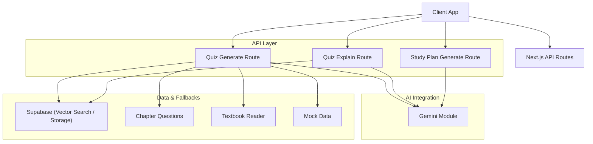
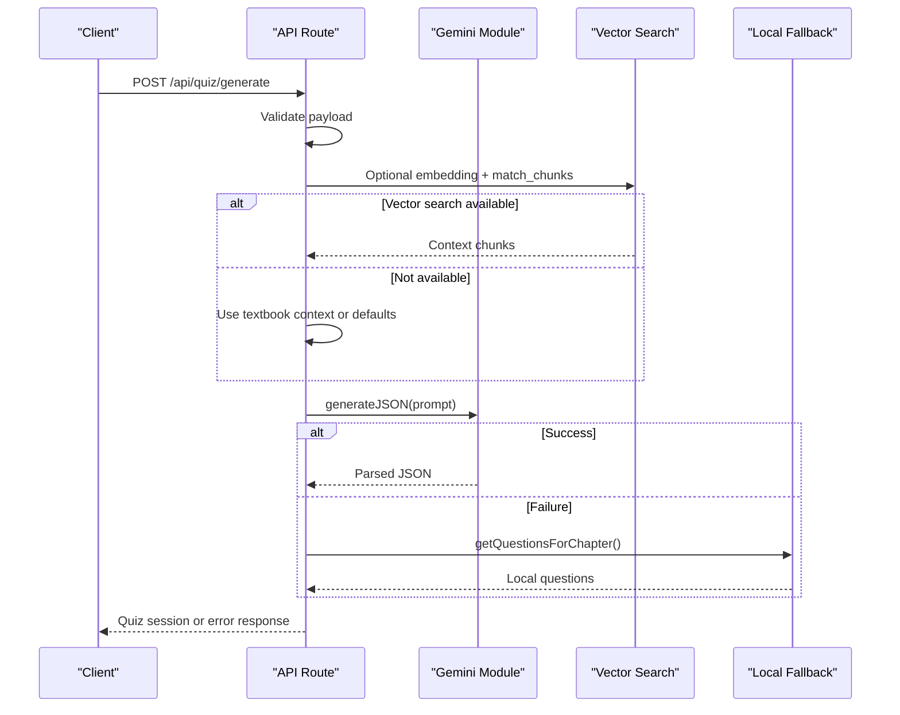
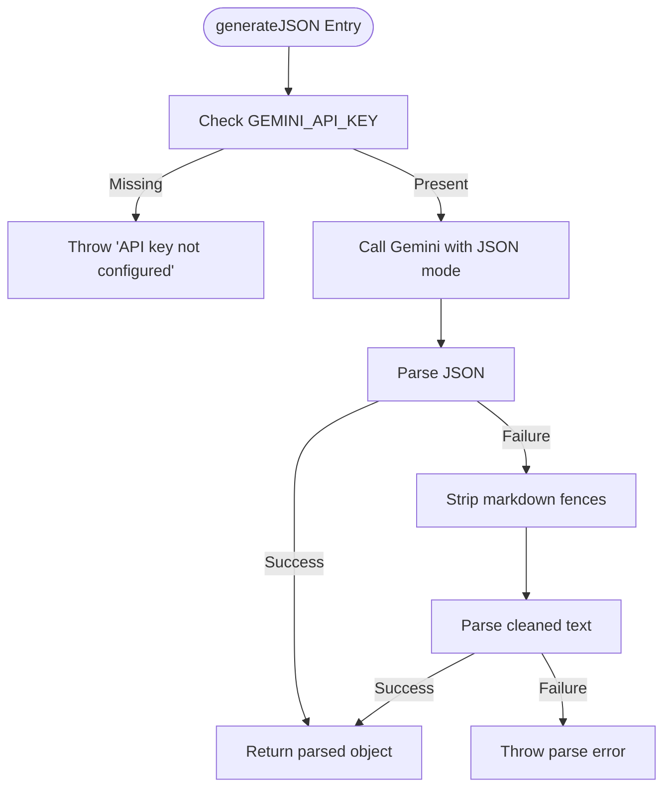
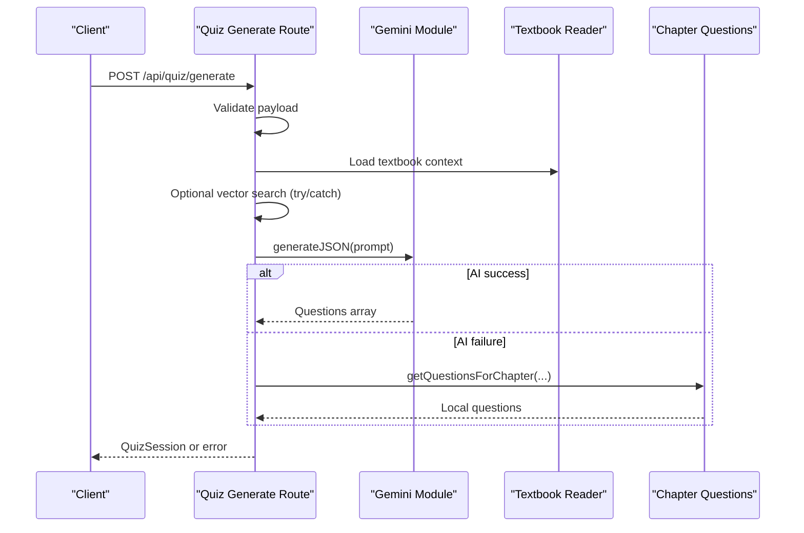
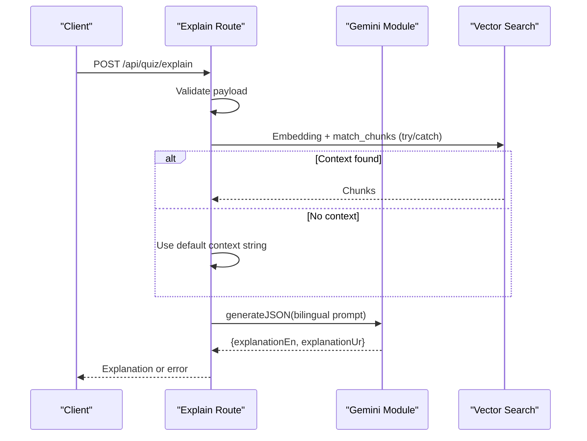
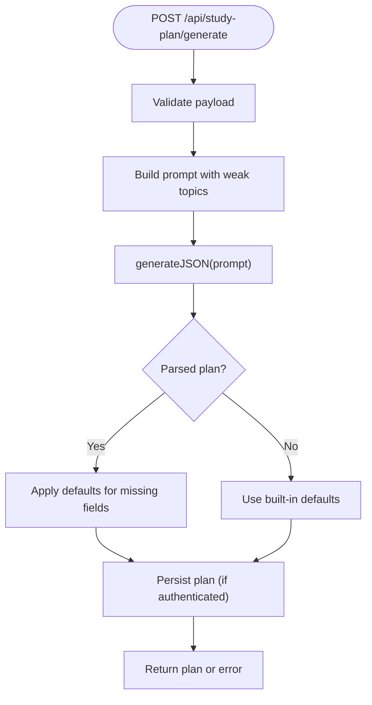
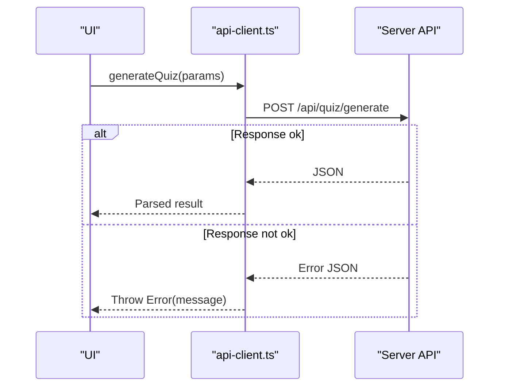
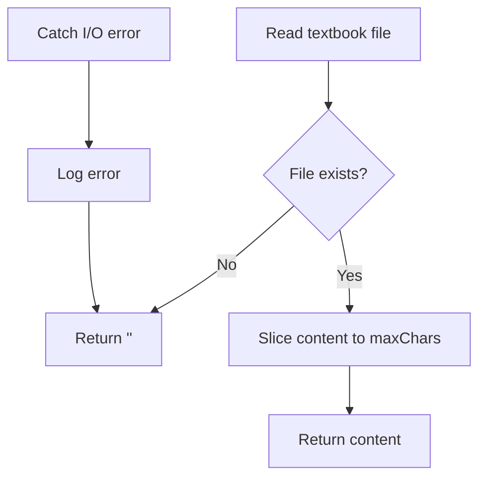
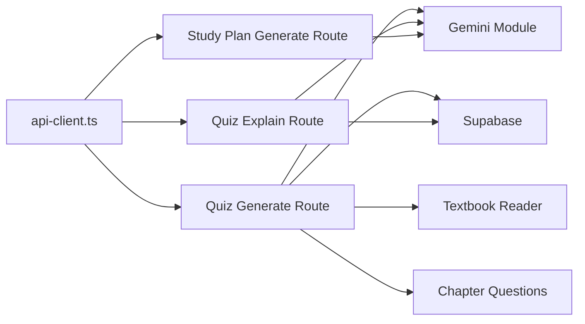

# Error Handling & Fallbacks

<cite>
**Referenced Files in This Document**
- [gemini.ts](file://src/lib/ai/gemini.ts)
- [route.ts (quiz generate)](file://src/app/api/quiz/generate/route.ts)
- [route.ts (quiz explain)](file://src/app/api/quiz/explain/route.ts)
- [route.ts (study plan generate)](file://src/app/api/study-plan/generate/route.ts)
- [api-client.ts](file://src/lib/api-client.ts)
- [textbook-reader.ts](file://src/lib/textbook-reader.ts)
- [chapter-questions.ts](file://src/lib/chapter-questions.ts)
- [mock-data.ts](file://src/lib/mock-data.ts)
</cite>

## Table of Contents
1. [Introduction](#introduction)
2. [Project Structure](#project-structure)
3. [Core Components](#core-components)
4. [Architecture Overview](#architecture-overview)
5. [Detailed Component Analysis](#detailed-component-analysis)
6. [Dependency Analysis](#dependency-analysis)
7. [Performance Considerations](#performance-considerations)
8. [Troubleshooting Guide](#troubleshooting-guide)
9. [Conclusion](#conclusion)
10. [Appendices](#appendices)

## Introduction
This document explains MedAce-AI’s error handling and fallback mechanisms for Gemini API integration. It covers how the system detects and handles API failures, network timeouts, invalid responses, and authentication errors. It also documents the JSON parsing fallback that cleans markdown-formatted AI responses before retrying parsing, and outlines graceful degradation strategies when AI services are unavailable. Finally, it provides guidance on logging, monitoring, alerting, cost control, testing strategies, and disaster recovery procedures.

## Project Structure
MedAce-AI integrates with the Gemini API via a dedicated module and exposes Next.js API routes for quiz generation, explanation, and study plan generation. The routes orchestrate validation, optional vector search, AI calls, and fallback to local data when needed. A client library abstracts HTTP interactions and centralizes error propagation.

**Diagram sources**
- [route.ts (quiz generate):1-196](file://src/app/api/quiz/generate/route.ts#L1-L196)
- [route.ts (quiz explain):1-79](file://src/app/api/quiz/explain/route.ts#L1-L79)
- [route.ts (study plan generate):1-123](file://src/app/api/study-plan/generate/route.ts#L1-L123)
- [gemini.ts:1-60](file://src/lib/ai/gemini.ts#L1-L60)
- [textbook-reader.ts:1-46](file://src/lib/textbook-reader.ts#L1-L46)
- [chapter-questions.ts:1-800](file://src/lib/chapter-questions.ts#L1-L800)
- [mock-data.ts:1-313](file://src/lib/mock-data.ts#L1-L313)

**Section sources**
- [route.ts (quiz generate):1-196](file://src/app/api/quiz/generate/route.ts#L1-L196)
- [route.ts (quiz explain):1-79](file://src/app/api/quiz/explain/route.ts#L1-L79)
- [route.ts (study plan generate):1-123](file://src/app/api/study-plan/generate/route.ts#L1-L123)
- [gemini.ts:1-60](file://src/lib/ai/gemini.ts#L1-L60)
- [textbook-reader.ts:1-46](file://src/lib/textbook-reader.ts#L1-L46)
- [chapter-questions.ts:1-800](file://src/lib/chapter-questions.ts#L1-L800)
- [mock-data.ts:1-313](file://src/lib/mock-data.ts#L1-L313)

## Core Components
- Gemini integration module:
  - Provides model accessors and typed helpers for embeddings and JSON generation.
  - Validates environment configuration and returns structured errors when keys are missing or responses are malformed.
- API routes:
  - Validate inputs, call Gemini, handle optional vector search, and fall back to local question banks or defaults when necessary.
  - Centralize error responses and logging.
- Client library:
  - Encapsulates fetch calls and converts non-ok responses into thrown errors for consistent upstream handling.
- Fallback utilities:
  - Chapter questions generator and textbook reader provide deterministic content when AI is unavailable.
  - Mock data supports development and offline scenarios.

Key responsibilities:
- Authentication guardrails for API key presence.
- Robust JSON parsing with markdown cleanup.
- Graceful degradation paths to ensure user experience continuity.
- Consistent error reporting and logging across layers.

**Section sources**
- [gemini.ts:1-60](file://src/lib/ai/gemini.ts#L1-L60)
- [route.ts (quiz generate):1-196](file://src/app/api/quiz/generate/route.ts#L1-L196)
- [route.ts (quiz explain):1-79](file://src/app/api/quiz/explain/route.ts#L1-L79)
- [route.ts (study plan generate):1-123](file://src/app/api/study-plan/generate/route.ts#L1-L123)
- [api-client.ts:1-133](file://src/lib/api-client.ts#L1-L133)
- [textbook-reader.ts:1-46](file://src/lib/textbook-reader.ts#L1-L46)
- [chapter-questions.ts:1-800](file://src/lib/chapter-questions.ts#L1-L800)
- [mock-data.ts:1-313](file://src/lib/mock-data.ts#L1-L313)

## Architecture Overview
The system follows a layered architecture:
- Client layer uses api-client.ts to call Next.js API endpoints.
- API routes validate input, optionally perform vector similarity search, and call Gemini for content generation.
- If Gemini fails or returns invalid output, routes degrade gracefully using local resources.
- Errors are logged centrally and returned as standardized JSON responses.

**Diagram sources**
- [route.ts (quiz generate):1-196](file://src/app/api/quiz/generate/route.ts#L1-L196)
- [gemini.ts:1-60](file://src/lib/ai/gemini.ts#L1-L60)
- [textbook-reader.ts:1-46](file://src/lib/textbook-reader.ts#L1-L46)
- [chapter-questions.ts:1-800](file://src/lib/chapter-questions.ts#L1-L800)

**Section sources**
- [route.ts (quiz generate):1-196](file://src/app/api/quiz/generate/route.ts#L1-L196)
- [route.ts (quiz explain):1-79](file://src/app/api/quiz/explain/route.ts#L1-L79)
- [route.ts (study plan generate):1-123](file://src/app/api/study-plan/generate/route.ts#L1-L123)
- [gemini.ts:1-60](file://src/lib/ai/gemini.ts#L1-L60)

## Detailed Component Analysis

### Gemini Module: Authentication, Parsing, and Embeddings
- Authentication:
  - Reads GEMINI_API_KEY from environment; throws a clear error if missing.
- JSON generation:
  - Requests JSON mode and parses the response.
  - On parse failure, strips markdown fences and retries parsing once.
- Embeddings:
  - Validates response structure and throws descriptive errors on failure.

**Diagram sources**
- [gemini.ts:45-59](file://src/lib/ai/gemini.ts#L45-L59)

**Section sources**
- [gemini.ts:6-8](file://src/lib/ai/gemini.ts#L6-L8)
- [gemini.ts:29-43](file://src/lib/ai/gemini.ts#L29-L43)
- [gemini.ts:45-59](file://src/lib/ai/gemini.ts#L45-L59)

### Quiz Generation Route: Validation, AI Orchestration, and Fallback
- Input validation ensures safe prompts and parameters.
- Attempts vector similarity search to enrich context; silently continues if unavailable.
- Calls Gemini for JSON-structured questions; logs warnings and falls back to chapter questions if AI fails.
- Persists sessions and questions when authenticated; always returns a valid session object.

**Diagram sources**
- [route.ts (quiz generate):1-196](file://src/app/api/quiz/generate/route.ts#L1-L196)
- [textbook-reader.ts:1-46](file://src/lib/textbook-reader.ts#L1-L46)
- [chapter-questions.ts:1-800](file://src/lib/chapter-questions.ts#L1-L800)
- [gemini.ts:45-59](file://src/lib/ai/gemini.ts#L45-L59)

**Section sources**
- [route.ts (quiz generate):10-196](file://src/app/api/quiz/generate/route.ts#L10-L196)

### Quiz Explanation Route: Context Enrichment and Bilingual Output
- Builds a prompt with question details and optional textbook context via vector search.
- Uses Gemini to return bilingual explanations; provides default messages if fields are missing.
- Logs errors and returns a standardized 500 response on failure.

**Diagram sources**
- [route.ts (quiz explain):1-79](file://src/app/api/quiz/explain/route.ts#L1-L79)
- [gemini.ts:45-59](file://src/lib/ai/gemini.ts#L45-L59)

**Section sources**
- [route.ts (quiz explain):6-79](file://src/app/api/quiz/explain/route.ts#L6-L79)

### Study Plan Generation Route: Structured Planning and Defaults
- Validates request and composes a prompt for a 7-day plan.
- Parses Gemini’s JSON response; applies sensible defaults for missing fields.
- Persists plan and updates profile when authenticated; returns standardized errors on failure.

**Diagram sources**
- [route.ts (study plan generate):1-123](file://src/app/api/study-plan/generate/route.ts#L1-L123)
- [gemini.ts:45-59](file://src/lib/ai/gemini.ts#L45-L59)

**Section sources**
- [route.ts (study plan generate):8-123](file://src/app/api/study-plan/generate/route.ts#L8-L123)

### Client Library: Unified Error Propagation
- Wraps fetch calls and throws errors when responses are not ok, preserving server-provided error messages.
- Ensures consistent error handling at the application boundary.

**Diagram sources**
- [api-client.ts:45-58](file://src/lib/api-client.ts#L45-L58)
- [api-client.ts:82-98](file://src/lib/api-client.ts#L82-L98)
- [api-client.ts:100-117](file://src/lib/api-client.ts#L100-L117)
- [api-client.ts:119-132](file://src/lib/api-client.ts#L119-L132)

**Section sources**
- [api-client.ts:1-133](file://src/lib/api-client.ts#L1-L133)

### Fallback Utilities: Textbook Reader and Chapter Questions
- Textbook reader safely reads chapter files and returns empty strings on I/O errors.
- Chapter questions provide deterministic MCQs per chapter for fallback usage.
- Mock data supports development workflows and offline previews.

**Diagram sources**
- [textbook-reader.ts:9-45](file://src/lib/textbook-reader.ts#L9-L45)

**Section sources**
- [textbook-reader.ts:1-46](file://src/lib/textbook-reader.ts#L1-L46)
- [chapter-questions.ts:1-800](file://src/lib/chapter-questions.ts#L1-L800)
- [mock-data.ts:1-313](file://src/lib/mock-data.ts#L1-L313)

## Dependency Analysis
- API routes depend on:
  - Gemini module for AI capabilities.
  - Supabase for vector search and persistence.
  - Textbook reader and chapter questions for fallback content.
- Client library depends on API routes and propagates errors upward.
- Loose coupling allows swapping or disabling AI without breaking core flows.

**Diagram sources**
- [route.ts (quiz generate):1-196](file://src/app/api/quiz/generate/route.ts#L1-L196)
- [route.ts (quiz explain):1-79](file://src/app/api/quiz/explain/route.ts#L1-L79)
- [route.ts (study plan generate):1-123](file://src/app/api/study-plan/generate/route.ts#L1-L123)
- [gemini.ts:1-60](file://src/lib/ai/gemini.ts#L1-L60)
- [api-client.ts:1-133](file://src/lib/api-client.ts#L1-L133)
- [textbook-reader.ts:1-46](file://src/lib/textbook-reader.ts#L1-L46)
- [chapter-questions.ts:1-800](file://src/lib/chapter-questions.ts#L1-L800)

**Section sources**
- [route.ts (quiz generate):1-196](file://src/app/api/quiz/generate/route.ts#L1-L196)
- [route.ts (quiz explain):1-79](file://src/app/api/quiz/explain/route.ts#L1-L79)
- [route.ts (study plan generate):1-123](file://src/app/api/study-plan/generate/route.ts#L1-L123)
- [gemini.ts:1-60](file://src/lib/ai/gemini.ts#L1-L60)
- [api-client.ts:1-133](file://src/lib/api-client.ts#L1-L133)

## Performance Considerations
- Request throttling:
  - Implement rate limiting at the API route level to protect against bursts and reduce costs.
- Response caching:
  - Cache repeated prompts or results (e.g., study plans or explanations) to minimize redundant AI calls.
- Fallback to mock data:
  - In development or degraded environments, serve mock data to maintain responsiveness.
- Efficient context building:
  - Limit context sizes and use vector search selectively to reduce token usage.

[No sources needed since this section provides general guidance]

## Troubleshooting Guide
Common issues and diagnostics:
- Missing or invalid API key:
  - Symptom: Immediate error indicating environment variable is not configured.
  - Action: Ensure GEMINI_API_KEY is set and accessible to the runtime.
- Network timeouts or service unavailability:
  - Symptom: Promises reject or responses fail; routes log errors and return 500.
  - Action: Inspect logs, verify network connectivity, and rely on fallbacks to continue operation.
- Malformed AI responses:
  - Symptom: JSON parse errors; module attempts markdown cleanup and retries parsing once.
  - Action: If parsing still fails, review prompts and consider relaxing constraints or adding stricter schema enforcement.
- Vector search failures:
  - Symptom: RPC errors or empty results; routes catch and proceed with defaults.
  - Action: Verify embeddings and database state; ensure thresholds and filters are appropriate.
- Logging and monitoring:
  - Use centralized logging to capture error messages, stack traces, and request metadata.
  - Track error rates by endpoint and integrate alerts for spikes in failures.

**Section sources**
- [gemini.ts:6-8](file://src/lib/ai/gemini.ts#L6-L8)
- [gemini.ts:29-43](file://src/lib/ai/gemini.ts#L29-L43)
- [gemini.ts:45-59](file://src/lib/ai/gemini.ts#L45-L59)
- [route.ts (quiz generate):125-196](file://src/app/api/quiz/generate/route.ts#L125-L196)
- [route.ts (quiz explain):20-79](file://src/app/api/quiz/explain/route.ts#L20-L79)
- [route.ts (study plan generate):8-123](file://src/app/api/study-plan/generate/route.ts#L8-L123)
- [api-client.ts:45-132](file://src/lib/api-client.ts#L45-L132)

## Conclusion
MedAce-AI implements robust error detection and graceful degradation for Gemini API integration. Authentication checks, JSON parsing fallbacks, and layered fallbacks to local data ensure reliability under adverse conditions. Standardized error responses and logging facilitate debugging and monitoring. To further strengthen resilience, consider implementing circuit breaker logic, exponential backoff retries, request throttling, response caching, and comprehensive testing for failure scenarios.

[No sources needed since this section summarizes without analyzing specific files]

## Appendices

### Implementation Patterns for Resilience
- Circuit breaker:
  - Wrap AI calls with a circuit breaker that opens after consecutive failures, short-circuiting requests until recovery.
- Exponential backoff retries:
  - Retry transient failures with increasing delays and jitter to avoid thundering herds.
- Graceful degradation:
  - Prefer local content (chapter questions, textbook snippets, mock data) when AI is down.
- Cost control:
  - Throttle requests, cache frequent responses, and limit context size to reduce token consumption.

[No sources needed since this section provides general guidance]

### Testing Strategies for Error Scenarios
- Unit tests:
  - Validate JSON parsing fallback behavior with markdown-wrapped and malformed payloads.
  - Assert environment key checks and error messages.
- Integration tests:
  - Simulate network failures, timeouts, and invalid responses to verify fallback paths.
  - Test vector search failures and ensure routes proceed with defaults.
- End-to-end tests:
  - Exercise full flows including client library error propagation and UI handling.

[No sources needed since this section provides general guidance]

### Disaster Recovery Procedures
- Backup and restore:
  - Maintain backups of vector indexes and generated content for quick restoration.
- Feature flags:
  - Toggle AI features off during outages to serve static content.
- Runbooks:
  - Document steps for diagnosing API issues, rotating keys, and scaling capacity.

[No sources needed since this section provides general guidance]