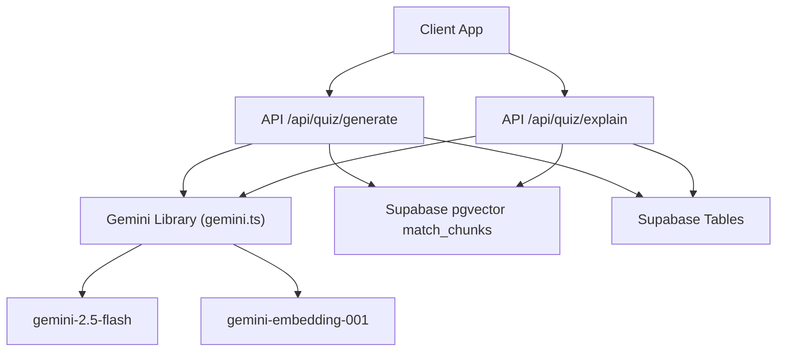
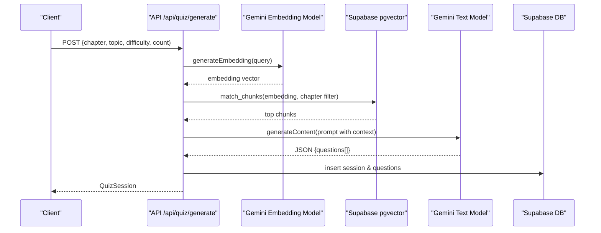
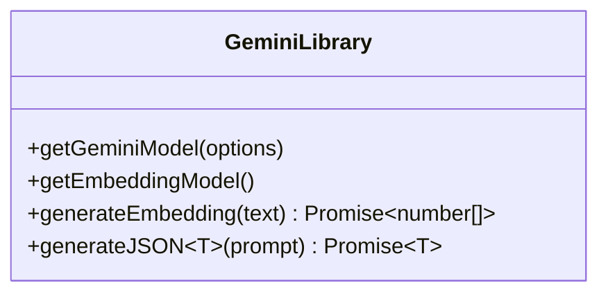
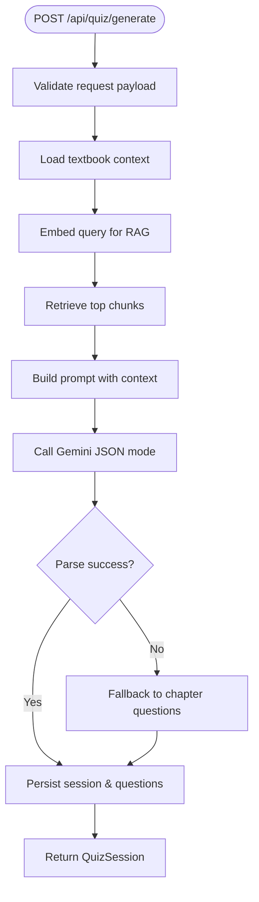
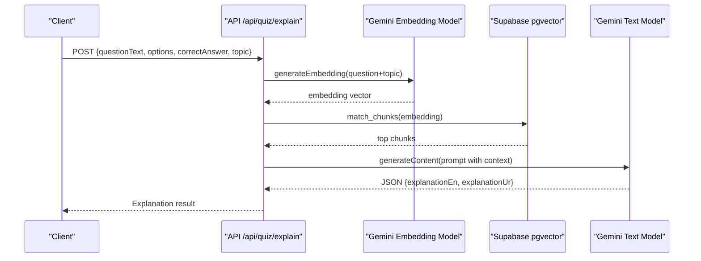
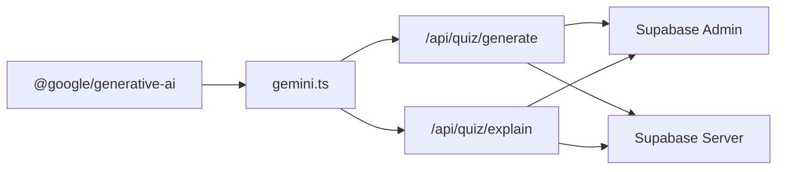

# Gemini API Integration

<cite>
**Referenced Files in This Document**
- [gemini.ts](file://src/lib/ai/gemini.ts)
- [route.ts (Quiz Generate)](file://src/app/api/quiz/generate/route.ts)
- [route.ts (Quiz Explain)](file://src/app/api/quiz/explain/route.ts)
- [schemas.ts](file://src/lib/validations/schemas.ts)
- [quiz.ts](file://src/types/quiz.ts)
- [admin.ts](file://src/lib/supabase/admin.ts)
- [server.ts](file://src/lib/supabase/server.ts)
- [next.config.ts](file://next.config.ts)
- [package.json](file://package.json)
- [README.md](file://README.md)
</cite>

## Table of Contents
1. Introduction
2. Project Structure
3. Core Components
4. Architecture Overview
5. Detailed Component Analysis
6. Dependency Analysis
7. Performance Considerations
8. Troubleshooting Guide
9. Conclusion
10. Appendices

## Introduction
This document explains MedAce-AI’s integration with the Google Gemini API for MDCAT preparation, focusing on model configuration, prompt engineering, structured JSON responses, error handling, and production best practices. The system uses a dual-model architecture:
- gemini-2.5-flash for text generation (MCQs and explanations)
- gemini-embedding-001 for vector embeddings used in Retrieval-Augmented Generation (RAG) over textbook content

The integration emphasizes high-quality MCQ generation aligned to SLO codes, bilingual explanations (English + Urdu), robust fallback strategies when AI services are unavailable, and secure environment-based configuration.

## Project Structure
MedAce-AI is a Next.js application that exposes server routes for quiz generation and explanation. The Gemini integration lives in a dedicated library module and is consumed by API routes. Textbook content is indexed into Supabase pgvector and retrieved at query time to ground prompts.

**Diagram sources**
- [gemini.ts:10-27](file://src/lib/ai/gemini.ts#L10-L27)
- [route.ts (Quiz Generate):29-49](file://src/app/api/quiz/generate/route.ts#L29-L49)
- [route.ts (Quiz Explain):20-35](file://src/app/api/quiz/explain/route.ts#L20-L35)

**Section sources**
- [package.json:11-13](file://package.json#L11-L13)
- [README.md:84-127](file://README.md#L84-L127)

## Core Components
- Gemini client utilities: model instantiation, JSON mode configuration, embedding generation, and JSON parsing helpers.
- Quiz generation route: builds context from textbook files and RAG, constructs a detailed prompt, calls Gemini, and persists results.
- Quiz explanation route: retrieves relevant chunks via embeddings, asks Gemini for bilingual explanations, and returns structured JSON.
- Validation schemas: enforce input contracts for requests.
- Database clients: Supabase admin and server clients for persistence and RAG queries.

Key responsibilities:
- Securely read API keys from environment variables.
- Configure models and response formats.
- Handle errors and provide fallbacks.
- Enforce strict JSON schema outputs.

**Section sources**
- [gemini.ts:1-60](file://src/lib/ai/gemini.ts#L1-L60)
- [route.ts (Quiz Generate):10-196](file://src/app/api/quiz/generate/route.ts#L10-L196)
- [route.ts (Quiz Explain):6-79](file://src/app/api/quiz/explain/route.ts#L6-L79)
- [schemas.ts:1-48](file://src/lib/validations/schemas.ts#L1-L48)
- [admin.ts:1-21](file://src/lib/supabase/admin.ts#L1-L21)
- [server.ts:1-27](file://src/lib/supabase/server.ts#L1-L27)

## Architecture Overview
The system follows a Retrieval-Augmented Generation (RAG) pattern:
1. Build or enhance context from local textbook files and vector similarity search.
2. Prompt Gemini 2.5 Flash to generate structured MCQs or explanations using JSON mode.
3. Validate and persist results; serve to the client.

**Diagram sources**
- [route.ts (Quiz Generate):29-49](file://src/app/api/quiz/generate/route.ts#L29-L49)
- [route.ts (Quiz Generate):55-127](file://src/app/api/quiz/generate/route.ts#L55-L127)
- [route.ts (Quiz Generate):137-171](file://src/app/api/quiz/generate/route.ts#L137-L171)
- [gemini.ts:21-43](file://src/lib/ai/gemini.ts#L21-L43)
- [gemini.ts:45-59](file://src/lib/ai/gemini.ts#L45-L59)

## Detailed Component Analysis

### Gemini Client Library
- Dual model support:
  - Text model: gemini-2.5-flash configured with optional JSON mode.
  - Embedding model: gemini-embedding-001 with fixed output dimensionality.
- JSON mode: sets responseMimeType to application/json to enforce structured outputs.
- Robust JSON parsing: attempts direct parse then strips markdown fences before retrying.
- Error handling: throws descriptive errors if API key is missing or embedding response is malformed.

**Diagram sources**
- [gemini.ts:10-27](file://src/lib/ai/gemini.ts#L10-L27)
- [gemini.ts:29-59](file://src/lib/ai/gemini.ts#L29-L59)

**Section sources**
- [gemini.ts:1-60](file://src/lib/ai/gemini.ts#L1-L60)

### Quiz Generation Route
- Input validation via Zod schema enforces chapter, topic, difficulty, and count constraints.
- Context assembly:
  - Loads textbook content directly for the chapter.
  - Enhances with RAG by embedding the query and retrieving top chunks via Supabase RPC.
- Prompt engineering:
  - Specifies role, topic, chapter, difficulty, and required number of questions.
  - Instructs distinct subtopic coverage, four plausible options, correct answer, and bilingual explanations.
  - Requests strict JSON schema for consistent parsing.
- Fallback strategy:
  - If AI generation fails or returns no questions, falls back to a built-in chapter question generator.
- Persistence:
  - Creates a quiz session and inserts generated questions into Supabase tables when authenticated.

**Diagram sources**
- [route.ts (Quiz Generate):10-23](file://src/app/api/quiz/generate/route.ts#L10-L23)
- [route.ts (Quiz Generate):29-53](file://src/app/api/quiz/generate/route.ts#L29-L53)
- [route.ts (Quiz Generate):55-127](file://src/app/api/quiz/generate/route.ts#L55-L127)
- [route.ts (Quiz Generate):129-135](file://src/app/api/quiz/generate/route.ts#L129-L135)
- [route.ts (Quiz Generate):137-187](file://src/app/api/quiz/generate/route.ts#L137-L187)

**Section sources**
- [route.ts (Quiz Generate):10-196](file://src/app/api/quiz/generate/route.ts#L10-L196)
- [schemas.ts:3-8](file://src/lib/validations/schemas.ts#L3-L8)

### Quiz Explanation Route
- Validates explanation request fields including question text, options, correct answer, and optional topic.
- Retrieves relevant textbook chunks via embeddings and RAG to ground explanations.
- Prompts Gemini for bilingual explanations (English and Urdu) with strict JSON schema.
- Returns default messages if AI response is missing or invalid.

**Diagram sources**
- [route.ts (Quiz Explain):6-18](file://src/app/api/quiz/explain/route.ts#L6-L18)
- [route.ts (Quiz Explain):20-35](file://src/app/api/quiz/explain/route.ts#L20-L35)
- [route.ts (Quiz Explain):37-70](file://src/app/api/quiz/explain/route.ts#L37-L70)
- [gemini.ts:21-43](file://src/lib/ai/gemini.ts#L21-L43)
- [gemini.ts:45-59](file://src/lib/ai/gemini.ts#L45-L59)

**Section sources**
- [route.ts (Quiz Explain):6-79](file://src/app/api/quiz/explain/route.ts#L6-L79)
- [schemas.ts:27-38](file://src/lib/validations/schemas.ts#L27-L38)

### Data Models and Types
- Question and QuizSession types define the structure persisted and returned by the API.
- These types align with the JSON schemas requested from Gemini to ensure consistency across the pipeline.

**Section sources**
- [quiz.ts:15-50](file://src/types/quiz.ts#L15-L50)

## Dependency Analysis
- External dependencies:
  - @google/generative-ai provides the Gemini SDK for both text and embedding models.
- Internal dependencies:
  - API routes depend on the Gemini library for model access and JSON parsing.
  - Routes use Supabase clients for RAG retrieval and persistence.
  - Validation schemas enforce request contracts.

**Diagram sources**
- [package.json:11-13](file://package.json#L11-L13)
- [gemini.ts:1-27](file://src/lib/ai/gemini.ts#L1-L27)
- [admin.ts:1-21](file://src/lib/supabase/admin.ts#L1-L21)
- [server.ts:1-27](file://src/lib/supabase/server.ts#L1-L27)

**Section sources**
- [package.json:11-13](file://package.json#L11-L13)
- [gemini.ts:1-27](file://src/lib/ai/gemini.ts#L1-L27)
- [admin.ts:1-21](file://src/lib/supabase/admin.ts#L1-L21)
- [server.ts:1-27](file://src/lib/supabase/server.ts#L1-L27)

## Performance Considerations
- RAG efficiency:
  - Limit chunk retrieval to a small set (e.g., top 3–4) to reduce token usage and latency.
  - Use chapter filters in vector queries to narrow context scope.
- Prompt size management:
  - Truncate context to fit within model limits while preserving key information.
- JSON mode:
  - Using responseMimeType application/json reduces post-processing overhead and improves reliability.
- Fallback path:
  - Built-in chapter question generator ensures service continuity when AI is unavailable.
- Security headers:
  - Application-level security headers mitigate common web vulnerabilities.

[No sources needed since this section provides general guidance]

## Troubleshooting Guide
Common issues and resolutions:
- Missing API key:
  - Ensure GEMINI_API_KEY is set in the environment; the library throws a clear error if absent.
- Embedding failures:
  - If the embedding response lacks expected fields, an error is thrown; verify network connectivity and API quotas.
- JSON parse errors:
  - The parser attempts to strip markdown fences and re-parse; validate prompt instructions to encourage clean JSON.
- RAG retrieval failures:
  - Vector search is optional; if it fails, the system continues with textbook-only context.
- Fallback activation:
  - If AI generation yields no questions, the built-in generator supplies content; check logs for warnings.

Operational checks:
- Verify environment variables for Supabase URLs and keys.
- Confirm pgvector RPC function exists and is accessible.
- Monitor server logs for error traces and fallback activations.

**Section sources**
- [gemini.ts:6-8](file://src/lib/ai/gemini.ts#L6-L8)
- [gemini.ts:29-43](file://src/lib/ai/gemini.ts#L29-L43)
- [gemini.ts:45-59](file://src/lib/ai/gemini.ts#L45-L59)
- [route.ts (Quiz Generate):47-53](file://src/app/api/quiz/generate/route.ts#L47-L53)
- [route.ts (Quiz Generate):125-135](file://src/app/api/quiz/generate/route.ts#L125-L135)
- [admin.ts:3-12](file://src/lib/supabase/admin.ts#L3-L12)
- [server.ts:4-27](file://src/lib/supabase/server.ts#L4-L27)

## Conclusion
MedAce-AI integrates Gemini through a focused library that supports both text generation and embeddings, enabling a robust RAG pipeline for MDCAT MCQ generation and explanations. The system enforces structured JSON outputs, includes comprehensive fallback mechanisms, and leverages Supabase for vector retrieval and persistence. With careful prompt engineering, validation, and secure environment configuration, the platform delivers reliable, high-quality educational content even under variable AI service conditions.

[No sources needed since this section summarizes without analyzing specific files]

## Appendices

### Configuration Options and Best Practices
- Environment variables:
  - GEMINI_API_KEY: Required for all Gemini operations.
  - NEXT_PUBLIC_SUPABASE_URL, SUPABASE_SERVICE_ROLE_KEY, NEXT_PUBLIC_SUPABASE_ANON_KEY: Required for Supabase integration.
- Model selection:
  - gemini-2.5-flash for text generation.
  - gemini-embedding-001 for embeddings.
- Response format:
  - JSON mode enabled via responseMimeType application/json for deterministic parsing.
- Rate limiting and cost management:
  - Implement server-side rate limiting per user/session to control API usage.
  - Cache frequent RAG results and reuse embeddings where appropriate.
  - Monitor token usage and adjust chunk sizes and counts to balance quality and cost.
- Security:
  - Keep API keys out of version control; use environment variables only.
  - Apply application-level security headers (already configured).
  - Restrict database access via service role keys and least privilege policies.

[No sources needed since this section provides general guidance]

### Prompt Engineering Approach
- MCQ generation:
  - Role: expert medical educator.
  - Inputs: topic, chapter number, difficulty level, count.
  - Constraints: exactly N questions, distinct subtopics, four plausible options, correct answer, bilingual explanations.
  - Output: strict JSON schema with fields for question text, options, correct answer, explanations, and difficulty.
- Explanation generation:
  - Role: expert medical tutor.
  - Inputs: question text, options, correct answer, optional topic.
  - Context: retrieved textbook chunks via RAG.
  - Output: JSON with English and Urdu explanations.

[No sources needed since this section describes conceptual prompt patterns]

### Example Prompt Templates
- MCQ generation template:
  - System: “You are an expert medical educator creating high-yield MDCAT MCQs.”
  - Context: textbook excerpt and RAG chunks.
  - Instructions: specify difficulty, number of questions, option format, correct answer, bilingual explanations.
  - Schema: JSON object containing an array of questions with defined fields.
- Explanation template:
  - System: “You are an expert medical tutor for MDCAT candidates.”
  - Context: relevant textbook chunks.
  - Instructions: explain why the correct answer is right and why distractors are incorrect; provide full Urdu translation.
  - Schema: JSON object with explanationEn and explanationUr.

[No sources needed since this section outlines conceptual templates]

### Authentication Setup and Security
- Gemini API key:
  - Set GEMINI_API_KEY in your environment; the library reads it securely at runtime.
- Supabase configuration:
  - NEXT_PUBLIC_SUPABASE_URL and anon key for client-side interactions.
  - SUPABASE_SERVICE_ROLE_KEY for server-side admin operations.
- Security headers:
  - X-Frame-Options, X-Content-Type-Options, Referrer-Policy, Permissions-Policy are enforced globally.

**Section sources**
- [gemini.ts:6-8](file://src/lib/ai/gemini.ts#L6-L8)
- [admin.ts:3-12](file://src/lib/supabase/admin.ts#L3-L12)
- [server.ts:4-27](file://src/lib/supabase/server.ts#L4-L27)
- [next.config.ts:3-21](file://next.config.ts#L3-L21)