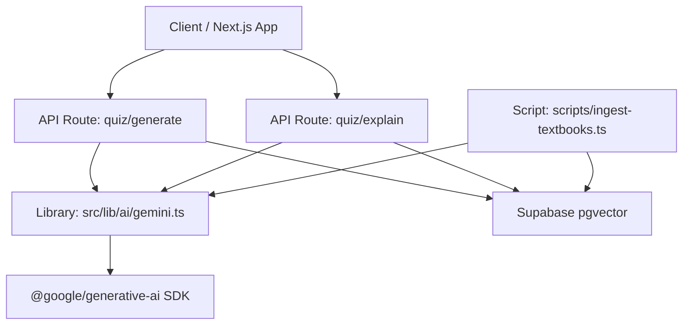
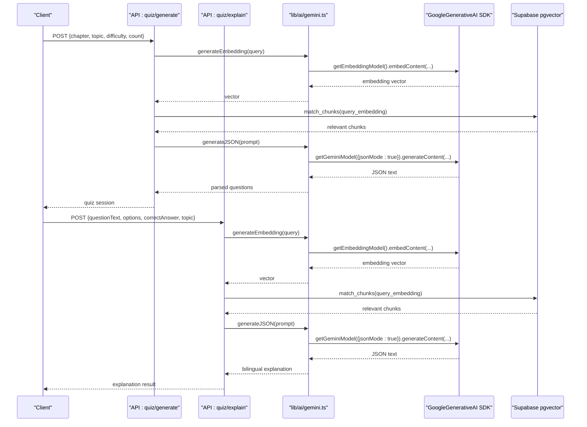
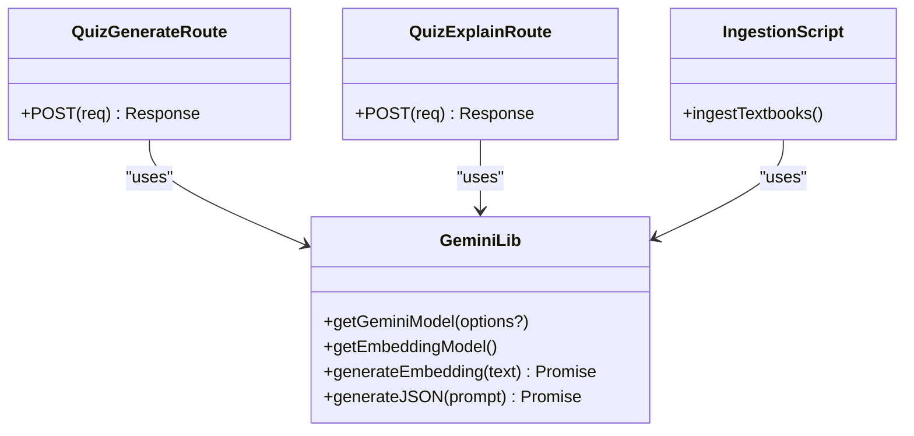
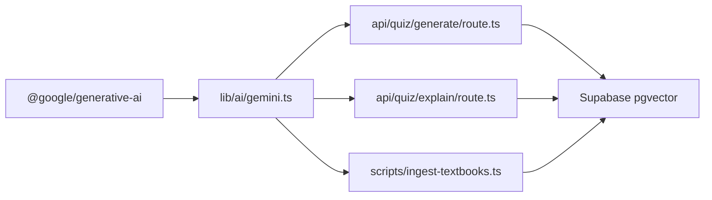

# Model Configuration

<cite>
**Referenced Files in This Document**
- [gemini.ts](file://src/lib/ai/gemini.ts)
- [route.ts (quiz generate)](file://src/app/api/quiz/generate/route.ts)
- [route.ts (quiz explain)](file://src/app/api/quiz/explain/route.ts)
- [ingest-textbooks.ts](file://scripts/ingest-textbooks.ts)
- [README.md](file://README.md)
- [package.json](file://package.json)
</cite>

## Table of Contents
1. Introduction
2. Project Structure
3. Core Components
4. Architecture Overview
5. Detailed Component Analysis
6. Dependency Analysis
7. Performance Considerations
8. Troubleshooting Guide
9. Conclusion

## Introduction
This document explains MedAce-AI’s Gemini model configuration for a dual-model architecture:
- Text generation with gemini-2.5-flash via getGeminiModel()
- Vector embeddings with gemini-embedding-001 via getEmbeddingModel()

It covers environment variable setup, model initialization patterns, connection management, JSON mode configuration, embedding output dimensionality, and practical guidance on parameter tuning, API key rotation, fallback strategies, and rate limiting.

## Project Structure
MedAce-AI integrates Google Gemini through a dedicated library module that centralizes model creation and common AI utilities. API routes consume these utilities to generate MCQs and explanations, while an ingestion script embeds textbook content into the vector store.

**Diagram sources**
- [gemini.ts:10-27](file://src/lib/ai/gemini.ts#L10-L27)
- [route.ts (quiz generate):1-196](file://src/app/api/quiz/generate/route.ts#L1-L196)
- [route.ts (quiz explain):1-79](file://src/app/api/quiz/explain/route.ts#L1-L79)
- [ingest-textbooks.ts:97-189](file://scripts/ingest-textbooks.ts#L97-L189)

**Section sources**
- [gemini.ts:1-61](file://src/lib/ai/gemini.ts#L1-L61)
- [README.md:255-271](file://README.md#L255-L271)

## Core Components
- Dual-model factory functions:
  - getGeminiModel(options?): creates a text-generation model instance with optional JSON mode
  - getEmbeddingModel(): creates an embedding model instance
- Embedding utility:
  - generateEmbedding(text): returns a numeric vector using gemini-embedding-001 with outputDimensionality set to 768
- JSON generation utility:
  - generateJSON<T>(prompt): uses gemini-2.5-flash in JSON mode and parses structured responses

Key behaviors:
- API key is read from GEMINI_API_KEY at runtime
- JSON mode sets responseMimeType to application/json
- Embeddings are generated with a fixed outputDimensionality of 768
- Robust error handling for missing keys and malformed responses

**Section sources**
- [gemini.ts:6-8](file://src/lib/ai/gemini.ts#L6-L8)
- [gemini.ts:10-19](file://src/lib/ai/gemini.ts#L10-L19)
- [gemini.ts:21-27](file://src/lib/ai/gemini.ts#L21-L27)
- [gemini.ts:29-43](file://src/lib/ai/gemini.ts#L29-L43)
- [gemini.ts:45-59](file://src/lib/ai/gemini.ts#L45-L59)

## Architecture Overview
The system uses a two-tier Gemini integration:
- Text generation tier: gemini-2.5-flash for MCQ and explanation generation
- Embedding tier: gemini-embedding-001 for vectorizing queries and textbook chunks

**Diagram sources**
- [route.ts (quiz generate):29-127](file://src/app/api/quiz/generate/route.ts#L29-L127)
- [route.ts (quiz explain):20-65](file://src/app/api/quiz/explain/route.ts#L20-L65)
- [gemini.ts:21-43](file://src/lib/ai/gemini.ts#L21-L43)
- [gemini.ts:45-59](file://src/lib/ai/gemini.ts#L45-L59)

## Detailed Component Analysis

### Gemini Library: getGeminiModel()
- Purpose: Create a text-generation model instance for gemini-2.5-flash
- JSON mode: When options.jsonMode is true, sets generationConfig.responseMimeType to application/json
- Connection pattern: Instantiates GoogleGenerativeAI per call using the API key from process.env.GEMINI_API_KEY

Configuration highlights:
- Model name constant: gemini-2.5-flash
- Optional JSON mode via responseMimeType customization

Usage examples in this codebase:
- Structured MCQ generation via generateJSON()
- Bilingual explanations via generateJSON()

**Section sources**
- [gemini.ts:3-4](file://src/lib/ai/gemini.ts#L3-L4)
- [gemini.ts:10-19](file://src/lib/ai/gemini.ts#L10-L19)
- [route.ts (quiz generate):95-107](file://src/app/api/quiz/generate/route.ts#L95-L107)
- [route.ts (quiz explain):62-65](file://src/app/api/quiz/explain/route.ts#L62-L65)

### Gemini Library: getEmbeddingModel()
- Purpose: Create an embedding model instance for gemini-embedding-001
- Output dimensionality: Fixed to 768 via outputDimensionality in embedContent calls
- Error handling: Validates presence of embedding values; throws if response is invalid

Usage examples in this codebase:
- Query-time embedding for RAG retrieval in quiz generation and explanation flows
- Batch embedding during textbook ingestion pipeline

**Section sources**
- [gemini.ts:21-27](file://src/lib/ai/gemini.ts#L21-L27)
- [gemini.ts:29-43](file://src/lib/ai/gemini.ts#L29-L43)
- [route.ts (quiz generate):33-46](file://src/app/api/quiz/generate/route.ts#L33-L46)
- [route.ts (quiz explain):22-32](file://src/app/api/quiz/explain/route.ts#L22-L32)
- [ingest-textbooks.ts:133-165](file://scripts/ingest-textbooks.ts#L133-L165)

### JSON Generation Utility: generateJSON<T>()
- Purpose: Generate structured JSON responses from gemini-2.5-flash
- Behavior:
  - Enables JSON mode by setting responseMimeType to application/json
  - Parses raw text response; attempts direct parse, then strips markdown fences before parsing
- Error handling: Throws when API key is missing or when parsing fails after cleanup

Usage examples in this codebase:
- MCQ generation with a strict schema
- Bilingual explanation generation with English and Urdu fields

**Section sources**
- [gemini.ts:45-59](file://src/lib/ai/gemini.ts#L45-L59)
- [route.ts (quiz generate):57-107](file://src/app/api/quiz/generate/route.ts#L57-L107)
- [route.ts (quiz explain):38-65](file://src/app/api/quiz/explain/route.ts#L38-L65)

### Environment Variables and API Key Management
- Required variable: GEMINI_API_KEY
- Access pattern: Read from process.env at runtime in getApiKey()
- Validation: Functions throw explicit errors when the key is missing
- Deployment note: Configure GEMINI_API_KEY in your hosting environment (e.g., Vercel project settings)

Environment reference:
- README documents GEMINI_API_KEY under environment variables

**Section sources**
- [gemini.ts:6-8](file://src/lib/ai/gemini.ts#L6-L8)
- [gemini.ts:30-33](file://src/lib/ai/gemini.ts#L30-L33)
- [gemini.ts:46-49](file://src/lib/ai/gemini.ts#L46-L49)
- [README.md:255-271](file://README.md#L255-L271)

### Usage Patterns in API Routes
- Quiz generation route:
  - Embeds query to retrieve relevant textbook chunks
  - Builds prompt with context and generates MCQs in JSON format
  - Falls back to local question generator if AI generation fails or returns no results
- Explanation route:
  - Embeds question to retrieve relevant context
  - Generates bilingual explanation in JSON format

Fallback strategy:
- If AI generation yields no questions, the route falls back to a deterministic chapter-based generator

Rate limiting awareness:
- The ingestion script implements retry logic and delays to respect free-tier rate limits

**Section sources**
- [route.ts (quiz generate):29-135](file://src/app/api/quiz/generate/route.ts#L29-L135)
- [route.ts (quiz explain):20-70](file://src/app/api/quiz/explain/route.ts#L20-L70)
- [ingest-textbooks.ts:133-165](file://scripts/ingest-textbooks.ts#L133-L165)

### Class and Module Relationships

**Diagram sources**
- [gemini.ts:10-59](file://src/lib/ai/gemini.ts#L10-L59)
- [route.ts (quiz generate):1-196](file://src/app/api/quiz/generate/route.ts#L1-L196)
- [route.ts (quiz explain):1-79](file://src/app/api/quiz/explain/route.ts#L1-L79)
- [ingest-textbooks.ts:97-189](file://scripts/ingest-textbooks.ts#L97-L189)

## Dependency Analysis
- External dependency: @google/generative-sdk version ^0.21.0
- Internal dependencies:
  - API routes depend on lib/ai/gemini.ts for model access
  - Ingestion script depends on lib/ai/gemini.ts for embeddings
  - Database interactions use Supabase client for vector search and storage

**Diagram sources**
- [package.json:11-13](file://package.json#L11-L13)
- [gemini.ts:1-4](file://src/lib/ai/gemini.ts#L1-L4)
- [route.ts (quiz generate):1-196](file://src/app/api/quiz/generate/route.ts#L1-L196)
- [route.ts (quiz explain):1-79](file://src/app/api/quiz/explain/route.ts#L1-L79)
- [ingest-textbooks.ts:1-189](file://scripts/ingest-textbooks.ts#L1-L189)

**Section sources**
- [package.json:11-13](file://package.json#L11-L13)
- [gemini.ts:1-4](file://src/lib/ai/gemini.ts#L1-L4)

## Performance Considerations
- Temperature and max tokens:
  - Not currently configured in getGeminiModel(); defaults are used by the SDK
  - To tune creativity and length, extend getGeminiModel() to accept additional generationConfig fields such as temperature and maxOutputTokens
- Rate limiting:
  - The ingestion script includes retry logic and delays to handle 429 rate limit responses
  - For production APIs, consider adding exponential backoff and request queuing
- Embedding dimensionality:
  - Fixed at 768 for gemini-embedding-001; suitable for multilingual similarity search and compact storage
- JSON mode:
  - Using responseMimeType application/json improves parse reliability for structured outputs

Recommendations:
- Add a configuration layer to pass temperature, topP, and max tokens into generationConfig
- Implement centralized retry/backoff for all Gemini calls
- Cache frequent embeddings where appropriate to reduce API usage

[No sources needed since this section provides general guidance]

## Troubleshooting Guide
Common issues and resolutions:
- Missing API key:
  - Symptom: Errors thrown indicating GEMINI_API_KEY is not configured
  - Resolution: Ensure GEMINI_API_KEY is set in your environment
- Invalid embedding response:
  - Symptom: Error indicating failed embedding generation
  - Resolution: Check network connectivity and API quotas; verify input text length
- JSON parse failures:
  - Symptom: Parsing errors when extracting structured data
  - Resolution: The utility strips markdown fences before parsing; ensure prompts enforce strict JSON schemas
- Rate limits:
  - Symptom: 429 errors during batch embedding
  - Resolution: Use retries with delays as implemented in the ingestion script; throttle requests

Operational checks:
- Verify environment variables are loaded in serverless environments
- Confirm Supabase vector search endpoints return expected chunks
- Validate Zod schemas for API inputs to avoid malformed prompts

**Section sources**
- [gemini.ts:30-43](file://src/lib/ai/gemini.ts#L30-L43)
- [gemini.ts:46-59](file://src/lib/ai/gemini.ts#L46-L59)
- [ingest-textbooks.ts:133-165](file://scripts/ingest-textbooks.ts#L133-L165)

## Conclusion
MedAce-AI’s Gemini integration centers on a clean, reusable library that abstracts model creation and common operations:
- getGeminiModel() supports JSON mode for reliable structured outputs
- getEmbeddingModel() produces 768-dimensional vectors for RAG
- API routes demonstrate end-to-end usage with fallback strategies and robust error handling
- Environment configuration is straightforward via GEMINI_API_KEY

To enhance performance and resilience:
- Extend getGeminiModel() to support additional generationConfig parameters
- Centralize retry/backoff logic across all Gemini calls
- Monitor rate limits and adjust throughput accordingly

[No sources needed since this section summarizes without analyzing specific files]