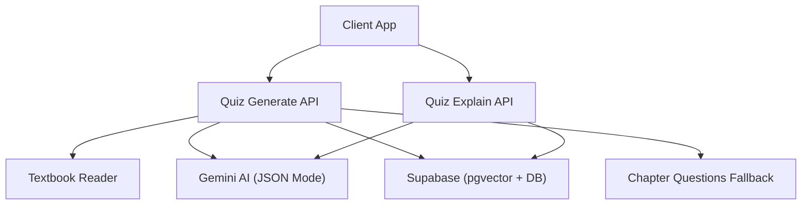
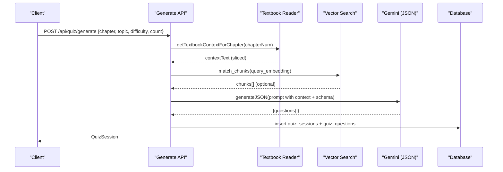
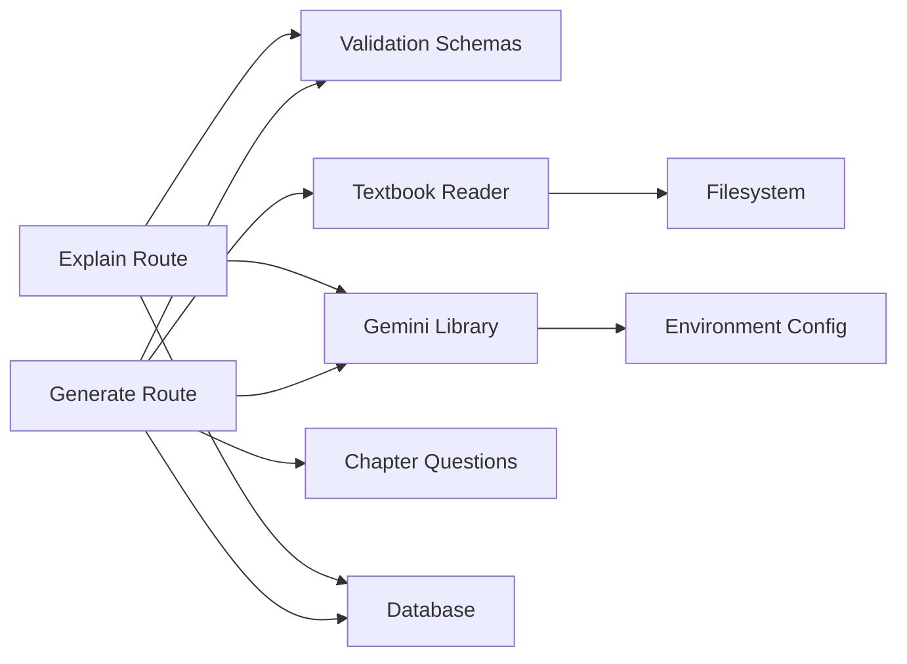

# Prompt Engineering

<cite>
**Referenced Files in This Document**
- [README.md](file://README.md)
- [route.ts (quiz generate)](file://src/app/api/quiz/generate/route.ts)
- [route.ts (quiz explain)](file://src/app/api/quiz/explain/route.ts)
- [gemini.ts](file://src/lib/ai/gemini.ts)
- [schemas.ts](file://src/lib/validations/schemas.ts)
- [textbook-reader.ts](file://src/lib/textbook-reader.ts)
- [chapter-questions.ts](file://src/lib/chapter-questions.ts)
- [quiz.ts](file://src/types/quiz.ts)
</cite>

## Table of Contents
1. Introduction
2. Project Structure
3. Core Components
4. Architecture Overview
5. Detailed Component Analysis
6. Dependency Analysis
7. Performance Considerations
8. Troubleshooting Guide
9. Conclusion
10. Appendices

## Introduction
This document explains MedAce-AI’s prompt engineering system for generating high-quality MDCAT preparation content. It focuses on:
- Prompt templates used to generate MCQs grounded in textbook content
- Difficulty scaling mechanisms and SLO-aligned topic boundaries
- Bilingual explanation generation (English questions with Urdu explanations)
- Structured JSON responses for reliable parsing
- Prompt variations across question types, difficulty levels, and subject domains
- Optimization techniques for context windows and token usage
- Guidelines for quality maintenance, testing effectiveness, and iterative improvement based on feedback and metrics

MedAce-AI uses Retrieval-Augmented Generation (RAG) over FSc Biology textbook chapters to ensure questions align with the MDCAT syllabus and Student Learning Outcomes (SLO). The system generates English MCQs and bilingual explanations, preserving the exam’s English interface while providing Urdu explanations when needed.

**Section sources**
- [README.md:1-25](file://README.md#L1-L25)
- [README.md:84-127](file://README.md#L84-L127)

## Project Structure
The prompt engineering system spans API routes, AI integration, validation schemas, textbook retrieval, and type definitions:
- API routes orchestrate request handling, RAG retrieval, prompt construction, and response serialization
- AI library configures Gemini models and JSON mode for structured outputs
- Validation schemas enforce input contracts for quiz generation and explanation requests
- Textbook reader loads chapter-specific content to ground prompts
- Chapter question bank provides a fallback generator aligned with SLO-based topics
- Types define consistent data structures for sessions, questions, and answers

**Diagram sources**
- [route.ts (quiz generate):1-196](file://src/app/api/quiz/generate/route.ts#L1-L196)
- [route.ts (quiz explain):1-79](file://src/app/api/quiz/explain/route.ts#L1-L79)
- [gemini.ts:1-60](file://src/lib/ai/gemini.ts#L1-L60)
- [textbook-reader.ts:1-46](file://src/lib/textbook-reader.ts#L1-L46)
- [chapter-questions.ts:1-800](file://src/lib/chapter-questions.ts#L1-L800)

**Section sources**
- [README.md:170-253](file://README.md#L170-L253)
- [schemas.ts:1-48](file://src/lib/validations/schemas.ts#L1-L48)
- [quiz.ts:1-107](file://src/types/quiz.ts#L1-L107)

## Core Components
- Quiz generation pipeline: validates inputs, retrieves textbook context, optionally augments via vector similarity search, constructs a prompt, calls Gemini in JSON mode, maps results to typed Question objects, persists session and questions, and returns a QuizSession.
- Explanation pipeline: validates inputs, performs vector similarity search for relevant context, constructs a bilingual explanation prompt, calls Gemini in JSON mode, and returns English and Urdu explanations.
- AI integration: configures Gemini text model and embedding model; enables JSON mode for deterministic schema-compliant outputs; parses raw or fenced JSON safely.
- Validation layer: enforces required fields, enums, and ranges for generation and explanation requests.
- Textbook retrieval: reads chapter-specific extracted text files and slices content to fit within token limits.
- Fallback generator: provides SLO-aligned questions from a curated bank if AI generation is unavailable or fails.

Key responsibilities and behaviors are implemented in the following files:
- API route for generation: orchestrates RAG, prompt building, AI call, mapping, persistence
- API route for explanation: builds bilingual explanation prompt and returns structured JSON
- AI library: model configuration, JSON mode, embedding generation
- Validation schemas: input contracts for generation and explanation
- Textbook reader: chapter content loading and slicing
- Chapter questions: fallback question bank with SLO-aligned topics and difficulties
- Types: shared interfaces for Question, QuizSession, UserAnswer

**Section sources**
- [route.ts (quiz generate):10-187](file://src/app/api/quiz/generate/route.ts#L10-L187)
- [route.ts (quiz explain):6-70](file://src/app/api/quiz/explain/route.ts#L6-L70)
- [gemini.ts:10-59](file://src/lib/ai/gemini.ts#L10-L59)
- [schemas.ts:3-40](file://src/lib/validations/schemas.ts#L3-L40)
- [textbook-reader.ts:9-45](file://src/lib/textbook-reader.ts#L9-L45)
- [chapter-questions.ts:14-800](file://src/lib/chapter-questions.ts#L14-L800)
- [quiz.ts:15-50](file://src/types/quiz.ts#L15-L50)

## Architecture Overview
The system follows a RAG-driven flow:
- Input validation ensures safe and well-formed requests
- Context retrieval combines local textbook text with vector-similarity chunks
- Prompt construction injects topic, chapter, difficulty, and constraints into a structured template
- Gemini generates JSON responses adhering to strict schemas
- Responses are mapped to typed models and persisted for later analysis
- Fallback logic guarantees availability even without AI keys

**Diagram sources**
- [route.ts (quiz generate):22-187](file://src/app/api/quiz/generate/route.ts#L22-L187)
- [textbook-reader.ts:9-45](file://src/lib/textbook-reader.ts#L9-L45)
- [gemini.ts:45-59](file://src/lib/ai/gemini.ts#L45-L59)

**Section sources**
- [README.md:84-127](file://README.md#L84-L127)
- [route.ts (quiz generate):22-187](file://src/app/api/quiz/generate/route.ts#L22-L187)

## Detailed Component Analysis

### Quiz Generation Prompt Template
- Inputs: topic, chapter number, difficulty level, requested count
- Context: textbook chapter text (sliced to token-safe length), optional vector-retrieved chunks
- Instructions: generate exactly N unique, high-yield MCQs covering distinct subtopics; four plausible options; exact correct answer; English explanation; Urdu explanation; adhere to difficulty
- Output: strict JSON schema with question fields and bilingual explanations

Prompt characteristics:
- Grounded in textbook content to reduce hallucination
- Enforces uniqueness and coverage across subtopics
- Requires bilingual explanations for pedagogical support
- Uses JSON mode to ensure parseable, schema-compliant output

Optimization notes:
- Context slicing prevents exceeding token limits
- Vector similarity enhances topical relevance when available
- Fallback to chapter questions ensures continuity

**Section sources**
- [route.ts (quiz generate):55-124](file://src/app/api/quiz/generate/route.ts#L55-L124)
- [textbook-reader.ts:9-45](file://src/lib/textbook-reader.ts#L9-L45)
- [gemini.ts:45-59](file://src/lib/ai/gemini.ts#L45-L59)

### Difficulty Scaling Mechanisms
- Difficulty is enforced at prompt time via explicit instruction to match Easy, Medium, Hard, or Mixed
- Mixed mode maps alternating questions to Easy/Medium during mapping
- Fallback questions include pre-labeled difficulties aligned with SLO-based topics
- Consistency is maintained by requiring the AI to tag each generated question with its difficulty

Implementation details:
- Input validation accepts difficulty enum values
- Mapping applies default difficulty when not provided by AI
- Fallback generator supplies difficulty labels per question

**Section sources**
- [schemas.ts:3-8](file://src/lib/validations/schemas.ts#L3-L8)
- [route.ts (quiz generate):110-123](file://src/app/api/quiz/generate/route.ts#L110-L123)
- [chapter-questions.ts:14-800](file://src/lib/chapter-questions.ts#L14-L800)

### SLO (Student Learning Outcome) Alignment
- Textbook chapters are structured with SLO codes, enabling natural topic boundaries
- Chunking strategy splits content by SLO codes and headings for precise retrieval
- Topic selection and chapter targeting align generated questions with MDCAT-tested outcomes
- Vector search filters by chapter to keep retrieval within the intended domain

Operational impact:
- Ensures questions target specific learning outcomes rather than generic content
- Improves relevance and reduces off-topic generation
- Supports adaptive practice by tracking performance per SLO-aligned topic

**Section sources**
- [README.md:88-107](file://README.md#L88-L107)
- [route.ts (quiz generate):29-49](file://src/app/api/quiz/generate/route.ts#L29-L49)

### Bilingual Explanation System
- Purpose: provide clear English reasoning plus Urdu translation for deeper understanding
- Trigger: explanation endpoint receives question text, options, correct answer, and optional topic
- Context: vector similarity search retrieves relevant textbook chunks to ground explanations
- Prompt: instructs the model to explain why the correct option is right and briefly address distractors; requires full Urdu translation
- Output: JSON with explanationEn and explanationUr fields

Quality considerations:
- Context slicing keeps explanations concise and focused
- Fallback text ensures responses even when retrieval fails
- JSON mode guarantees structured bilingual output

**Section sources**
- [route.ts (quiz explain):18-70](file://src/app/api/quiz/explain/route.ts#L18-L70)
- [gemini.ts:45-59](file://src/lib/ai/gemini.ts#L45-L59)

### Structured Response Format (JSON Mode)
- Both generation and explanation endpoints use Gemini JSON mode to return predictable schemas
- Generation returns an array of questions with standardized fields
- Explanation returns a single object with bilingual explanations
- Parsing handles both raw JSON and fenced code blocks for robustness

Benefits:
- Enables reliable client-side parsing and UI rendering
- Facilitates database storage and analytics
- Simplifies validation and error handling

**Section sources**
- [gemini.ts:10-18](file://src/lib/ai/gemini.ts#L10-L18)
- [gemini.ts:45-59](file://src/lib/ai/gemini.ts#L45-L59)
- [route.ts (quiz generate):77-107](file://src/app/api/quiz/generate/route.ts#L77-L107)
- [route.ts (quiz explain):55-65](file://src/app/api/quiz/explain/route.ts#L55-L65)

### Prompt Variations by Question Type, Difficulty, and Domain
- Conceptual questions: focus on definitions, principles, and core concepts from textbook sections
- Application-based questions: require applying knowledge to scenarios or clinical-like situations grounded in chapter content
- Analytical questions: demand evaluation, comparison, or synthesis across related subtopics within the same chapter
- Difficulty levels: Easy (recall/basic understanding), Medium (application/analysis), Hard (synthesis/evaluation)
- Subject domains: Human Physiology (Chapters 1–8), Modern Topics (Chapters 9–14), Pharmacology (Chapter 15)

Guidance for variation:
- Adjust instructions to emphasize concept recall vs. scenario application vs. multi-step reasoning
- Use difficulty tags to constrain complexity and depth
- Leverage vector retrieval to anchor prompts in domain-specific chunks

[No sources needed since this section provides conceptual guidance]

### Data Models and Contracts
- Question: includes identifiers, text, options, correct answer, bilingual explanations, difficulty, and topic
- QuizSession: tracks metadata, status, score, total questions, and arrays of questions and user answers
- UserAnswer: records selected answer, correctness, and timing

These types ensure consistency across generation, submission, and analytics pipelines.

**Section sources**
- [quiz.ts:15-50](file://src/types/quiz.ts#L15-L50)

## Dependency Analysis
The prompt engineering system depends on several components:
- API routes depend on validation schemas, AI library, textbook reader, and database
- AI library depends on environment configuration for API keys and model selection
- Textbook reader depends on filesystem access to chapter files
- Chapter questions provide a fallback dependency for continuity
- Types define contracts consumed by routes and clients

**Diagram sources**
- [route.ts (quiz generate):1-196](file://src/app/api/quiz/generate/route.ts#L1-L196)
- [route.ts (quiz explain):1-79](file://src/app/api/quiz/explain/route.ts#L1-L79)
- [schemas.ts:1-48](file://src/lib/validations/schemas.ts#L1-L48)
- [gemini.ts:1-60](file://src/lib/ai/gemini.ts#L1-L60)
- [textbook-reader.ts:1-46](file://src/lib/textbook-reader.ts#L1-L46)
- [chapter-questions.ts:1-800](file://src/lib/chapter-questions.ts#L1-L800)

**Section sources**
- [route.ts (quiz generate):1-196](file://src/app/api/quiz/generate/route.ts#L1-L196)
- [route.ts (quiz explain):1-79](file://src/app/api/quiz/explain/route.ts#L1-L79)
- [gemini.ts:1-60](file://src/lib/ai/gemini.ts#L1-L60)
- [schemas.ts:1-48](file://src/lib/validations/schemas.ts#L1-L48)
- [textbook-reader.ts:1-46](file://src/lib/textbook-reader.ts#L1-L46)
- [chapter-questions.ts:1-800](file://src/lib/chapter-questions.ts#L1-L800)

## Performance Considerations
- Context window management: slice textbook content to token-safe lengths before injection into prompts
- Token optimization: limit retrieved chunks to a small set via vector similarity thresholds and counts
- Model selection: use fast, cost-effective models suitable for MCQ generation and bilingual explanations
- Fallback efficiency: maintain a curated question bank to avoid unnecessary API calls when keys are missing
- Caching and reuse: consider caching embeddings and chunk results for repeated queries within a session

[No sources needed since this section provides general guidance]

## Troubleshooting Guide
Common issues and resolutions:
- Missing API key: ensure environment variables are configured; the AI library throws a descriptive error when keys are absent
- Invalid request payload: validation errors indicate missing or malformed fields; adjust client inputs accordingly
- Retrieval failures: if vector search fails, the system falls back to textbook-only context or static explanations
- JSON parsing errors: the AI library cleans fenced JSON blocks; verify that prompts enforce strict schema compliance
- Database write failures: check authentication and permissions; logged errors help diagnose insertion issues

Diagnostic steps:
- Inspect console logs for AI and database errors
- Validate request payloads against schemas
- Confirm textbook files exist and are readable
- Test vector similarity thresholds and counts to balance relevance and performance

**Section sources**
- [gemini.ts:6-8](file://src/lib/ai/gemini.ts#L6-L8)
- [gemini.ts:29-43](file://src/lib/ai/gemini.ts#L29-L43)
- [route.ts (quiz generate):11-20](file://src/app/api/quiz/generate/route.ts#L11-L20)
- [route.ts (quiz explain):8-16](file://src/app/api/quiz/explain/route.ts#L8-L16)
- [route.ts (quiz generate):188-195](file://src/app/api/quiz/generate/route.ts#L188-L195)
- [route.ts (quiz explain):71-78](file://src/app/api/quiz/explain/route.ts#L71-L78)

## Conclusion
MedAce-AI’s prompt engineering system delivers high-quality, syllabus-aligned MDCAT MCQs with bilingual explanations through a robust RAG pipeline. By grounding prompts in textbook content, enforcing strict JSON schemas, and implementing difficulty scaling and SLO alignment, the system ensures educational fidelity and usability. Continuous iteration—guided by user feedback and performance metrics—will further refine prompt quality, retrieval effectiveness, and overall learning outcomes.

[No sources needed since this section summarizes without analyzing specific files]

## Appendices

### Prompt Quality Maintenance Guidelines
- Keep prompts concise and focused on one task per call
- Explicitly specify schema requirements and field constraints
- Include difficulty and domain cues to steer generation
- Limit injected context to essential excerpts to conserve tokens
- Use vector similarity to maximize relevance and minimize noise

### Testing Prompt Effectiveness
- Run batch tests across chapters and difficulties to assess coverage and accuracy
- Measure parsing success rates for JSON outputs
- Evaluate bilingual explanation clarity and correctness via expert review
- Track user performance improvements correlated with explanation usage

### Iteration Based on Feedback and Metrics
- Collect user-reported confusion areas and update prompts to clarify ambiguous concepts
- Monitor failure modes (e.g., off-topic generation) and tighten constraints
- Adjust chunk sizes and retrieval thresholds to improve relevance
- Update fallback questions to fill gaps identified by analytics

[No sources needed since this section provides general guidance]