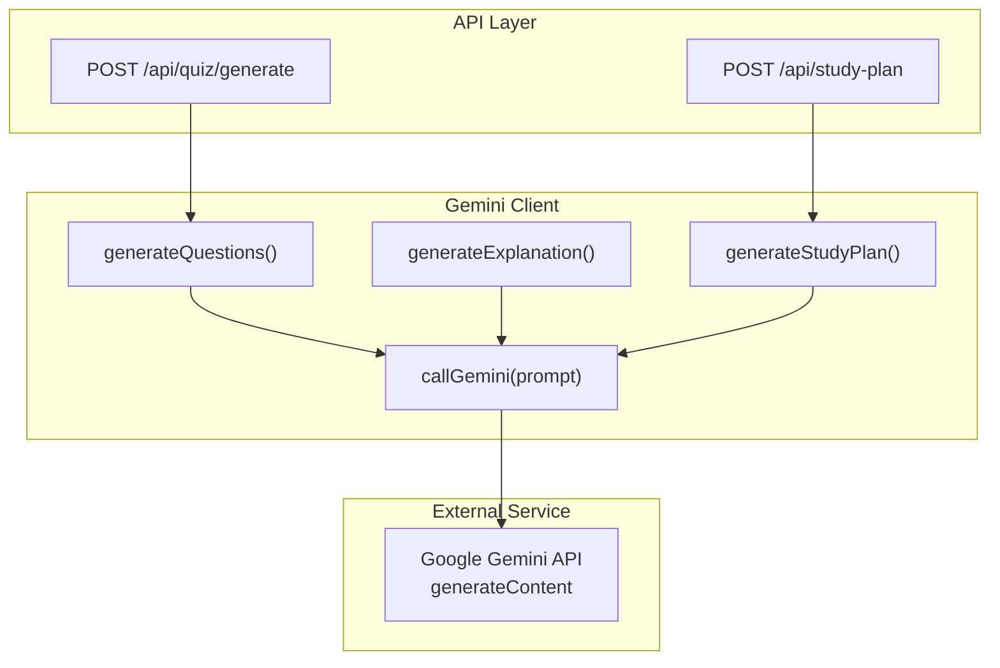
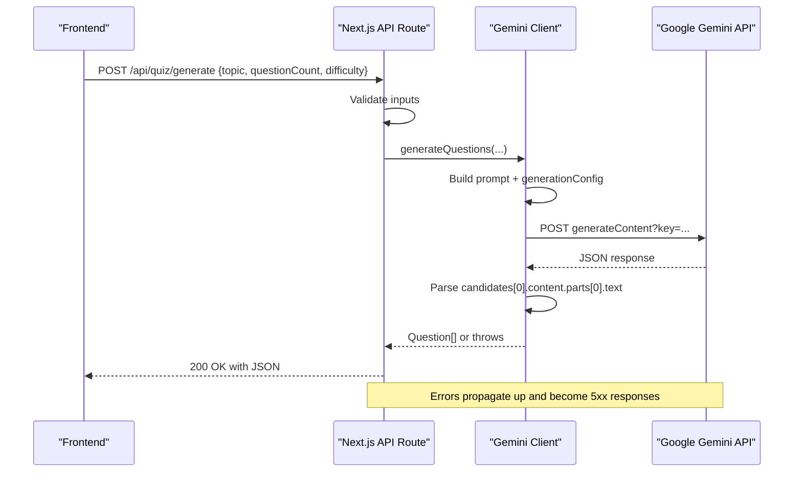
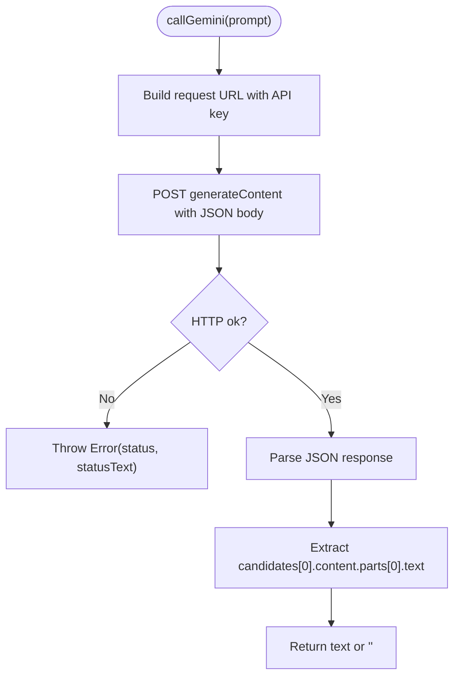
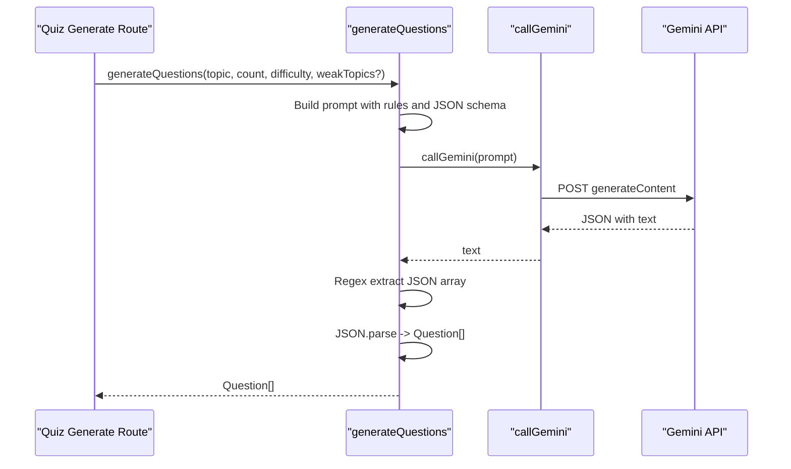
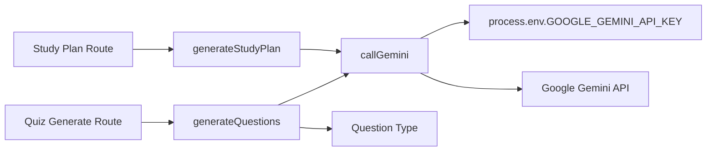

# Gemini Client Setup

<cite>
**Referenced Files in This Document**
- [client.ts](file://Next-app/src/lib/gemini/client.ts)
- [prompts.ts](file://Next-app/src/lib/gemini/prompts.ts)
- [route.ts (quiz generate)](file://Next-app/src/app/api/quiz/generate/route.ts)
- [route.ts (study-plan)](file://Next-app/src/app/api/study-plan/route.ts)
- [quiz.ts](file://Next-app/src/types/quiz.ts)
</cite>

## Table of Contents
1. Introduction
2. Project Structure
3. Core Components
4. Architecture Overview
5. Detailed Component Analysis
6. Dependency Analysis
7. Performance Considerations
8. Troubleshooting Guide
9. Conclusion
10. Appendices

## Introduction
This document explains the Google Gemini API client implementation used by the application to generate quiz questions, explanations, and study plans. It covers how the client is initialized, how the API endpoint is configured, how authentication is handled via environment variables, and how requests and responses are processed. It also documents the callGemini function architecture, error handling strategies, response parsing logic, configuration options such as temperature and token limits, content formatting expectations, security considerations for API key management and input validation, and troubleshooting guidance for connection issues, rate limiting, and quota management.

## Project Structure
The Gemini integration lives under a dedicated library module and is consumed by Next.js API routes:
- Library: src/lib/gemini contains the core client and reusable prompts.
- API Routes: src/app/api expose endpoints that orchestrate user inputs, call the Gemini client, and return structured results.
- Types: src/types define shared data models used across the app and the Gemini client.

**Diagram sources**
- [route.ts (quiz generate):1-32](file://Next-app/src/app/api/quiz/generate/route.ts#L1-L32)
- [route.ts (study-plan):1-115](file://Next-app/src/app/api/study-plan/route.ts#L1-L115)
- [client.ts:1-135](file://Next-app/src/lib/gemini/client.ts#L1-L135)

**Section sources**
- [client.ts:1-135](file://Next-app/src/lib/gemini/client.ts#L1-L135)
- [prompts.ts:1-25](file://Next-app/src/lib/gemini/prompts.ts#L1-L25)
- [route.ts (quiz generate):1-32](file://Next-app/src/app/api/quiz/generate/route.ts#L1-L32)
- [route.ts (study-plan):1-115](file://Next-app/src/app/api/study-plan/route.ts#L1-L115)
- [quiz.ts:1-47](file://Next-app/src/types/quiz.ts#L1-L47)

## Core Components
- Gemini client functions:
  - generateQuestions(topic, count, difficulty, weakTopics?): returns an array of Question objects.
  - generateExplanation(questionText, correctAnswer, userAnswer): returns a textual explanation.
  - generateStudyPlan(weakTopics, recentAccuracy, hoursPerDay?): returns a JSON string representing a weekly plan.
- Shared prompt templates:
  - System and task-specific prompts for consistent behavior and tone.
- API route handlers:
  - POST /api/quiz/generate: validates input, calls generateQuestions, returns JSON.
  - POST /api/study-plan: authenticates user, fetches performance data, calls generateStudyPlan, parses JSON, persists to database, returns result.

Key responsibilities:
- Input validation and sanitization at the API layer.
- Prompt construction with clear output format constraints.
- Centralized HTTP request and error handling via callGemini.
- Response parsing with robust extraction of expected structures.

**Section sources**
- [client.ts:6-28](file://Next-app/src/lib/gemini/client.ts#L6-L28)
- [client.ts:30-75](file://Next-app/src/lib/gemini/client.ts#L30-L75)
- [client.ts:77-92](file://Next-app/src/lib/gemini/client.ts#L77-L92)
- [client.ts:94-134](file://Next-app/src/lib/gemini/client.ts#L94-L134)
- [prompts.ts:1-25](file://Next-app/src/lib/gemini/prompts.ts#L1-L25)
- [route.ts (quiz generate):4-31](file://Next-app/src/app/api/quiz/generate/route.ts#L4-L31)
- [route.ts (study-plan):5-78](file://Next-app/src/app/api/study-plan/route.ts#L5-L78)

## Architecture Overview
The system follows a layered approach:
- API routes handle HTTP concerns: authentication, input validation, and response formatting.
- The Gemini client encapsulates LLM interaction details: prompt building, HTTP calls, and response parsing.
- External service: Google Gemini API generateContent endpoint.

**Diagram sources**
- [route.ts (quiz generate):4-31](file://Next-app/src/app/api/quiz/generate/route.ts#L4-L31)
- [client.ts:6-28](file://Next-app/src/lib/gemini/client.ts#L6-L28)
- [client.ts:30-75](file://Next-app/src/lib/gemini/client.ts#L30-L75)

## Detailed Component Analysis

### callGemini Function
Purpose:
- Sends a single-turn prompt to the Gemini generateContent endpoint.
- Appends the API key from environment variables.
- Uses fixed generation settings: temperature and maxOutputTokens.
- Throws on non-OK responses; otherwise extracts the first candidate’s text.

Request structure:
- Endpoint: https://generativelanguage.googleapis.com/v1beta/models/gemini-2.0-flash:generateContent
- Query parameter: key from process.env.GOOGLE_GEMINI_API_KEY
- Body: contents array with a single part containing the prompt text
- Headers: Content-Type application/json
- Generation config: temperature and maxOutputTokens

Response parsing:
- Reads JSON and safely navigates to candidates[0].content.parts[0].text
- Returns empty string if path is missing

Error handling:
- Non-OK status throws an error including HTTP status and statusText

**Diagram sources**
- [client.ts:6-28](file://Next-app/src/lib/gemini/client.ts#L6-L28)

**Section sources**
- [client.ts:6-28](file://Next-app/src/lib/gemini/client.ts#L6-L28)

### generateQuestions
Purpose:
- Constructs a detailed prompt instructing the model to produce a strict JSON array of multiple-choice questions in Urdu aligned with MDCAT syllabus.
- Calls callGemini and extracts a JSON array from the response using regex.
- Parses into Question[] using the shared type.

Input parameters:
- topic: string
- count: number
- difficulty: string
- weakTopics?: string[]

Output:
- Promise<Question[]>

Parsing strategy:
- Matches the first JSON array bracket pair in the response
- Throws if no valid JSON array is found
- Parses into typed array

**Diagram sources**
- [client.ts:30-75](file://Next-app/src/lib/gemini/client.ts#L30-L75)
- [client.ts:6-28](file://Next-app/src/lib/gemini/client.ts#L6-L28)
- [route.ts (quiz generate):4-31](file://Next-app/src/app/api/quiz/generate/route.ts#L4-L31)

**Section sources**
- [client.ts:30-75](file://Next-app/src/lib/gemini/client.ts#L30-L75)
- [quiz.ts:1-9](file://Next-app/src/types/quiz.ts#L1-L9)

### generateExplanation
Purpose:
- Builds a conversational Urdu explanation prompt based on the question, correct answer, and user’s choice.
- Delegates to callGemini and returns the resulting text.

Inputs:
- questionText: string
- correctAnswer: string
- userAnswer: string

Output:
- Promise<string>

**Section sources**
- [client.ts:77-92](file://Next-app/src/lib/gemini/client.ts#L77-L92)

### generateStudyPlan
Purpose:
- Aggregates weak topics and recent accuracy into a prompt requesting a 7-day JSON study plan in Urdu.
- Calls callGemini and returns the raw JSON string.
- The calling route parses the JSON and persists it.

Inputs:
- weakTopics: array of { topic, wrongCount, totalCount }
- recentAccuracy: number
- hoursPerDay?: number (default 2)

Output:
- Promise<string> (JSON string)

Parsing strategy:
- The route uses regex to extract a JSON object from the response and parses it before saving.

**Section sources**
- [client.ts:94-134](file://Next-app/src/lib/gemini/client.ts#L94-L134)
- [route.ts (study-plan):43-70](file://Next-app/src/app/api/study-plan/route.ts#L43-L70)

### API Route: Quiz Generate
Responsibilities:
- Parse request body
- Validate required fields (topic, questionCount)
- Call generateQuestions with defaults for missing optional fields
- Return JSON or error response

Error handling:
- Logs errors and returns 500 with localized message

**Section sources**
- [route.ts (quiz generate):4-31](file://Next-app/src/app/api/quiz/generate/route.ts#L4-L31)

### API Route: Study Plan
Responsibilities:
- Authenticate user via Supabase
- Fetch weak topics and recent quiz sessions
- Compute recent accuracy
- Call generateStudyPlan
- Parse returned JSON
- Persist plan to database
- Return generated plan

Error handling:
- Logs errors and returns 500 with localized message

**Section sources**
- [route.ts (study-plan):5-78](file://Next-app/src/app/api/study-plan/route.ts#L5-L78)

## Dependency Analysis
- API routes depend on the Gemini client functions.
- The Gemini client depends on environment variables for the API key and makes outbound HTTPS calls to Google’s API.
- Types are shared between client and routes to ensure consistency.

**Diagram sources**
- [route.ts (quiz generate):1-32](file://Next-app/src/app/api/quiz/generate/route.ts#L1-L32)
- [route.ts (study-plan):1-115](file://Next-app/src/app/api/study-plan/route.ts#L1-L115)
- [client.ts:1-135](file://Next-app/src/lib/gemini/client.ts#L1-L135)
- [quiz.ts:1-47](file://Next-app/src/types/quiz.ts#L1-L47)

**Section sources**
- [client.ts:1-135](file://Next-app/src/lib/gemini/client.ts#L1-L135)
- [route.ts (quiz generate):1-32](file://Next-app/src/app/api/quiz/generate/route.ts#L1-L32)
- [route.ts (study-plan):1-115](file://Next-app/src/app/api/study-plan/route.ts#L1-L115)
- [quiz.ts:1-47](file://Next-app/src/types/quiz.ts#L1-L47)

## Performance Considerations
- Token budget: maxOutputTokens is set to a fixed value; adjust based on expected response length to avoid truncation or excessive cost.
- Temperature: currently fixed; increase for more creative outputs, decrease for deterministic answers.
- Request batching: consider grouping prompts if generating multiple items per request to reduce latency and cost.
- Caching: cache repeated prompts or results where appropriate to minimize redundant API calls.
- Timeouts and retries: implement retry with exponential backoff for transient network errors; add timeouts to prevent hanging requests.
- Streaming: if supported by your integration, streaming can improve perceived latency for long responses.

[No sources needed since this section provides general guidance]

## Troubleshooting Guide
Common issues and resolutions:
- Missing or invalid API key:
  - Ensure GOOGLE_GEMINI_API_KEY is set in the server environment.
  - Verify the key has access to the generativelanguage.googleapis.com model.
- Network connectivity:
  - Confirm outbound HTTPS to Google APIs is allowed from your runtime.
  - Check DNS resolution and proxy/firewall settings.
- Rate limiting and quotas:
  - Monitor HTTP status codes; 429 indicates rate limiting. Implement retries with backoff.
  - Review quota usage in the Google Cloud console and adjust limits or request increases.
- Invalid response format:
  - For generateQuestions, if the model does not return a JSON array, parsing will fail. Add fallbacks or stricter prompting to enforce format.
  - For generateStudyPlan, ensure the route’s regex extraction handles edge cases; consider adding validation and default values.
- Input validation failures:
  - Ensure required fields like topic and questionCount are present and well-formed before calling the client.
- Authentication errors:
  - For protected routes, verify user session and permissions before invoking Gemini.

**Section sources**
- [client.ts:22-27](file://Next-app/src/lib/gemini/client.ts#L22-L27)
- [client.ts:68-74](file://Next-app/src/lib/gemini/client.ts#L68-L74)
- [route.ts (quiz generate):9-14](file://Next-app/src/app/api/quiz/generate/route.ts#L9-L14)
- [route.ts (study-plan):54-56](file://Next-app/src/app/api/study-plan/route.ts#L54-L56)

## Conclusion
The Gemini client centralizes LLM interactions through a small, focused interface. The callGemini function standardizes HTTP calls and error handling, while higher-level functions build domain-specific prompts and parse responses according to strict contracts. API routes provide input validation, authentication, and persistence around these capabilities. With careful configuration of temperature, token limits, and robust error handling, the system can reliably generate quizzes, explanations, and study plans tailored to student needs.

[No sources needed since this section summarizes without analyzing specific files]

## Appendices

### Configuration Examples
- Temperature and token limits:
  - Adjust generationConfig.temperature for creativity vs determinism.
  - Adjust generationConfig.maxOutputTokens to match expected response size.
- Content formatting:
  - Enforce JSON-only responses in prompts for structured outputs.
  - Use explicit schemas in prompts to guide the model’s output shape.

[No sources needed since this section provides general guidance]

### Security Considerations
- API key management:
  - Store GOOGLE_GEMINI_API_KEY in secure server-side environment variables only.
  - Never expose keys to the client side.
- Input validation:
  - Validate and sanitize all user inputs before constructing prompts to prevent injection and unexpected behavior.
- Output sanitization:
  - Validate parsed JSON against types before rendering or persisting.
  - Escape or filter untrusted content when displaying to users.

[No sources needed since this section provides general guidance]