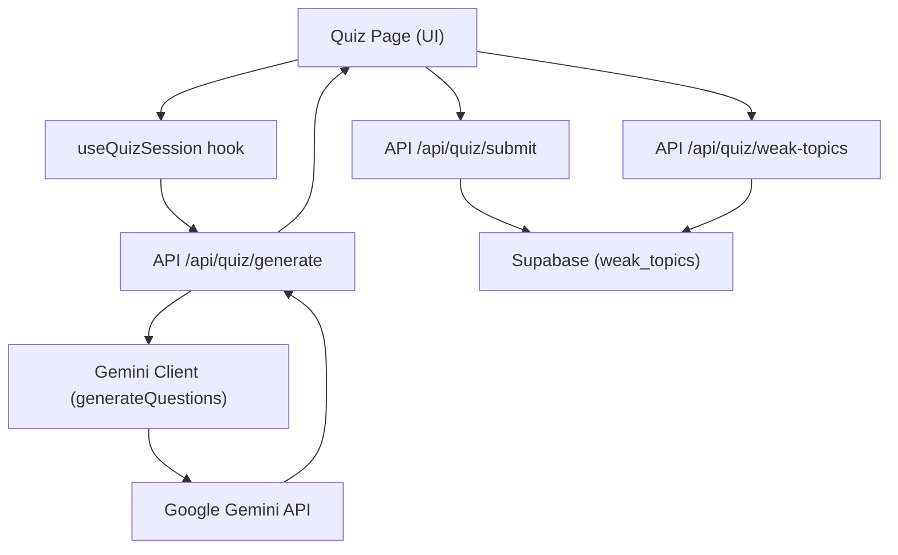
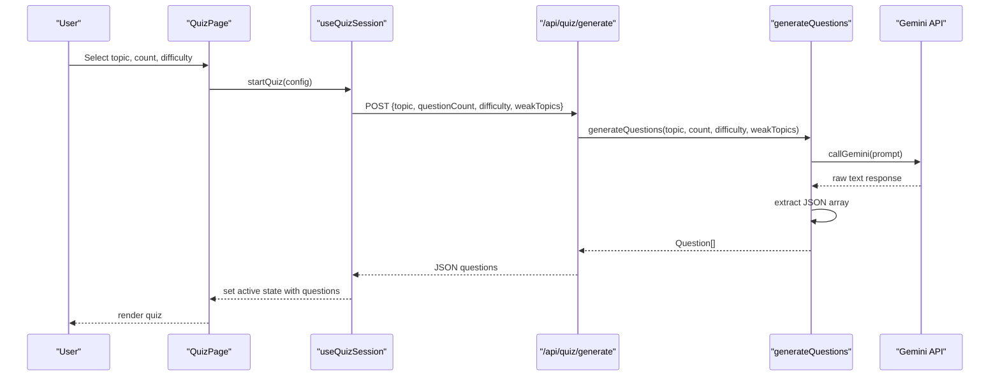
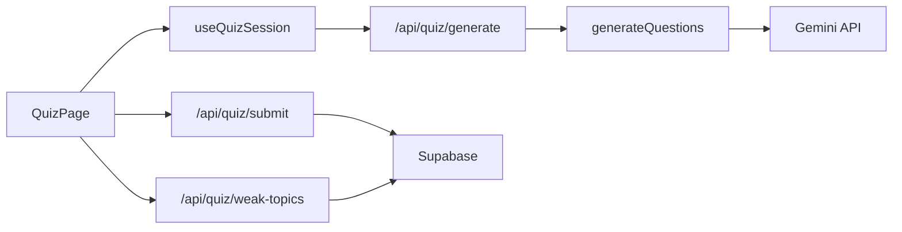

# Quiz Question Generation

<cite>
**Referenced Files in This Document**
- [route.ts](file://Next-app/src/app/api/quiz/generate/route.ts)
- [client.ts](file://Next-app/src/lib/gemini/client.ts)
- [prompts.ts](file://Next-app/src/lib/gemini/prompts.ts)
- [quiz.ts](file://Next-app/src/types/quiz.ts)
- [constants.ts](file://Next-app/src/lib/constants.ts)
- [page.tsx](file://Next-app/src/app/(dashboard)/quiz/page.tsx)
- [QuizSetup.tsx](file://Next-app/src/components/quiz/QuizSetup.tsx)
- [WeakTopicAlert.tsx](file://Next-app/src/components/quiz/WeakTopicAlert.tsx)
- [useQuizSession.ts](file://Next-app/src/lib/hooks/useQuizSession.ts)
- [route.ts (submit)](file://Next-app/src/app/api/quiz/submit/route.ts)
- [route.ts (weak-topics)](file://Next-app/src/app/api/quiz/weak-topics/route.ts)
</cite>

## Table of Contents
1. [Introduction](#introduction)
2. [Project Structure](#project-structure)
3. [Core Components](#core-components)
4. [Architecture Overview](#architecture-overview)
5. [Detailed Component Analysis](#detailed-component-analysis)
6. [Dependency Analysis](#dependency-analysis)
7. [Performance Considerations](#performance-considerations)
8. [Troubleshooting Guide](#troubleshooting-guide)
9. [Conclusion](#conclusion)
10. [Appendices](#appendices)

## Introduction
This document explains the AI-powered quiz question generation system for MDCAT preparation with Urdu language support. It focuses on the generateQuestions function, prompt engineering strategies tailored to MDCAT content, weak topic integration, JSON response parsing, and end-to-end data flow from UI to API to Gemini and back. It also covers testing strategies, validation, performance optimization, caching, and fallback mechanisms when AI services are unavailable.

## Project Structure
The quiz generation feature spans a Next.js App Router API route, a Gemini client module, type definitions, and UI components that orchestrate user interactions and display results.

**Diagram sources**
- [page.tsx:1-185](file://Next-app/src/app/(dashboard)/quiz/page.tsx#L1-L185)
- [useQuizSession.ts:53-78](file://Next-app/src/lib/hooks/useQuizSession.ts#L53-L78)
- [route.ts:1-32](file://Next-app/src/app/api/quiz/generate/route.ts#L1-L32)
- [client.ts:30-75](file://Next-app/src/lib/gemini/client.ts#L30-L75)
- [route.ts (submit):80-112](file://Next-app/src/app/api/quiz/submit/route.ts#L80-L112)
- [route.ts (weak-topics):1-33](file://Next-app/src/app/api/quiz/weak-topics/route.ts#L1-L33)

**Section sources**
- [page.tsx:1-185](file://Next-app/src/app/(dashboard)/quiz/page.tsx#L1-L185)
- [useQuizSession.ts:53-78](file://Next-app/src/lib/hooks/useQuizSession.ts#L53-L78)
- [route.ts:1-32](file://Next-app/src/app/api/quiz/generate/route.ts#L1-L32)
- [client.ts:30-75](file://Next-app/src/lib/gemini/client.ts#L30-L75)
- [route.ts (submit):80-112](file://Next-app/src/app/api/quiz/submit/route.ts#L80-L112)
- [route.ts (weak-topics):1-33](file://Next-app/src/app/api/quiz/weak-topics/route.ts#L1-L33)

## Core Components
- API Route (/api/quiz/generate): Validates input, calls generateQuestions, returns JSON or error responses in Urdu.
- Gemini Client: Builds prompts, calls Google Gemini, extracts JSON, parses into typed questions.
- Types: Strongly typed Question, UserAnswer, QuizSession, SessionResult, QuizSetupConfig.
- UI: Quiz setup, progress, answer selection, explanation panel, results, and weak topic alerts.
- Weak Topics Integration: Tracks wrong answers by topic and feeds them back into future quizzes.

Key responsibilities:
- Input validation and error handling at the API boundary.
- Prompt construction with MDCAT alignment and Urdu language enforcement.
- Robust JSON extraction and parsing from LLM responses.
- Frontend state management for quiz lifecycle and result submission.

**Section sources**
- [route.ts:1-32](file://Next-app/src/app/api/quiz/generate/route.ts#L1-L32)
- [client.ts:30-75](file://Next-app/src/lib/gemini/client.ts#L30-L75)
- [quiz.ts:1-47](file://Next-app/src/types/quiz.ts#L1-L47)
- [QuizSetup.tsx:1-82](file://Next-app/src/components/quiz/QuizSetup.tsx#L1-L82)
- [WeakTopicAlert.tsx:1-32](file://Next-app/src/components/quiz/WeakTopicAlert.tsx#L1-L32)

## Architecture Overview
End-to-end flow for generating MDCAT-aligned questions in Urdu:

**Diagram sources**
- [page.tsx:38-42](file://Next-app/src/app/(dashboard)/quiz/page.tsx#L38-L42)
- [useQuizSession.ts:53-78](file://Next-app/src/lib/hooks/useQuizSession.ts#L53-L78)
- [route.ts:4-23](file://Next-app/src/app/api/quiz/generate/route.ts#L4-L23)
- [client.ts:30-75](file://Next-app/src/lib/gemini/client.ts#L30-L75)

## Detailed Component Analysis

### API Route: /api/quiz/generate
- Validates required fields (topic, questionCount).
- Defaults difficulty to medium if not provided.
- Passes optional weakTopics to the generator.
- Returns generated questions or error messages in Urdu.

Error handling:
- 400 for missing inputs.
- 500 for unexpected errors during generation.

**Section sources**
- [route.ts:4-31](file://Next-app/src/app/api/quiz/generate/route.ts#L4-L31)

### Gemini Client: generateQuestions
- Constructs a prompt specifying:
  - Role: expert MDCAT tutor for Pakistani students.
  - Output: exactly N multiple-choice questions in Urdu.
  - Difficulty level and optional weak topics focus.
  - Strict rules: Urdu-only, syllabus-aligned, 4 options per question, detailed explanations.
  - Exact JSON schema for output.
- Calls Gemini via fetch with temperature and token limits.
- Extracts JSON using regex to handle markdown code blocks.
- Parses into Question[] with strong typing.

Edge cases handled:
- Non-JSON or malformed responses throw an error.
- HTTP errors propagate with status details.

Prompt engineering notes:
- Emphasizes Urdu language and MDCAT syllabus alignment.
- Uses explicit JSON template to constrain model output.
- Optional weakTopicsStr appends targeted sub-topic emphasis.

**Section sources**
- [client.ts:6-28](file://Next-app/src/lib/gemini/client.ts#L6-L28)
- [client.ts:30-75](file://Next-app/src/lib/gemini/client.ts#L30-L75)

### Question Schema and Parsing
Schema enforced by types:
- id: string
- questionText: string (Urdu)
- options: string[] (length 4)
- correctAnswer: number (0–3)
- explanation: string (Urdu)
- topic: string
- difficulty: "easy" | "medium" | "hard"

Parsing strategy:
- Regex captures the first JSON array in the response.
- JSON.parse converts to Question[].
- Errors thrown if no valid JSON found.

Validation recommendations:
- Validate options length equals 4.
- Ensure correctAnswer is within bounds.
- Confirm presence of explanation and topic.

**Section sources**
- [quiz.ts:1-47](file://Next-app/src/types/quiz.ts#L1-L47)
- [client.ts:68-75](file://Next-app/src/lib/gemini/client.ts#L68-L75)

### Weak Topic Integration
- During quiz completion, wrong answers are aggregated by topic.
- Results submitted to /api/quiz/submit which upserts weak_topics per user.
- /api/quiz/weak-topics retrieves top weak topics for the current user.
- UI displays new weak topics via WeakTopicAlert.

Flow highlights:
- Frontend computes wrong topics and posts results.
- Backend persists counts and timestamps.
- Future quizzes can include weakTopics to bias generation.

**Section sources**
- [page.tsx:50-75](file://Next-app/src/app/(dashboard)/quiz/page.tsx#L50-L75)
- [route.ts (submit):80-112](file://Next-app/src/app/api/quiz/submit/route.ts#L80-L112)
- [route.ts (weak-topics):4-31](file://Next-app/src/app/api/quiz/weak-topics/route.ts#L4-L31)
- [WeakTopicAlert.tsx:8-30](file://Next-app/src/components/quiz/WeakTopicAlert.tsx#L8-L30)

### UI Orchestration and State Management
- QuizSetup collects topic, count, and difficulty.
- useQuizSession manages lifecycle: idle → loading → active → finished.
- Handles timer, answer tracking, and navigation between questions.
- Displays WeakTopicAlert after finishing a quiz.

**Section sources**
- [QuizSetup.tsx:14-41](file://Next-app/src/components/quiz/QuizSetup.tsx#L14-L41)
- [useQuizSession.ts:53-105](file://Next-app/src/lib/hooks/useQuizSession.ts#L53-L105)
- [page.tsx:77-113](file://Next-app/src/app/(dashboard)/quiz/page.tsx#L77-L113)

### Prompt Engineering Strategies for MDCAT and Urdu
- System-level guidance emphasizes conversational Urdu, pedagogical tone, and MDCAT alignment.
- Question generation prompt enforces:
  - Exactly N questions.
  - Urdu-only content.
  - Four plausible options.
  - Clear correct answer and detailed explanation.
  - Strict JSON structure.
- Additional prompts exist for explanations and study plans, maintaining consistent Urdu style.

Customization examples:
- Adjust difficulty levels via constants and UI selection.
- Inject weak topics to emphasize specific sub-topics.
- Modify prompt templates to add subject-specific constraints (e.g., chemistry equations, physics diagrams described in text).

**Section sources**
- [prompts.ts:1-24](file://Next-app/src/lib/gemini/prompts.ts#L1-L24)
- [client.ts:41-64](file://Next-app/src/lib/gemini/client.ts#L41-L64)
- [constants.ts:24-50](file://Next-app/src/lib/constants.ts#L24-L50)

## Dependency Analysis

**Diagram sources**
- [page.tsx:1-185](file://Next-app/src/app/(dashboard)/quiz/page.tsx#L1-L185)
- [useQuizSession.ts:53-78](file://Next-app/src/lib/hooks/useQuizSession.ts#L53-L78)
- [route.ts:1-32](file://Next-app/src/app/api/quiz/generate/route.ts#L1-L32)
- [client.ts:30-75](file://Next-app/src/lib/gemini/client.ts#L30-L75)
- [route.ts (submit):80-112](file://Next-app/src/app/api/quiz/submit/route.ts#L80-L112)
- [route.ts (weak-topics):1-33](file://Next-app/src/app/api/quiz/weak-topics/route.ts#L1-L33)

**Section sources**
- [page.tsx:1-185](file://Next-app/src/app/(dashboard)/quiz/page.tsx#L1-L185)
- [useQuizSession.ts:53-78](file://Next-app/src/lib/hooks/useQuizSession.ts#L53-L78)
- [route.ts:1-32](file://Next-app/src/app/api/quiz/generate/route.ts#L1-L32)
- [client.ts:30-75](file://Next-app/src/lib/gemini/client.ts#L30-L75)
- [route.ts (submit):80-112](file://Next-app/src/app/api/quiz/submit/route.ts#L80-L112)
- [route.ts (weak-topics):1-33](file://Next-app/src/app/api/quiz/weak-topics/route.ts#L1-L33)

## Performance Considerations
- Reduce payload size: limit questionCount to reasonable values (e.g., 10–30).
- Token budgeting: adjust maxOutputTokens based on expected question volume and explanation length.
- Temperature tuning: lower temperature reduces variability; higher increases creativity but may affect consistency.
- Network latency: consider retry logic and timeouts in the client layer.
- Server-side caching: cache frequent topic+difficulty combinations to reduce redundant API calls.
- Database efficiency: batch updates for weak topics and avoid excessive writes per session.

[No sources needed since this section provides general guidance]

## Troubleshooting Guide
Common issues and resolutions:
- Missing inputs: ensure topic and questionCount are provided; otherwise, expect 400 error.
- Invalid LLM response: if JSON cannot be extracted, an error is thrown; validate prompt and retry.
- API failures: check environment variable for Gemini key and network connectivity; handle non-ok responses.
- Weak topics not updating: verify submit endpoint receives correct payloads and database permissions.

Diagnostics:
- Log request payloads and responses in development.
- Inspect browser network tab for API errors.
- Check server logs for Gemini API status codes.

**Section sources**
- [route.ts:9-14](file://Next-app/src/app/api/quiz/generate/route.ts#L9-L14)
- [client.ts:22-28](file://Next-app/src/lib/gemini/client.ts#L22-L28)
- [client.ts:68-72](file://Next-app/src/lib/gemini/client.ts#L68-L72)
- [route.ts (submit):104-112](file://Next-app/src/app/api/quiz/submit/route.ts#L104-L112)

## Conclusion
The system integrates a robust API route, a Gemini-based generator with carefully engineered prompts, and a responsive UI that supports Urdu-language MDCAT quizzes. Weak topic tracking personalizes future sessions, while strict JSON schemas and validation ensure reliable question structures. With attention to performance, caching, and fallback strategies, the platform can deliver consistent, high-quality quiz experiences even under variable AI service conditions.

[No sources needed since this section summarizes without analyzing specific files]

## Appendices

### Testing Question Quality
- Unit tests for generateQuestions:
  - Mock Gemini responses to assert JSON extraction and parsing.
  - Validate schema compliance (options length, correctAnswer bounds).
- Integration tests:
  - End-to-end flows from UI to API to Gemini and back.
  - Verify weak topics persistence and retrieval.
- Prompt evaluation:
  - Sample prompts across subjects and difficulties.
  - Measure accuracy against known MDCAT syllabus references.

**Section sources**
- [client.ts:30-75](file://Next-app/src/lib/gemini/client.ts#L30-L75)
- [route.ts (submit):80-112](file://Next-app/src/app/api/quiz/submit/route.ts#L80-L112)

### Customizing Prompts for Different Subjects
- Biology: emphasize cellular processes, genetics, physiology.
- Chemistry: stress reaction mechanisms, stoichiometry, organic concepts.
- Physics: focus on mechanics, optics, thermodynamics.
- English: vocabulary, comprehension, grammar aligned with MDCAT standards.

Adjustments:
- Update prompt templates to include subject-specific constraints.
- Add domain terminology in Urdu with English terms in parentheses where helpful.

**Section sources**
- [prompts.ts:1-24](file://Next-app/src/lib/gemini/prompts.ts#L1-L24)
- [constants.ts:24-50](file://Next-app/src/lib/constants.ts#L24-L50)

### Handling Edge Cases in AI Responses
- Non-JSON responses: detect and retry with stricter prompts or fallback templates.
- Malformed arrays: validate parsed arrays and reject invalid entries.
- Inconsistent option counts: enforce four options per question before returning.

**Section sources**
- [client.ts:68-75](file://Next-app/src/lib/gemini/client.ts#L68-L75)

### Validating Generated Questions
- Post-parse validation:
  - Ensure each question has exactly four options.
  - Verify correctAnswer index is within range.
  - Confirm explanation and topic fields are present and non-empty.
- Pre-render checks:
  - Guard against undefined or null values in UI.

**Section sources**
- [quiz.ts:1-47](file://Next-app/src/types/quiz.ts#L1-L47)

### Performance Optimization Techniques
- Caching:
  - Cache repeated topic+difficulty queries server-side.
  - Use short TTLs to balance freshness and cost.
- Batching:
  - Batch weak topic updates to minimize database writes.
- Concurrency:
  - Limit concurrent Gemini calls per user to prevent rate limiting.

[No sources needed since this section provides general guidance]

### Fallback Mechanisms When AI Services Are Unavailable
- Local fallback:
  - Serve curated static questions for critical topics when Gemini is down.
- Graceful degradation:
  - Show user-friendly error messages and allow retries.
- Circuit breaker:
  - Temporarily disable AI generation after repeated failures.

[No sources needed since this section provides general guidance]