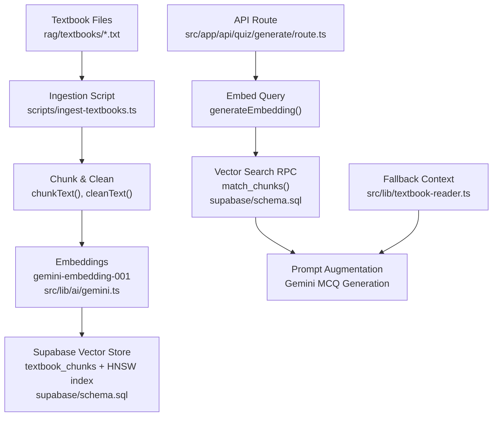
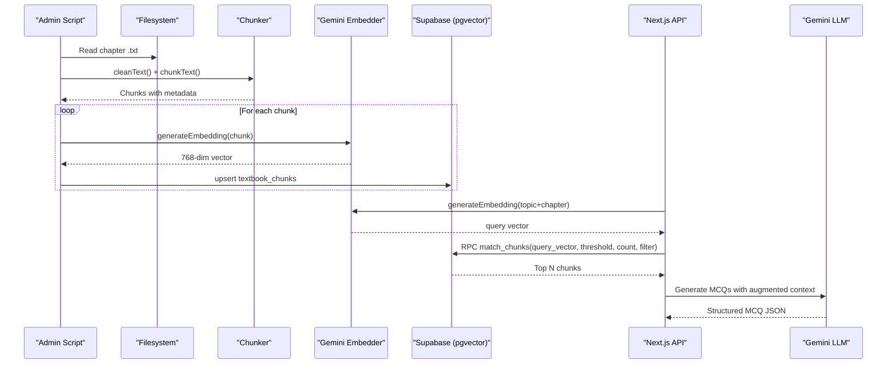
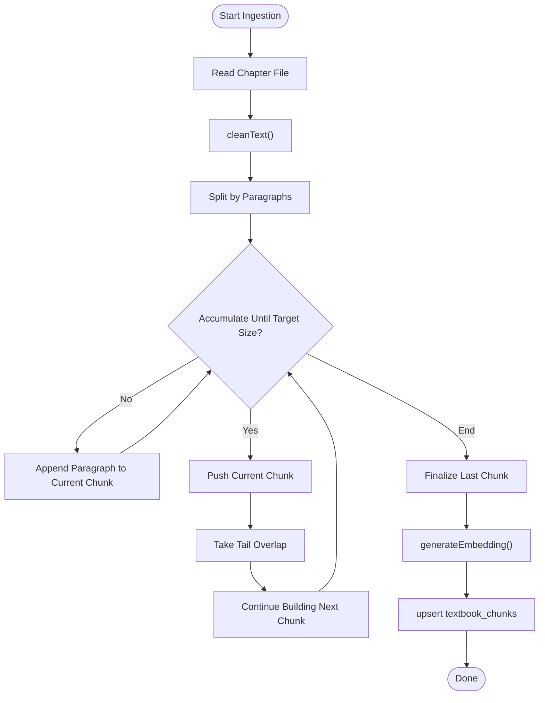
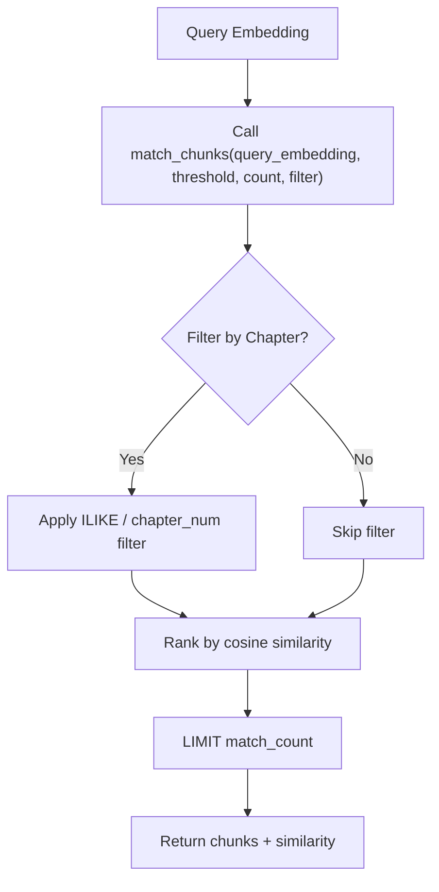
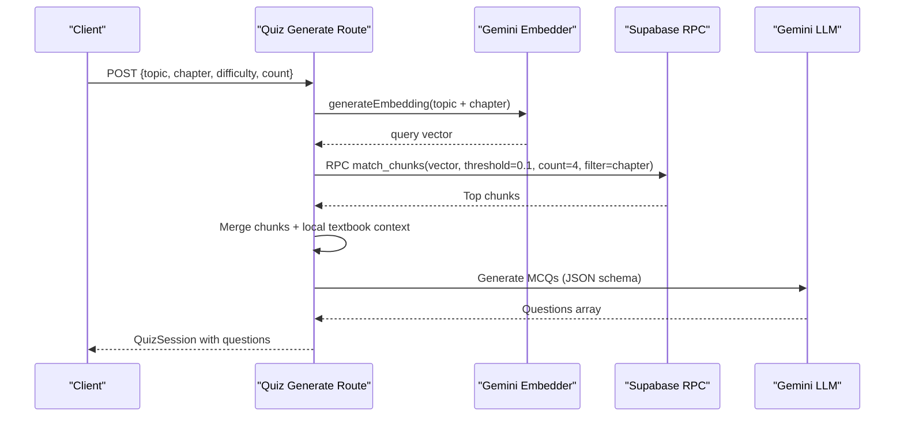
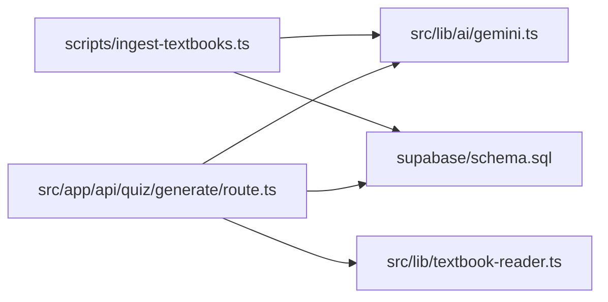

# RAG Pipeline

<cite>
**Referenced Files in This Document**
- [ingest-textbooks.ts](file://scripts/ingest-textbooks.ts)
- [check-chunks.ts](file://scripts/check-chunks.ts)
- [gemini.ts](file://src/lib/ai/gemini.ts)
- [route.ts](file://src/app/api/quiz/generate/route.ts)
- [textbook-reader.ts](file://src/lib/textbook-reader.ts)
- [schema.sql](file://supabase/schema.sql)
- [README.md](file://README.md)
</cite>

## Table of Contents
1. [Introduction](#introduction)
2. [Project Structure](#project-structure)
3. [Core Components](#core-components)
4. [Architecture Overview](#architecture-overview)
5. [Detailed Component Analysis](#detailed-component-analysis)
6. [Dependency Analysis](#dependency-analysis)
7. [Performance Considerations](#performance-considerations)
8. [Troubleshooting Guide](#troubleshooting-guide)
9. [Conclusion](#conclusion)
10. [Appendices](#appendices)

## Introduction
This document explains MedAce-AI’s Retrieval-Augmented Generation (RAG) pipeline for processing textbook content and generating high-quality, syllabus-aligned multiple-choice questions. It covers the end-to-end data flow from raw textbook ingestion to vector storage in Supabase with pgvector, chunking strategy, embedding generation using gemini-embedding-001, similarity search, and query-time usage during question generation. It also provides configuration guidance, database schema details, example usage patterns, and performance considerations for large datasets.

## Project Structure
The RAG pipeline spans scripts, server-side API routes, AI integration, and a PostgreSQL-based vector store:
- Ingestion script reads chapter text files, cleans and chunks them, generates embeddings, and upserts into Supabase.
- Query-time route embeds user queries, performs vector similarity search via an RPC function, and augments prompts for question generation.
- Database schema defines the vector table and HNSW index for fast cosine similarity search.
- Textbook reader supports fallback context retrieval from local chapter files.

**Diagram sources**
- [ingest-textbooks.ts:49-75](file://scripts/ingest-textbooks.ts#L49-L75)
- [gemini.ts:21-43](file://src/lib/ai/gemini.ts#L21-L43)
- [schema.sql:26-44](file://supabase/schema.sql#L26-L44)
- [route.ts:29-49](file://src/app/api/quiz/generate/route.ts#L29-L49)
- [textbook-reader.ts:9-45](file://src/lib/textbook-reader.ts#L9-L45)

**Section sources**
- [README.md:84-127](file://README.md#L84-L127)
- [schema.sql:26-44](file://supabase/schema.sql#L26-L44)

## Core Components
- Textbook ingestion and chunking: Reads chapter files, cleans OCR artifacts, splits into paragraphs with overlap, estimates token counts, and prepares records for storage.
- Embedding generation: Uses gemini-embedding-001 to produce 768-dimensional vectors per chunk.
- Vector storage and indexing: Stores chunks and embeddings in Supabase PostgreSQL with pgvector; uses HNSW index for cosine similarity.
- Query-time retrieval: Embeds topic+chapter prompt, calls match_chunks RPC to retrieve top relevant chunks, and augments the LLM prompt for MCQ generation.
- Fallback context: If vector search is unavailable or empty, reads local textbook file content as context.

**Section sources**
- [ingest-textbooks.ts:38-75](file://scripts/ingest-textbooks.ts#L38-L75)
- [gemini.ts:21-43](file://src/lib/ai/gemini.ts#L21-L43)
- [schema.sql:26-44](file://supabase/schema.sql#L26-L44)
- [route.ts:29-49](file://src/app/api/quiz/generate/route.ts#L29-L49)
- [textbook-reader.ts:9-45](file://src/lib/textbook-reader.ts#L9-L45)

## Architecture Overview
The RAG system integrates ingestion and query-time flows:
- Ingestion: Raw text → cleaning → paragraph-aware chunking with overlap → embedding → upsert to textbook_chunks with HNSW index.
- Query-time: User selects topic/chapter → embed query → vector similarity search via match_chunks → combine retrieved chunks with local textbook context → generate MCQs with Gemini JSON mode.

**Diagram sources**
- [ingest-textbooks.ts:97-183](file://scripts/ingest-textbooks.ts#L97-L183)
- [gemini.ts:21-43](file://src/lib/ai/gemini.ts#L21-L43)
- [schema.sql:116-150](file://supabase/schema.sql#L116-L150)
- [route.ts:29-49](file://src/app/api/quiz/generate/route.ts#L29-L49)

## Detailed Component Analysis

### Ingestion Pipeline: Cleaning, Chunking, Embedding, Upsert
- Cleaning removes OCR artifacts and normalizes whitespace/newlines to improve chunk quality.
- Chunking strategy:
  - Splits by double newlines (paragraph boundaries).
  - Accumulates paragraphs until target size reached.
  - Applies overlap by retaining tail of previous chunk to preserve context across boundaries.
  - Default parameters: target chunk size ~2500 characters, overlap ~400 characters. These can be tuned based on domain needs.
- Token estimation: Approximate token count derived from character length for bookkeeping.
- Embedding: Calls gemini-embedding-001 with outputDimensionality set to 768.
- Storage: Upserts records into textbook_chunks with id, chapter, chapter_num, chunk_index, content, token_count, embedding, created_at.

**Diagram sources**
- [ingest-textbooks.ts:38-75](file://scripts/ingest-textbooks.ts#L38-L75)
- [ingest-textbooks.ts:115-183](file://scripts/ingest-textbooks.ts#L115-L183)

**Section sources**
- [ingest-textbooks.ts:38-75](file://scripts/ingest-textbooks.ts#L38-L75)
- [ingest-textbooks.ts:97-183](file://scripts/ingest-textbooks.ts#L97-L183)

### Embedding Model and Dimensions
- Model: gemini-embedding-001 configured via getEmbeddingModel().
- Output dimensionality: 768 dimensions explicitly requested.
- Error handling: Throws if API key missing or response lacks embedding values.

**Section sources**
- [gemini.ts:21-43](file://src/lib/ai/gemini.ts#L21-L43)

### Vector Similarity Search: match_chunks RPC
- Function signature accepts query_embedding (vector(768)), match_threshold (float), match_count (int), and optional filter_chapter (text).
- Returns id, chapter, chapter_num, chunk_index, content, and similarity score computed as 1 - cosine distance.
- Filters by chapter name or number when provided.
- Index: HNSW index on embedding using vector_cosine_ops ensures efficient cosine similarity searches.

**Diagram sources**
- [schema.sql:116-150](file://supabase/schema.sql#L116-L150)
- [schema.sql:38-44](file://supabase/schema.sql#L38-L44)

**Section sources**
- [schema.sql:116-150](file://supabase/schema.sql#L116-L150)
- [schema.sql:38-44](file://supabase/schema.sql#L38-L44)

### Query-Time RAG Integration in Question Generation
- The API route constructs a query embedding from topic and chapter context.
- Calls match_chunks RPC with threshold and count, optionally filtered by chapter.
- Merges retrieved chunk contents with local textbook context to build a rich prompt for Gemini.
- Generates structured MCQ JSON via Gemini JSON mode and persists session and questions.

**Diagram sources**
- [route.ts:29-49](file://src/app/api/quiz/generate/route.ts#L29-L49)
- [route.ts:55-127](file://src/app/api/quiz/generate/route.ts#L55-L127)
- [gemini.ts:45-59](file://src/lib/ai/gemini.ts#L45-L59)

**Section sources**
- [route.ts:29-49](file://src/app/api/quiz/generate/route.ts#L29-L49)
- [route.ts:55-127](file://src/app/api/quiz/generate/route.ts#L55-L127)

### Fallback Context Reader
- Reads chapter-specific textbook files from rag/textbooks.
- Supports flexible filename matching and returns a bounded window of content to fit within limits.
- Used as a fallback when vector search yields no results or is disabled.

**Section sources**
- [textbook-reader.ts:9-45](file://src/lib/textbook-reader.ts#L9-L45)

## Dependency Analysis
Key dependencies and relationships:
- Ingestion depends on filesystem, Supabase admin client, and Gemini embedding model.
- Query-time depends on Gemini embedding model, Supabase RPC, and Gemini LLM for generation.
- Database schema defines vector table and HNSW index used by both ingestion and query-time paths.
- README documents the overall architecture and RAG pipeline steps.

**Diagram sources**
- [ingest-textbooks.ts:1-5](file://scripts/ingest-textbooks.ts#L1-L5)
- [gemini.ts:1-5](file://src/lib/ai/gemini.ts#L1-L5)
- [schema.sql:26-44](file://supabase/schema.sql#L26-L44)
- [route.ts:1-8](file://src/app/api/quiz/generate/route.ts#L1-L8)
- [textbook-reader.ts:1-5](file://src/lib/textbook-reader.ts#L1-L5)

**Section sources**
- [README.md:27-83](file://README.md#L27-L83)

## Performance Considerations
- Chunk size and overlap:
  - Default target chunk size ~2500 characters with ~400-character overlap balances context preservation and search efficiency.
  - Larger chunks increase context but reduce granularity; smaller chunks improve precision but may lose context. Adjust parameters based on domain vocabulary density and typical query specificity.
- Embedding dimensionality:
  - 768-dimensional vectors provide a good trade-off between storage cost and retrieval accuracy for multilingual content.
- Similarity threshold:
  - Threshold controls relevance filtering; higher thresholds reduce noise but may miss relevant chunks. Tune per use case (e.g., 0.1 used in query-time).
- Indexing:
  - HNSW index on vector column enables fast cosine similarity search; ensure proper maintenance and consider reindexing after bulk updates.
- Batch processing:
  - Ingestion processes chapters sequentially with delays to respect rate limits; for large datasets, consider parallelization with concurrency control and retry/backoff strategies.
- Rate limiting and retries:
  - Ingestion includes exponential backoff-like waits on 429 errors; implement robust retry logic and circuit breakers for production.
- Query-time caching:
  - Cache frequent query embeddings and results at the application layer to reduce latency and API costs.

[No sources needed since this section provides general guidance]

## Troubleshooting Guide
Common issues and resolutions:
- Missing API keys:
  - Ensure GEMINI_API_KEY is set; embedding functions throw explicit errors if not configured.
- Rate limit errors:
  - Ingestion script handles 429 responses with waits; monitor logs and adjust delays or batch sizes accordingly.
- Empty vector search results:
  - Verify that ingestion completed successfully and HNSW index exists; check match_threshold and filter_chapter parameters.
- Chunk integrity:
  - Use check-chunks script to verify row counts and integrity in textbook_chunks.

**Section sources**
- [gemini.ts:29-43](file://src/lib/ai/gemini.ts#L29-L43)
- [ingest-textbooks.ts:133-165](file://scripts/ingest-textbooks.ts#L133-L165)
- [check-chunks.ts:24-27](file://scripts/check-chunks.ts#L24-L27)

## Conclusion
MedAce-AI’s RAG pipeline integrates robust textbook ingestion, paragraph-aware chunking with overlap, 768-dimensional embeddings via gemini-embedding-001, and efficient vector similarity search using Supabase pgvector with HNSW indexing. Query-time augmentation combines retrieved chunks with local textbook context to generate high-quality, syllabus-aligned MCQs. Tuning chunk size, overlap, and similarity thresholds allows balancing context preservation and search efficiency. With careful batching, retry logic, and indexing, the pipeline scales to large textbook datasets while maintaining performance and reliability.

[No sources needed since this section summarizes without analyzing specific files]

## Appendices

### Configuration Options
- Chunking:
  - targetChunkChars: default ~2500 characters.
  - overlapChars: default ~400 characters.
- Embedding:
  - Model: gemini-embedding-001.
  - Dimensionality: 768.
- Similarity search:
  - match_threshold: default 0.1 in query-time.
  - match_count: default 4 in query-time.
  - filter_chapter: optional string filter by chapter name or number.

**Section sources**
- [ingest-textbooks.ts:52-75](file://scripts/ingest-textbooks.ts#L52-L75)
- [gemini.ts:21-43](file://src/lib/ai/gemini.ts#L21-L43)
- [route.ts:33-40](file://src/app/api/quiz/generate/route.ts#L33-L40)
- [schema.sql:116-150](file://supabase/schema.sql#L116-L150)

### Example Usage: Ingestion Script
- Run the ingestion script to process all chapter files under rag/textbooks, generate embeddings, and upsert into Supabase.
- Environment variables required: Supabase URL and keys, Gemini API key.

**Section sources**
- [README.md:414-433](file://README.md#L414-L433)
- [ingest-textbooks.ts:97-183](file://scripts/ingest-textbooks.ts#L97-L183)

### Database Schema: Textbook Chunks and Index
- Table: textbook_chunks with fields id, chapter, chapter_num, chunk_index, content, token_count, embedding (vector(768)), created_at.
- Index: HNSW on embedding using vector_cosine_ops for cosine similarity.
- RPC: match_chunks(query_embedding, match_threshold, match_count, filter_chapter) returns relevant chunks with similarity scores.

**Section sources**
- [schema.sql:26-44](file://supabase/schema.sql#L26-L44)
- [schema.sql:116-150](file://supabase/schema.sql#L116-L150)

### Query Patterns for Semantic Search
- Construct a query embedding from topic and chapter context.
- Call match_chunks RPC with appropriate threshold and count, optionally filtering by chapter.
- Merge returned chunk contents with local textbook context to augment the LLM prompt for MCQ generation.

**Section sources**
- [route.ts:29-49](file://src/app/api/quiz/generate/route.ts#L29-L49)
- [schema.sql:116-150](file://supabase/schema.sql#L116-L150)