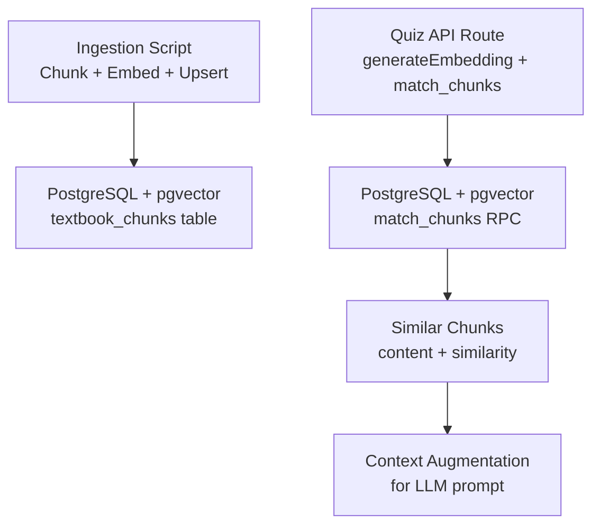
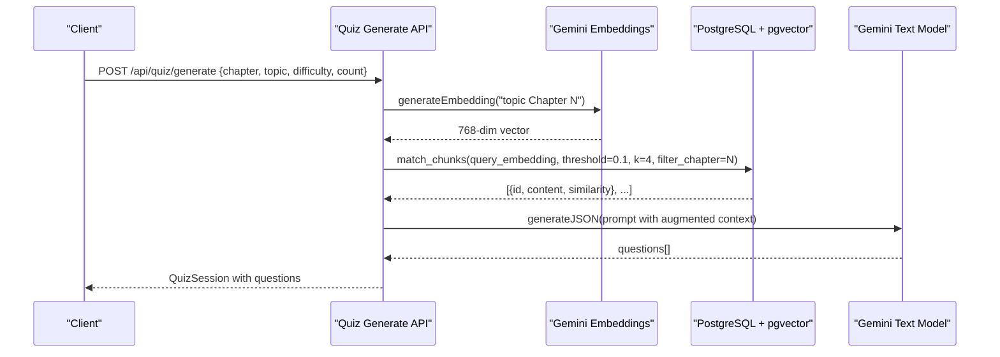
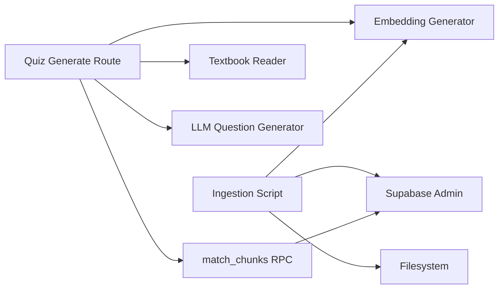
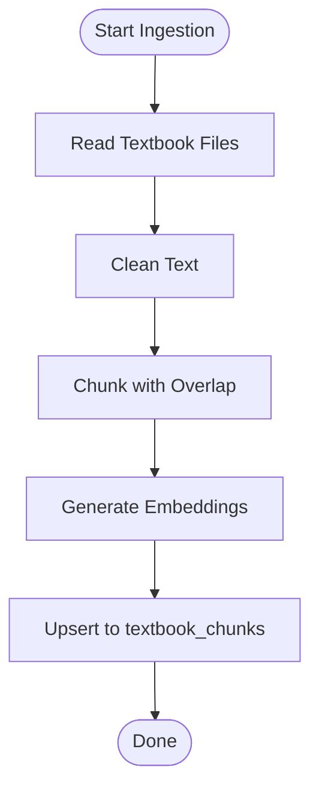
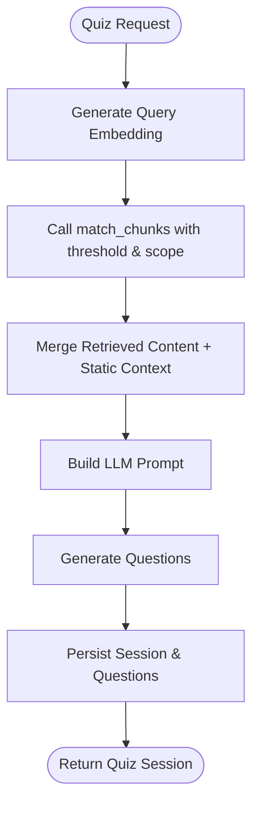

# Semantic Similarity Search

<cite>
**Referenced Files in This Document**
- [route.ts](file://src/app/api/quiz/generate/route.ts)
- [ingest-textbooks.ts](file://scripts/ingest-textbooks.ts)
- [schema.sql](file://supabase/schema.sql)
- [gemini.ts](file://src/lib/ai/gemini.ts)
- [textbook-reader.ts](file://src/lib/textbook-reader.ts)
- [check-chunks.ts](file://scripts/check-chunks.ts)
</cite>

## Table of Contents
1. Introduction
2. Project Structure
3. Core Components
4. Architecture Overview
5. Detailed Component Analysis
6. Dependency Analysis
7. Performance Considerations
8. Troubleshooting Guide
9. Conclusion
10. Appendices

## Introduction
This document explains the semantic similarity search implementation used to retrieve relevant textbook content during quiz generation. It covers how query embeddings are generated, how they are matched against stored textbook chunks using cosine similarity via pgvector, and how results are integrated into the quiz pipeline. It also documents configuration options for thresholds and result limits, index usage, performance tuning, scalability considerations, and caching strategies.

## Project Structure
The semantic similarity search spans ingestion, storage, and runtime retrieval:
- Ingestion: Textbook chapters are chunked, embedded, and upserted into a vector-enabled table with an HNSW index.
- Runtime: Quiz generation creates a query embedding and calls a database RPC to find similar chunks, optionally filtered by chapter. Retrieved chunks augment context for question generation.

**Diagram sources**
- [ingest-textbooks.ts:97-183](file://scripts/ingest-textbooks.ts#L97-L183)
- [schema.sql:27-44](file://supabase/schema.sql#L27-L44)
- [schema.sql:116-150](file://supabase/schema.sql#L116-L150)
- [route.ts:29-49](file://src/app/api/quiz/generate/route.ts#L29-L49)

**Section sources**
- [ingest-textbooks.ts:97-183](file://scripts/ingest-textbooks.ts#L97-L183)
- [schema.sql:27-44](file://supabase/schema.sql#L27-L44)
- [schema.sql:116-150](file://supabase/schema.sql#L116-L150)
- [route.ts:29-49](file://src/app/api/quiz/generate/route.ts#L29-L49)

## Core Components
- Embedding Generation: Produces 768-dimensional vectors from text using the Gemini embedding model.
- Vector Storage: Stores chunks with embeddings in a PostgreSQL table with pgvector extension enabled.
- Indexing: Uses an HNSW index configured for cosine similarity operations to accelerate nearest neighbor search.
- Similarity Search RPC: A server-side function computes cosine similarity between query and stored embeddings, applies threshold filtering and optional chapter scoping, and returns top-k results.
- Integration: The quiz generation route embeds the user’s topic and chapter, invokes the RPC, merges retrieved content with local textbook excerpts, and feeds it to the LLM for question generation.

**Section sources**
- [gemini.ts:21-43](file://src/lib/ai/gemini.ts#L21-L43)
- [schema.sql:5-8](file://supabase/schema.sql#L5-L8)
- [schema.sql:27-44](file://supabase/schema.sql#L27-L44)
- [schema.sql:116-150](file://supabase/schema.sql#L116-L150)
- [route.ts:29-49](file://src/app/api/quiz/generate/route.ts#L29-L49)

## Architecture Overview
The system follows a Retrieval-Augmented Generation (RAG) pattern:
- Query embedding is created at request time.
- The database performs approximate nearest neighbor search using cosine distance on the HNSW index.
- Results are filtered by a configurable similarity threshold and optional chapter scope.
- Retrieved content is combined with static textbook excerpts to form a rich prompt for question generation.

**Diagram sources**
- [route.ts:29-49](file://src/app/api/quiz/generate/route.ts#L29-L49)
- [gemini.ts:21-43](file://src/lib/ai/gemini.ts#L21-L43)
- [schema.sql:116-150](file://supabase/schema.sql#L116-L150)

## Detailed Component Analysis

### Embedding Generation
- Purpose: Convert natural language queries into fixed-length vectors suitable for similarity search.
- Implementation: Calls the Gemini embedding model with output dimensionality set to 768.
- Error Handling: Throws if the API key is missing or the response lacks an embedding.

Key behaviors:
- Requires environment variable for API access.
- Returns a numeric array representing the embedding.

**Section sources**
- [gemini.ts:21-43](file://src/lib/ai/gemini.ts#L21-L43)

### Ingestion Pipeline
- Purpose: Prepare textbook content for vector search by chunking, embedding, and storing.
- Chunking Strategy: Splits cleaned text into paragraphs-based chunks with overlap to preserve context across boundaries.
- Embedding: Generates one embedding per chunk with retry logic for rate limiting.
- Storage: Upserts records into the textbook_chunks table; includes metadata like chapter number and token count.

Optimization notes:
- Rate-limit handling with delays and retries.
- Clean text normalization reduces noise before embedding.

**Section sources**
- [ingest-textbooks.ts:38-75](file://scripts/ingest-textbooks.ts#L38-L75)
- [ingest-textbooks.ts:97-183](file://scripts/ingest-textbooks.ts#L97-L183)

### Database Schema and Indexing
- Vector Column: Stores 768-dimensional embeddings.
- Index: HNSW index configured with cosine operations for fast approximate nearest neighbor search.
- Additional Index: Chapter number index supports efficient filtering by chapter.

Performance implications:
- HNSW provides sub-linear search complexity for large datasets when tuned appropriately.
- Cosine operations align with normalized embeddings commonly produced by modern models.

**Section sources**
- [schema.sql:27-44](file://supabase/schema.sql#L27-L44)

### Similarity Search RPC
- Function: Computes similarity as 1 minus cosine distance between query and stored embeddings.
- Filtering: Supports optional chapter filtering by name substring or exact chapter number.
- Thresholding: Applies a minimum similarity threshold to exclude low-relevance matches.
- Ranking: Orders by ascending cosine distance (i.e., highest similarity first) and limits to top-k results.

Configuration exposed to callers:
- match_threshold: Minimum similarity score to include.
- match_count: Maximum number of results to return.
- filter_chapter: Restricts search to a specific chapter.

**Section sources**
- [schema.sql:116-150](file://supabase/schema.sql#L116-L150)

### Quiz Generation Integration
- Workflow:
  - Load static textbook excerpt for the chapter.
  - Generate query embedding from “topic Chapter N”.
  - Call match_chunks with threshold 0.1 and k=4, scoped to the chapter.
  - Merge returned chunk contents with static excerpt to enrich the prompt.
  - Generate questions via the LLM; persist session and questions.

Robustness:
- Vector search is optional; if it fails, the system continues with static content and fallback question sources.

**Section sources**
- [route.ts:29-49](file://src/app/api/quiz/generate/route.ts#L29-L49)
- [route.ts:55-127](file://src/app/api/quiz/generate/route.ts#L55-L127)
- [route.ts:137-171](file://src/app/api/quiz/generate/route.ts#L137-L171)

### Static Textbook Reader
- Purpose: Provides additional context by reading chapter-specific files from the local filesystem.
- Behavior: Finds the matching file by chapter number and returns a bounded slice of content.

Use case:
- Acts as a deterministic baseline source of context alongside vector RAG.

**Section sources**
- [textbook-reader.ts:1-46](file://src/lib/textbook-reader.ts#L1-L46)

## Dependency Analysis
- The quiz generation route depends on:
  - Embedding generation utility.
  - Supabase client to call the match_chunks RPC.
  - Local textbook reader for static context.
  - LLM generator for question creation.
- Ingestion script depends on:
  - Filesystem access to read textbook files.
  - Embedding generation utility.
  - Supabase admin client to upsert chunks.

**Diagram sources**
- [route.ts:29-49](file://src/app/api/quiz/generate/route.ts#L29-L49)
- [ingest-textbooks.ts:97-183](file://scripts/ingest-textbooks.ts#L97-L183)
- [schema.sql:116-150](file://supabase/schema.sql#L116-L150)

**Section sources**
- [route.ts:29-49](file://src/app/api/quiz/generate/route.ts#L29-L49)
- [ingest-textbooks.ts:97-183](file://scripts/ingest-textbooks.ts#L97-L183)

## Performance Considerations
- Index Selection: HNSW with cosine operations is appropriate for normalized embeddings and large-scale retrieval. Ensure index parameters (e.g., m, ef_construction, ef_search) are tuned to balance recall and latency based on dataset size and query volume.
- Threshold Tuning: Adjust match_threshold to control precision vs. recall. Lower thresholds increase recall but may introduce less relevant chunks.
- Result Limiting: Use match_count to cap payload size and reduce downstream processing costs.
- Chapter Scoping: Always filter by chapter when possible to reduce search space and improve relevance.
- Embedding Dimensionality: Keep consistent dimensionality (768) across ingestion and query paths to avoid mismatches.
- I/O Boundaries: Avoid excessive concatenation of chunk content; limit prompt size to stay within model constraints.

[No sources needed since this section provides general guidance]

## Troubleshooting Guide
Common issues and resolutions:
- Missing API Key: If the embedding generation fails due to missing environment variables, ensure the required keys are configured.
- Rate Limits: During ingestion, handle 429 responses with exponential backoff or fixed delays to respect provider quotas.
- No Matches Found: Increase match_count or lower match_threshold; verify that embeddings exist and the index is built.
- Slow Queries: Confirm HNSW index exists and is optimized; consider adjusting search-time parameters and ensuring chapter filtering is applied.
- Data Integrity: Verify chunk counts and schema alignment; use a diagnostic script to check row counts and sample data.

Operational checks:
- Use a diagnostic script to count rows in the vector store and validate ingestion completeness.

**Section sources**
- [gemini.ts:29-43](file://src/lib/ai/gemini.ts#L29-L43)
- [ingest-textbooks.ts:129-165](file://scripts/ingest-textbooks.ts#L129-L165)
- [schema.sql:38-44](file://supabase/schema.sql#L38-L44)
- [check-chunks.ts:24-27](file://scripts/check-chunks.ts#L24-L27)

## Conclusion
The semantic similarity search integrates vector embeddings with PostgreSQL’s pgvector to enhance quiz generation with highly relevant textbook content. By leveraging HNSW indexing, cosine similarity, and configurable thresholds and scopes, the system balances accuracy and performance. Proper ingestion practices, robust error handling, and thoughtful parameter tuning ensure scalable operation even as textbook collections grow.

[No sources needed since this section summarizes without analyzing specific files]

## Appendices

### Configuration Options
- Similarity Threshold: Control relevance via match_threshold in the RPC call.
- Result Count: Limit results via match_count to manage context size and cost.
- Scope Limitation: Use filter_chapter to restrict search to a specific chapter or chapter name substring.

Example invocation patterns:
- Broad search: Higher match_count and lower threshold to maximize coverage.
- Narrow search: Lower match_count and higher threshold for precise, high-confidence matches.
- Scoped search: Always provide filter_chapter when generating chapter-specific quizzes.

**Section sources**
- [schema.sql:116-150](file://supabase/schema.sql#L116-L150)
- [route.ts:33-46](file://src/app/api/quiz/generate/route.ts#L33-L46)

### Example Workflows

#### Ingestion Flow

**Diagram sources**
- [ingest-textbooks.ts:38-75](file://scripts/ingest-textbooks.ts#L38-L75)
- [ingest-textbooks.ts:97-183](file://scripts/ingest-textbooks.ts#L97-L183)

#### Quiz Generation with RAG

**Diagram sources**
- [route.ts:29-49](file://src/app/api/quiz/generate/route.ts#L29-L49)
- [route.ts:55-127](file://src/app/api/quiz/generate/route.ts#L55-L127)
- [route.ts:137-171](file://src/app/api/quiz/generate/route.ts#L137-L171)

### Scalability Considerations
- Dataset Growth: As textbook collections expand, monitor index build times and query latency; tune HNSW parameters accordingly.
- Concurrency: Batch ingestion jobs and throttle embedding requests to avoid provider rate limits.
- Partitioning: Consider partitioning by chapter_num for very large datasets to optimize filtering and maintenance.
- Caching: Cache frequent query embeddings and their top-k results keyed by normalized query strings and chapter filters to reduce repeated computation and database load.

[No sources needed since this section provides general guidance]