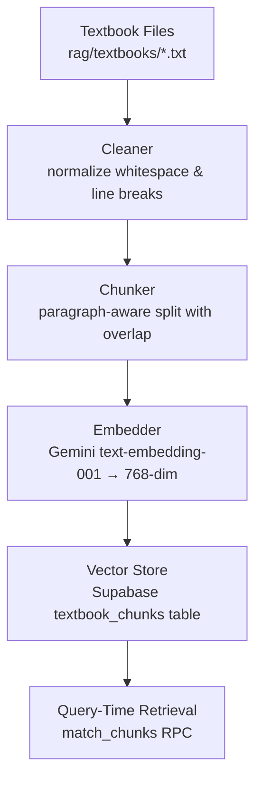
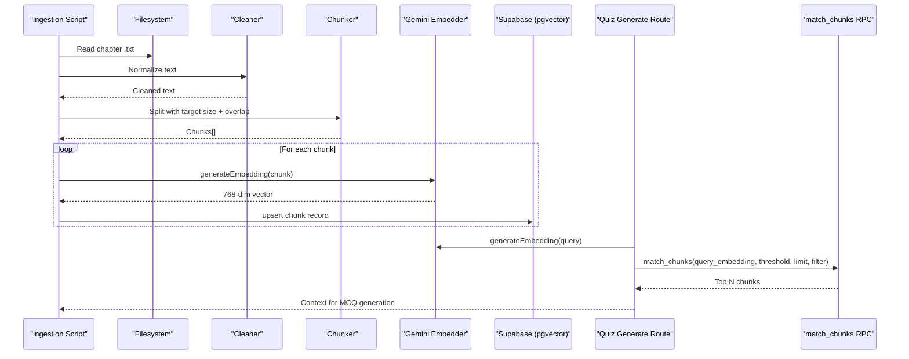
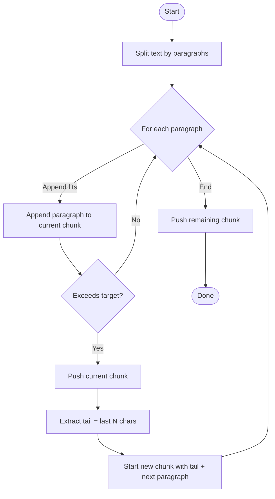
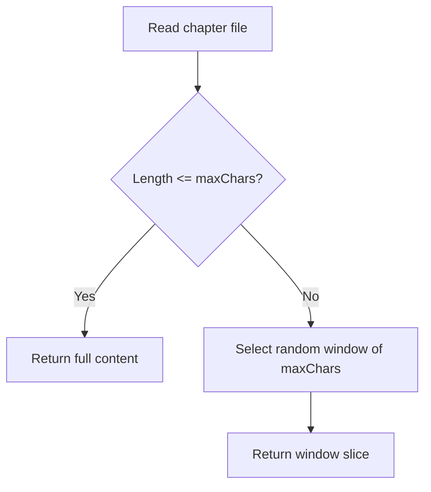
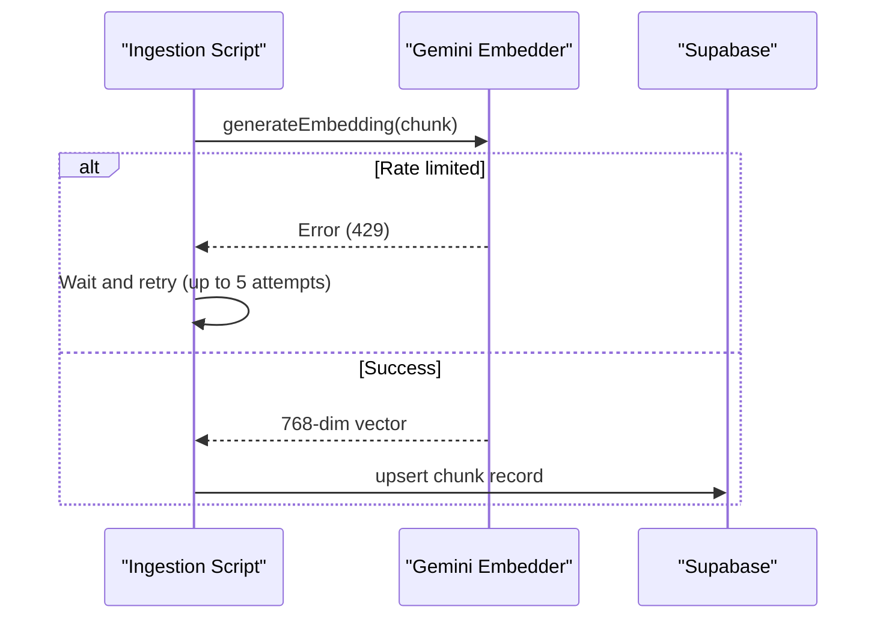
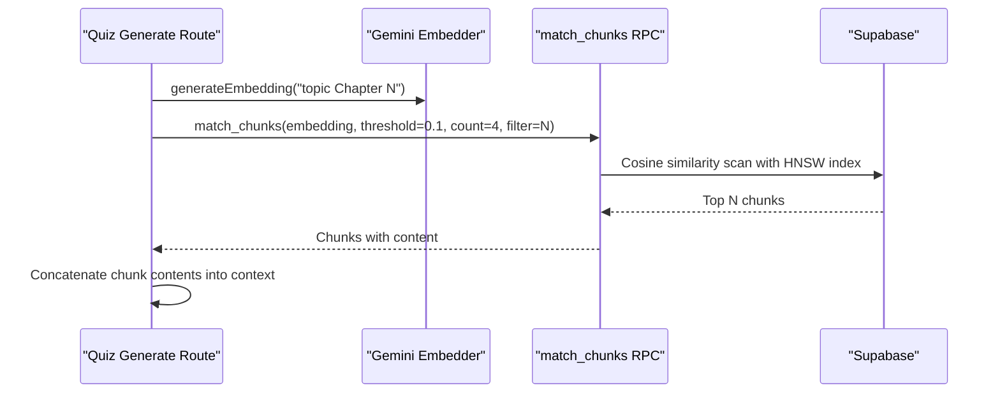
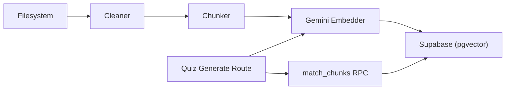

# Text Chunking Algorithms

<cite>
**Referenced Files in This Document**
- [ingest-textbooks.ts](file://scripts/ingest-textbooks.ts)
- [gemini.ts](file://src/lib/ai/gemini.ts)
- [textbook-reader.ts](file://src/lib/textbook-reader.ts)
- [schema.sql](file://supabase/schema.sql)
- [route.ts](file://src/app/api/quiz/generate/route.ts)
- [check-chunks.ts](file://scripts/check-chunks.ts)
</cite>

## Table of Contents
1. Introduction
2. Project Structure
3. Core Components
4. Architecture Overview
5. Detailed Component Analysis
6. Dependency Analysis
7. Performance Considerations
8. Troubleshooting Guide
9. Conclusion
10. Appendices

## Introduction
This document explains the text chunking algorithms used to segment textbook content for optimal vector search performance in the MedAce AI RAG pipeline. It covers the strategy that balances context preservation with search efficiency, configurable chunk sizes and overlap handling, semantic coherence techniques, maximum character limits, embedding optimization, examples of chunking scenarios, performance considerations for large textbooks, memory management strategies, customization options (chunk size, overlap, boundary detection), and guidance on evaluating chunk quality and tuning parameters across different subject matter types.

## Project Structure
The chunking system is implemented as a build-time ingestion pipeline that:
- Reads raw chapter text files from rag/textbooks
- Cleans and normalizes text
- Splits content into semantically coherent chunks with overlap
- Generates 768-dimensional embeddings using Gemini
- Upserts chunks into Supabase PostgreSQL with pgvector for fast similarity search

**Diagram sources**
- [ingest-textbooks.ts:41-75](file://scripts/ingest-textbooks.ts#L41-L75)
- [gemini.ts:21-43](file://src/lib/ai/gemini.ts#L21-L43)
- [schema.sql:27-44](file://supabase/schema.sql#L27-L44)
- [schema.sql:116-149](file://supabase/schema.sql#L116-L149)

**Section sources**
- [ingest-textbooks.ts:97-183](file://scripts/ingest-textbooks.ts#L97-L183)
- [schema.sql:27-44](file://supabase/schema.sql#L27-L44)

## Core Components
- Cleaner: Normalizes OCR artifacts and whitespace to improve chunk stability.
- Chunker: Paragraph-aware segmentation with configurable target size and overlap to preserve context across boundaries.
- Embedder: Uses Gemini’s embedding model to produce 768-dimensional vectors suitable for cosine similarity retrieval.
- Vector Store: Stores chunks with metadata (chapter, index, token count) and an HNSW index for fast retrieval.
- Query-Time Integration: API routes embed queries and retrieve relevant chunks via a database function.

Key responsibilities and behaviors are detailed in the following sections.

**Section sources**
- [ingest-textbooks.ts:41-75](file://scripts/ingest-textbooks.ts#L41-L75)
- [gemini.ts:21-43](file://src/lib/ai/gemini.ts#L21-L43)
- [schema.sql:27-44](file://supabase/schema.sql#L27-L44)
- [route.ts:31-49](file://src/app/api/quiz/generate/route.ts#L31-L49)

## Architecture Overview
The end-to-end flow integrates chunking with embedding and retrieval:

**Diagram sources**
- [ingest-textbooks.ts:97-183](file://scripts/ingest-textbooks.ts#L97-L183)
- [gemini.ts:21-43](file://src/lib/ai/gemini.ts#L21-L43)
- [schema.sql:116-149](file://supabase/schema.sql#L116-L149)
- [route.ts:31-49](file://src/app/api/quiz/generate/route.ts#L31-L49)

## Detailed Component Analysis

### Chunking Strategy: Paragraph-Aware Segmentation with Overlap
- Boundary Detection: The chunker splits by paragraph boundaries (double newline) to maintain semantic coherence. This avoids cutting mid-thought and keeps related sentences together.
- Target Size: Default target chunk size is set to a fixed character budget to keep chunks manageable for embedding and storage.
- Overlap Handling: When a new paragraph would exceed the target size, the algorithm retains a tail portion from the previous chunk and prepends it to the next chunk. This preserves context across chunk boundaries.
- Token Estimation: Approximate token counts are derived from chunk length to aid downstream processing and monitoring.

**Diagram sources**
- [ingest-textbooks.ts:52-75](file://scripts/ingest-textbooks.ts#L52-L75)

**Section sources**
- [ingest-textbooks.ts:52-75](file://scripts/ingest-textbooks.ts#L52-L75)

### Maximum Character Limits and Optimization for Embeddings
- Chapter Reader Limit: The textbook reader supports reading up to a maximum character window (default 8000 characters) when retrieving context for query-time prompts. This ensures prompts remain within model constraints while still providing rich context.
- Embedding Optimization: Chunks are sized to fit efficiently into the embedding model and stored as 768-dimensional vectors. The ingestion script estimates token counts per chunk to monitor usage and balance cost/performance.

**Diagram sources**
- [textbook-reader.ts:9-45](file://src/lib/textbook-reader.ts#L9-L45)

**Section sources**
- [textbook-reader.ts:9-45](file://src/lib/textbook-reader.ts#L9-L45)
- [ingest-textbooks.ts:129-164](file://scripts/ingest-textbooks.ts#L129-L164)

### Embedding Generation and Storage
- Model: Gemini embedding model configured to output 768-dimensional vectors.
- Rate Limiting: Ingestion includes retries with backoff for rate-limited responses and delays between requests to respect free-tier quotas.
- Storage: Chunks are upserted into the textbook_chunks table with fields for chapter, chapter_num, chunk_index, content, token_count, and embedding. An HNSW index enables fast cosine similarity searches.

**Diagram sources**
- [gemini.ts:21-43](file://src/lib/ai/gemini.ts#L21-L43)
- [ingest-textbooks.ts:129-164](file://scripts/ingest-textbooks.ts#L129-L164)
- [schema.sql:27-44](file://supabase/schema.sql#L27-L44)

**Section sources**
- [gemini.ts:21-43](file://src/lib/ai/gemini.ts#L21-L43)
- [ingest-textbooks.ts:129-164](file://scripts/ingest-textbooks.ts#L129-L164)
- [schema.sql:27-44](file://supabase/schema.sql#L27-L44)

### Query-Time Retrieval and Context Assembly
- Query Embedding: The quiz generation route embeds a query string combining topic and chapter context.
- Similarity Search: The match_chunks RPC performs cosine similarity filtering with a threshold and returns top results, optionally filtered by chapter.
- Context Assembly: Retrieved chunk contents are concatenated and appended to the prompt context to ground MCQ generation in actual textbook material.

**Diagram sources**
- [route.ts:31-49](file://src/app/api/quiz/generate/route.ts#L31-L49)
- [schema.sql:116-149](file://supabase/schema.sql#L116-L149)

**Section sources**
- [route.ts:31-49](file://src/app/api/quiz/generate/route.ts#L31-L49)
- [schema.sql:116-149](file://supabase/schema.sql#L116-L149)

## Dependency Analysis
- Ingestion depends on filesystem access, cleaning logic, chunking logic, embedding service, and database upsert operations.
- Retrieval depends on embedding service and database RPC for similarity search.
- Database schema defines the vector store structure and indexes required for efficient retrieval.

**Diagram sources**
- [ingest-textbooks.ts:97-183](file://scripts/ingest-textbooks.ts#L97-L183)
- [gemini.ts:21-43](file://src/lib/ai/gemini.ts#L21-L43)
- [schema.sql:27-44](file://supabase/schema.sql#L27-L44)
- [schema.sql:116-149](file://supabase/schema.sql#L116-L149)
- [route.ts:31-49](file://src/app/api/quiz/generate/route.ts#L31-L49)

**Section sources**
- [ingest-textbooks.ts:97-183](file://scripts/ingest-textbooks.ts#L97-L183)
- [schema.sql:27-44](file://supabase/schema.sql#L27-L44)
- [route.ts:31-49](file://src/app/api/quiz/generate/route.ts#L31-L49)

## Performance Considerations
- Chunk Size Tuning: Larger chunks increase context but may dilute relevance; smaller chunks improve precision but risk losing cross-boundary context. Adjust target chunk size based on domain density and embedding model behavior.
- Overlap Percentage: Increasing overlap improves continuity at the cost of more duplicates and higher storage/compute. Tune overlap to balance recall and redundancy.
- Rate Limits and Delays: The ingestion script implements retries and delays to respect API quotas. For large textbooks, consider batching or parallelization with careful concurrency control.
- Indexing: HNSW indexing on embeddings accelerates similarity search. Ensure appropriate index parameters if customizing pgvector configuration.
- Memory Management: Reading entire chapters can be memory-intensive. Use streaming reads or bounded windows where possible. The textbook reader already supports a maximum character window to constrain memory usage during context assembly.

[No sources needed since this section provides general guidance]

## Troubleshooting Guide
- Missing Environment Variables: Ensure GEMINI_API_KEY and Supabase credentials are configured before running ingestion or query-time routes.
- Rate Limit Errors: If encountering 429 errors, the ingestion script retries with backoff. Increase delays or reduce concurrency if necessary.
- Empty Results: Verify that chunks exist in the database and that the match threshold is not too high. Use the check script to confirm chunk counts.
- Incorrect Chapter Filtering: Ensure filter_chapter matches the expected chapter number or name format used during ingestion.

**Section sources**
- [gemini.ts:6-8](file://src/lib/ai/gemini.ts#L6-L8)
- [ingest-textbooks.ts:135-164](file://scripts/ingest-textbooks.ts#L135-L164)
- [check-chunks.ts:24-27](file://scripts/check-chunks.ts#L24-L27)
- [schema.sql:116-149](file://supabase/schema.sql#L116-L149)

## Conclusion
The chunking system uses paragraph-aware segmentation with configurable target size and overlap to preserve semantic coherence while enabling efficient vector search. Chunks are embedded into 768-dimensional vectors and stored in a pgvector-backed table with HNSW indexing for fast retrieval. The textbook reader enforces a maximum character window to optimize prompt context. By tuning chunk size, overlap, and thresholds, you can adapt the system to different subject matters and performance requirements.

[No sources needed since this section summarizes without analyzing specific files]

## Appendices

### Customization Options
- Chunk Size: Adjust the target chunk character budget to balance context richness and retrieval precision.
- Overlap: Modify the overlap character count to control how much context is preserved across chunk boundaries.
- Boundary Detection: Currently paragraph-based; extend to heading/SLO-aware splitting if your textbooks have structured headings or SLO codes.
- Threshold and Count: Tune match_threshold and match_count in the query-time retrieval to adjust relevance strictness and result volume.

**Section sources**
- [ingest-textbooks.ts:52-75](file://scripts/ingest-textbooks.ts#L52-L75)
- [route.ts:31-49](file://src/app/api/quiz/generate/route.ts#L31-L49)
- [schema.sql:116-149](file://supabase/schema.sql#L116-L149)

### Evaluating Chunk Quality
- Relevance Testing: Run representative queries and inspect retrieved chunks for topical alignment and completeness.
- Recall vs Precision: Lower thresholds increase recall but may introduce noise; raise thresholds for stricter relevance.
- Coverage: Ensure all key topics appear in chunks; adjust chunk size/overlap if certain concepts are fragmented.
- Cost Monitoring: Track approximate token counts per chunk to manage embedding costs and storage footprint.

**Section sources**
- [ingest-textbooks.ts:129-164](file://scripts/ingest-textbooks.ts#L129-L164)
- [route.ts:31-49](file://src/app/api/quiz/generate/route.ts#L31-L49)