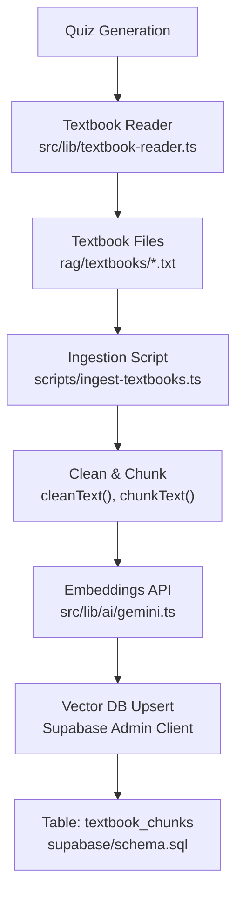
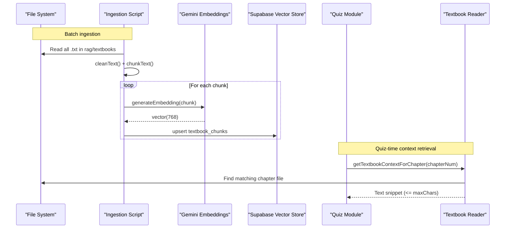
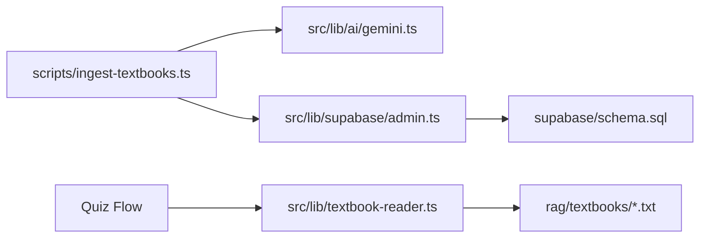
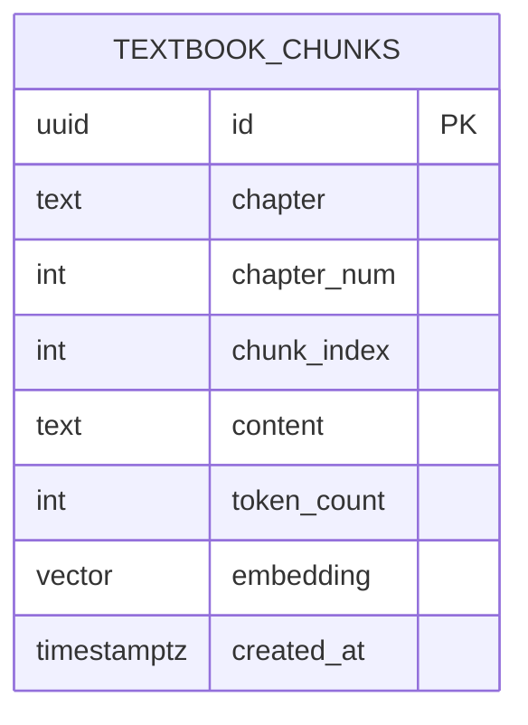
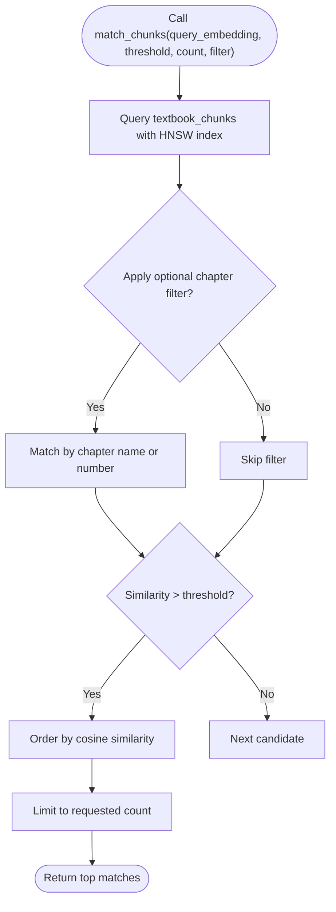

# Textbook Ingestion Pipeline

<cite>
**Referenced Files in This Document**
- [ingest-textbooks.ts](file://scripts/ingest-textbooks.ts)
- [textbook-reader.ts](file://src/lib/textbook-reader.ts)
- [gemini.ts](file://src/lib/ai/gemini.ts)
- [admin.ts](file://src/lib/supabase/admin.ts)
- [schema.sql](file://supabase/schema.sql)
- [check-chunks.ts](file://scripts/check-chunks.ts)
</cite>

## Table of Contents
1. [Introduction](#introduction)
2. [Project Structure](#project-structure)
3. [Core Components](#core-components)
4. [Architecture Overview](#architecture-overview)
5. [Detailed Component Analysis](#detailed-component-analysis)
6. [Dependency Analysis](#dependency-analysis)
7. [Performance Considerations](#performance-considerations)
8. [Troubleshooting Guide](#troubleshooting-guide)
9. [Conclusion](#conclusion)
10. [Appendices](#appendices)

## Introduction
This document explains the textbook ingestion pipeline that transforms raw chapter text files into a searchable, vectorized format for retrieval-augmented generation (RAG). It covers how chapter files are discovered and parsed, how text is cleaned and chunked, how embeddings are generated, and how chunks are persisted to a vector database. It also documents the integration with the textbook reader module used during quiz generation to retrieve contextual content, configuration options for paths and encoding, error recovery strategies, usage examples, batch processing behavior, monitoring tips, and common issues with mitigations.

## Project Structure
The ingestion pipeline is implemented as a Node/TypeScript script that:
- Scans a dedicated directory for chapter text files
- Cleans and chunks the text
- Generates vector embeddings via an AI provider
- Persists structured chunks into a PostgreSQL table with vector search support

**Diagram sources**
- [ingest-textbooks.ts:97-183](file://scripts/ingest-textbooks.ts#L97-L183)
- [gemini.ts:29-43](file://src/lib/ai/gemini.ts#L29-L43)
- [admin.ts:3-12](file://src/lib/supabase/admin.ts#L3-L12)
- [schema.sql:26-44](file://supabase/schema.sql#L26-L44)
- [textbook-reader.ts:9-45](file://src/lib/textbook-reader.ts#L9-L45)

**Section sources**
- [ingest-textbooks.ts:97-183](file://scripts/ingest-textbooks.ts#L97-L183)
- [schema.sql:26-44](file://supabase/schema.sql#L26-L44)

## Core Components
- File discovery and parsing: Locates chapter files by pattern and extracts chapter number and name.
- Text cleaning: Normalizes line endings, collapses whitespace, and trims content.
- Chunking: Splits cleaned text into paragraph-aware segments with overlap to preserve context.
- Embedding generation: Calls the Gemini embedding model to produce fixed-dimension vectors per chunk.
- Persistence: Upserts chunk records into a PostgreSQL table with vector indexing and RLS policies.
- Context retrieval: Reads raw chapter text for quiz context when needed.

Key responsibilities and behaviors are implemented in the following modules:
- Ingestion script: orchestrates file scanning, cleaning, chunking, embedding, and upserts.
- AI embedding module: configures and calls the embedding model.
- Supabase admin client: provides privileged write access to the vector store.
- Database schema: defines the vector table, indexes, and similarity search function.
- Textbook reader: locates and returns relevant text snippets for quiz context.

**Section sources**
- [ingest-textbooks.ts:41-95](file://scripts/ingest-textbooks.ts#L41-L95)
- [gemini.ts:21-43](file://src/lib/ai/gemini.ts#L21-L43)
- [admin.ts:3-12](file://src/lib/supabase/admin.ts#L3-L12)
- [schema.sql:26-44](file://supabase/schema.sql#L26-L44)
- [textbook-reader.ts:9-45](file://src/lib/textbook-reader.ts#L9-L45)

## Architecture Overview
The end-to-end flow from raw files to searchable chunks and back to context retrieval is shown below.

**Diagram sources**
- [ingest-textbooks.ts:97-183](file://scripts/ingest-textbooks.ts#L97-L183)
- [gemini.ts:29-43](file://src/lib/ai/gemini.ts#L29-L43)
- [textbook-reader.ts:9-45](file://src/lib/textbook-reader.ts#L9-L45)
- [schema.sql:26-44](file://supabase/schema.sql#L26-L44)

## Detailed Component Analysis

### File Discovery and Naming Conventions
- Directory: The pipeline reads from a fixed path under the project root: rag/textbooks.
- Pattern: Only files ending with .txt are processed.
- Chapter metadata extraction: Filenames follow the pattern Chapter_<number>_<Title>_extracted.txt. The parser:
  - Extracts the numeric chapter identifier.
  - Derives a human-readable chapter name by removing prefixes/suffixes and replacing underscores with spaces.
- Sorting: Files are sorted lexicographically to ensure deterministic processing order.

Operational notes:
- If the directory does not exist, the script exits with an error.
- Non-.txt files are ignored.

**Section sources**
- [ingest-textbooks.ts:100-118](file://scripts/ingest-textbooks.ts#L100-L118)
- [ingest-textbooks.ts:77-95](file://scripts/ingest-textbooks.ts#L77-L95)

### Text Processing Workflow
- Cleaning:
  - Normalizes line endings to LF.
  - Collapses multiple spaces/tabs into single spaces.
  - Reduces excessive blank lines to double newlines.
  - Trims leading/trailing whitespace.
- Chunking:
  - Splits on paragraph boundaries (double newline).
  - Accumulates paragraphs until a target character threshold is reached.
  - Uses an overlap window from the tail of the previous chunk to maintain continuity across chunk boundaries.
  - Returns an array of trimmed chunk strings.

Complexity considerations:
- Cleaning is linear in input size.
- Chunking is linear in the number of paragraphs; memory usage scales with the largest chunk.

**Section sources**
- [ingest-textbooks.ts:41-75](file://scripts/ingest-textbooks.ts#L41-L75)

### Embedding Generation and Rate Limit Handling
- Model: Uses a dedicated embedding model configured in the AI module.
- Output dimensionality: Fixed at 768 dimensions to match the database vector type.
- Error handling:
  - Retries up to five times on rate-limit responses (HTTP 429), with a short wait between attempts.
  - Exits the retry loop on other errors and logs them.
- Throttling: Adds a delay between chunk embeddings to respect free-tier limits.

**Section sources**
- [gemini.ts:21-43](file://src/lib/ai/gemini.ts#L21-L43)
- [ingest-textbooks.ts:129-165](file://scripts/ingest-textbooks.ts#L129-L165)

### Persistence to Vector Database
- Table structure:
  - Stores chapter metadata, chunk index, content, approximate token count, and the embedding vector.
  - Includes a timestamp for creation.
- Indexing:
  - HNSW index on the embedding column for fast cosine similarity search.
  - Index on chapter_num for filtering.
- Upsert strategy:
  - Inserts or updates rows based on primary key conflict resolution.
- Security:
  - Row-level security policies allow authenticated and anonymous users to read textbook_chunks for RAG.

**Section sources**
- [schema.sql:26-44](file://supabase/schema.sql#L26-L44)
- [schema.sql:152-179](file://supabase/schema.sql#L152-L179)
- [ingest-textbooks.ts:167-179](file://scripts/ingest-textbooks.ts#L167-L179)

### Integration with Textbook Reader for Quiz Context
- Purpose: During quiz generation, the system can fetch a representative snippet from the corresponding chapter’s raw text file to provide context to the LLM.
- Matching logic:
  - Searches for files starting with chapter_<number>_ or chapter_<number>. or chapter_<number> followed by space.
  - Reads the file in UTF-8 and returns either the full content or a bounded slice up to a configurable maximum character limit.
- Error handling:
  - Returns an empty string if the directory or file is missing or if reading fails.

Usage in quiz workflows:
- The quiz generation flow can call this reader to include relevant textbook excerpts alongside question prompts.

**Section sources**
- [textbook-reader.ts:9-45](file://src/lib/textbook-reader.ts#L9-L45)

### Configuration Options
- Environment variables loaded by scripts:
  - .env.local and .env are scanned and parsed to populate process.env.
- Required environment variables:
  - NEXT_PUBLIC_SUPABASE_URL: Supabase project URL.
  - SUPABASE_SERVICE_ROLE_KEY: Service role key for privileged writes during ingestion.
  - GEMINI_API_KEY: API key for generating embeddings.
- Paths and encoding:
  - Textbook directory: hardcoded to rag/textbooks relative to the working directory.
  - Encoding: All file reads use UTF-8.

Notes:
- The ingestion script uses a proxy-wrapped Supabase admin client to perform upserts.
- The check script demonstrates reading environment variables and querying chunk counts.

**Section sources**
- [ingest-textbooks.ts:6-27](file://scripts/ingest-textbooks.ts#L6-L27)
- [admin.ts:3-12](file://src/lib/supabase/admin.ts#L3-L12)
- [check-chunks.ts:5-22](file://scripts/check-chunks.ts#L5-L22)
- [gemini.ts:6-8](file://src/lib/ai/gemini.ts#L6-L8)

### Usage Examples and Batch Processing
- Running the ingestion:
  - Execute the ingestion script from the project root so that relative paths resolve correctly.
  - Ensure environment variables are set before running.
- What happens:
  - Discovers all .txt files in rag/textbooks.
  - Processes each file sequentially, generating chunks and embeddings.
  - Upserts chunks into the database.
  - Prints progress and final totals.
- Monitoring:
  - Use the provided check script to query the total number of chunks stored.
  - Observe console output for per-chapter and per-chunk status messages.

Batch behavior:
- The script processes all available files in one run.
- Delays and retries are applied per chunk to manage external API constraints.

**Section sources**
- [ingest-textbooks.ts:97-183](file://scripts/ingest-textbooks.ts#L97-L183)
- [check-chunks.ts:24-27](file://scripts/check-chunks.ts#L24-L27)

### Monitoring Ingestion Progress
- Console logs:
  - Start message, number of files found, per-chapter headers, chunk counts, embedding progress, upsert results, and completion summary.
- Post-ingestion verification:
  - Run the check script to confirm the expected number of chunks were inserted.

**Section sources**
- [ingest-textbooks.ts:97-183](file://scripts/ingest-textbooks.ts#L97-L183)
- [check-chunks.ts:24-27](file://scripts/check-chunks.ts#L24-L27)

## Dependency Analysis
The ingestion pipeline depends on several modules and services:

- Coupling:
  - The ingestion script directly depends on the AI embedding module and the Supabase admin client.
  - The textbook reader is decoupled and only depends on filesystem operations.
- External dependencies:
  - Google Generative AI SDK for embeddings.
  - Supabase JS client for database operations.
- Potential circularities:
  - None observed between ingestion and textbook reader.

**Diagram sources**
- [ingest-textbooks.ts:1-5](file://scripts/ingest-textbooks.ts#L1-L5)
- [gemini.ts:1-8](file://src/lib/ai/gemini.ts#L1-L8)
- [admin.ts:1-12](file://src/lib/supabase/admin.ts#L1-L12)
- [textbook-reader.ts:1-4](file://src/lib/textbook-reader.ts#L1-L4)

**Section sources**
- [ingest-textbooks.ts:1-5](file://scripts/ingest-textbooks.ts#L1-L5)
- [gemini.ts:1-8](file://src/lib/ai/gemini.ts#L1-L8)
- [admin.ts:1-12](file://src/lib/supabase/admin.ts#L1-L12)
- [textbook-reader.ts:1-4](file://src/lib/textbook-reader.ts#L1-L4)

## Performance Considerations
- Chunk size and overlap:
  - Paragraph-based chunking with a target character threshold and overlap helps balance context retention and retrieval precision.
- Embedding throughput:
  - Built-in delays and retries mitigate rate limiting; consider adjusting delays for higher quotas.
- Database indexing:
  - HNSW index accelerates vector similarity queries; ensure it is created and maintained.
- Large files:
  - Chunking prevents loading entire large texts into prompts; keep chunk sizes reasonable for downstream models.
- I/O patterns:
  - Sequential file processing avoids concurrent I/O contention; suitable for local disk performance.

[No sources needed since this section provides general guidance]

## Troubleshooting Guide
Common issues and resolutions:

- Missing textbook directory:
  - Symptom: Script exits immediately with a directory-not-found error.
  - Resolution: Ensure rag/textbooks exists and contains .txt files.

- No matching chapter file for quiz context:
  - Symptom: Empty context returned during quiz generation.
  - Resolution: Verify filenames start with chapter_<number>_ or similar patterns recognized by the reader.

- Encoding problems:
  - Symptom: Garbled characters or read errors.
  - Resolution: Save files as UTF-8; the pipeline reads using UTF-8 consistently.

- Rate limiting from embedding API:
  - Symptom: Errors indicating HTTP 429.
  - Resolution: The script retries with waits; reduce chunk volume or adjust delays if necessary.

- Large file handling:
  - Symptom: Long processing times or high memory usage.
  - Resolution: Chunking already mitigates this; ensure target chunk sizes are appropriate for your model context windows.

- Database upsert failures:
  - Symptom: Errors during insertion/updating chunks.
  - Resolution: Check service role key permissions and network connectivity; verify table schema and indexes exist.

- Verifying ingestion:
  - Use the check script to confirm chunk counts after ingestion runs.

**Section sources**
- [ingest-textbooks.ts:100-104](file://scripts/ingest-textbooks.ts#L100-L104)
- [textbook-reader.ts:11-26](file://src/lib/textbook-reader.ts#L11-L26)
- [ingest-textbooks.ts:135-165](file://scripts/ingest-textbooks.ts#L135-L165)
- [check-chunks.ts:24-27](file://scripts/check-chunks.ts#L24-L27)

## Conclusion
The textbook ingestion pipeline provides a robust, automated workflow to transform raw chapter texts into a searchable vector store. It handles file discovery, text cleaning, chunking, embedding generation with resilience to rate limits, and persistent storage with optimized indexes. The textbook reader complements this by enabling efficient context retrieval during quiz generation. With clear configuration, logging, and verification tools, teams can reliably ingest and operate on textbook content at scale.

[No sources needed since this section summarizes without analyzing specific files]

## Appendices

### Data Model: Textbook Chunks

**Diagram sources**
- [schema.sql:26-36](file://supabase/schema.sql#L26-L36)

### Similarity Search Function

**Diagram sources**
- [schema.sql:116-150](file://supabase/schema.sql#L116-L150)