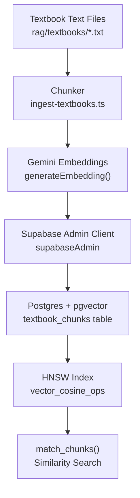
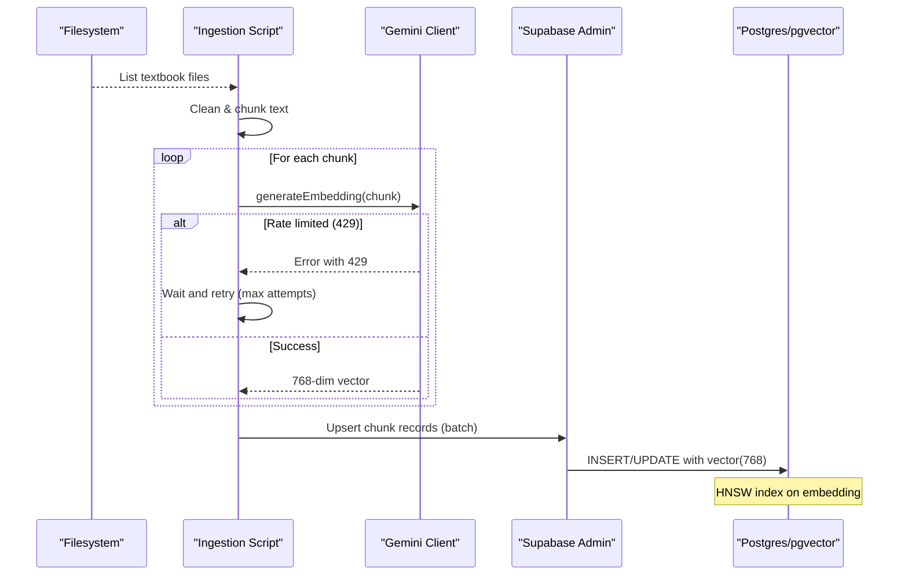
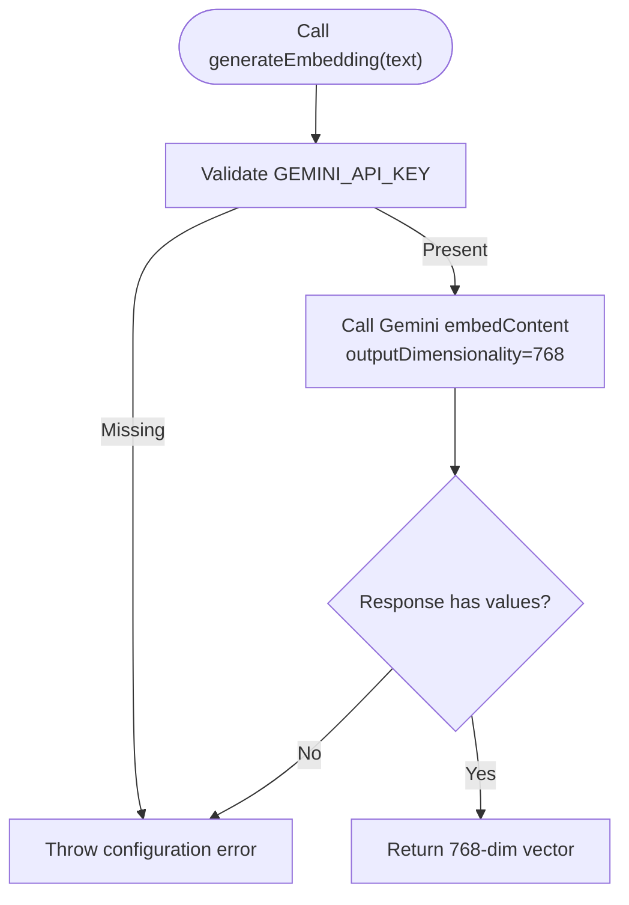
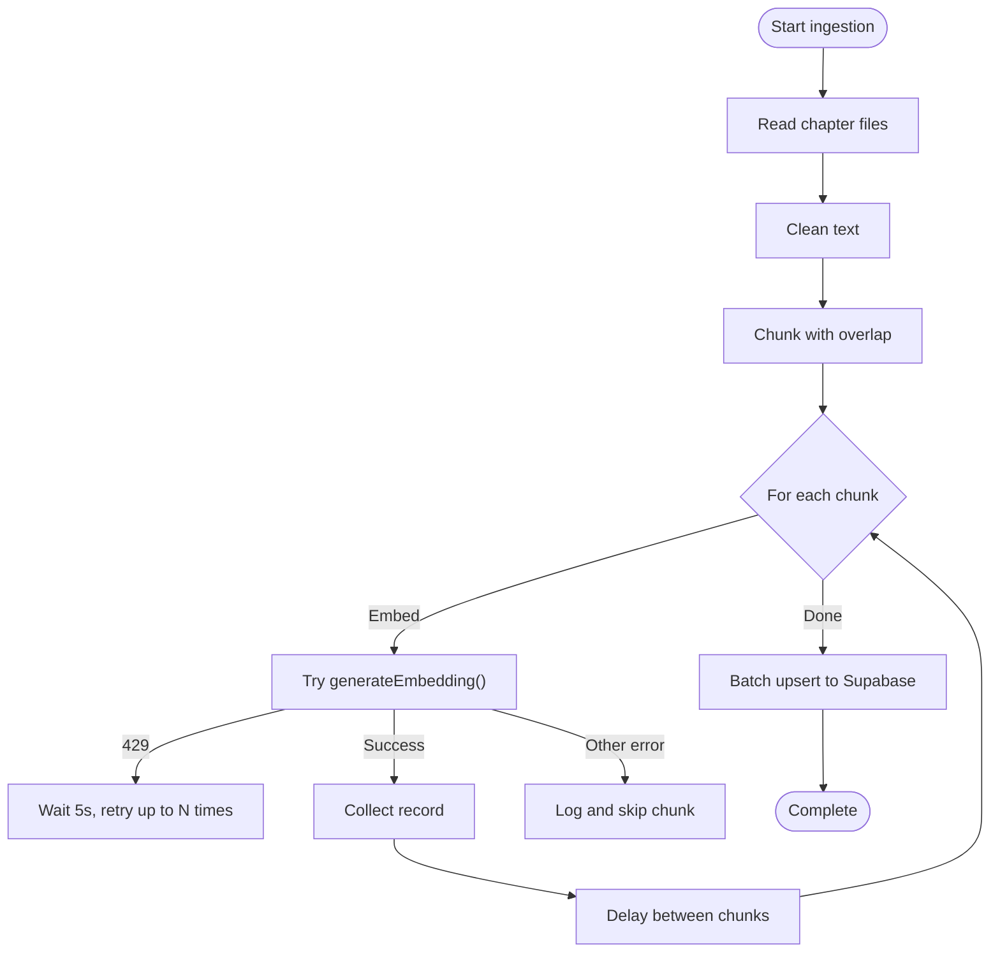
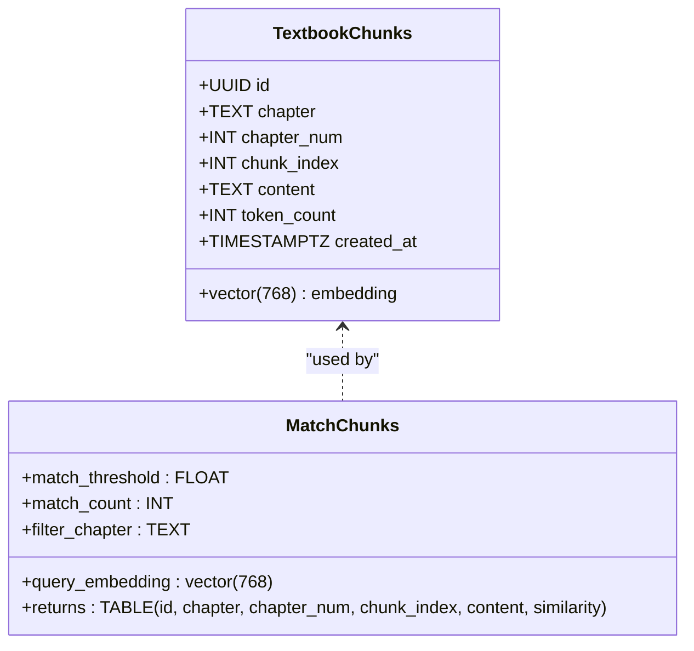
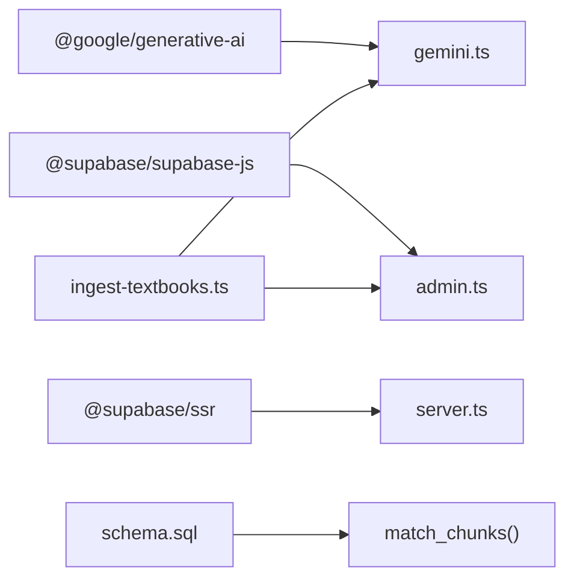

# Vector Embedding Generation

<cite>
**Referenced Files in This Document**
- [gemini.ts](file://src/lib/ai/gemini.ts)
- [ingest-textbooks.ts](file://scripts/ingest-textbooks.ts)
- [schema.sql](file://supabase/schema.sql)
- [admin.ts](file://src/lib/supabase/admin.ts)
- [textbook-reader.ts](file://src/lib/textbook-reader.ts)
- [package.json](file://package.json)
</cite>

## Table of Contents
1. [Introduction](#introduction)
2. [Project Structure](#project-structure)
3. [Core Components](#core-components)
4. [Architecture Overview](#architecture-overview)
5. [Detailed Component Analysis](#detailed-component-analysis)
6. [Dependency Analysis](#dependency-analysis)
7. [Performance Considerations](#performance-considerations)
8. [Troubleshooting Guide](#troubleshooting-guide)
9. [Conclusion](#conclusion)
10. [Appendices](#appendices)

## Introduction
This document explains the vector embedding generation system that converts text chunks into 768-dimensional vectors using Google’s gemini-embedding-001 model. It covers the end-to-end pipeline: chunking, embedding via Gemini API, storing vectors in Supabase with pgvector, and performing semantic similarity search. It also documents rate limiting, error handling, retry mechanisms, configuration options, performance optimization strategies, cost considerations for large-scale ingestion, and caching approaches for repeated content.

## Project Structure
The embedding system spans three main areas:
- AI integration layer: Gemini client and embedding function
- Ingestion script: reads textbook files, chunks text, generates embeddings, and persists to Supabase
- Database schema: defines the vector table, indexes, and a similarity search function

**Diagram sources**
- [ingest-textbooks.ts:52-75](file://scripts/ingest-textbooks.ts#L52-L75)
- [gemini.ts:29-43](file://src/lib/ai/gemini.ts#L29-L43)
- [schema.sql:27-44](file://supabase/schema.sql#L27-L44)
- [schema.sql:116-150](file://supabase/schema.sql#L116-L150)

**Section sources**
- [ingest-textbooks.ts:97-183](file://scripts/ingest-textbooks.ts#L97-L183)
- [gemini.ts:1-60](file://src/lib/ai/gemini.ts#L1-L60)
- [schema.sql:1-44](file://supabase/schema.sql#L1-L44)
- [schema.sql:116-150](file://supabase/schema.sql#L116-L150)

## Core Components
- Gemini embedding client: Initializes the model and returns 768-dim vectors for input text.
- Ingestion pipeline: Reads chapter files, cleans and chunks text, calls Gemini, handles retries and rate limits, then upserts records to Supabase.
- Vector storage and search: PostgreSQL with pgvector extension stores vectors; HNSW index accelerates cosine similarity search; a stored procedure performs filtered similarity queries.

Key responsibilities:
- Chunking strategy with paragraph-aware segmentation and overlap to preserve context across boundaries.
- Robust error handling and backoff for API rate limits (HTTP 429).
- Batched upserts to minimize database round-trips.
- Configurable output dimensionality aligned with the vector column type.

**Section sources**
- [gemini.ts:21-43](file://src/lib/ai/gemini.ts#L21-L43)
- [ingest-textbooks.ts:52-75](file://scripts/ingest-textbooks.ts#L52-L75)
- [ingest-textbooks.ts:129-165](file://scripts/ingest-textbooks.ts#L129-L165)
- [schema.sql:27-44](file://supabase/schema.sql#L27-L44)
- [schema.sql:116-150](file://supabase/schema.sql#L116-L150)

## Architecture Overview
The system follows a linear ingestion flow with explicit safeguards:
- File discovery and parsing
- Text cleaning and chunking
- Embedding generation with retries and delays
- Bulk upsert to Supabase
- Vector search via a stored procedure leveraging HNSW index

**Diagram sources**
- [ingest-textbooks.ts:115-183](file://scripts/ingest-textbooks.ts#L115-L183)
- [gemini.ts:29-43](file://src/lib/ai/gemini.ts#L29-L43)
- [schema.sql:27-44](file://supabase/schema.sql#L27-L44)

## Detailed Component Analysis

### Gemini Embedding Client
- Model selection: Uses gemini-embedding-001 for embeddings and gemini-2.5-flash for text tasks.
- Dimensionality: Requests 768-dimensional outputs to match the database schema.
- Error handling: Throws when API key is missing or response lacks expected fields.
- Integration: Exposed as a simple async function returning number arrays.

**Diagram sources**
- [gemini.ts:29-43](file://src/lib/ai/gemini.ts#L29-L43)

**Section sources**
- [gemini.ts:1-60](file://src/lib/ai/gemini.ts#L1-L60)

### Ingestion Pipeline
- Text processing: Cleans OCR artifacts and normalizes whitespace; splits by paragraphs to maintain semantic coherence.
- Chunking: Builds chunks up to a target size with an overlap region to reduce boundary information loss.
- Embedding loop: Calls Gemini per chunk with exponential-style retry logic on 429 errors and fixed inter-chunk delay to respect free-tier quotas.
- Persistence: Accumulates records and performs a single upsert per chapter to reduce network overhead.

**Diagram sources**
- [ingest-textbooks.ts:52-75](file://scripts/ingest-textbooks.ts#L52-L75)
- [ingest-textbooks.ts:129-165](file://scripts/ingest-textbooks.ts#L129-L165)
- [ingest-textbooks.ts:167-179](file://scripts/ingest-textbooks.ts#L167-L179)

**Section sources**
- [ingest-textbooks.ts:38-75](file://scripts/ingest-textbooks.ts#L38-L75)
- [ingest-textbooks.ts:97-183](file://scripts/ingest-textbooks.ts#L97-L183)

### Vector Storage Schema and Search
- Table: Stores chapter metadata, content, token count estimate, and a vector(768) column.
- Index: HNSW index with cosine operations for fast approximate nearest neighbor search.
- Similarity function: A stored procedure computes cosine similarity and supports optional filtering by chapter name or number, thresholding, and result limit.

**Diagram sources**
- [schema.sql:27-44](file://supabase/schema.sql#L27-L44)
- [schema.sql:116-150](file://supabase/schema.sql#L116-L150)

**Section sources**
- [schema.sql:27-44](file://supabase/schema.sql#L27-L44)
- [schema.sql:116-150](file://supabase/schema.sql#L116-L150)

### Supabase Admin Client
- Provides a service-role client for server-side writes during ingestion.
- Disables session persistence and auto-refresh since it runs in scripts.

**Section sources**
- [admin.ts:1-21](file://src/lib/supabase/admin.ts#L1-L21)

### Textbook Reader Utility
- Locates and reads raw textbook files by chapter number for non-ingestion use cases (e.g., generating contextual prompts).
- Returns a bounded window of text to fit within prompt constraints.

**Section sources**
- [textbook-reader.ts:1-46](file://src/lib/textbook-reader.ts#L1-L46)

## Dependency Analysis
- External libraries:
  - @google/generative-ai: SDK for Gemini models and embeddings
  - @supabase/supabase-js and @supabase/ssr: Clients for Supabase access
- Internal modules:
  - AI module encapsulates Gemini client setup and embedding generation
  - Ingestion script orchestrates file I/O, chunking, embedding, and persistence
  - Schema defines vector storage and search primitives

**Diagram sources**
- [package.json:11-16](file://package.json#L11-L16)
- [gemini.ts:1-60](file://src/lib/ai/gemini.ts#L1-L60)
- [admin.ts:1-21](file://src/lib/supabase/admin.ts#L1-L21)
- [schema.sql:116-150](file://supabase/schema.sql#L116-L150)

**Section sources**
- [package.json:11-16](file://package.json#L11-L16)
- [gemini.ts:1-60](file://src/lib/ai/gemini.ts#L1-L60)
- [admin.ts:1-21](file://src/lib/supabase/admin.ts#L1-L21)
- [schema.sql:116-150](file://supabase/schema.sql#L116-L150)

## Performance Considerations
- Chunk size and overlap: Larger chunks reduce API calls but risk truncation; overlap preserves context at boundaries. Tune target chunk size and overlap based on content density.
- Batch upserts: Accumulate records per chapter and perform one upsert call to minimize network overhead and transaction costs.
- HNSW indexing: The cosine-based HNSW index significantly speeds up similarity searches; ensure appropriate parameters if customizing later.
- Inter-chunk delay: Fixed delay helps avoid rate limits on free tiers; adjust based on quota and throughput needs.
- Token estimation: Approximate token counts can guide downstream processing or cost accounting.

[No sources needed since this section provides general guidance]

## Troubleshooting Guide
Common issues and resolutions:
- Missing API key: Ensure GEMINI_API_KEY is set before running ingestion or embedding functions.
- Rate limit (HTTP 429): The ingestion script retries with a short wait; consider increasing delays or reducing concurrency.
- Invalid embedding response: If the API returns unexpected structure, the function throws; verify environment and model availability.
- Upsert failures: Check Supabase service role key and RLS policies; confirm the vector column type matches 768 dimensions.
- Slow similarity search: Verify HNSW index exists and is healthy; consider tuning index parameters if you have control over them.

**Section sources**
- [gemini.ts:29-43](file://src/lib/ai/gemini.ts#L29-L43)
- [ingest-textbooks.ts:133-165](file://scripts/ingest-textbooks.ts#L133-L165)
- [schema.sql:27-44](file://supabase/schema.sql#L27-L44)
- [schema.sql:116-150](file://supabase/schema.sql#L116-L150)

## Conclusion
The system implements a robust pipeline for converting textbook content into searchable vectors using Gemini embeddings and pgvector. It balances accuracy and efficiency through thoughtful chunking, resilient API interactions, and optimized storage and retrieval. With careful tuning of chunk sizes, delays, and index parameters, it scales to larger corpora while maintaining responsive similarity search.

[No sources needed since this section summarizes without analyzing specific files]

## Appendices

### Configuration Options
- Model selection:
  - Embedding model: gemini-embedding-001
  - Text model: gemini-2.5-flash
- Output dimensionality: 768 (must match vector(768) column)
- Environment variables:
  - GEMINI_API_KEY: Required for Gemini access
  - NEXT_PUBLIC_SUPABASE_URL: Supabase project URL
  - SUPABASE_SERVICE_ROLE_KEY: Service role key for server-side writes
  - NEXT_PUBLIC_SUPABASE_ANON_KEY: Anon key for client-side access

**Section sources**
- [gemini.ts:3-8](file://src/lib/ai/gemini.ts#L3-L8)
- [gemini.ts:29-38](file://src/lib/ai/gemini.ts#L29-L38)
- [admin.ts:3-11](file://src/lib/supabase/admin.ts#L3-L11)

### Embedding Generation Workflow Example
- Prepare text: Load and clean a chapter file.
- Chunk: Split into segments with overlap.
- Embed: Call generateEmbedding for each chunk; handle retries on 429.
- Persist: Upsert records to Supabase in batches.
- Search: Use match_chunks with a query embedding, threshold, and optional chapter filter.

**Section sources**
- [ingest-textbooks.ts:52-75](file://scripts/ingest-textbooks.ts#L52-L75)
- [ingest-textbooks.ts:129-165](file://scripts/ingest-textbooks.ts#L129-L165)
- [schema.sql:116-150](file://supabase/schema.sql#L116-L150)

### Cost Considerations and Caching Strategies
- Cost drivers: Number of chunks and their lengths directly affect API usage. Reduce redundant content and optimize chunk size to balance quality and cost.
- Caching repeated content:
  - Content hash cache: Store a hash of normalized text alongside embeddings; skip re-embedding identical content.
  - Local cache: Maintain a local mapping from content fingerprint to embedding to avoid repeated API calls during development or batch runs.
  - Database-level deduplication: Add a unique constraint on content hash to prevent duplicate rows and enable idempotent ingestion.

[No sources needed since this section provides general guidance]