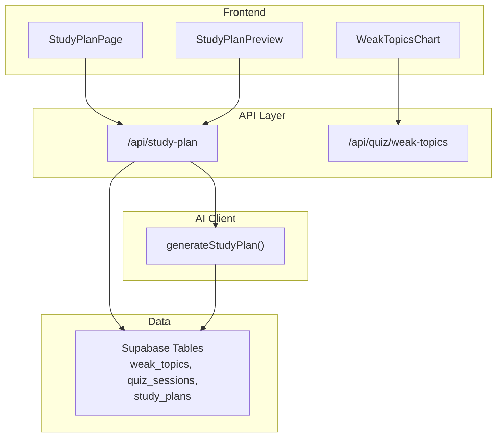
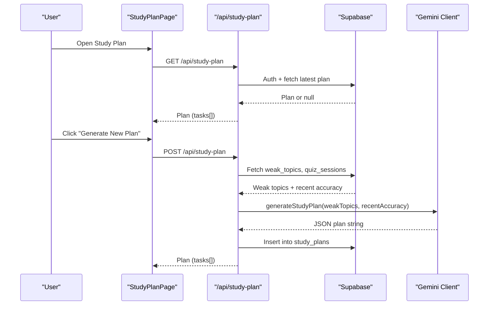
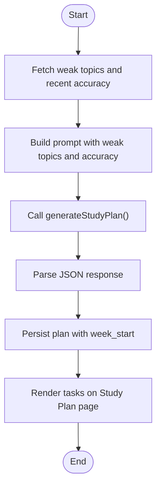
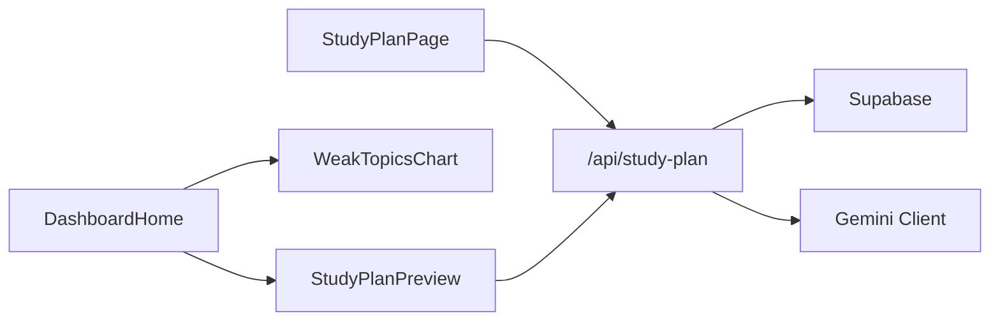

# Study Plan Generation

<cite>
**Referenced Files in This Document**
- [route.ts](file://Next-app/src/app/api/study-plan/route.ts)
- [client.ts](file://Next-app/src/lib/gemini/client.ts)
- [page.tsx](file://Next-app/src/app/(dashboard)/study-plan/page.tsx)
- [StudyPlanPreview.tsx](file://Next-app/src/components/dashboard/StudyPlanPreview.tsx)
- [WeakTopicsChart.tsx](file://Next-app/src/components/dashboard/WeakTopicsChart.tsx)
- [DashboardHome.tsx](file://Next-app/src/components/DashboardHome.tsx)
- [user.ts](file://Next-app/src/types/user.ts)
</cite>

## Table of Contents
1. [Introduction](#introduction)
2. [Project Structure](#project-structure)
3. [Core Components](#core-components)
4. [Architecture Overview](#architecture-overview)
5. [Detailed Component Analysis](#detailed-component-analysis)
6. [Dependency Analysis](#dependency-analysis)
7. [Performance Considerations](#performance-considerations)
8. [Troubleshooting Guide](#troubleshooting-guide)
9. [Conclusion](#conclusion)
10. [Appendices](#appendices)

## Introduction
This document explains the adaptive study plan generation system that creates personalized weekly schedules based on a user’s quiz performance and weak topics. It covers how the generateStudyPlan function works, how performance data is analyzed, and how scheduling algorithms allocate time across activities (read, quiz, review). It also documents Urdu content generation, customization options for different study habits and time commitments, and guidance for integrating with dashboard components to display plans effectively.

## Project Structure
The study plan feature spans API routes, an AI client, UI pages, and dashboard components:
- API route handles authentication, fetches weak topics and recent accuracy, calls the Gemini-based planner, persists results, and returns the plan.
- The Gemini client builds prompts with user performance data and returns JSON plans in Urdu.
- The study plan page displays tasks, supports toggling completion, and triggers regeneration.
- Dashboard preview shows upcoming tasks and links to the full plan.
- Weak topics chart visualizes error rates to inform planning.

**Diagram sources**
- [route.ts:5-77](file://Next-app/src/app/api/study-plan/route.ts#L5-L77)
- [client.ts:94-134](file://Next-app/src/lib/gemini/client.ts#L94-L134)
- [page.tsx:22-54](file://Next-app/src/app/(dashboard)/study-plan/page.tsx#L22-L54)
- [StudyPlanPreview.tsx:22-75](file://Next-app/src/components/dashboard/StudyPlanPreview.tsx#L22-L75)
- [WeakTopicsChart.tsx:8-50](file://Next-app/src/components/dashboard/WeakTopicsChart.tsx#L8-L50)

**Section sources**
- [route.ts:5-114](file://Next-app/src/app/api/study-plan/route.ts#L5-L114)
- [client.ts:94-134](file://Next-app/src/lib/gemini/client.ts#L94-L134)
- [page.tsx:22-163](file://Next-app/src/app/(dashboard)/study-plan/page.tsx#L22-L163)
- [StudyPlanPreview.tsx:22-75](file://Next-app/src/components/dashboard/StudyPlanPreview.tsx#L22-L75)
- [WeakTopicsChart.tsx:8-50](file://Next-app/src/components/dashboard/WeakTopicsChart.tsx#L8-L50)

## Core Components
- API route: Authenticates users, retrieves weak topics and recent accuracy, generates a plan via Gemini, persists it, and returns structured tasks.
- Gemini client: Builds a prompt including weak topics and recent accuracy, requests a 7-day plan in JSON with Urdu text, and returns the string response.
- Study plan page: Fetches or regenerates plans, renders tasks with activity badges, icons, and completion toggles.
- Dashboard preview: Shows first few tasks from the latest plan and navigates to the full plan.
- Weak topics chart: Visualizes top weak topics by error rate to support planning insights.

Key data structures:
- StudyPlanTask: day, topic, activity (read | quiz | review), estimatedMinutes, completed, summary.
- StudyPlan: id, userId, weekStart, tasks[], generatedAt.

**Section sources**
- [route.ts:5-114](file://Next-app/src/app/api/study-plan/route.ts#L5-L114)
- [client.ts:94-134](file://Next-app/src/lib/gemini/client.ts#L94-L134)
- [page.tsx:9-20](file://Next-app/src/app/(dashboard)/study-plan/page.tsx#L9-L20)
- [StudyPlanPreview.tsx:10-20](file://Next-app/src/components/dashboard/StudyPlanPreview.tsx#L10-L20)
- [user.ts:17-32](file://Next-app/src/types/user.ts#L17-L32)

## Architecture Overview
The flow begins when a user requests or refreshes their study plan. The API authenticates the user, aggregates weak topics and recent accuracy, and asks the Gemini model to produce a balanced weekly schedule. The result is stored and returned to the frontend for rendering.

**Diagram sources**
- [route.ts:5-77](file://Next-app/src/app/api/study-plan/route.ts#L5-L77)
- [client.ts:94-134](file://Next-app/src/lib/gemini/client.ts#L94-L134)
- [page.tsx:22-54](file://Next-app/src/app/(dashboard)/study-plan/page.tsx#L22-L54)

## Detailed Component Analysis

### API Route: /api/study-plan
Responsibilities:
- Authenticate user via Supabase.
- Retrieve weak topics ordered by wrong count.
- Compute recent accuracy from last five quiz sessions.
- Call generateStudyPlan with weak topics and recent accuracy.
- Parse JSON from model output.
- Persist plan with week start date.
- Return plan tasks to the client.

Error handling:
- Unauthorized responses if no user.
- Graceful fallbacks when no plan exists.
- Error logging and 500 responses on failures.

Week calculation:
- Determines current week start using the current day of week.

**Section sources**
- [route.ts:5-77](file://Next-app/src/app/api/study-plan/route.ts#L5-L77)
- [route.ts:80-114](file://Next-app/src/app/api/study-plan/route.ts#L80-L114)

### Gemini Client: generateStudyPlan
Inputs:
- weakTopics: array of { topic, wrongCount, totalCount }.
- recentAccuracy: percentage derived from recent sessions.
- hoursPerDay: default 2 hours/day used in prompt.

Prompt strategy:
- Summarizes weak topics with error percentages.
- Includes recent accuracy context.
- Requests a 7-day plan in JSON with fields: day, topic, activity, estimatedMinutes, completed, summary.
- Enforces Urdu language for all text.

Output:
- Returns a JSON string which the API parses into tasks.

Customization levers:
- hoursPerDay can be adjusted to reflect daily availability.
- Prompt emphasizes focusing more time on weaker topics and mixing activities.

**Section sources**
- [client.ts:94-134](file://Next-app/src/lib/gemini/client.ts#L94-L134)

### Study Plan Page: Display and Interactions
Features:
- Fetches existing plan or triggers generation.
- Renders tasks with activity labels, icons, and color-coded badges.
- Supports toggling task completion locally.
- Provides a button to regenerate plan via mutation.

Activity configuration:
- read: labeled in Urdu with blue theme.
- quiz: labeled in Urdu with green theme.
- review: labeled in Urdu with amber theme.

Time display:
- Shows estimatedMinutes per task in Urdu minute label.

**Section sources**
- [page.tsx:9-20](file://Next-app/src/app/(dashboard)/study-plan/page.tsx#L9-L20)
- [page.tsx:22-54](file://Next-app/src/app/(dashboard)/study-plan/page.tsx#L22-L54)
- [page.tsx:64-163](file://Next-app/src/app/(dashboard)/study-plan/page.tsx#L64-L163)

### Dashboard Integration: StudyPlanPreview and WeakTopicsChart
StudyPlanPreview:
- Displays up to three upcoming tasks from the latest plan.
- Links to the full study plan page.
- Uses activity labels and colors consistent with the plan page.

WeakTopicsChart:
- Visualizes top weak topics by error rate.
- Shows total attempts and incorrect counts.
- Helps users understand where to focus study time.

DashboardHome:
- Composes stats, weak topics, study plan preview, streak, and recent activity.
- Integrates weak topics and study plan preview side-by-side.

**Section sources**
- [StudyPlanPreview.tsx:22-75](file://Next-app/src/components/dashboard/StudyPlanPreview.tsx#L22-L75)
- [WeakTopicsChart.tsx:8-50](file://Next-app/src/components/dashboard/WeakTopicsChart.tsx#L8-L50)
- [DashboardHome.tsx:33-89](file://Next-app/src/components/DashboardHome.tsx#L33-L89)

### Weekly Plan Structure and Activity Types
Plan structure:
- Seven days of tasks, each with:
  - day: weekday name in Urdu.
  - topic: subject area to focus on.
  - activity: one of read, quiz, review.
  - estimatedMinutes: planned duration.
  - completed: boolean flag for progress tracking.
  - summary: short description in Urdu.

Activity types:
- read: focused reading or concept review.
- quiz: practice questions to reinforce learning.
- review: revisit previously studied material to consolidate memory.

Time allocation strategies:
- The model receives weak topics and recent accuracy to prioritize weaker areas.
- Mix of activities keeps engagement high while balancing input (read), assessment (quiz), and consolidation (review).

Urdu content generation:
- All plan text (days, summaries, labels) is requested in Urdu by the prompt.

**Section sources**
- [client.ts:94-134](file://Next-app/src/lib/gemini/client.ts#L94-L134)
- [page.tsx:9-20](file://Next-app/src/app/(dashboard)/study-plan/page.tsx#L9-L20)
- [StudyPlanPreview.tsx:10-20](file://Next-app/src/components/dashboard/StudyPlanPreview.tsx#L10-L20)

### Processing Weak Topic Data and Calculating Priorities
How weak topics are gathered:
- The API selects weak_topics for the authenticated user, ordered by wrong_count descending.
- Recent accuracy is computed from the last five quiz sessions’ accuracy values.

Priority signals:
- Higher wrong_count indicates greater need for attention.
- Error rate (wrong_count / total_count) informs intensity of focus.
- Recent accuracy provides a trend signal; lower recent accuracy may increase emphasis on foundational review.

Example processing steps:
- Fetch weak topics and sort by wrong_count.
- Compute average accuracy over recent sessions.
- Pass both to generateStudyPlan to shape the weekly distribution.

**Section sources**
- [route.ts:16-51](file://Next-app/src/app/api/study-plan/route.ts#L16-L51)
- [WeakTopicsChart.tsx:19-45](file://Next-app/src/components/dashboard/WeakTopicsChart.tsx#L19-L45)

### Generating Balanced Schedules
Balancing principles:
- Allocate more minutes to topics with higher error rates.
- Alternate between read, quiz, and review to avoid fatigue and improve retention.
- Keep daily load within the student’s available hours (default 2 hours/day in prompt).

Schedule generation flow:
- Input weak topics and recent accuracy.
- Model outputs a 7-day plan with varied activities and durations.
- Frontend renders tasks and allows marking completion.

**Diagram sources**
- [route.ts:16-77](file://Next-app/src/app/api/study-plan/route.ts#L16-L77)
- [client.ts:94-134](file://Next-app/src/lib/gemini/client.ts#L94-L134)
- [page.tsx:22-54](file://Next-app/src/app/(dashboard)/study-plan/page.tsx#L22-L54)

## Dependency Analysis
Components and their relationships:
- StudyPlanPage depends on the /api/study-plan endpoint for fetching and generating plans.
- The API route depends on Supabase for user data and persistence, and on the Gemini client for plan generation.
- DashboardHome composes WeakTopicsChart and StudyPlanPreview to present insights and next steps.
- Types define shared contracts for tasks and plans.

**Diagram sources**
- [page.tsx:22-54](file://Next-app/src/app/(dashboard)/study-plan/page.tsx#L22-L54)
- [route.ts:5-114](file://Next-app/src/app/api/study-plan/route.ts#L5-L114)
- [client.ts:94-134](file://Next-app/src/lib/gemini/client.ts#L94-L134)
- [DashboardHome.tsx:33-89](file://Next-app/src/components/DashboardHome.tsx#L33-L89)

**Section sources**
- [page.tsx:22-54](file://Next-app/src/app/(dashboard)/study-plan/page.tsx#L22-L54)
- [route.ts:5-114](file://Next-app/src/app/api/study-plan/route.ts#L5-L114)
- [client.ts:94-134](file://Next-app/src/lib/gemini/client.ts#L94-L134)
- [DashboardHome.tsx:33-89](file://Next-app/src/components/DashboardHome.tsx#L33-L89)

## Performance Considerations
- Caching: Use React Query keys to cache plans and invalidate on regeneration to reduce redundant API calls.
- Batching: Fetch weak topics and recent accuracy in a single server call to minimize latency.
- Rate limiting: Respect Gemini API limits; consider retry logic with exponential backoff for transient errors.
- Parsing robustness: Ensure JSON extraction handles markdown code blocks and malformed responses gracefully.
- UI responsiveness: Show loading states and disable regeneration during pending mutations.

[No sources needed since this section provides general guidance]

## Troubleshooting Guide
Common issues and resolutions:
- Unauthorized access: Ensure user is authenticated before calling endpoints.
- No plan found: If no plan exists, trigger generation; handle null responses gracefully.
- Gemini API errors: Validate environment variables for API key; implement retries and user-friendly messages.
- Invalid JSON: Add fallback parsing and log detailed errors for debugging.
- Week alignment: Confirm week_start calculation aligns with local timezone expectations.

**Section sources**
- [route.ts:12-14](file://Next-app/src/app/api/study-plan/route.ts#L12-L14)
- [route.ts:71-77](file://Next-app/src/app/api/study-plan/route.ts#L71-L77)
- [route.ts:99-113](file://Next-app/src/app/api/study-plan/route.ts#L99-L113)
- [client.ts:22-28](file://Next-app/src/lib/gemini/client.ts#L22-L28)

## Conclusion
The adaptive study plan system leverages user performance data to generate personalized, balanced weekly schedules in Urdu. By combining weak topic analysis, recent accuracy trends, and flexible time allocation, it delivers actionable plans that adapt to individual needs. Integration with dashboard components ensures visibility and encourages consistent engagement. With careful error handling and performance optimizations, the system remains reliable and responsive for learners preparing for competitive exams.

[No sources needed since this section summarizes without analyzing specific files]

## Appendices

### Customization Options
- Daily time commitment: Adjust hoursPerDay in the planner prompt to match user availability.
- Focus areas: Emphasize specific topics by increasing their representation in weak topics.
- Activity mix: Encourage more quizzes or reviews based on learning preferences.
- Language: All plan text is generated in Urdu; ensure locale settings are consistent.

**Section sources**
- [client.ts:94-134](file://Next-app/src/lib/gemini/client.ts#L94-L134)

### Example Scenarios
- High error rate in a topic: Increase allocated minutes and include multiple review sessions across the week.
- Low recent accuracy: Add foundational read sessions before quizzes to rebuild understanding.
- Limited daily time: Reduce estimatedMinutes per task and concentrate on highest-priority topics.

[No sources needed since this section provides conceptual examples]

### Integration Tips for Dashboard
- Display upcoming tasks in StudyPlanPreview to drive action.
- Use WeakTopicsChart to highlight areas needing attention.
- Provide quick actions to regenerate plans after significant performance changes.

**Section sources**
- [StudyPlanPreview.tsx:22-75](file://Next-app/src/components/dashboard/StudyPlanPreview.tsx#L22-L75)
- [WeakTopicsChart.tsx:8-50](file://Next-app/src/components/dashboard/WeakTopicsChart.tsx#L8-L50)
- [DashboardHome.tsx:33-89](file://Next-app/src/components/DashboardHome.tsx#L33-L89)