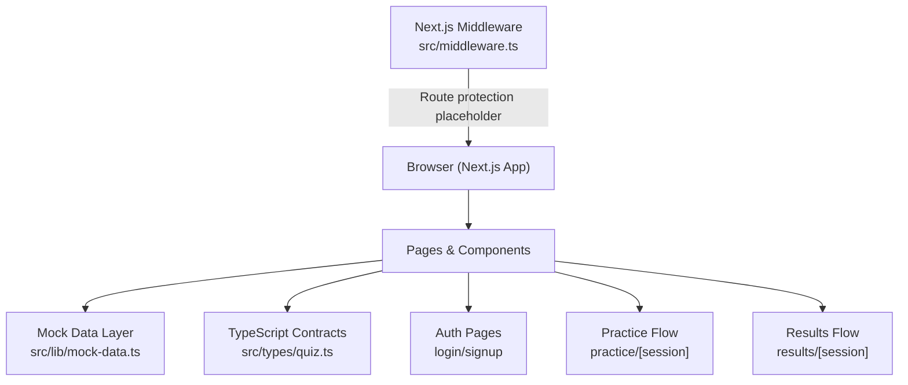
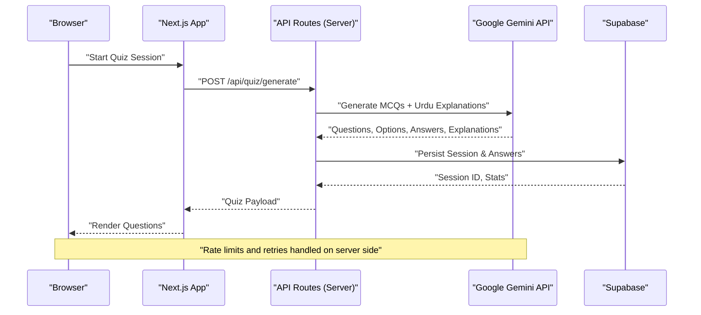
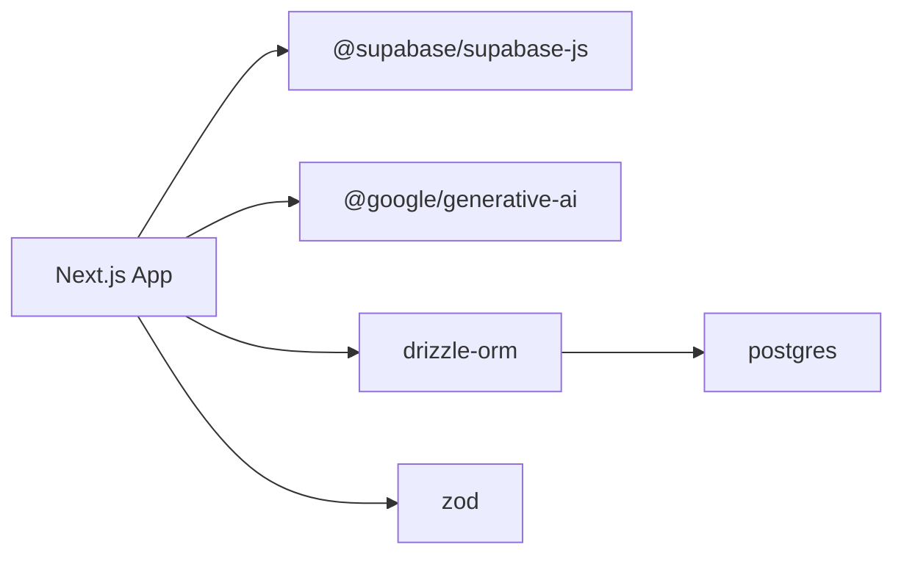

# API Reference

<cite>
**Referenced Files in This Document**
- [README.md](file://README.md)
- [package.json](file://package.json)
- [src/types/quiz.ts](file://src/types/quiz.ts)
- [src/lib/mock-data.ts](file://src/lib/mock-data.ts)
- [src/middleware.ts](file://src/middleware.ts)
- [src/components/auth/AuthProvider.tsx](file://src/components/auth/AuthProvider.tsx)
- [src/app/(auth)/login/page.tsx](file://src/app/(auth)/login/page.tsx)
- [src/app/(auth)/signup/page.tsx](file://src/app/(auth)/signup/page.tsx)
- [src/app/results/[session]/page.tsx](file://src/app/results/[session]/page.tsx)
- [src/app/practice/[session]/page.tsx](file://src/app/practice/[session]/page.tsx)
</cite>

## Table of Contents
1. Introduction
2. Project Structure
3. Core Components
4. Architecture Overview
5. Detailed Component Analysis
6. Dependency Analysis
7. Performance Considerations
8. Troubleshooting Guide
9. Conclusion
10. Appendices

## Introduction
This document provides a comprehensive API reference for MedAce AI’s internal APIs and external integrations. It covers:
- Mock data endpoints used during development and testing for quiz generation, user profile management, and progress tracking.
- Google Gemini integration points for AI-powered question generation and Urdu explanation creation, including request/response schemas and error handling guidance.
- Supabase usage for authentication, database operations, and file storage.
- TypeScript interfaces that define all API contracts.
- Authentication requirements, rate limiting considerations, and error response patterns.
- Code examples demonstrating proper usage patterns and integration approaches.

## Project Structure
MedAce AI is a Next.js application with a frontend-first architecture. The current implementation uses client-side mock data for development and includes placeholders for server-side API routes and middleware to integrate Supabase and Google Gemini.

**Diagram sources**
- [src/lib/mock-data.ts:1-313](file://src/lib/mock-data.ts#L1-L313)
- [src/types/quiz.ts:1-107](file://src/types/quiz.ts#L1-L107)
- [src/middleware.ts:1-41](file://src/middleware.ts#L1-L41)
- [src/app/(auth)/login/page.tsx:1-91](file://src/app/(auth)/login/page.tsx#L1-L91)
- [src/app/(auth)/signup/page.tsx:1-103](file://src/app/(auth)/signup/page.tsx#L1-L103)
- [src/app/practice/[session]/page.tsx:195-226](file://src/app/practice/[session]/page.tsx#L195-L226)
- [src/app/results/[session]/page.tsx:258-294](file://src/app/results/[session]/page.tsx#L258-L294)

**Section sources**
- [README.md:228-244](file://README.md#L228-L244)
- [package.json:11-27](file://package.json#L11-L27)
- [src/middleware.ts:14-35](file://src/middleware.ts#L14-L35)

## Core Components
- Mock Data API: Provides static datasets for topics, questions, sessions, study plans, dashboard stats, recent sessions, and user profiles. Used by practice and results pages to simulate real behavior.
- Type Contracts: Centralized TypeScript interfaces defining the shape of all API payloads and responses.
- Authentication Placeholder: Frontend auth context currently returns a mock user; middleware contains a commented block to enforce protected routes via Supabase session cookies when integrated.
- External Integrations: Environment variables indicate planned use of Supabase (Auth, Database, Storage) and Google Gemini (question generation and Urdu explanations).

Key responsibilities:
- Quiz Generation: Uses mock questions and sessions; future server-side logic will call Gemini to generate MCQs grounded in textbook content.
- User Profile Management: Mock profile and chapter performance; future backend will persist via Supabase.
- Progress Tracking: Tracks answers, time taken, correctness; future backend will store sessions and update weak-spot metrics.

**Section sources**
- [src/lib/mock-data.ts:15-313](file://src/lib/mock-data.ts#L15-L313)
- [src/types/quiz.ts:5-106](file://src/types/quiz.ts#L5-L106)
- [src/components/auth/AuthProvider.tsx:31-57](file://src/components/auth/AuthProvider.tsx#L31-L57)
- [src/middleware.ts:14-35](file://src/middleware.ts#L14-L35)

## Architecture Overview
The intended architecture integrates three main layers:
- Frontend: Next.js app with React components and pages.
- Server-Side API Routes: To be implemented for secure calls to Gemini and Supabase.
- External Services: Supabase (Auth, Database, Storage) and Google Gemini (text generation and embeddings).

**Diagram sources**
- [README.md:25-55](file://README.md#L25-L55)
- [package.json:11-27](file://package.json#L11-L27)

## Detailed Component Analysis

### Mock Data API Endpoints
These are not HTTP endpoints but module exports consumed by pages to simulate API behavior. They provide consistent shapes matching the TypeScript contracts.

- Topics
  - Purpose: List of MDCAT Biology chapters with category, subtopics count, accuracy, and weakness flags.
  - Response Shape: Array of Topic objects.
  - Usage: Dashboard and topic selection.
  - Example Path: [mockTopics:15-31](file://src/lib/mock-data.ts#L15-L31)

- Weak Topics
  - Purpose: Identify areas needing more practice based on error and attempt counts.
  - Response Shape: Array of WeakTopic objects.
  - Usage: Adaptive planning and insights.
  - Example Path: [mockWeakTopics:36-42](file://src/lib/mock-data.ts#L36-L42)

- Dashboard Stats
  - Purpose: High-level metrics like total questions, weekly activity, accuracy, sessions completed, streak.
  - Response Shape: DashboardStats object.
  - Usage: Dashboard overview.
  - Example Path: [mockDashboardStats:47-53](file://src/lib/mock-data.ts#L47-L53)

- Recent Sessions
  - Purpose: History of quiz sessions with scores and dates.
  - Response Shape: Array of RecentSession objects.
  - Usage: Recent activity feed.
  - Example Path: [mockRecentSessions:58-64](file://src/lib/mock-data.ts#L58-L64)

- Questions
  - Purpose: MCQ set for a session with options, correct answer, English and Urdu explanations, difficulty, and topic.
  - Response Shape: Array of Question objects.
  - Usage: Practice page rendering and evaluation.
  - Example Path: [mockQuestions:69-210](file://src/lib/mock-data.ts#L69-L210)

- Quiz Session
  - Purpose: In-progress or completed session metadata, questions, and answers.
  - Response Shape: QuizSession object.
  - Usage: Practice flow state and results display.
  - Example Paths: [mockQuizSession:215-227](file://src/lib/mock-data.ts#L215-L227), [mockCompletedSession:232-256](file://src/lib/mock-data.ts#L232-L256)

- Study Plan
  - Purpose: Weekly plan with daily topics, estimated minutes, status, difficulty, and question counts.
  - Response Shape: StudyPlan object.
  - Usage: Study-plan page and adaptive recommendations.
  - Example Path: [mockStudyPlan:261-281](file://src/lib/mock-data.ts#L261-L281)

- User Profile
  - Purpose: User identity, membership date, totals, overall accuracy, best/worst topics, longest streak, chapter performance.
  - Response Shape: UserProfile object.
  - Usage: Profile page and analytics.
  - Example Path: [mockUserProfile:286-312](file://src/lib/mock-data.ts#L286-L312)

Authentication Requirements:
- Currently, mock data is accessible without authentication in development. When wired to backend, protect these endpoints using Supabase session tokens.

Rate Limiting:
- Not implemented in mock layer. Apply server-side rate limiting when exposing API routes.

Error Responses:
- Mock layer does not return errors. Implement standardized error envelopes on server routes (e.g., { error: string, code: number }).

Code Examples:
- Consuming mock data in pages:
  - Import from src/lib/mock-data.ts and bind to local state or TanStack Query.
  - See usage in practice and results pages for rendering questions and toggling Urdu explanations.

**Section sources**
- [src/lib/mock-data.ts:15-313](file://src/lib/mock-data.ts#L15-L313)
- [src/types/quiz.ts:5-106](file://src/types/quiz.ts#L5-L106)
- [src/app/practice/[session]/page.tsx:195-226](file://src/app/practice/[session]/page.tsx#L195-L226)
- [src/app/results/[session]/page.tsx:258-294](file://src/app/results/[session]/page.tsx#L258-L294)

### Google Gemini Integration
Purpose:
- Generate high-quality MCQs grounded in textbook content.
- Create bilingual explanations (English and Urdu) tailored to student needs.

Request Schema (server-side):
- Input fields:
  - topic: string
  - difficulty: "Easy" | "Medium" | "Hard" | "Mixed"
  - numQuestions: number
  - language: "en" | "ur" | "mixed"
  - contextChunks: string[] (optional, retrieved from RAG pipeline)

Response Schema (server-side):
- Output fields:
  - questions: Question[]
  - sessionId: string
  - generatedAt: string (ISO timestamp)

Error Handling:
- Handle network timeouts and rate limits with retries and backoff.
- Validate model output against Zod schema before returning to client.
- Return structured errors with codes and messages.

Integration Notes:
- Use environment variable GEMINI_API_KEY securely on the server.
- Cache frequently requested topics to reduce API costs.
- Stream responses if supported to improve perceived latency.

Code Examples:
- Server function calling Gemini to generate questions and explanations.
- Client calling /api/quiz/generate and rendering results.

**Section sources**
- [README.md:228-244](file://README.md#L228-L244)
- [package.json:11-27](file://package.json#L11-L27)

### Supabase Integration
Purpose:
- Authentication (email/password and Google OAuth).
- Database operations (sessions, answers, user profiles, weak-topic metrics).
- File storage (user avatars, documents).

Authentication:
- Use Supabase Auth with email/password and Google OAuth flows.
- Store session in cookies and validate via middleware for protected routes.

Database Operations:
- Persist quiz sessions, answers, and progress metrics.
- Update weak-topic scores and chapter performance arrays.

File Storage:
- Upload and retrieve user avatars and study materials.

Environment Variables:
- NEXT_PUBLIC_SUPABASE_URL
- NEXT_PUBLIC_SUPABASE_ANON_KEY
- SUPABASE_SERVICE_ROLE_KEY
- DATABASE_URL

Rate Limiting:
- Apply server-side rate limiting on Supabase calls where appropriate.

Error Handling:
- Normalize Supabase errors into standard API error responses.

Code Examples:
- Initialize Supabase client in server functions.
- Create session and record answers.
- Fetch user profile and stats.

**Section sources**
- [README.md:228-244](file://README.md#L228-L244)
- [src/middleware.ts:22-33](file://src/middleware.ts#L22-L33)
- [src/components/auth/AuthProvider.tsx:31-57](file://src/components/auth/AuthProvider.tsx#L31-L57)

### Authentication and Route Protection
Current State:
- Frontend auth context returns a mock user for development.
- Middleware defines protected routes and includes a commented block to enforce Supabase session checks.

Protected Routes:
- /dashboard, /practice, /results, /study-plan, /profile

Public Routes:
- /, /login, /signup

Implementation Guidance:
- Enable cookie-based session validation in middleware.
- Redirect unauthenticated users to login with redirect parameter.

Code Examples:
- Login and signup pages include Google OAuth buttons and forms ready for Supabase integration.

**Section sources**
- [src/middleware.ts:4-35](file://src/middleware.ts#L4-L35)
- [src/app/(auth)/login/page.tsx:25-75](file://src/app/(auth)/login/page.tsx#L25-L75)
- [src/app/(auth)/signup/page.tsx:25-87](file://src/app/(auth)/signup/page.tsx#L25-L87)
- [src/components/auth/AuthProvider.tsx:31-57](file://src/components/auth/AuthProvider.tsx#L31-L57)

## Dependency Analysis
External dependencies relevant to APIs and integrations:
- @supabase/supabase-js and @supabase/ssr for authentication and SSR support.
- @google/generative-ai for Gemini integration.
- drizzle-orm and postgres for database access.
- zod for runtime validation of API payloads.

**Diagram sources**
- [package.json:11-27](file://package.json#L11-L27)

**Section sources**
- [package.json:11-27](file://package.json#L11-L27)

## Performance Considerations
- Caching: Cache Gemini-generated questions per topic/difficulty to reduce cost and latency.
- Pagination: Paginate large datasets (questions, sessions) to minimize payload size.
- Streaming: Stream Gemini responses where possible to improve UX.
- Debouncing: Debounce input changes in search/filter features.
- Error Retries: Implement exponential backoff for external API calls.

[No sources needed since this section provides general guidance]

## Troubleshooting Guide
Common Issues and Resolutions:
- Missing Environment Variables: Ensure NEXT_PUBLIC_SUPABASE_URL, NEXT_PUBLIC_SUPABASE_ANON_KEY, SUPABASE_SERVICE_ROLE_KEY, DATABASE_URL, and GEMINI_API_KEY are set.
- Authentication Failures: Verify Supabase project settings and OAuth providers configured. Check middleware redirection logic.
- Gemini Rate Limits: Implement retry with backoff and fallback to cached questions.
- Database Errors: Validate connection strings and permissions; log detailed errors server-side.

Validation:
- Use Zod to validate incoming requests and outgoing responses.
- Log validation failures with field-specific messages.

**Section sources**
- [README.md:228-244](file://README.md#L228-L244)
- [src/middleware.ts:22-33](file://src/middleware.ts#L22-L33)

## Conclusion
MedAce AI’s current implementation provides a robust mock data layer and type-safe contracts for development. The architecture is designed to integrate Supabase for authentication, database, and storage, and Google Gemini for AI-powered question generation and bilingual explanations. When server-side API routes are implemented, they should enforce authentication, handle rate limiting, and provide standardized error responses. The TypeScript interfaces ensure consistency across the stack and facilitate seamless transitions from mock to production APIs.

[No sources needed since this section summarizes without analyzing specific files]

## Appendices

### TypeScript Interfaces Summary
- Topic: Chapter metadata with category, subtopics, accuracy, weakness flag.
- Question: MCQ with options, correct answer, explanations in English and Urdu, difficulty, topic.
- UserAnswer: Answer record with selected option, correctness, and time taken.
- QuizSession: Session metadata, questions, answers, score, status.
- WeakTopic: Topic weakness metrics.
- StudyPlanDay: Daily plan entry with topics, duration, status, difficulty, question count.
- StudyPlan: Weekly plan with rationale and insights.
- DashboardStats: Aggregated metrics for dashboard.
- RecentSession: Historical session entries.
- UserProfile: User identity and performance summary.

**Section sources**
- [src/types/quiz.ts:5-106](file://src/types/quiz.ts#L5-L106)

### Mock Data Usage Patterns
- Practice Flow:
  - Load mockQuizSession and render questions.
  - Toggle Urdu explanations per question.
  - Record answers and compute score.
- Results Flow:
  - Display mockCompletedSession with answers and explanations.
  - Show weak-spot updates and insights.

**Section sources**
- [src/lib/mock-data.ts:215-256](file://src/lib/mock-data.ts#L215-L256)
- [src/app/practice/[session]/page.tsx:195-226](file://src/app/practice/[session]/page.tsx#L195-L226)
- [src/app/results/[session]/page.tsx:258-294](file://src/app/results/[session]/page.tsx#L258-L294)

### Environment Configuration
Required environment variables:
- NEXT_PUBLIC_SUPABASE_URL
- NEXT_PUBLIC_SUPABASE_ANON_KEY
- SUPABASE_SERVICE_ROLE_KEY
- DATABASE_URL
- GEMINI_API_KEY
- NEXT_PUBLIC_APP_URL

**Section sources**
- [README.md:228-244](file://README.md#L228-L244)