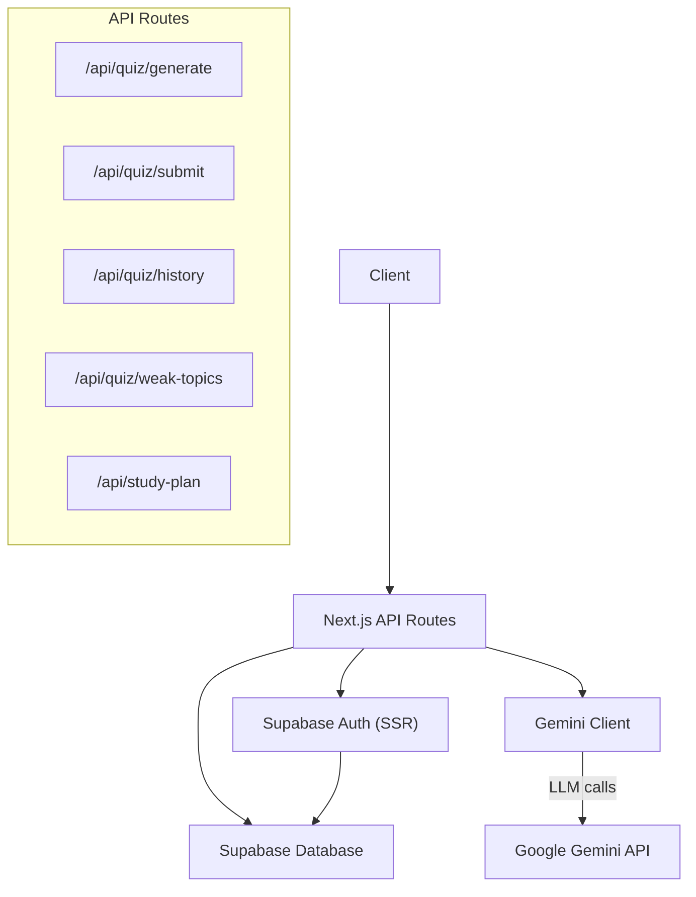
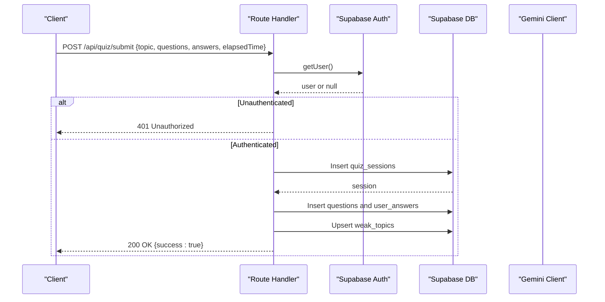
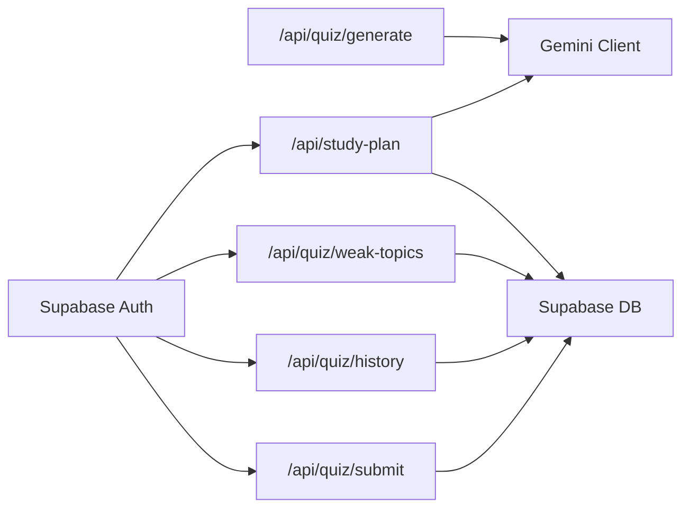

# API Reference

<cite>
**Referenced Files in This Document**
- [route.ts](file://Next-app/src/app/api/quiz/generate/route.ts)
- [route.ts](file://Next-app/src/app/api/quiz/submit/route.ts)
- [route.ts](file://Next-app/src/app/api/quiz/history/route.ts)
- [route.ts](file://Next-app/src/app/api/quiz/weak-topics/route.ts)
- [route.ts](file://Next-app/src/app/api/study-plan/route.ts)
- [client.ts](file://Next-app/src/lib/gemini/client.ts)
- [middleware.ts](file://Next-app/src/middleware.ts)
- [middleware.ts](file://Next-app/src/lib/supabase/middleware.ts)
- [quiz.ts](file://Next-app/src/types/quiz.ts)
</cite>

## Table of Contents
1. Introduction
2. Project Structure
3. Core Components
4. Architecture Overview
5. Detailed Component Analysis
6. Dependency Analysis
7. Performance Considerations
8. Troubleshooting Guide
9. Conclusion
10. Appendices

## Introduction
This document provides comprehensive API reference documentation for the REST endpoints exposed by the Next.js application. It covers quiz generation, submission, history retrieval, weak topic analysis, and study plan endpoints. For each endpoint, you will find HTTP methods, URL patterns, request/response schemas, authentication requirements, error codes, parameter specifications, example payloads, status codes, and error handling patterns. It also includes client implementation guidelines, rate limiting considerations, and best practices for consuming these APIs securely and efficiently.

## Project Structure
The API is implemented using Next.js App Router under src/app/api. Each route file defines handlers for specific endpoints:
- Quiz endpoints: generate, submit, history, weak-topics
- Study plan endpoint: generate and retrieve

Authentication is handled via Supabase SSR middleware that injects user context into server-side routes. External AI capabilities are provided through a Gemini client module.

**Diagram sources**
- [route.ts:4-31](file://Next-app/src/app/api/quiz/generate/route.ts#L4-L31)
- [route.ts:4-112](file://Next-app/src/app/api/quiz/submit/route.ts#L4-L112)
- [route.ts:4-32](file://Next-app/src/app/api/quiz/history/route.ts#L4-L32)
- [route.ts:4-32](file://Next-app/src/app/api/quiz/weak-topics/route.ts#L4-L32)
- [route.ts:5-114](file://Next-app/src/app/api/study-plan/route.ts#L5-L114)
- [client.ts:6-28](file://Next-app/src/lib/gemini/client.ts#L6-L28)
- [middleware.ts:4-6](file://Next-app/src/middleware.ts#L4-L6)
- [middleware.ts:4-67](file://Next-app/src/lib/supabase/middleware.ts#L4-L67)

**Section sources**
- [route.ts:4-31](file://Next-app/src/app/api/quiz/generate/route.ts#L4-L31)
- [route.ts:4-112](file://Next-app/src/app/api/quiz/submit/route.ts#L4-L112)
- [route.ts:4-32](file://Next-app/src/app/api/quiz/history/route.ts#L4-L32)
- [route.ts:4-32](file://Next-app/src/app/api/quiz/weak-topics/route.ts#L4-L32)
- [route.ts:5-114](file://Next-app/src/app/api/study-plan/route.ts#L5-L114)
- [client.ts:6-28](file://Next-app/src/lib/gemini/client.ts#L6-L28)
- [middleware.ts:4-6](file://Next-app/src/middleware.ts#L4-L6)
- [middleware.ts:4-67](file://Next-app/src/lib/supabase/middleware.ts#L4-L67)

## Core Components
- Authentication Middleware: Ensures requests to protected routes carry a valid session and enforces redirects for unauthenticated users on protected pages.
- Supabase Integration: Provides authenticated database access for storing and retrieving quiz sessions, questions, answers, weak topics, and study plans.
- Gemini Client: Interfaces with Google Gemini to generate questions, explanations, and personalized study plans based on user performance data.
- Type Definitions: Define shared shapes for questions, answers, sessions, and setup configurations used across endpoints.

Key responsibilities:
- Validate inputs and enforce required fields
- Authenticate users before persisting or reading personal data
- Generate content via LLM and parse structured JSON responses
- Persist results and update analytics (e.g., weak topics)

**Section sources**
- [middleware.ts:4-67](file://Next-app/src/lib/supabase/middleware.ts#L4-L67)
- [client.ts:30-75](file://Next-app/src/lib/gemini/client.ts#L30-L75)
- [client.ts:94-134](file://Next-app/src/lib/gemini/client.ts#L94-L134)
- [quiz.ts:1-47](file://Next-app/src/types/quiz.ts#L1-L47)

## Architecture Overview
The API follows a layered architecture:
- Route handlers receive HTTP requests, validate inputs, and enforce authentication.
- Business logic interacts with Supabase for persistence and with Gemini for content generation.
- Responses are standardized JSON objects with consistent error structures.

**Diagram sources**
- [route.ts:4-112](file://Next-app/src/app/api/quiz/submit/route.ts#L4-L112)
- [middleware.ts:4-67](file://Next-app/src/lib/supabase/middleware.ts#L4-L67)

## Detailed Component Analysis

### Endpoint: Generate Questions
- Method: POST
- URL: /api/quiz/generate
- Authentication: Not enforced at route level; recommended to protect via middleware if needed.
- Request Body:
  - topic: string (required)
  - questionCount: number (required)
  - difficulty: string (optional; default "medium")
  - weakTopics: string[] (optional)
- Response: Array of Question objects
- Status Codes:
  - 200 OK: Successful generation
  - 400 Bad Request: Missing required fields
  - 500 Internal Server Error: Generation failure
- Error Handling: Returns a JSON object with an error message on failure.

Example Request:
{
  "topic": "Anatomy",
  "questionCount": 5,
  "difficulty": "medium",
  "weakTopics": ["Musculoskeletal", "Cardiovascular"]
}

Example Response:
[
  {
    "id": "q1",
    "questionText": "...",
    "options": ["A", "B", "C", "D"],
    "correctAnswer": 0,
    "explanation": "...",
    "topic": "Anatomy",
    "difficulty": "medium"
  }
]

Notes:
- The Gemini client enforces returning a JSON array of questions. If parsing fails, an error is thrown.

**Section sources**
- [route.ts:4-31](file://Next-app/src/app/api/quiz/generate/route.ts#L4-L31)
- [client.ts:30-75](file://Next-app/src/lib/gemini/client.ts#L30-L75)
- [quiz.ts:1-9](file://Next-app/src/types/quiz.ts#L1-L9)

### Endpoint: Submit Quiz Results
- Method: POST
- URL: /api/quiz/submit
- Authentication: Required (user must be authenticated).
- Request Body:
  - topic: string
  - questions: Question[]
  - answers: UserAnswer[]
  - elapsedTime: number (seconds)
- Response: { success: boolean }
- Status Codes:
  - 200 OK: Submission successful
  - 401 Unauthorized: No active session
  - 500 Internal Server Error: Persistence failure
- Data Stored:
  - quiz_sessions: user_id, topic, question_count, score, accuracy, started_at, completed_at
  - questions: session_id, question_text, options, correct_answer, explanation, topic, difficulty
  - user_answers: session_id, question_id, selected_answer, is_correct, time_taken
  - weak_topics: upsert per topic with wrong_count, total_count, last_updated

Example Request:
{
  "topic": "Physiology",
  "questions": [
    {
      "id": "q1",
      "questionText": "...",
      "options": ["A", "B", "C", "D"],
      "correctAnswer": 1,
      "explanation": "...",
      "topic": "Physiology",
      "difficulty": "hard"
    }
  ],
  "answers": [
    {
      "questionId": "q1",
      "selectedAnswer": 1,
      "isCorrect": true,
      "timeTaken": 12
    }
  ],
  "elapsedTime": 12
}

Example Response:
{
  "success": true
}

Error Handling:
- On missing user: returns 401 with error message.
- On DB errors: logs and returns 500 with error message.

**Section sources**
- [route.ts:4-112](file://Next-app/src/app/api/quiz/submit/route.ts#L4-L112)
- [quiz.ts:11-16](file://Next-app/src/types/quiz.ts#L11-L16)
- [quiz.ts:18-27](file://Next-app/src/types/quiz.ts#L18-L27)

### Endpoint: Get Quiz History
- Method: GET
- URL: /api/quiz/history
- Authentication: Required (user must be authenticated).
- Query Parameters: None
- Response: Array of quiz sessions (limited to recent 50), ordered by start time descending.
- Status Codes:
  - 200 OK: Success
  - 401 Unauthorized: No active session
  - 500 Internal Server Error: Unexpected error (returns empty array)

Example Response:
[
  {
    "id": "session1",
    "user_id": "user123",
    "topic": "Biochemistry",
    "question_count": 10,
    "score": 8,
    "accuracy": 80,
    "started_at": "2024-01-01T10:00:00Z",
    "completed_at": "2024-01-01T10:15:00Z"
  }
]

**Section sources**
- [route.ts:4-32](file://Next-app/src/app/api/quiz/history/route.ts#L4-L32)

### Endpoint: Get Weak Topics
- Method: GET
- URL: /api/quiz/weak-topics
- Authentication: Required (user must be authenticated).
- Query Parameters: None
- Response: Array of weak topics for the current user, limited to top 10 by wrong count.
- Status Codes:
  - 200 OK: Success
  - 401 Unauthorized: No active session
  - 500 Internal Server Error: Unexpected error (returns empty array)

Example Response:
[
  {
    "user_id": "user123",
    "topic": "Neuroanatomy",
    "wrong_count": 5,
    "total_count": 10,
    "last_updated": "2024-01-01T12:00:00Z"
  }
]

**Section sources**
- [route.ts:4-32](file://Next-app/src/app/api/quiz/weak-topics/route.ts#L4-L32)

### Endpoint: Generate Study Plan
- Method: POST
- URL: /api/study-plan
- Authentication: Required (user must be authenticated).
- Request Body: None (uses current user’s weak topics and recent accuracy)
- Response: Study plan JSON object containing tasks array
- Status Codes:
  - 200 OK: Plan generated and saved
  - 401 Unauthorized: No active session
  - 500 Internal Server Error: Generation or persistence failure
- Behavior:
  - Fetches weak topics and recent accuracy for the user
  - Generates a weekly plan via Gemini
  - Saves plan to study_plans table with week_start and plan_data
  - Returns parsed plan data

Example Response:
{
  "tasks": [
    {
      "day": "Monday",
      "topic": "Neuroanatomy",
      "activity": "quiz",
      "estimatedMinutes": 60,
      "completed": false,
      "summary": "..."
    }
  ]
}

**Section sources**
- [route.ts:5-114](file://Next-app/src/app/api/study-plan/route.ts#L5-L114)
- [client.ts:94-134](file://Next-app/src/lib/gemini/client.ts#L94-L134)

### Endpoint: Retrieve Latest Study Plan
- Method: GET
- URL: /api/study-plan
- Authentication: Required (user must be authenticated).
- Query Parameters: None
- Response: Latest study plan for the user or null if none exists
- Status Codes:
  - 200 OK: Success
  - 401 Unauthorized: No active session
  - 500 Internal Server Error: Unexpected error (returns null)

Example Response:
{
  "id": "plan1",
  "userId": "user123",
  "weekStart": "2024-01-01",
  "tasks": [...],
  "generatedAt": "2024-01-01T12:00:00Z"
}

**Section sources**
- [route.ts:80-114](file://Next-app/src/app/api/study-plan/route.ts#L80-L114)

## Dependency Analysis
- Route handlers depend on:
  - Supabase SSR client for authentication and database operations
  - Gemini client for content generation
- Authentication flow:
  - Global middleware updates session and enforces redirects for protected UI routes
  - API routes check user presence via Supabase auth
- Data models:
  - Types define shared structures for questions, answers, sessions, and setup configuration

**Diagram sources**
- [route.ts:4-31](file://Next-app/src/app/api/quiz/generate/route.ts#L4-L31)
- [route.ts:4-112](file://Next-app/src/app/api/quiz/submit/route.ts#L4-L112)
- [route.ts:4-32](file://Next-app/src/app/api/quiz/history/route.ts#L4-L32)
- [route.ts:4-32](file://Next-app/src/app/api/quiz/weak-topics/route.ts#L4-L32)
- [route.ts:5-114](file://Next-app/src/app/api/study-plan/route.ts#L5-L114)
- [client.ts:6-28](file://Next-app/src/lib/gemini/client.ts#L6-L28)
- [middleware.ts:4-67](file://Next-app/src/lib/supabase/middleware.ts#L4-L67)

**Section sources**
- [client.ts:30-75](file://Next-app/src/lib/gemini/client.ts#L30-L75)
- [client.ts:94-134](file://Next-app/src/lib/gemini/client.ts#L94-L134)
- [quiz.ts:1-47](file://Next-app/src/types/quiz.ts#L1-L47)

## Performance Considerations
- Rate Limiting:
  - No explicit rate limiting is implemented in the API routes. Consider adding middleware-based throttling to prevent abuse and manage external API costs (Gemini).
- Caching:
  - Cache repeated queries for weak topics and study plans where appropriate to reduce database load.
- Payload Size:
  - Keep request payloads minimal; paginate history and weak topics if datasets grow large.
- External Calls:
  - Gemini calls can be slow; implement timeouts and retries with exponential backoff for robustness.
- Database Queries:
  - Use indexes on frequently queried columns (e.g., user_id, started_at) to optimize performance.

[No sources needed since this section provides general guidance]

## Troubleshooting Guide
Common issues and resolutions:
- 401 Unauthorized:
  - Ensure the client sends a valid session cookie or token when calling protected endpoints.
  - Verify Supabase environment variables are configured correctly.
- 400 Bad Request:
  - Validate required fields in the request body (e.g., topic and questionCount for generate).
- 500 Internal Server Error:
  - Check server logs for errors from Gemini API or database operations.
  - Confirm network connectivity and API keys.

Error response pattern:
- Errors return a JSON object with an error field describing the issue.

**Section sources**
- [route.ts:4-31](file://Next-app/src/app/api/quiz/generate/route.ts#L4-L31)
- [route.ts:4-112](file://Next-app/src/app/api/quiz/submit/route.ts#L4-L112)
- [route.ts:4-32](file://Next-app/src/app/api/quiz/history/route.ts#L4-L32)
- [route.ts:4-32](file://Next-app/src/app/api/quiz/weak-topics/route.ts#L4-L32)
- [route.ts:5-114](file://Next-app/src/app/api/study-plan/route.ts#L5-L114)

## Conclusion
The API provides a cohesive set of endpoints for generating quizzes, submitting results, retrieving history, analyzing weak topics, and creating personalized study plans. Authentication is enforced on sensitive endpoints via Supabase, and content generation leverages Gemini for dynamic, tailored outputs. Implement rate limiting, caching, and robust error handling to ensure reliability and scalability. Follow the documented schemas and status codes for consistent client integration.

[No sources needed since this section summarizes without analyzing specific files]

## Appendices

### Authentication Methods
- Session-based authentication via Supabase SSR middleware ensures user context is available in server-side routes.
- Protected routes verify user presence before processing requests.

**Section sources**
- [middleware.ts:4-67](file://Next-app/src/lib/supabase/middleware.ts#L4-L67)
- [middleware.ts:4-6](file://Next-app/src/middleware.ts#L4-L6)

### Data Validation and Security Considerations
- Input validation:
  - Enforce required fields in request bodies (e.g., topic, questionCount).
  - Validate types and ranges (e.g., difficulty values, question counts).
- Security:
  - Always authenticate before accessing or modifying user-specific data.
  - Sanitize and validate external LLM outputs before trusting them.
  - Protect API keys and secrets via environment variables.

**Section sources**
- [route.ts:4-31](file://Next-app/src/app/api/quiz/generate/route.ts#L4-L31)
- [client.ts:6-28](file://Next-app/src/lib/gemini/client.ts#L6-L28)

### Client Implementation Guidelines
- Base URL: Use your deployed Next.js app base URL.
- Headers:
  - Content-Type: application/json
  - Cookie: Include session cookies for authenticated endpoints.
- Retry Logic:
  - Implement retries for transient failures (network or 5xx errors).
- Error Handling:
  - Handle 401 by redirecting to login or refreshing session.
  - Handle 400 by prompting users to correct input.
  - Handle 500 by showing a generic error and logging details.

[No sources needed since this section provides general guidance]