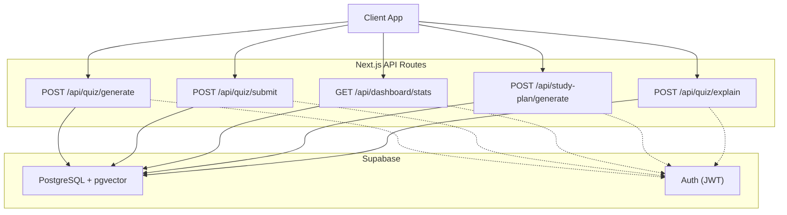
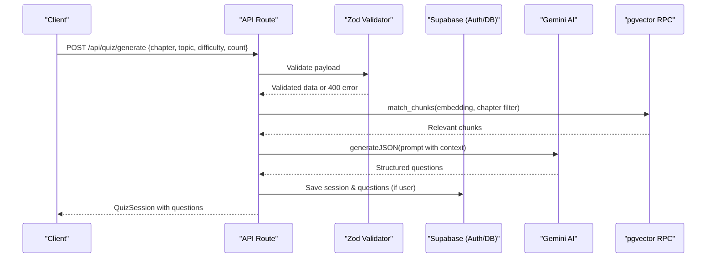
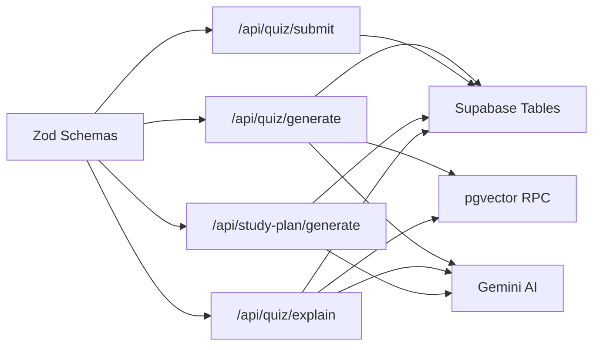

# API Reference

<cite>
**Referenced Files in This Document**
- [route.ts](file://src/app/api/quiz/generate/route.ts)
- [route.ts](file://src/app/api/quiz/submit/route.ts)
- [route.ts](file://src/app/api/dashboard/stats/route.ts)
- [route.ts](file://src/app/api/study-plan/generate/route.ts)
- [route.ts](file://src/app/api/quiz/explain/route.ts)
- [schemas.ts](file://src/lib/validations/schemas.ts)
- [quiz.ts](file://src/types/quiz.ts)
- [schema.sql](file://supabase/schema.sql)
- [middleware.ts](file://src/middleware.ts)
</cite>

## Table of Contents
1. Introduction
2. Project Structure
3. Core Components
4. Architecture Overview
5. Detailed Component Analysis
6. Dependency Analysis
7. Performance Considerations
8. Troubleshooting Guide
9. Conclusion

## Introduction
This document provides a complete API reference for MedAce-AI’s RESTful endpoints that power quiz generation, answer submission, dashboard statistics, and personalized study plan creation. It specifies HTTP methods, URL patterns, request/response schemas, authentication expectations using Supabase JWT tokens, error handling strategies, and practical examples for common workflows. It also includes security best practices, rate limiting considerations, and client integration guidelines.

## Project Structure
MedAce-AI exposes Next.js App Router API routes under src/app/api. The relevant endpoints are:
- POST /api/quiz/generate — Generate practice questions with RAG-backed context
- POST /api/quiz/submit — Submit answers and compute score
- GET /api/dashboard/stats — Retrieve user-specific performance stats
- POST /api/study-plan/generate — Create a personalized 7-day study plan
- POST /api/quiz/explain — Get bilingual explanations for a question

Authentication is handled via Supabase sessions. Server-side route handlers use the server Supabase client to obtain the current user from the request context (JWT). Unauthenticated requests still return valid responses but with limited or demo data where applicable.

**Diagram sources**
- [route.ts:10-195](file://src/app/api/quiz/generate/route.ts#L10-L195)
- [route.ts:6-140](file://src/app/api/quiz/submit/route.ts#L6-L140)
- [route.ts:6-180](file://src/app/api/dashboard/stats/route.ts#L6-L180)
- [route.ts:8-122](file://src/app/api/study-plan/generate/route.ts#L8-L122)
- [route.ts:6-78](file://src/app/api/quiz/explain/route.ts#L6-L78)
- [schema.sql:11-109](file://supabase/schema.sql#L11-L109)

**Section sources**
- [route.ts:10-195](file://src/app/api/quiz/generate/route.ts#L10-L195)
- [route.ts:6-140](file://src/app/api/quiz/submit/route.ts#L6-L140)
- [route.ts:6-180](file://src/app/api/dashboard/stats/route.ts#L6-L180)
- [route.ts:8-122](file://src/app/api/study-plan/generate/route.ts#L8-L122)
- [route.ts:6-78](file://src/app/api/quiz/explain/route.ts#L6-L78)
- [schema.sql:11-109](file://supabase/schema.sql#L11-L109)

## Core Components
- Input validation: All endpoints validate payloads using Zod schemas defined in the validations module.
- Authentication: Endpoints use the server Supabase client to read the current user from the request context (JWT). Protected writes persist only when a user is present; otherwise they proceed without persistence.
- Data storage: Supabase PostgreSQL tables store sessions, questions, responses, profiles, and study plans. Vector search uses pgvector via an RPC function.
- AI integration: Gemini models generate MCQs, explanations, and study plans based on prompts and retrieved textbook context.

**Section sources**
- [schemas.ts:3-47](file://src/lib/validations/schemas.ts#L3-L47)
- [route.ts:138-171](file://src/app/api/quiz/generate/route.ts#L138-L171)
- [route.ts:49-122](file://src/app/api/quiz/submit/route.ts#L49-L122)
- [route.ts:8-11](file://src/app/api/dashboard/stats/route.ts#L8-L11)
- [route.ts:95-112](file://src/app/api/study-plan/generate/route.ts#L95-L112)
- [schema.sql:11-109](file://supabase/schema.sql#L11-L109)

## Architecture Overview
The API follows a consistent pattern:
- Validate input with Zod
- Optionally retrieve vector context via pgvector RPC
- Call Gemini to generate structured JSON
- Persist results if authenticated
- Return typed responses

**Diagram sources**
- [route.ts:10-195](file://src/app/api/quiz/generate/route.ts#L10-L195)
- [schemas.ts:3-8](file://src/lib/validations/schemas.ts#L3-L8)
- [schema.sql:116-150](file://supabase/schema.sql#L116-L150)

## Detailed Component Analysis

### Endpoint: Generate Quiz Questions
- Method: POST
- Path: /api/quiz/generate
- Authentication: Optional. If authenticated, creates a quiz session and persists questions. Otherwise, returns generated questions without persistence.
- Request body schema:
  - chapter: string | number
  - topic: string (required)
  - difficulty: enum ["Easy", "Medium", "Hard", "Mixed"] (default "Mixed")
  - count: integer 1..100 (default 20)
- Response schema:
  - id: string (session ID)
  - topic: string
  - chapterNum: number
  - difficulty: enum
  - numQuestions: number
  - totalQuestions: number
  - status: "in-progress"
  - createdAt: string (ISO timestamp)
  - questions: array of Question objects
  - answers: array (initially empty)
- Error handling:
  - 400: Invalid request payload (validation errors)
  - 500: Internal server error (AI or DB failure)
- Notes:
  - Uses textbook content and optional pgvector retrieval to ground generation.
  - Falls back to local chapter question generator if AI fails.

Example request:
{
  "chapter": 2,
  "topic": "Blood Circulatory System",
  "difficulty": "Medium",
  "count": 20
}

Example response:
{
  "id": "uuid-session-id",
  "topic": "Blood Circulatory System",
  "chapterNum": 2,
  "difficulty": "Medium",
  "numQuestions": 20,
  "totalQuestions": 20,
  "status": "in-progress",
  "createdAt": "2025-01-01T12:00:00.000Z",
  "questions": [
    {
      "id": "uuid-question-id",
      "sessionId": "uuid-session-id",
      "questionText": "...",
      "optionA": "...",
      "optionB": "...",
      "optionC": "...",
      "optionD": "...",
      "correctAnswer": "A",
      "explanationEn": "...",
      "explanationUr": "...",
      "difficulty": "Medium",
      "topic": "Blood Circulatory System"
    }
  ],
  "answers": []
}

**Section sources**
- [route.ts:10-195](file://src/app/api/quiz/generate/route.ts#L10-L195)
- [schemas.ts:3-8](file://src/lib/validations/schemas.ts#L3-L8)
- [quiz.ts:15-50](file://src/types/quiz.ts#L15-L50)

### Endpoint: Submit Answers
- Method: POST
- Path: /api/quiz/submit
- Authentication: Optional. If authenticated, records responses, updates session status, and refreshes profile metrics.
- Request body schema:
  - sessionId: string (required)
  - answers: array of AnswerSubmission
    - questionId: string (required)
    - selectedAnswer: enum ["A","B","C","D"] | null
    - isCorrect: boolean (default false)
    - timeTakenMs: number >= 0 (default 0)
  - timeTakenMs: number >= 0 (optional)
- Response schema:
  - sessionId: string
  - score: number (count of correct answers)
  - totalQuestions: number
  - accuracy: number (percentage)
  - status: "completed"
  - timeTakenMs: number
- Error handling:
  - 400: Invalid submission data
  - 500: Internal server error
- Notes:
  - Verifies correctness against stored correct answers when available.
  - Updates streak, totals, and overall accuracy for authenticated users.

Example request:
{
  "sessionId": "uuid-session-id",
  "answers": [
    {"questionId": "uuid-q1", "selectedAnswer": "A", "isCorrect": true, "timeTakenMs": 12000},
    {"questionId": "uuid-q2", "selectedAnswer": "B", "isCorrect": false, "timeTakenMs": 15000}
  ],
  "timeTakenMs": 27000
}

Example response:
{
  "sessionId": "uuid-session-id",
  "score": 1,
  "totalQuestions": 2,
  "accuracy": 50,
  "status": "completed",
  "timeTakenMs": 27000
}

**Section sources**
- [route.ts:6-140](file://src/app/api/quiz/submit/route.ts#L6-L140)
- [schemas.ts:12-23](file://src/lib/validations/schemas.ts#L12-L23)
- [quiz.ts:30-50](file://src/types/quiz.ts#L30-L50)

### Endpoint: Dashboard Statistics
- Method: GET
- Path: /api/dashboard/stats
- Authentication: Optional. Returns real user stats if authenticated; otherwise returns demo structure.
- Response schema:
  - stats: DashboardStats
    - totalQuestions: number
    - questionsThisWeek: number
    - accuracyRate: number
    - sessionsCompleted: number
    - studyStreak: number
  - recentSessions: array of RecentSession
  - weakTopics: array of WeakTopic
  - profile: UserProfile
- Error handling:
  - 500: Internal server error
- Notes:
  - Aggregates completed sessions and user responses to compute weak topics and chapter performance.
  - Computes weekly question counts and accuracy rates.

Example response (unauthenticated):
{
  "stats": {
    "totalQuestions": 0,
    "questionsThisWeek": 0,
    "accuracyRate": 0,
    "sessionsCompleted": 0,
    "studyStreak": 0
  },
  "recentSessions": [],
  "weakTopics": [],
  "profile": {
    "id": "demo-user-id",
    "fullName": "Medical Student",
    "email": "student@medace.ai",
    "memberSince": "Recent",
    "totalQuestions": 0,
    "totalSessions": 0,
    "overallAccuracy": 0,
    "bestTopic": "N/A",
    "worstTopic": "N/A",
    "longestStreak": 0,
    "chapterPerformance": []
  }
}

**Section sources**
- [route.ts:6-180](file://src/app/api/dashboard/stats/route.ts#L6-L180)
- [quiz.ts:78-106](file://src/types/quiz.ts#L78-L106)

### Endpoint: Generate Study Plan
- Method: POST
- Path: /api/study-plan/generate
- Authentication: Optional. If authenticated, saves plan and updates target exam date on profile.
- Request body schema:
  - targetExamDate: string formatted YYYY-MM-DD (required)
  - weakTopics: array of strings (optional)
- Response schema:
  - id: string (plan ID)
  - weekNumber: number
  - rationale: string
  - insights: array of strings
  - days: array of StudyPlanDay
    - day: string ("Day 1" .. "Day 7")
    - date: string (YYYY-MM-DD)
    - topics: array of strings
    - estimatedMinutes: number
    - status: enum ["completed","today","upcoming"]
    - difficulty: enum ["Easy","Medium","Hard","Mixed"]
    - questionCount: number
- Error handling:
  - 400: Invalid study plan request
  - 500: Internal server error
- Notes:
  - Defaults to focus areas when weakTopics not provided.
  - Persists plan data to study_plans table for authenticated users.

Example request:
{
  "targetExamDate": "2026-06-01",
  "weakTopics": ["Nervous System of Man", "Endocrine System of Man"]
}

Example response:
{
  "id": "uuid-plan-id",
  "weekNumber": 1,
  "rationale": "Personalized study plan tailored to MDCAT syllabus and weak spots.",
  "insights": [
    "Focus on active recall when reviewing Nervous System concepts.",
    "Solve timed 15-question blocks for high-yield retention.",
    "Review Urdu explanations for complex biological terms."
  ],
  "days": [
    {
      "day": "Day 1",
      "date": "2025-09-01",
      "topics": ["Nervous System of Man"],
      "estimatedMinutes": 120,
      "status": "today",
      "difficulty": "Hard",
      "questionCount": 20
    }
  ]
}

**Section sources**
- [route.ts:8-122](file://src/app/api/study-plan/generate/route.ts#L8-L122)
- [schemas.ts:42-45](file://src/lib/validations/schemas.ts#L42-L45)
- [quiz.ts:60-76](file://src/types/quiz.ts#L60-L76)

### Endpoint: Explain Question
- Method: POST
- Path: /api/quiz/explain
- Authentication: Not required for explanation generation.
- Request body schema:
  - questionId: string (optional)
  - questionText: string (required)
  - options: object with keys A, B, C, D (each string, required)
  - correctAnswer: enum ["A","B","C","D"] (required)
  - topic: string (optional)
- Response schema:
  - explanationEn: string
  - explanationUr: string
- Error handling:
  - 400: Invalid explanation request
  - 500: Internal server error
- Notes:
  - Uses vector similarity search to retrieve relevant textbook context before generating bilingual explanations.

Example request:
{
  "questionText": "Which enzyme catalyzes the conversion of glucose to glucose-6-phosphate?",
  "options": {
    "A": "Hexokinase",
    "B": "Glucokinase",
    "C": "Phosphofructokinase",
    "D": "Pyruvate kinase"
  },
  "correctAnswer": "A",
  "topic": "Metabolism"
}

Example response:
{
  "explanationEn": "Hexokinase phosphorylates glucose to glucose-6-phosphate using ATP...",
  "explanationUr": "ہیکسوکائیز گلوکوز کو گلوکوز-6-فاسفیٹ میں تبدیل کرتا ہے..."
}

**Section sources**
- [route.ts:6-78](file://src/app/api/quiz/explain/route.ts#L6-L78)
- [schemas.ts:27-38](file://src/lib/validations/schemas.ts#L27-L38)

## Dependency Analysis
- Validation layer: Zod schemas enforce strict contracts for all endpoints.
- Database layer: Supabase PostgreSQL stores sessions, questions, responses, profiles, and study plans. Row-level security policies restrict access by user_id.
- Vector layer: pgvector enables semantic search over textbook chunks via an RPC function used during generation and explanation flows.
- AI layer: Gemini generates structured outputs (MCQs, explanations, study plans) based on prompts enriched with retrieved context.

**Diagram sources**
- [schemas.ts:3-47](file://src/lib/validations/schemas.ts#L3-L47)
- [route.ts:10-195](file://src/app/api/quiz/generate/route.ts#L10-L195)
- [route.ts:6-140](file://src/app/api/quiz/submit/route.ts#L6-L140)
- [route.ts:8-122](file://src/app/api/study-plan/generate/route.ts#L8-L122)
- [route.ts:6-78](file://src/app/api/quiz/explain/route.ts#L6-L78)
- [schema.sql:116-150](file://supabase/schema.sql#L116-L150)

**Section sources**
- [schemas.ts:3-47](file://src/lib/validations/schemas.ts#L3-L47)
- [schema.sql:11-109](file://supabase/schema.sql#L11-L109)
- [schema.sql:116-150](file://supabase/schema.sql#L116-L150)

## Performance Considerations
- Vector search tuning: match_threshold and match_count influence latency and relevance. Adjust per endpoint needs.
- AI call batching: Each endpoint may call Gemini once; consider caching repeated prompts or contexts where appropriate.
- Database indexing: Ensure indexes on frequently queried fields (user_id, session_id, created_at) to optimize dashboard aggregation.
- Payload size: Limit question counts to reasonable ranges (e.g., up to 100) to avoid large payloads and long processing times.
- Timeouts: Implement client-side timeouts and retries for AI-dependent endpoints.

[No sources needed since this section provides general guidance]

## Troubleshooting Guide
Common issues and resolutions:
- 400 Validation errors: Check request payload against schemas. Ensure enums and formats match exactly.
- 500 Internal server errors: Inspect logs for AI or database failures. Verify environment variables for Supabase and Gemini.
- Missing persistence: If not authenticated, data will not be saved. Ensure Supabase session is active for write operations.
- Incorrect correctness: Submitting answers relies on stored correct answers; verify question IDs and correct_answer values.

Error response format:
{
  "error": "Invalid request payload",
  "details": [...]
}
or
{
  "error": "Internal Server Error",
  "message": "..."
}

**Section sources**
- [route.ts:15-20](file://src/app/api/quiz/generate/route.ts#L15-L20)
- [route.ts:11-16](file://src/app/api/quiz/submit/route.ts#L11-L16)
- [route.ts:13-17](file://src/app/api/study-plan/generate/route.ts#L13-L17)
- [route.ts:11-16](file://src/app/api/quiz/explain/route.ts#L11-L16)
- [route.ts:188-193](file://src/app/api/quiz/generate/route.ts#L188-L193)
- [route.ts:133-139](file://src/app/api/quiz/submit/route.ts#L133-L139)
- [route.ts:173-179](file://src/app/api/dashboard/stats/route.ts#L173-L179)
- [route.ts:115-121](file://src/app/api/study-plan/generate/route.ts#L115-L121)
- [route.ts:71-77](file://src/app/api/quiz/explain/route.ts#L71-L77)

## Conclusion
MedAce-AI’s API provides robust, validated endpoints for generating practice questions, submitting answers, retrieving dashboard statistics, and creating personalized study plans. Authentication is integrated via Supabase JWT tokens, enabling secure persistence and personalization. Follow the schemas and error handling patterns outlined here to integrate clients reliably. For production, implement rate limiting, monitor AI and DB performance, and ensure proper error propagation and retries.

[No sources needed since this section summarizes without analyzing specific files]