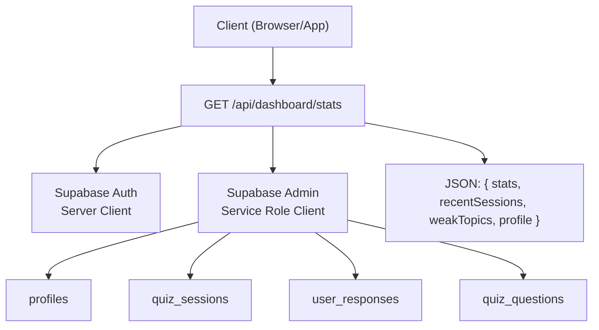
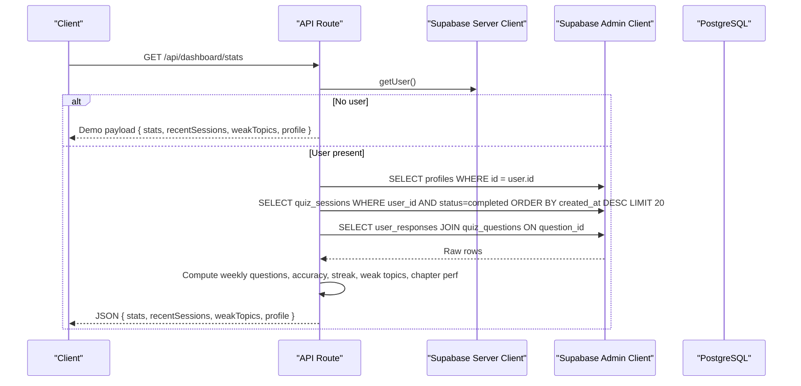
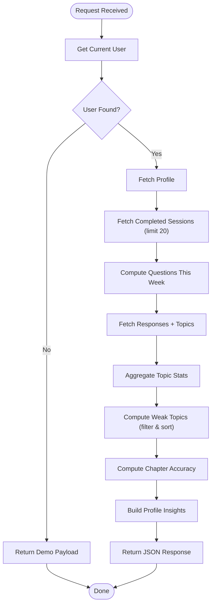
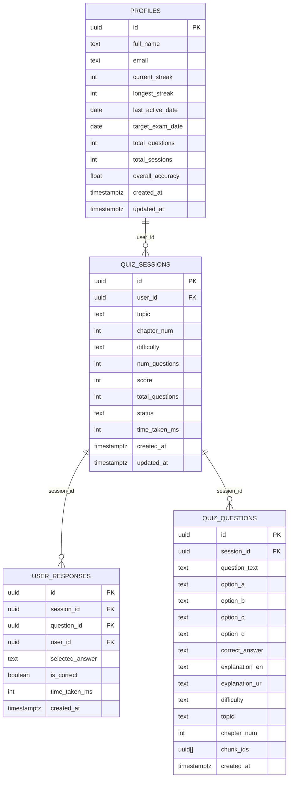
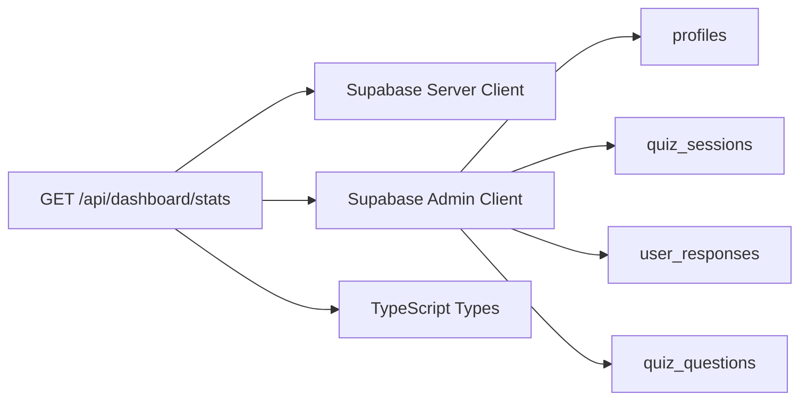

# Dashboard APIs

<cite>
**Referenced Files in This Document**
- [route.ts](file://src/app/api/dashboard/stats/route.ts)
- [quiz.ts](file://src/types/quiz.ts)
- [schema.sql](file://supabase/schema.sql)
- [server.ts](file://src/lib/supabase/server.ts)
- [admin.ts](file://src/lib/supabase/admin.ts)
- [middleware.ts](file://src/middleware.ts)
- [README.md](file://README.md)
</cite>

## Table of Contents
1. Introduction
2. Project Structure
3. Core Components
4. Architecture Overview
5. Detailed Component Analysis
6. Dependency Analysis
7. Performance Considerations
8. Troubleshooting Guide
9. Conclusion

## Introduction
This document provides API documentation for the MedAce-AI dashboard statistics endpoint that returns comprehensive user progress analytics and performance metrics. The endpoint aggregates quiz completion rates, identifies weak topics, tracks study streaks, and computes chapter-wise performance to power analytics dashboards and progress tracking interfaces.

## Project Structure
The dashboard statistics endpoint is implemented as a Next.js App Router API route under the dashboard module. It reads authenticated user context via Supabase, queries multiple database tables for session history and responses, and returns a unified response object containing stats, recent sessions, weak topics, and profile insights.

**Diagram sources**
- [route.ts:6-172](file://src/app/api/dashboard/stats/route.ts#L6-L172)
- [server.ts:4-27](file://src/lib/supabase/server.ts#L4-L27)
- [admin.ts:1-21](file://src/lib/supabase/admin.ts#L1-L21)
- [schema.sql:11-99](file://supabase/schema.sql#L11-L99)

**Section sources**
- [route.ts:1-181](file://src/app/api/dashboard/stats/route.ts#L1-L181)
- [README.md:170-253](file://README.md#L170-L253)

## Core Components
- Endpoint: GET /api/dashboard/stats
- Authentication: Supabase JWT via server-side client; if no user is found, returns demo data
- Data sources:
  - profiles: overall accuracy, streaks, totals
  - quiz_sessions: completed sessions with scores and timestamps
  - user_responses + quiz_questions: per-question correctness by topic/chapter
- Output: Aggregated stats, recent sessions, weak topics, and profile insights

Key behaviors:
- Unauthenticated or demo mode returns empty/demo values
- Computes weekly questions from last 7 days
- Derives weak topics by error rate threshold and sorts by weakness score
- Calculates chapter-wise accuracy and best/worst topics
- Returns structured JSON conforming to TypeScript types

**Section sources**
- [route.ts:6-172](file://src/app/api/dashboard/stats/route.ts#L6-L172)
- [quiz.ts:78-106](file://src/types/quiz.ts#L78-L106)

## Architecture Overview
The endpoint orchestrates authentication, multi-table aggregation, and response composition. It uses a server-side Supabase client to read the current user and an admin client to query protected tables efficiently.

**Diagram sources**
- [route.ts:6-172](file://src/app/api/dashboard/stats/route.ts#L6-L172)
- [server.ts:4-27](file://src/lib/supabase/server.ts#L4-L27)
- [admin.ts:1-21](file://src/lib/supabase/admin.ts#L1-L21)
- [schema.sql:11-99](file://supabase/schema.sql#L11-L99)

## Detailed Component Analysis

### Endpoint: GET /api/dashboard/stats
- Purpose: Retrieve comprehensive user statistics including quiz completion rates, weak spot identification, study streaks, and chapter-wise performance analysis.
- Authentication: Uses Supabase server client to get the current user. If no user is present, returns a demo dataset.
- Request:
  - Method: GET
  - Path: /api/dashboard/stats
  - Headers: None required at route level; authentication handled via Supabase session cookies on the server side
- Response:
  - Content-Type: application/json
  - Body schema:
    - stats: DashboardStats
    - recentSessions: RecentSession[]
    - weakTopics: WeakTopic[]
    - profile: UserProfile
- Error handling:
  - On exceptions, returns 500 with { error, message }

Response schema details:
- DashboardStats
  - totalQuestions: number
  - questionsThisWeek: number
  - accuracyRate: number
  - sessionsCompleted: number
  - studyStreak: number
- RecentSession
  - id: string
  - topic: string
  - score: number
  - totalQuestions: number
  - date: string
- WeakTopic
  - topic: string
  - chapterNum: number
  - weaknessScore: number
  - errorCount: number
  - attemptCount: number
- UserProfile
  - id: string
  - fullName: string
  - email: string
  - memberSince: string
  - totalQuestions: number
  - totalSessions: number
  - overallAccuracy: number
  - bestTopic: string
  - worstTopic: string
  - longestStreak: number
  - chapterPerformance: array of { chapter: string; accuracy: number }

Processing logic highlights:
- Weekly calculation: filters sessions created within the last 7 days and sums their total_questions
- Weak topics: aggregates per-topic error counts and attempts, calculates error rate, filters by threshold, and sorts descending by weaknessScore
- Chapter performance: maps topics to chapters and computes per-chapter accuracy
- Best/worst topics: derived from sorted chapter performance
- Profile enrichment: merges Supabase user metadata and persisted profile fields

**Diagram sources**
- [route.ts:6-172](file://src/app/api/dashboard/stats/route.ts#L6-L172)

**Section sources**
- [route.ts:6-172](file://src/app/api/dashboard/stats/route.ts#L6-L172)
- [quiz.ts:78-106](file://src/types/quiz.ts#L78-L106)

### Database Schema and Relationships
The endpoint relies on the following tables and relationships:
- profiles: user-level aggregated metrics and streaks
- quiz_sessions: per-session results linked to users
- user_responses: per-question answers linked to sessions and users
- quiz_questions: question metadata including topic and chapter

**Diagram sources**
- [schema.sql:11-99](file://supabase/schema.sql#L11-L99)

**Section sources**
- [schema.sql:11-99](file://supabase/schema.sql#L11-L99)

### Authentication and Authorization
- Authentication flow:
  - The route uses the server-side Supabase client to retrieve the current user from the session cookie
  - If no user is found, the endpoint returns a demo payload instead of failing
- Authorization:
  - Data access uses the Supabase service role client to read across tables
  - Row Level Security policies are defined in the schema for standard clients; the service role bypasses these for server-side aggregation

Notes:
- Middleware currently allows all routes through in development; production should enforce session checks
- Ensure environment variables for Supabase URL and keys are configured

**Section sources**
- [route.ts:6-41](file://src/app/api/dashboard/stats/route.ts#L6-L41)
- [server.ts:4-27](file://src/lib/supabase/server.ts#L4-L27)
- [admin.ts:1-21](file://src/lib/supabase/admin.ts#L1-L21)
- [schema.sql:155-229](file://supabase/schema.sql#L155-L229)
- [middleware.ts:14-35](file://src/middleware.ts#L14-L35)

### Error Handling Strategies
- Unauthenticated path: returns a structured demo payload rather than an error
- Unexpected errors: caught and returned as HTTP 500 with a consistent error envelope
- Recommended client behavior:
  - Check HTTP status code
  - Parse error envelope when status >= 400
  - Handle empty arrays gracefully for recentSessions and weakTopics

**Section sources**
- [route.ts:173-180](file://src/app/api/dashboard/stats/route.ts#L173-L180)

## Dependency Analysis
The endpoint depends on:
- Supabase server client for user context
- Supabase admin client for cross-table reads
- PostgreSQL tables for sessions, responses, questions, and profiles
- TypeScript types for response contracts

**Diagram sources**
- [route.ts:1-172](file://src/app/api/dashboard/stats/route.ts#L1-L172)
- [server.ts:4-27](file://src/lib/supabase/server.ts#L4-L27)
- [admin.ts:1-21](file://src/lib/supabase/admin.ts#L1-L21)
- [quiz.ts:78-106](file://src/types/quiz.ts#L78-L106)

**Section sources**
- [route.ts:1-172](file://src/app/api/dashboard/stats/route.ts#L1-L172)
- [quiz.ts:78-106](file://src/types/quiz.ts#L78-L106)

## Performance Considerations
- Query limits:
  - Recent sessions are limited to 20 rows to reduce payload size and processing time
- Aggregation efficiency:
  - Topic-level aggregation is computed in-memory after fetching responses; consider indexing by user_id and topic where applicable
- Weekly computation:
  - Filters by created_at within the last 7 days; ensure proper indexes on quiz_sessions.created_at for large datasets
- Caching:
  - Consider client-side caching (e.g., TanStack Query) to avoid repeated requests for the same dashboard view
- Service role usage:
  - Using the service role client avoids per-row policy checks; ensure this is acceptable for your security model

[No sources needed since this section provides general guidance]

## Troubleshooting Guide
Common issues and resolutions:
- Empty or zero metrics:
  - Verify the user has completed quiz sessions and recorded responses
  - Confirm quiz_sessions.status is set to "completed"
- Incorrect weak topics:
  - Ensure user_responses.is_correct is accurately recorded
  - Validate that quiz_questions.topic and chapter_num are populated
- Authentication failures:
  - Confirm Supabase session cookies are present and valid
  - Check environment variables for Supabase URL and keys
- Rate limiting or timeouts:
  - Reduce payload size by limiting recent sessions further if necessary
  - Optimize queries or add indexes based on observed bottlenecks

**Section sources**
- [route.ts:58-127](file://src/app/api/dashboard/stats/route.ts#L58-L127)
- [schema.sql:47-99](file://supabase/schema.sql#L47-L99)

## Conclusion
The GET /api/dashboard/stats endpoint provides a robust foundation for building analytics dashboards and progress tracking interfaces. It consolidates user performance into actionable insights such as accuracy rates, weak topics, study streaks, and chapter-wise performance. With clear authentication handling, structured error responses, and well-defined data schemas, it enables reliable integration for both frontend dashboards and external analytics tools.