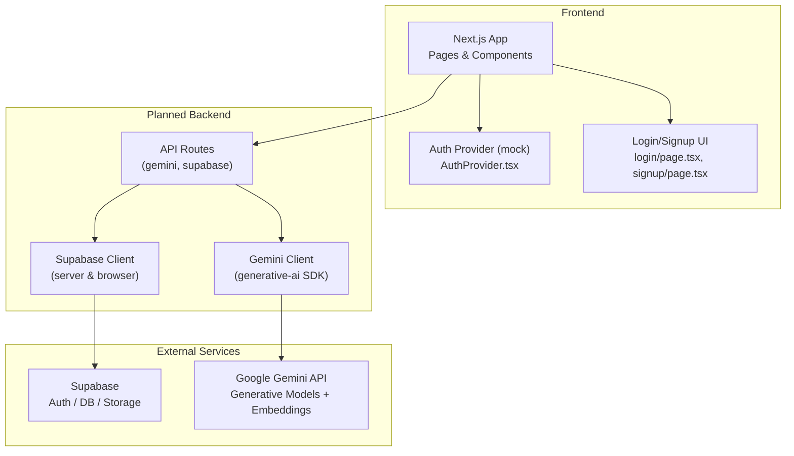
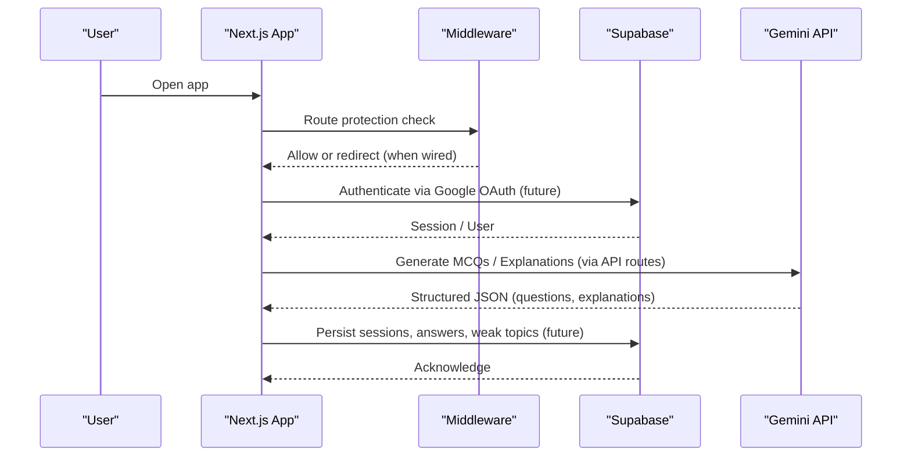
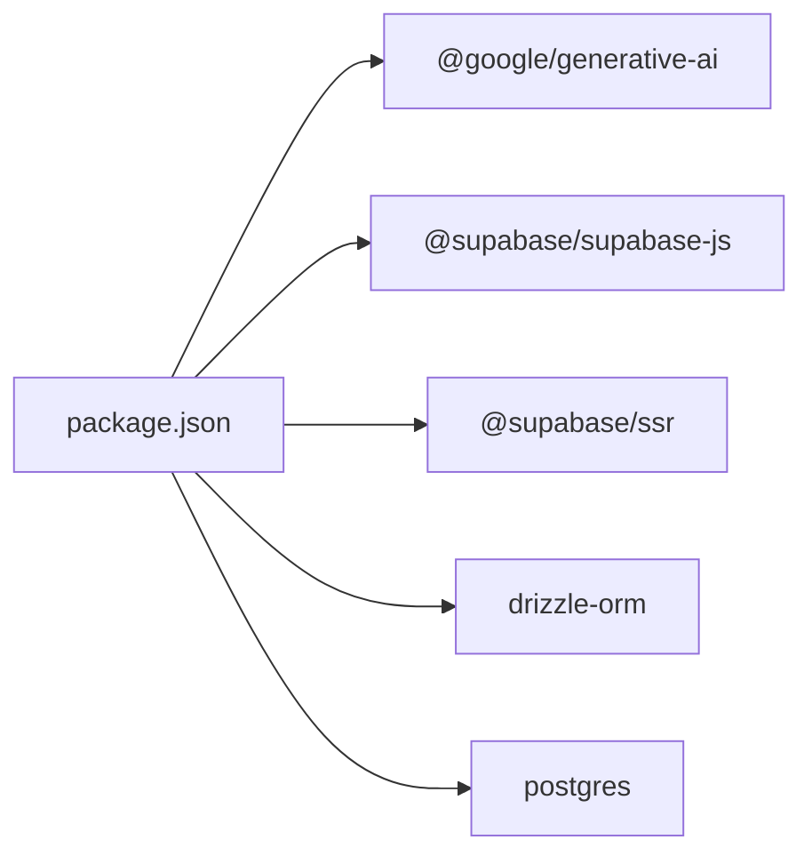

# External Integrations

<cite>
**Referenced Files in This Document**
- [README.md](file://README.md)
- [package.json](file://package.json)
- [next.config.ts](file://next.config.ts)
- [src/middleware.ts](file://src/middleware.ts)
- [src/components/auth/AuthProvider.tsx](file://src/components/auth/AuthProvider.tsx)
- [src/app/(auth)/login/page.tsx](file://src/app/(auth)/login/page.tsx)
- [src/app/(auth)/signup/page.tsx](file://src/app/(auth)/signup/page.tsx)
</cite>

## Table of Contents
1. [Introduction](#introduction)
2. [Project Structure](#project-structure)
3. [Core Components](#core-components)
4. [Architecture Overview](#architecture-overview)
5. [Detailed Component Analysis](#detailed-component-analysis)
6. [Dependency Analysis](#dependency-analysis)
7. [Performance Considerations](#performance-considerations)
8. [Troubleshooting Guide](#troubleshooting-guide)
9. [Conclusion](#conclusion)
10. [Appendices](#appendices)

## Introduction
This document explains MedAce AI’s external service integrations with a focus on:
- Google Gemini API for AI-powered MCQ generation and Urdu explanation creation
- Supabase for authentication, database operations, and file storage

It covers configuration requirements, environment variables, connection setup, request/response schemas, rate limiting considerations, error handling patterns, fallback strategies, and performance tips. The project is currently in a frontend-only state with mock auth; integration points are clearly marked for when backend wiring is enabled.

## Project Structure
The repository includes UI pages and components that prepare the app for Supabase Auth (Google OAuth) and references to Gemini-based RAG flows. The README documents the intended architecture, including API routes and server-side logic for Gemini and Supabase interactions.

**Diagram sources**
- [README.md:23-78](file://README.md#L23-L78)
- [src/components/auth/AuthProvider.tsx:31-42](file://src/components/auth/AuthProvider.tsx#L31-L42)
- [src/app/(auth)/login/page.tsx:25-46](file://src/app/(auth)/login/page.tsx#L25-L46)
- [src/app/(auth)/signup/page.tsx:25-46](file://src/app/(auth)/signup/page.tsx#L25-L46)

**Section sources**
- [README.md:23-78](file://README.md#L23-L78)
- [src/components/auth/AuthProvider.tsx:31-42](file://src/components/auth/AuthProvider.tsx#L31-L42)
- [src/app/(auth)/login/page.tsx:25-46](file://src/app/(auth)/login/page.tsx#L25-L46)
- [src/app/(auth)/signup/page.tsx:25-46](file://src/app/(auth)/signup/page.tsx#L25-L46)

## Core Components
- Authentication (Supabase):
  - Frontend uses a mock user context today; comments indicate where to wire Supabase Auth state changes.
  - Login/Signup pages include “Continue with Google” buttons ready for OAuth flow once Supabase is connected.
  - Middleware contains commented-out session checks for protected routes, indicating where Supabase cookie validation will be enforced.

- AI Generation (Google Gemini):
  - The README outlines a RAG pipeline using Gemini embeddings and generative models to produce MCQs and Urdu explanations.
  - Dependencies include the official Google Generative AI SDK.

- Configuration:
  - Environment variables for Supabase and Gemini are documented in the README.
  - Security headers are configured at the Next.js level.

**Section sources**
- [src/components/auth/AuthProvider.tsx:31-42](file://src/components/auth/AuthProvider.tsx#L31-L42)
- [src/app/(auth)/login/page.tsx:25-46](file://src/app/(auth)/login/page.tsx#L25-L46)
- [src/app/(auth)/signup/page.tsx:25-46](file://src/app/(auth)/signup/page.tsx#L25-L46)
- [src/middleware.ts:17-33](file://src/middleware.ts#L17-L33)
- [README.md:23-78](file://README.md#L23-L78)
- [README.md:228-244](file://README.md#L228-L244)
- [next.config.ts:13-22](file://next.config.ts#L13-L22)

## Architecture Overview
The system integrates two primary external services:
- Supabase: Provides authentication (Google OAuth), PostgreSQL database (with pgvector), and storage.
- Google Gemini: Provides text generation (MCQs, Urdu explanations) and embeddings for RAG retrieval.

**Diagram sources**
- [src/middleware.ts:17-33](file://src/middleware.ts#L17-L33)
- [src/components/auth/AuthProvider.tsx:31-42](file://src/components/auth/AuthProvider.tsx#L31-L42)
- [README.md:79-122](file://README.md#L79-L122)

## Detailed Component Analysis

### Google Gemini Integration
Purpose:
- Generate MCQs grounded in textbook content via RAG.
- Provide Urdu explanations for concepts students struggle with.
- Create embeddings for textbook chunks to enable similarity search.

Configuration:
- Set the Gemini API key via environment variable.
- Use the Google Generative AI SDK for model calls.

Request/Response Schemas (as described in the README):
- Input: Topic/difficulty context plus retrieved textbook chunks.
- Output: Structured JSON containing question, options, correct answer, English explanation, and Urdu explanation.

Rate Limiting and Quotas:
- Respect Gemini API quotas and implement retries/backoff for transient errors.
- Cache frequent prompts/chunks to reduce redundant calls.

Error Handling:
- Validate outputs with Zod before persisting.
- Surface user-friendly errors and log detailed diagnostics server-side.

Fallback Mechanisms:
- If Gemini is unavailable, return cached or previously generated content for the same topic/difficulty.
- Gracefully degrade by showing placeholder questions until the service recovers.

Performance Tips:
- Chunk size and overlap tuned for retrieval quality.
- Batch requests where possible.
- Use streaming responses for long generations to improve perceived latency.

**Section sources**
- [README.md:79-122](file://README.md#L79-L122)
- [README.md:228-244](file://README.md#L228-L244)
- [package.json:20-21](file://package.json#L20-L21)

### Supabase Integration
Purpose:
- Authentication via Google OAuth.
- Database operations for users, quiz sessions, answers, weak topics, study plans.
- File storage for assets and potentially generated content.

Configuration:
- Configure Supabase URL, anon key, and service role key.
- Set DATABASE_URL for Drizzle ORM migrations and queries.

Connection Setup:
- Browser client for client-side interactions.
- Server client for secure operations in API routes.
- Middleware will enforce route protection by validating Supabase session cookies when wired.

Authentication Flow (planned):
- Login/Signup UI triggers Google OAuth.
- Supabase handles token exchange and sets secure cookies.
- Middleware validates session for protected routes.

Database Schema (high-level):
- Users, Quiz Sessions, Questions, User Answers, Weak Topics, Textbook Chunks (pgvector), Study Plans.

Storage:
- Store files via Supabase Storage buckets as needed.

Error Handling:
- Handle network errors, invalid credentials, and permission denials.
- Provide user-facing messages and server logs.

Fallback Mechanisms:
- If Supabase is down, show maintenance messaging and cache last known state locally where appropriate.
- Defer non-critical writes until connectivity resumes.

Performance Tips:
- Use indexes on frequently queried columns (e.g., user_id, topic).
- Leverage pgvector for efficient similarity searches.
- Minimize round-trips by batching reads/writes.

**Section sources**
- [README.md:23-78](file://README.md#L23-L78)
- [README.md:124-161](file://README.md#L124-L161)
- [README.md:228-244](file://README.md#L228-L244)
- [src/middleware.ts:17-33](file://src/middleware.ts#L17-L33)
- [src/components/auth/AuthProvider.tsx:31-42](file://src/components/auth/AuthProvider.tsx#L31-L42)
- [src/app/(auth)/login/page.tsx:25-46](file://src/app/(auth)/login/page.tsx#L25-L46)
- [src/app/(auth)/signup/page.tsx:25-46](file://src/app/(auth)/signup/page.tsx#L25-L46)

## Dependency Analysis
Key dependencies related to external integrations:
- @google/generative-ai: SDK for Gemini API access.
- @supabase/supabase-js and @supabase/ssr: Client libraries for Supabase Auth and SSR support.
- drizzle-orm and postgres: Database access and migrations.

**Diagram sources**
- [package.json:11-27](file://package.json#L11-L27)

**Section sources**
- [package.json:11-27](file://package.json#L11-L27)

## Performance Considerations
- Gemini:
  - Use concise prompts and structured output to minimize token usage.
  - Implement retry with exponential backoff for rate limits.
  - Cache embeddings and generated content per topic/difficulty.

- Supabase:
  - Index columns used in filters and joins (user_id, topic, created_at).
  - Use pgvector efficiently by tuning top-k and distance metrics.
  - Prefer server-side queries to avoid over-fetching data.

- Application:
  - Add caching layers (e.g., TanStack Query) for repeated reads.
  - Stream long-running responses from Gemini to improve UX.
  - Enforce security headers and minimal permissions in middleware.

[No sources needed since this section provides general guidance]

## Troubleshooting Guide
Common issues and resolutions:

- Missing environment variables:
  - Ensure NEXT_PUBLIC_SUPABASE_URL, NEXT_PUBLIC_SUPABASE_ANON_KEY, SUPABASE_SERVICE_ROLE_KEY, DATABASE_URL, and GEMINI_API_KEY are set.
  - Verify values match your Supabase project and Gemini account.

- Authentication not working:
  - Confirm Google OAuth provider is enabled in Supabase.
  - Check that login/signup UI triggers the OAuth flow and that middleware enforces session checks when wired.

- Rate limit errors from Gemini:
  - Implement retries with backoff and queue requests during high load.
  - Reduce concurrent requests and batch where possible.

- Database connection failures:
  - Validate DATABASE_URL format and credentials.
  - Run migrations and ensure tables exist.

- Storage upload failures:
  - Check bucket policies and CORS settings in Supabase.
  - Validate file sizes and MIME types.

- Fallback behavior:
  - When external services are unavailable, serve cached content and display informative messages.
  - Log errors for observability and alerting.

**Section sources**
- [README.md:228-244](file://README.md#L228-L244)
- [src/middleware.ts:17-33](file://src/middleware.ts#L17-L33)
- [src/components/auth/AuthProvider.tsx:31-42](file://src/components/auth/AuthProvider.tsx#L31-L42)

## Conclusion
MedAce AI is designed to integrate tightly with Google Gemini for AI-driven MCQ generation and Urdu explanations, and with Supabase for authentication, database, and storage. While the current codebase is frontend-focused with mock auth, the structure and comments clearly indicate where to wire Supabase Auth and API routes. Following the configuration, error handling, and performance recommendations will ensure robust integrations and a resilient user experience.

[No sources needed since this section summarizes without analyzing specific files]

## Appendices

### Environment Variables Reference
- NEXT_PUBLIC_SUPABASE_URL
- NEXT_PUBLIC_SUPABASE_ANON_KEY
- SUPABASE_SERVICE_ROLE_KEY
- DATABASE_URL
- GEMINI_API_KEY
- NEXT_PUBLIC_APP_URL

**Section sources**
- [README.md:228-244](file://README.md#L228-L244)

### Security Headers
- X-Frame-Options: DENY
- X-Content-Type-Options: nosniff
- Referrer-Policy: origin-when-cross-origin
- Permissions-Policy: camera=(), microphone=(), geolocation()

**Section sources**
- [next.config.ts:3-11](file://next.config.ts#L3-L11)