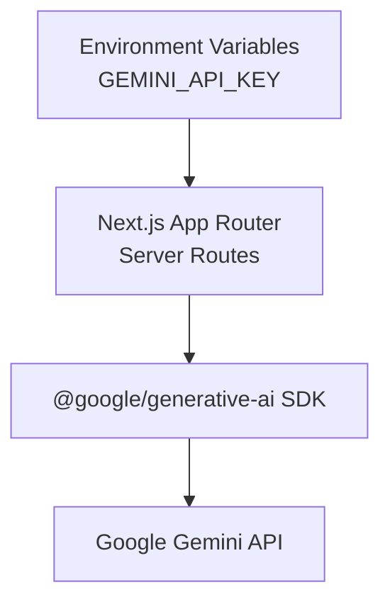
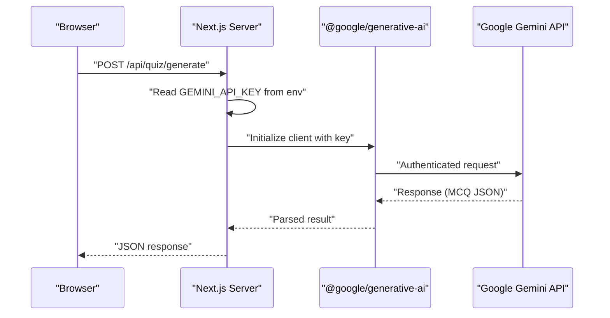
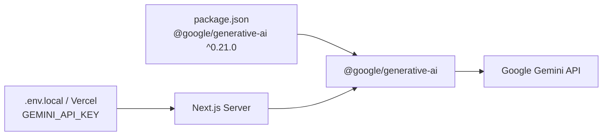

# Authentication & Configuration

<cite>
**Referenced Files in This Document**
- [README.md](file://README.md)
- [package.json](file://package.json)
</cite>

## Table of Contents
1. [Introduction](#introduction)
2. [Project Structure](#project-structure)
3. [Core Components](#core-components)
4. [Architecture Overview](#architecture-overview)
5. [Detailed Component Analysis](#detailed-component-analysis)
6. [Dependency Analysis](#dependency-analysis)
7. [Performance Considerations](#performance-considerations)
8. [Troubleshooting Guide](#troubleshooting-guide)
9. [Conclusion](#conclusion)
10. [Appendices](#appendices)

## Introduction
This document explains how MedAce AI authenticates to and configures the Google Gemini API for server-side operations such as MCQ generation and Urdu explanations. It covers environment variable setup (GEMINI_API_KEY), where to obtain keys from Google AI Studio, how to configure them locally and on Vercel, and how Next.js server routes consume the key via the official SDK. It also includes security best practices, deployment considerations, and troubleshooting guidance for common authentication issues.

## Project Structure
MedAce AI is a Next.js 15 application that uses server-side API routes to call Google Gemini. The project’s README documents the intended location of the Gemini client and prompts under src/lib/gemini, and lists GEMINI_API_KEY among required environment variables. The runtime dependency on the official Google Generative AI SDK is declared in package.json.

**Diagram sources**
- [README.md:208-210](file://README.md#L208-L210)
- [README.md:228-244](file://README.md#L228-L244)
- [package.json:20-20](file://package.json#L20-L20)

**Section sources**
- [README.md:208-210](file://README.md#L208-L210)
- [README.md:228-244](file://README.md#L228-L244)
- [package.json:20-20](file://package.json#L20-L20)

## Core Components
- Environment configuration:
  - GEMINI_API_KEY is the sole secret required for Gemini access. It must be set in your local .env.local and in your Vercel project settings.
- Server-side integration:
  - The Next.js server executes API routes that initialize the Gemini client using the SDK and the GEMINI_API_KEY environment variable.
- SDK usage:
  - The project depends on @google/generative-ai (v0.21.x), which reads GEMINI_API_KEY at runtime to authenticate requests to Google Gemini.

Security notes:
- Keep GEMINI_API_KEY out of version control and never expose it to the browser. Only server-side code should read and use this variable.

**Section sources**
- [README.md:228-244](file://README.md#L228-L244)
- [package.json:20-20](file://package.json#L20-L20)

## Architecture Overview
The flow below shows how a client request triggers server-side Gemini calls with secure environment-based authentication.

**Diagram sources**
- [README.md:208-210](file://README.md#L208-L210)
- [README.md:228-244](file://README.md#L228-L244)
- [package.json:20-20](file://package.json#L20-L20)

## Detailed Component Analysis

### Environment Variables and Key Management
- Local development:
  - Create or update .env.local with GEMINI_API_KEY set to your key from Google AI Studio.
- Production (Vercel):
  - Add GEMINI_API_KEY in Vercel Project Settings > Environment Variables so serverless functions can access it at runtime.
- Best practices:
  - Never commit secrets to version control.
  - Use separate keys per environment if needed.
  - Rotate keys periodically and revoke compromised keys in Google AI Studio.

Obtaining the key:
- Sign in to Google AI Studio, create an API key, and copy it into your environment configuration as described above.

**Section sources**
- [README.md:228-244](file://README.md#L228-L244)

### Next.js Server-Side Configuration
- Initialization:
  - In server-side code (API routes or server components), import the SDK and initialize the client using the GEMINI_API_KEY environment variable.
- Models used:
  - gemini-2.0-flash for text generation (MCQs, explanations).
  - text-embedding-004 for embeddings (RAG indexing).
- Error handling:
  - Wrap Gemini calls in try/catch blocks and surface user-friendly errors when authentication fails or quotas are exceeded.
- Timeouts and retries:
  - Configure timeouts appropriate for serverless execution limits.
  - Implement retry logic with exponential backoff for transient network errors; avoid retrying on invalid credentials or quota errors.

Note: The repository documents these models and the presence of a Gemini client module in src/lib/gemini.

**Section sources**
- [README.md:208-210](file://README.md#L208-L210)
- [README.md:228-244](file://README.md#L228-L244)

### Security Best Practices
- Protect secrets:
  - Store GEMINI_API_KEY only in environment variables (.env.local locally; Vercel environment variables in production).
- Least privilege:
  - Use a dedicated API key for MedAce AI with model-specific restrictions if available.
- Deployment hygiene:
  - Ensure no logs print secrets.
  - Restrict access to Vercel project settings and CI/CD secrets.
- Rotation strategy:
  - Periodically rotate keys.
  - Revoke old keys after verifying new ones work in all environments.
  - Maintain a rollback plan to revert to a previous key quickly.

**Section sources**
- [README.md:228-244](file://README.md#L228-L244)

## Dependency Analysis
MedAce AI integrates with Google Gemini through the official SDK. The dependency is declared in package.json and referenced by server-side code to perform authenticated calls.

**Diagram sources**
- [package.json:20-20](file://package.json#L20-L20)
- [README.md:228-244](file://README.md#L228-L244)

**Section sources**
- [package.json:20-20](file://package.json#L20-L20)
- [README.md:228-244](file://README.md#L228-L244)

## Performance Considerations
- Model selection:
  - gemini-2.0-flash provides fast, cost-effective generation suitable for interactive features like MCQs and explanations.
- Embeddings:
  - text-embedding-004 produces compact vectors for efficient storage and retrieval in pgvector.
- Request sizing:
  - Chunk textbook content appropriately to minimize token usage while preserving context quality.
- Caching:
  - Cache repeated responses (e.g., study plans or explanations) at the application layer to reduce API calls.
- Backpressure:
  - Rate-limit requests per user or tenant to stay within quotas and improve stability.

[No sources needed since this section provides general guidance]

## Troubleshooting Guide

Common issues and resolutions:

- Invalid or missing API key:
  - Symptom: Authentication error from Gemini.
  - Resolution: Verify GEMINI_API_KEY is set in .env.local (development) and Vercel environment variables (production). Regenerate the key in Google AI Studio if necessary.

- Quota or rate limit exceeded:
  - Symptom: 429 or quota-related errors.
  - Resolution: Reduce request frequency, implement backoff/retry for transient errors, and monitor usage in Google AI Studio. Consider upgrading quotas if needed.

- Network connectivity problems:
  - Symptom: Timeouts or DNS failures.
  - Resolution: Check outbound internet access from your serverless environment, proxy/firewall rules, and retry with exponential backoff.

- Incorrect model name:
  - Symptom: Model not found or unsupported.
  - Resolution: Ensure you reference supported models documented in the project (gemini-2.0-flash for generation, text-embedding-004 for embeddings).

- Secrets exposure:
  - Symptom: Logs or errors reveal the key.
  - Resolution: Sanitize logs, ensure environment variables are not printed, and rotate the key if exposed.

[No sources needed since this section provides general guidance]

## Conclusion
MedAce AI secures Gemini access through a single server-side secret, GEMINI_API_KEY, configured in local and production environments. By initializing the official SDK on the server and following the security and operational practices outlined here, you can reliably generate MCQs and explanations while keeping credentials safe and predictable across deployments.

[No sources needed since this section summarizes without analyzing specific files]

## Appendices

### Environment Variables Reference
- GEMINI_API_KEY: Required for server-side Gemini authentication. Set in .env.local for development and in Vercel environment variables for production.

**Section sources**
- [README.md:228-244](file://README.md#L228-L244)

### Models Used
- Text generation: gemini-2.0-flash
- Embeddings: text-embedding-004

**Section sources**
- [README.md:208-210](file://README.md#L208-L210)