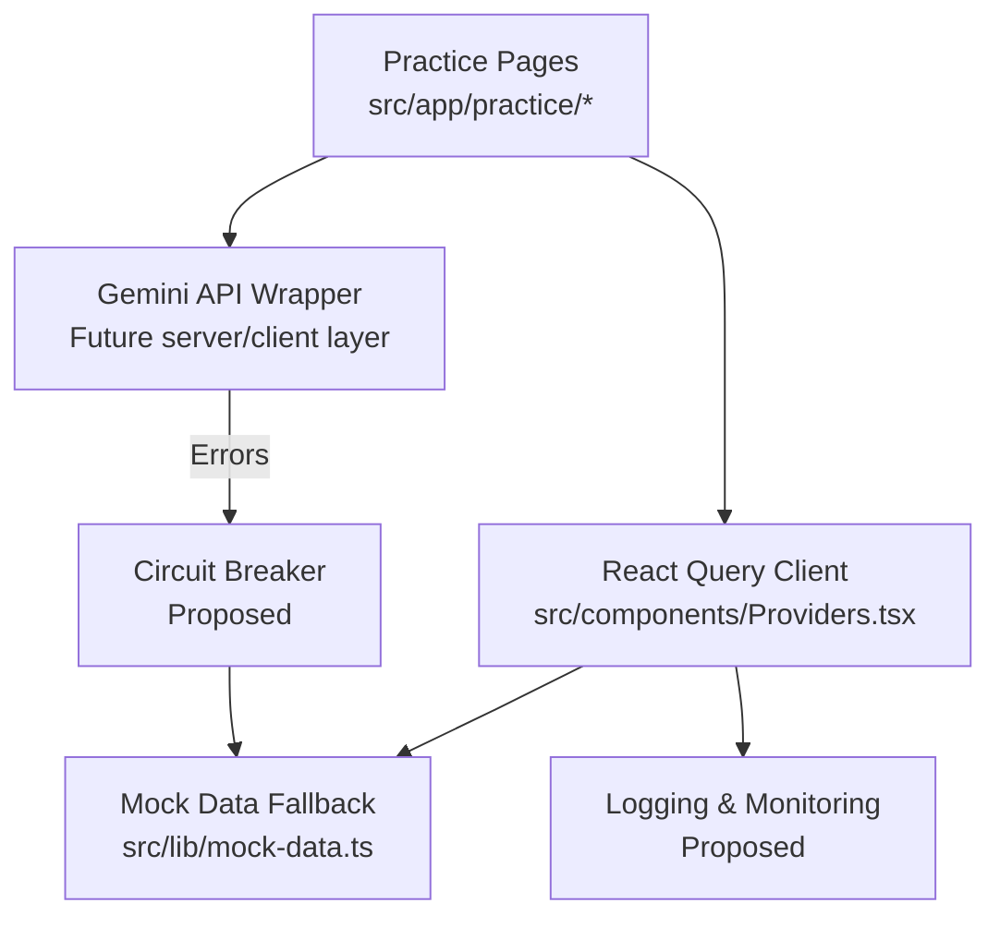
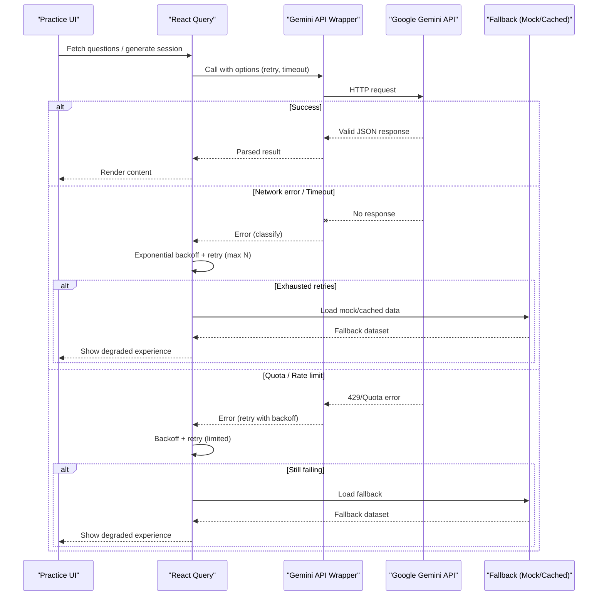
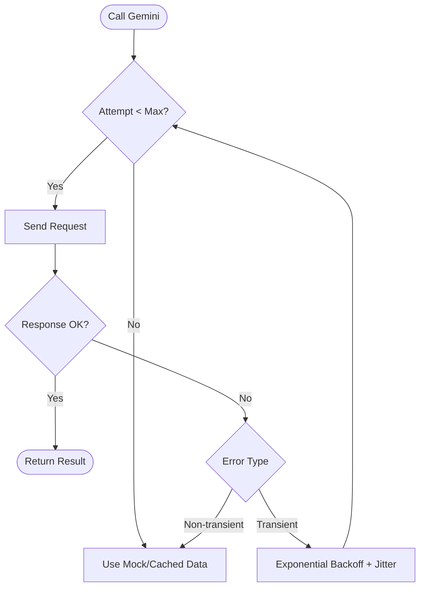
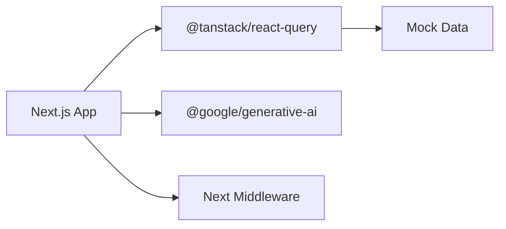

# Error Handling & Retry Strategies

<cite>
**Referenced Files in This Document**
- [package.json](file://package.json)
- [README.md](file://README.md)
- [src/components/Providers.tsx](file://src/components/Providers.tsx)
- [src/lib/mock-data.ts](file://src/lib/mock-data.ts)
- [src/app/practice/page.tsx](file://src/app/practice/page.tsx)
- [src/app/practice/[session]/page.tsx](file://src/app/practice/[session]/page.tsx)
- [src/middleware.ts](file://src/middleware.ts)
</cite>

## Table of Contents
1. [Introduction](#introduction)
2. [Project Structure](#project-structure)
3. [Core Components](#core-components)
4. [Architecture Overview](#architecture-overview)
5. [Detailed Component Analysis](#detailed-component-analysis)
6. [Dependency Analysis](#dependency-analysis)
7. [Performance Considerations](#performance-considerations)
8. [Troubleshooting Guide](#troubleshooting-guide)
9. [Conclusion](#conclusion)
10. [Appendices](#appendices)

## Introduction
This document specifies robust error handling and retry strategies for integrating Google Gemini API into the application. It covers client-side error handling patterns (network timeouts, quota exceeded, rate limiting, malformed responses), retry mechanisms with exponential backoff and maximum attempts, circuit breaker behavior to prevent cascading failures, graceful degradation using mock data or cached responses, logging and monitoring approaches, debugging techniques, and health checks for production deployments.

The project currently uses @google/generative-ai as a dependency and includes React Query configuration for retries and caching. The UI is primarily driven by mock data at present, which provides a foundation for fallback behavior when Gemini is unavailable.

## Project Structure
Key areas relevant to error handling and resilience:
- Client-side state management and retries are configured via React Query in the providers layer.
- Practice flows use mock data; this is the natural place to implement fallbacks when Gemini calls fail.
- Middleware is present for route protection and can be extended for centralized error handling or telemetry.
- README documents intended Gemini integration points (generation, embeddings) that will require resilient wrappers.

**Diagram sources**
- [src/components/Providers.tsx:7-15](file://src/components/Providers.tsx#L7-L15)
- [src/lib/mock-data.ts:1-312](file://src/lib/mock-data.ts#L1-L312)
- [src/app/practice/page.tsx:1-196](file://src/app/practice/page.tsx#L1-L196)
- [src/app/practice/[session]/page.tsx:1-352](file://src/app/practice/[session]/page.tsx#L1-L352)

**Section sources**
- [src/components/Providers.tsx:7-15](file://src/components/Providers.tsx#L7-L15)
- [src/lib/mock-data.ts:1-312](file://src/lib/mock-data.ts#L1-L312)
- [src/app/practice/page.tsx:1-196](file://src/app/practice/page.tsx#L1-L196)
- [src/app/practice/[session]/page.tsx:1-352](file://src/app/practice/[session]/page.tsx#L1-L352)

## Core Components
- React Query client configuration sets default query retry behavior and stale time, providing a baseline for resilient data fetching.
- Mock data module supplies stable datasets used across practice pages, enabling immediate fallback when external services are down.
- Practice pages orchestrate user interactions and display content; they are ideal places to integrate error boundaries and fallback states.

Implementation notes:
- Default React Query retry is set to 1, which limits automatic retries on network errors. For Gemini calls, consider customizing retry per query based on error type.
- Use React Query’s retryDelay to implement exponential backoff for transient errors.
- Centralize Gemini API calls in a dedicated wrapper to apply consistent error classification, retries, and circuit breaking.

**Section sources**
- [src/components/Providers.tsx:7-15](file://src/components/Providers.tsx#L7-L15)
- [src/lib/mock-data.ts:1-312](file://src/lib/mock-data.ts#L1-L312)
- [src/app/practice/page.tsx:1-196](file://src/app/practice/page.tsx#L1-L196)
- [src/app/practice/[session]/page.tsx:1-352](file://src/app/practice/[session]/page.tsx#L1-L352)

## Architecture Overview
A resilient Gemini integration should follow a layered approach:
- Client layer (React Query): handles retries, caching, and background updates.
- Service layer (API wrapper): classifies errors, applies exponential backoff, enforces max retries, and implements circuit breaker logic.
- Fallback layer: serves mock or cached data when Gemini is unavailable.
- Observability layer: logs usage, errors, latency, and exposes health endpoints.

**Diagram sources**
- [src/components/Providers.tsx:7-15](file://src/components/Providers.tsx#L7-L15)
- [src/lib/mock-data.ts:1-312](file://src/lib/mock-data.ts#L1-L312)
- [src/app/practice/page.tsx:1-196](file://src/app/practice/page.tsx#L1-L196)
- [src/app/practice/[session]/page.tsx:1-352](file://src/app/practice/[session]/page.tsx#L1-L352)

## Detailed Component Analysis

### Client-Side Error Handling Patterns
- Network timeouts: Configure request timeouts in the API wrapper and treat timeouts as transient errors eligible for retry with backoff.
- API quota exceeded: Detect quota errors and apply shorter retry intervals; if persistent, switch to fallback immediately to avoid long waits.
- Rate limiting responses: On 429 responses, honor Retry-After headers when present; otherwise use exponential backoff capped at a reasonable interval.
- Malformed API responses: Validate structured outputs (e.g., MCQ JSON) before rendering; on validation failure, treat as non-retryable and fall back to mock data.

Integration points:
- Use React Query’s retry and retryDelay to manage retries at the client level.
- Wrap Gemini calls in a service function that centralizes error classification and fallback invocation.

**Section sources**
- [src/components/Providers.tsx:7-15](file://src/components/Providers.tsx#L7-L15)
- [src/app/practice/page.tsx:1-196](file://src/app/practice/page.tsx#L1-L196)
- [src/app/practice/[session]/page.tsx:1-352](file://src/app/practice/[session]/page.tsx#L1-L352)

### Retry Mechanism Implementation
Recommended strategy:
- Exponential backoff: Base delay multiplied by an exponent factor, with jitter to reduce thundering herd.
- Maximum retry attempts: Cap retries (e.g., 3–5) to avoid indefinite loops.
- Retryable vs non-retryable errors: Only retry transient errors (timeouts, 429); do not retry schema validation failures.
- Per-query configuration: Customize retry settings for critical operations (e.g., quiz generation) versus lightweight reads.

[No sources needed since this diagram shows conceptual workflow, not actual code structure]

### Circuit Breaker Pattern
Purpose: Prevent cascading failures when Gemini is consistently down or throttled.
Behavior:
- Track recent error rates and failure counts.
- Open circuit after threshold breaches; short-circuit requests to Gemini and serve fallback immediately.
- Half-open state: periodically allow limited probes to test recovery.
- Close circuit when success rate improves above threshold.

Placement:
- Implement within the Gemini API wrapper to encapsulate state and policy decisions.

[No sources needed since this section describes a proposed pattern]

### Graceful Degradation Strategies
When Gemini is unavailable:
- Serve mock data from the local module to keep the UI functional.
- Cache previous successful responses in memory or localStorage for quick recovery.
- Simplify question generation: reduce complexity or number of questions while maintaining core functionality.

Current assets:
- Mock datasets provide realistic structures for topics, questions, sessions, and dashboards.

**Section sources**
- [src/lib/mock-data.ts:1-312](file://src/lib/mock-data.ts#L1-L312)

### Logging and Monitoring Approaches
Track:
- API usage metrics: request counts, token usage, latency percentiles.
- Error rates: categorized by type (timeout, quota, rate limit, schema).
- Performance: p50/p95 latency, retry counts, fallback activation frequency.
- Health status: upstream availability and circuit breaker state.

Recommendations:
- Emit structured logs with correlation IDs for each request.
- Integrate with a metrics backend (e.g., OpenTelemetry) for observability.
- Surface key metrics in admin dashboards and alert on SLO violations.

[No sources needed since this section provides general guidance]

### Debugging Tools and Techniques
- Local testing:
  - Simulate network errors and timeouts by intercepting requests.
  - Inject malformed responses to validate schema validation and fallback paths.
- Reproduce issues:
  - Capture request payloads and responses for analysis.
  - Log retry attempts and backoff durations.
- Health checks:
  - Implement a simple endpoint that pings Gemini and reports status.
  - Expose circuit breaker state and recent error summaries.

[No sources needed since this section provides general guidance]

## Dependency Analysis
- The project depends on @google/generative-ai for Gemini integration.
- React Query is used for data fetching and caching, with default retry configured.
- Middleware exists for route protection and can be extended for centralized error handling or telemetry.

**Diagram sources**
- [package.json:11-26](file://package.json#L11-L26)
- [src/components/Providers.tsx:7-15](file://src/components/Providers.tsx#L7-L15)
- [src/middleware.ts:1-41](file://src/middleware.ts#L1-L41)

**Section sources**
- [package.json:11-26](file://package.json#L11-L26)
- [src/components/Providers.tsx:7-15](file://src/components/Providers.tsx#L7-L15)
- [src/middleware.ts:1-41](file://src/middleware.ts#L1-L41)

## Performance Considerations
- Prefer server-side Gemini calls to protect API keys and reduce client load.
- Cache frequent reads aggressively with appropriate stale times.
- Limit retry attempts and backoff caps to avoid excessive latency.
- Use streaming where supported to improve perceived performance for long generations.
- Monitor and tune timeouts based on observed latency distributions.

[No sources needed since this section provides general guidance]

## Troubleshooting Guide
Common issues and resolutions:
- Network timeouts: Increase timeout thresholds, verify network stability, enable retries with backoff.
- Quota exceeded: Reduce request volume, implement cooldowns, switch to fallback quickly.
- Rate limiting: Honor Retry-After headers, cap retry intervals, batch requests if possible.
- Malformed responses: Strengthen schema validation, log raw payloads for diagnostics, fall back to mock data.

Operational checks:
- Verify environment variables and credentials.
- Confirm upstream service health via health check endpoints.
- Review logs for error categorization and retry activity.

[No sources needed since this section provides general guidance]

## Conclusion
Adopting a layered approach—client retries via React Query, a robust Gemini wrapper with exponential backoff and circuit breaker, and reliable fallbacks using mock data—ensures resilience against transient and sustained failures. Coupled with comprehensive logging, monitoring, and health checks, the system can maintain a smooth user experience even when Gemini is partially or fully unavailable.

[No sources needed since this section summarizes without analyzing specific files]

## Appendices

### Configuration Reference
- React Query defaults:
  - Stale time: 60 seconds
  - Retry count: 1 (default)
- Recommended enhancements:
  - Custom retryDelay for exponential backoff
  - Per-query retry policies for critical operations
  - Circuit breaker thresholds tuned to production traffic

**Section sources**
- [src/components/Providers.tsx:7-15](file://src/components/Providers.tsx#L7-L15)

### Integration Notes
- README outlines planned Gemini usage for MCQ generation, Urdu explanations, and embeddings.
- Sidebar references Gemini branding, indicating future integration visibility.

**Section sources**
- [README.md:42-51](file://README.md#L42-L51)
- [README.md:72-72](file://README.md#L72-L72)
- [README.md:99-99](file://README.md#L99-L99)
- [README.md:113-119](file://README.md#L113-L119)
- [README.md:172-172](file://README.md#L172-L172)
- [README.md:208-209](file://README.md#L208-L209)
- [README.md:239-239](file://README.md#L239-L239)
- [README.md:259-259](file://README.md#L259-L259)
- [README.md:284-284](file://README.md#L284-L284)
- [README.md:300-300](file://README.md#L300-L300)
- [src/components/layout/Sidebar.tsx:68-68](file://src/components/layout/Sidebar.tsx#L68-L68)