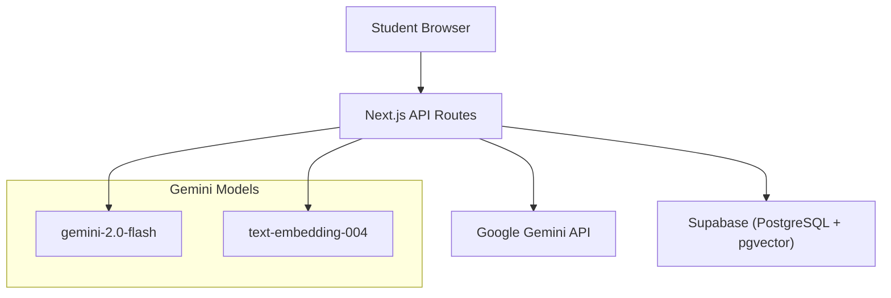
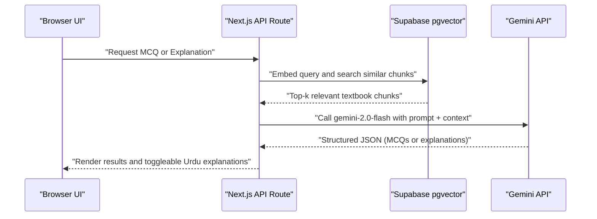
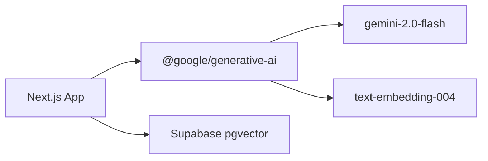

# Google Gemini API Integration

<cite>
**Referenced Files in This Document**
- [README.md](file://README.md)
- [.env.example](file://.env.example)
- [package-lock.json](file://package-lock.json)
- [Sidebar.tsx](file://src/components/layout/Sidebar.tsx)
- [page.tsx (results)](file://src/app/results/[session]/page.tsx)
</cite>

## Table of Contents
1. [Introduction](#introduction)
2. [Project Structure](#project-structure)
3. [Core Components](#core-components)
4. [Architecture Overview](#architecture-overview)
5. [Detailed Component Analysis](#detailed-component-analysis)
6. [Dependency Analysis](#dependency-analysis)
7. [Performance Considerations](#performance-considerations)
8. [Troubleshooting Guide](#troubleshooting-guide)
9. [Conclusion](#conclusion)

## Introduction
This document explains how MedAce AI integrates with the Google Gemini API to power two primary features:
- MCQ generation using gemini-2.0-flash
- Urdu explanation creation with multilingual support

It also covers authentication via the GEMINI_API_KEY environment variable, client configuration and connection management, request/response schemas, prompt templates, rate limiting strategies, error handling patterns, fallback mechanisms, embedding textbook content with text-embedding-004 for RAG, performance optimizations, and troubleshooting guidance.

## Project Structure
MedAce AI is a Next.js application that uses server-side API routes to call Gemini. The README documents the intended structure including:
- src/app/api/... routes for quiz generation, explanations, study plans
- src/lib/gemini/client.ts and prompts.ts for Gemini integration
- rag/scripts/embed.ts for embedding textbook chunks via Gemini
- Supabase pgvector for storing embeddings and retrieving relevant chunks at query time

The current repository snapshot includes UI pages and assets but not the full implementation of the API routes or lib modules referenced in the README. Where applicable, this document references the documented architecture and environment setup from the project files present in the workspace.

[No sources needed since this diagram shows conceptual workflow, not actual code structure]

**Section sources**
- [README.md:23-55](file://README.md#L23-L55)
- [README.md:163-226](file://README.md#L163-L226)

## Core Components
- Authentication and Configuration
  - The Gemini API key is provided via the GEMINI_API_KEY environment variable.
  - The .env.example file defines the required variables, including GEMINI_API_KEY.
- Client and Connection Management
  - The README indicates a dedicated Gemini client wrapper under src/lib/gemini/client.ts and prompt templates under src/lib/gemini/prompts.ts.
  - Embedding scripts under rag/scripts/embed.ts use Gemini’s text-embedding-004 model to vectorize textbook content.
- Primary Use Cases
  - MCQ generation: gemini-2.0-flash produces structured MCQs grounded in retrieved textbook chunks.
  - Urdu explanations: gemini-2.0-flash generates bilingual explanations on demand; UI supports toggling Urdu explanations per question.

**Section sources**
- [.env.example:9-10](file://.env.example#L9-L10)
- [README.md:208-213](file://README.md#L208-L213)
- [README.md:90-122](file://README.md#L90-L122)
- [README.md:172-173](file://README.md#L172-L173)
- [README.md:239-240](file://README.md#L239-L240)
- [Sidebar.tsx:65-70](file://src/components/layout/Sidebar.tsx#L65-L70)
- [page.tsx (results):258-284](file://src/app/results/[session]/page.tsx#L258-L284)

## Architecture Overview
The system follows a Retrieval-Augmented Generation (RAG) flow:
- Indexing phase: Clean raw textbook texts, chunk by SLO/headings, embed with text-embedding-004, and store vectors in Supabase pgvector.
- Query-time phase: Embed user queries, retrieve top-k relevant chunks via cosine similarity, build a Gemini prompt with context, and generate structured outputs (MCQs or explanations).

[No sources needed since this diagram shows conceptual workflow, not actual code structure]

**Section sources**
- [README.md:90-122](file://README.md#L90-L122)
- [README.md:23-55](file://README.md#L23-L55)

## Detailed Component Analysis

### Authentication and Environment Setup
- The Gemini API key must be set in the environment as GEMINI_API_KEY.
- The .env.example file provides the template for all required variables, including database and Supabase credentials alongside GEMINI_API_KEY.

Operational notes:
- Ensure GEMINI_API_KEY is configured in your runtime environment (e.g., Vercel environment variables) before deploying.
- Do not hardcode secrets in source code; rely on environment variables.

**Section sources**
- [.env.example:9-10](file://.env.example#L9-L10)
- [README.md:239-240](file://README.md#L239-L240)

### Client Configuration and Connection Management
- The README documents a Gemini client wrapper (src/lib/gemini/client.ts) and prompt templates (src/lib/gemini/prompts.ts).
- The dependency list confirms usage of @google/generative-ai SDK.
- Connection management should centralize initialization of the Gemini client using the environment-provided API key and reuse it across requests to minimize overhead.

Implementation pointers:
- Initialize the client once per process and export a singleton instance.
- Configure model names (gemini-2.0-flash for generation, text-embedding-004 for embeddings).
- Centralize timeout and retry policies in the client layer.

**Section sources**
- [README.md:208-213](file://README.md#L208-L213)
- [package-lock.json:1116-1124](file://package-lock.json#L1116-L1124)

### MCQ Generation with gemini-2.0-flash
- Purpose: Generate exam-style MCQs grounded in retrieved textbook chunks.
- Flow:
  - Retrieve relevant chunks from pgvector based on the user’s topic/difficulty context.
  - Build a prompt that includes system instructions, context chunks, and output schema requirements.
  - Call gemini-2.0-flash to return structured JSON containing questions, options, correct answers, and explanations.
  - Validate responses with Zod and persist to the database for later serving.

Prompt template characteristics (as documented):
- System role defining an MDCAT biology MCQ generator.
- Context section populated with retrieved chunks.
- Instruction to produce N MCQs with four options each.
- Output schema specifying fields such as question_text, options, answer, explanation_en, explanation_ur.

Response schema highlights:
- Array of MCQ objects with standardized fields for consistent rendering and evaluation.

**Section sources**
- [README.md:104-122](file://README.md#L104-L122)
- [README.md:208-213](file://README.md#L208-L213)

### Urdu Explanation Creation with Multilingual Support
- Purpose: Provide on-demand Urdu explanations for MCQs to improve comprehension.
- Flow:
  - When a student selects “Show Urdu Explanation,” the app calls an API route to generate explanation_ur for the selected question.
  - The backend constructs a prompt tailored to explain concepts in code-mixed Urdu while keeping technical terms in English.
  - The response is returned to the UI and rendered in a right-to-left friendly block.

User experience:
- The results page includes a toggle to show/hide Urdu explanations per question, demonstrating the feature’s integration into the learning flow.

**Section sources**
- [README.md:23-55](file://README.md#L23-L55)
- [README.md:104-122](file://README.md#L104-L122)
- [page.tsx (results):258-284](file://src/app/results/[session]/page.tsx#L258-L284)

### Embedding Textbook Content with text-embedding-004 for RAG
- Purpose: Vectorize textbook chapters to enable semantic retrieval during MCQ generation.
- Pipeline:
  - Clean raw text to remove OCR artifacts and noise.
  - Chunk by SLO codes and headings (~400–600 tokens per chunk with overlap).
  - Embed each chunk using text-embedding-004 to obtain 768-dimensional vectors.
  - Upload vectors to Supabase pgvector table for similarity search.

Indexing script:
- rag/scripts/embed.ts orchestrates embedding via Gemini and stores results for downstream retrieval.

**Section sources**
- [README.md:83-102](file://README.md#L83-L102)
- [README.md:172-173](file://README.md#L172-L173)

### Request/Response Schemas and Prompt Templates
- Request inputs:
  - Topic, difficulty, and optional constraints passed to the API route.
  - Retrieved chunks from pgvector used as context in the prompt.
- Prompt construction:
  - System message sets the role and task.
  - Context section injects relevant textbook excerpts.
  - Instruction specifies output format and number of items.
- Response validation:
  - Zod schemas enforce strict structure for MCQ arrays and explanation fields.
  - Invalid responses are rejected early to maintain data integrity.

Note: The exact TypeScript types and Zod schemas are defined in the project’s type definitions and validation modules referenced by the README.

**Section sources**
- [README.md:104-122](file://README.md#L104-L122)
- [README.md:208-213](file://README.md#L208-L213)

## Dependency Analysis
- Gemini SDK:
  - The project depends on @google/generative-ai for interacting with Gemini models.
- Models:
  - gemini-2.0-flash for generation tasks (MCQs and explanations).
  - text-embedding-004 for embedding textbook content.
- Database:
  - Supabase PostgreSQL with pgvector for storing and querying embeddings.

**Diagram sources**
- [package-lock.json:1116-1124](file://package-lock.json#L1116-L1124)
- [README.md:23-55](file://README.md#L23-L55)

**Section sources**
- [package-lock.json:1116-1124](file://package-lock.json#L1116-L1124)
- [README.md:23-55](file://README.md#L23-L55)

## Performance Considerations
- Batch Processing:
  - During indexing, batch embedding calls to text-embedding-004 to reduce overhead and respect rate limits.
  - Group MCQ generation requests when possible to amortize network costs.
- Caching Strategies:
  - Cache frequent topic embeddings and popular MCQ sets to avoid redundant calls.
  - Use TanStack Query caching on the client side for UI responsiveness.
- Timeout Configurations:
  - Set reasonable timeouts for Gemini calls to prevent long-running requests from blocking.
  - Implement retries with exponential backoff for transient errors.
- Model Selection:
  - gemini-2.0-flash offers speed and cost efficiency suitable for high-throughput scenarios.
  - text-embedding-004 provides compact 768-dim vectors for efficient storage and fast similarity search.

[No sources needed since this section provides general guidance]

## Troubleshooting Guide
Common issues and resolutions:
- API Quota Limits:
  - Symptom: Rate limit or quota exceeded errors from Gemini.
  - Resolution: Implement backoff and queueing; consider batching; monitor usage in the Google Cloud console.
- Network Timeouts:
  - Symptom: Requests timing out during generation or embedding.
  - Resolution: Increase timeouts judiciously; add retries; ensure stable network conditions; offload heavy work to background jobs if necessary.
- Response Validation Failures:
  - Symptom: Zod validation errors due to malformed Gemini responses.
  - Resolution: Strengthen prompt instructions; add post-processing to normalize output; log failures for analysis.
- Missing or Incorrect GEMINI_API_KEY:
  - Symptom: Authentication errors when calling Gemini.
  - Resolution: Verify GEMINI_API_KEY is set in the environment and accessible to the serverless function or runtime.

Operational tips:
- Log request payloads (sanitized) and response shapes to diagnose prompt issues.
- Add health checks for external dependencies (Gemini, Supabase).
- Use feature flags to roll back changes quickly if new prompts degrade quality.

**Section sources**
- [README.md:239-240](file://README.md#L239-L240)
- [README.md:104-122](file://README.md#L104-L122)

## Conclusion
MedAce AI leverages Google Gemini to deliver authentic, exam-aligned MCQs and on-demand Urdu explanations, powered by a robust RAG pipeline that indexes textbook content into pgvector. With careful configuration of GEMINI_API_KEY, thoughtful client setup, and strong validation and error-handling practices, the system provides scalable, performant, and user-friendly AI capabilities. Ongoing monitoring, caching, and rate-limit-aware design will ensure reliability as usage grows.

[No sources needed since this section summarizes without analyzing specific files]