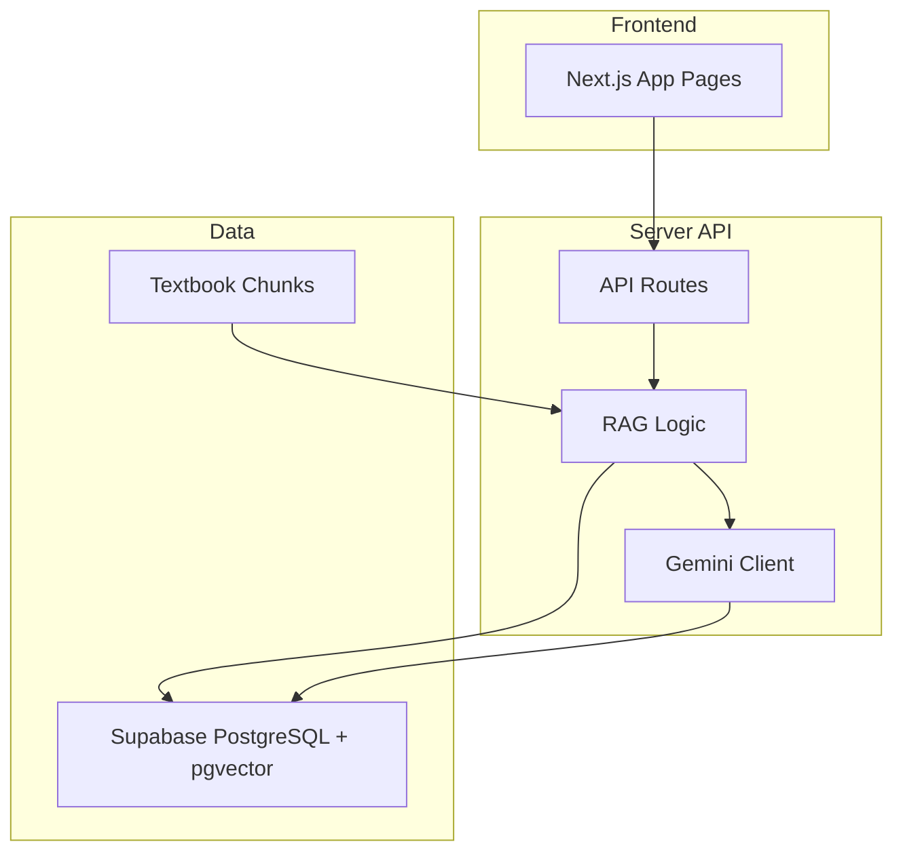
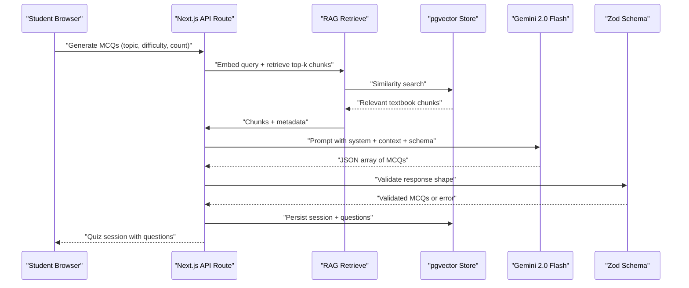
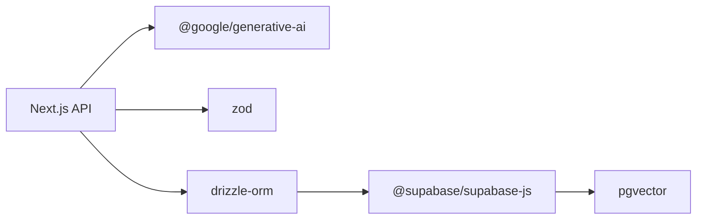
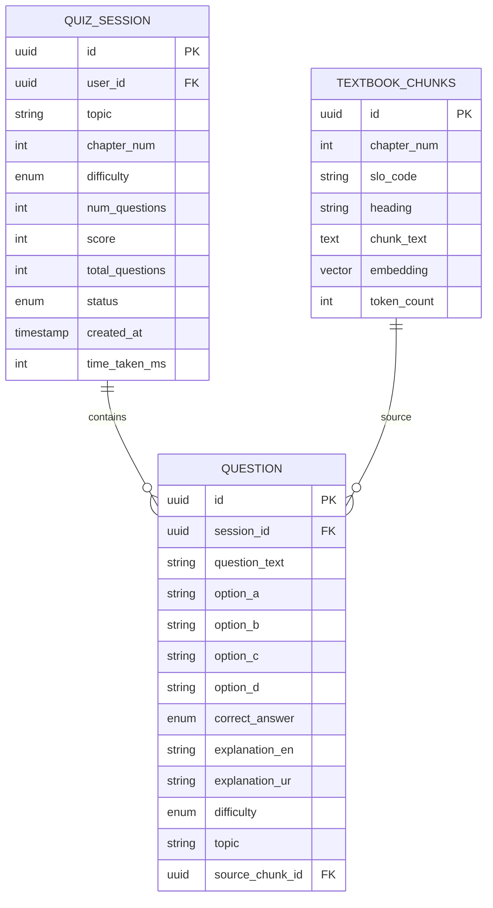

# MCQ Generation with Gemini 2.0 Flash

<cite>
**Referenced Files in This Document**
- [README.md](file://README.md)
- [package.json](file://package.json)
- [quiz.ts](file://src/types/quiz.ts)
- [Chapter_1_Digestive_System_of_Man_extracted.txt](file://rag/textbooks/Chapter_1_Digestive_System_of_Man_extracted.txt)
- [Chapter_9_Immunity_extracted.txt](file://rag/textbooks/Chapter_9_Immunity_extracted.txt)
</cite>

## Table of Contents
1. [Introduction](#introduction)
2. [Project Structure](#project-structure)
3. [Core Components](#core-components)
4. [Architecture Overview](#architecture-overview)
5. [Detailed Component Analysis](#detailed-component-analysis)
6. [Dependency Analysis](#dependency-analysis)
7. [Performance Considerations](#performance-considerations)
8. [Troubleshooting Guide](#troubleshooting-guide)
9. [Conclusion](#conclusion)
10. [Appendices](#appendices)

## Introduction
This document explains how MedAce AI generates MDCAT Biology multiple-choice questions using Google Gemini 2.0 Flash within a Retrieval-Augmented Generation (RAG) pipeline. It covers prompt engineering, context injection from textbook chunks, request structure, JSON output schema validation with Zod, error handling and fallbacks, and performance optimizations such as batching, caching, and rate limiting. The system ensures that generated questions are grounded in the official FSc Biology textbook content and provide bilingual explanations to support student understanding.

## Project Structure
The repository is organized around a Next.js application with server-side API routes for RAG-powered MCQ generation. Textbook chapters are stored under rag/textbooks and processed into vector embeddings for similarity search. The types for questions and sessions define the expected data contracts used throughout the app.

**Diagram sources**
- [README.md:23-78](file://README.md#L23-L78)
- [README.md:163-225](file://README.md#L163-L225)

**Section sources**
- [README.md:163-225](file://README.md#L163-L225)

## Core Components
- Gemini 2.0 Flash integration for MCQ generation and Urdu explanations.
- RAG retrieval over Supabase pgvector using text-embedding-004.
- Prompt templates for system instructions, context injection, and structured output.
- Zod schemas for validating Gemini responses and enforcing strict JSON contracts.
- Types defining Question, QuizSession, and related entities.

Key responsibilities:
- Retrieve relevant textbook chunks based on topic and difficulty.
- Build prompts that ground question generation in retrieved content.
- Validate and normalize Gemini outputs before storage and display.
- Persist sessions, questions, and answers; track weak topics.

**Section sources**
- [README.md:79-122](file://README.md#L79-L122)
- [quiz.ts:15-50](file://src/types/quiz.ts#L15-L50)

## Architecture Overview
The query-time pipeline embeds the user’s topic and difficulty, retrieves top-k textbook chunks via cosine similarity, constructs a Gemini prompt with system instructions and injected context, requests structured JSON output, validates it with Zod, stores results, and serves them to the client.

**Diagram sources**
- [README.md:104-122](file://README.md#L104-L122)
- [README.md:23-78](file://README.md#L23-L78)

## Detailed Component Analysis

### Prompt Engineering Approach
- System prompt defines role, exam alignment (MDCAT), and output contract (structured JSON).
- Context injection includes retrieved textbook chunks with SLO codes and headings to ground questions.
- Instructions specify difficulty level, number of questions, and bilingual explanations (English and Urdu).
- Output schema requires options A–D, correct answer, and explanations in both languages.

Best practices:
- Keep context concise and relevant to avoid token bloat.
- Use explicit field names and constraints to reduce hallucination.
- Include examples of valid JSON in the prompt when necessary.

**Section sources**
- [README.md:104-122](file://README.md#L104-L122)

### Request Structure
Typical inputs include:
- Topic selection (e.g., “Digestive System”, “Immunity”)
- Difficulty levels: Easy, Medium, Hard, Mixed
- Question count parameter (N)
- Optional filters by chapter or SLO code

Example request payload fields:
- topic: string
- difficulty: "Easy" | "Medium" | "Hard" | "Mixed"
- numQuestions: number
- chapterNum?: number
- sloCode?: string

These parameters guide chunk retrieval and prompt construction.

**Section sources**
- [quiz.ts:37-50](file://src/types/quiz.ts#L37-L50)
- [README.md:104-122](file://README.md#L104-L122)

### RAG Integration and Context Injection
- Embed the query using text-embedding-004.
- Perform cosine similarity search against textbook_chunks in pgvector.
- Retrieve top-k chunks (e.g., top 5) with metadata (chapter, SLO, heading).
- Inject these chunks into the Gemini prompt as grounding context.

Benefits:
- Ensures syllabus-aligned questions.
- Reduces hallucinations by constraining generation to verified content.

**Section sources**
- [README.md:79-122](file://README.md#L79-L122)

### Output Schema Validation with Zod
- Define a Zod schema matching the Question interface:
  - Fields: questionText, optionA/B/C/D, correctAnswer (A–D), explanationEn, explanationUr, difficulty, topic.
- Validate Gemini’s JSON response strictly; reject malformed payloads.
- On validation failure, trigger retry or fallback logic.

Validation outcomes:
- Success: proceed to persist and serve.
- Failure: log error, attempt retry with refined prompt, or return a safe fallback.

**Section sources**
- [quiz.ts:15-28](file://src/types/quiz.ts#L15-L28)
- [README.md:117-122](file://README.md#L117-L122)

### Response Processing and Storage
- Normalize validated MCQs into the Question type.
- Create a QuizSession with topic, difficulty, numQuestions, status, and timestamps.
- Store questions linked to the session and optionally source_chunk_id for traceability.
- Track user answers and update weak topics based on performance.

**Section sources**
- [README.md:124-161](file://README.md#L124-L161)
- [quiz.ts:37-50](file://src/types/quiz.ts#L37-L50)

### Error Handling and Fallback Mechanisms
Common errors:
- Gemini API failures (network, quota, model unavailable)
- Malformed JSON responses
- Chunk retrieval failures (no relevant content)

Fallback strategies:
- Retry with exponential backoff and reduced temperature.
- Narrow context (fewer chunks or stricter filters).
- Return cached or previously generated questions if available.
- Surface user-friendly errors and allow manual regeneration.

**Section sources**
- [README.md:104-122](file://README.md#L104-L122)

### Performance Optimization Techniques
- Batch processing:
  - Generate multiple questions per Gemini call to reduce latency and cost.
  - Aggregate retries and cache results at the batch level.
- Caching strategies:
  - Cache frequent topic/difficulty combinations.
  - Cache chunk retrieval results for identical queries.
  - Use TanStack Query for client-side caching and optimistic updates.
- Rate limiting:
  - Implement server-side throttling per user/IP.
  - Respect Gemini API quotas and backpressure signals.
- Efficient retrieval:
  - Limit top-k chunks to balance relevance and token usage.
  - Precompute embeddings during build-time indexing.

**Section sources**
- [README.md:79-122](file://README.md#L79-L122)
- [README.md:280-290](file://README.md#L280-L290)

## Dependency Analysis
Core dependencies and their roles:
- @google/generative-ai: SDK for Gemini API calls.
- zod: Runtime schema validation for inputs and outputs.
- drizzle-orm: Type-safe database interactions.
- @supabase/supabase-js: Client for PostgreSQL and pgvector.
- next: Framework for API routes and server components.

**Diagram sources**
- [package.json:11-26](file://package.json#L11-L26)
- [README.md:23-78](file://README.md#L23-L78)

**Section sources**
- [package.json:11-26](file://package.json#L11-L26)
- [README.md:23-78](file://README.md#L23-L78)

## Performance Considerations
- Prefer gemini-2.0-flash for speed and cost efficiency.
- Use text-embedding-004 for multilingual embeddings with smaller vector size.
- Minimize prompt length by selecting only the most relevant chunks.
- Leverage TanStack Query for efficient client-side state and caching.
- Monitor API latency and adjust batch sizes accordingly.

[No sources needed since this section provides general guidance]

## Troubleshooting Guide
Symptoms and resolutions:
- No questions generated:
  - Verify chunk retrieval returns relevant content.
  - Check Gemini API key and quotas.
  - Ensure Zod schema matches expected output.
- Frequent validation errors:
  - Inspect raw Gemini response for missing fields or wrong types.
  - Tighten prompt instructions and add examples if needed.
- Slow responses:
  - Reduce top-k chunks or question count.
  - Enable caching for repeated queries.
  - Apply rate limiting to prevent overload.

Operational checks:
- Confirm environment variables are set correctly.
- Validate database connectivity and pgvector index health.
- Log errors with context (topic, difficulty, chunk IDs).

**Section sources**
- [README.md:228-244](file://README.md#L228-L244)
- [README.md:104-122](file://README.md#L104-L122)

## Conclusion
MedAce AI’s MCQ generation leverages Gemini 2.0 Flash within a robust RAG pipeline to produce syllabus-grounded, high-quality questions with bilingual explanations. By combining precise prompt engineering, strict schema validation, and performance-focused design, the system delivers reliable, scalable quiz generation tailored to MDCAT Biology preparation.

[No sources needed since this section summarizes without analyzing specific files]

## Appendices

### Data Models

**Diagram sources**
- [README.md:124-161](file://README.md#L124-L161)

### Example Textbook Sources
- Digestive System chapter content used for grounding questions.
- Immunity chapter content used for modern topics coverage.

**Section sources**
- [Chapter_1_Digestive_System_of_Man_extracted.txt](file://rag/textbooks/Chapter_1_Digestive_System_of_Man_extracted.txt)
- [Chapter_9_Immunity_extracted.txt](file://rag/textbooks/Chapter_9_Immunity_extracted.txt)