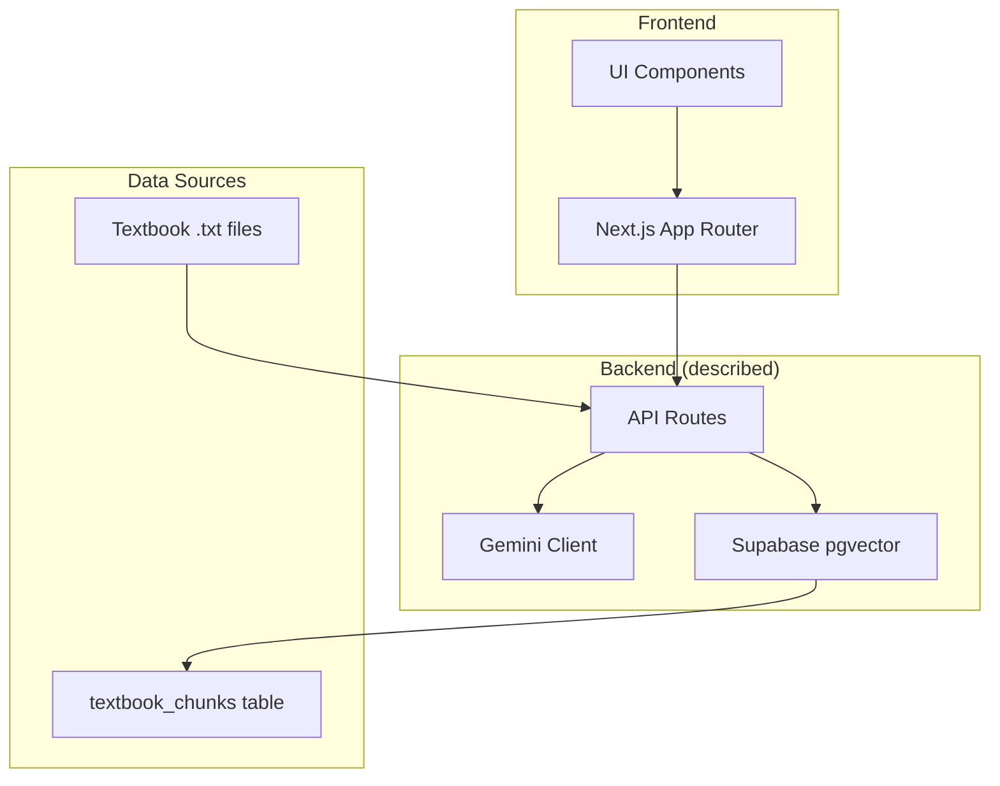
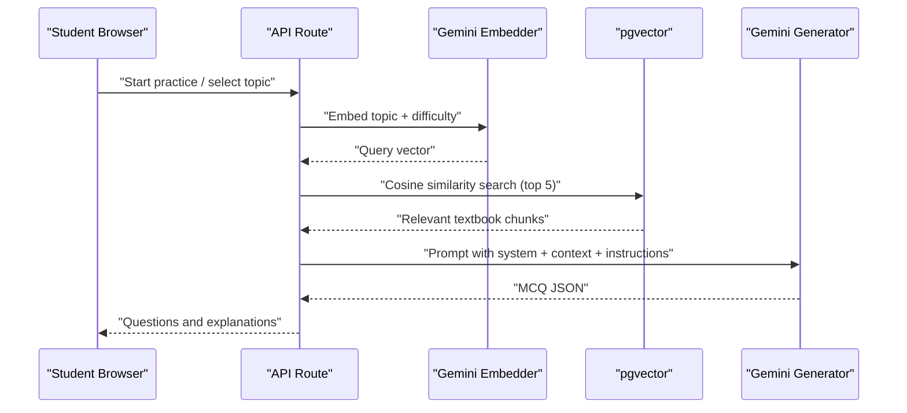
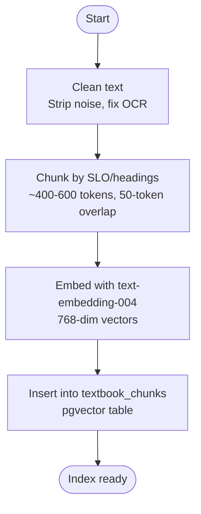
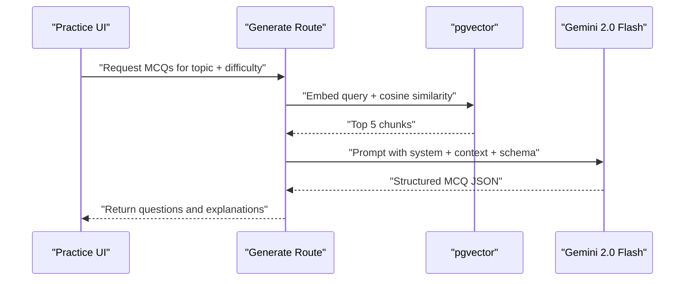
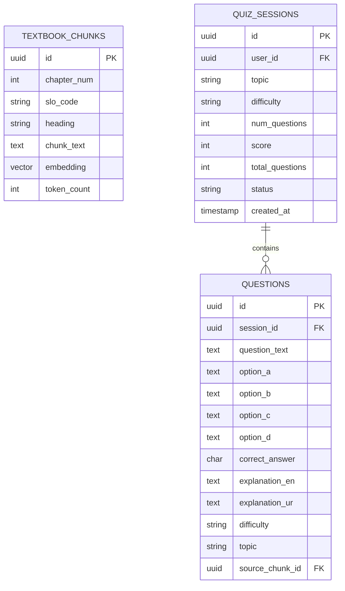
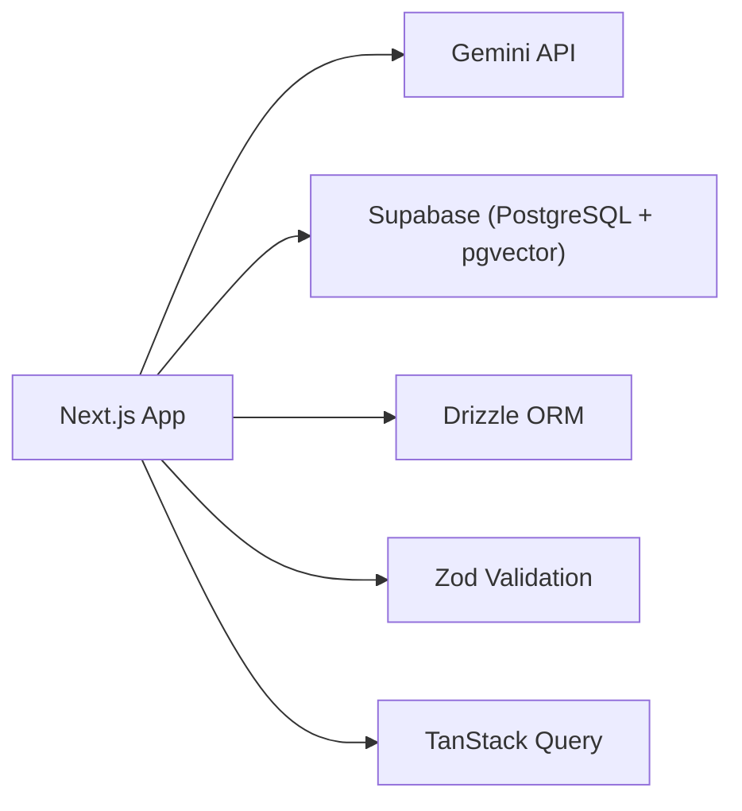

# Text Embeddings & RAG Pipeline

<cite>
**Referenced Files in This Document**
- [README.md](file://README.md)
- [package.json](file://package.json)
- [src/types/quiz.ts](file://src/types/quiz.ts)
- [src/lib/utils.ts](file://src/lib/utils.ts)
- [src/middleware.ts](file://src/middleware.ts)
</cite>

## Table of Contents
1. [Introduction](#introduction)
2. [Project Structure](#project-structure)
3. [Core Components](#core-components)
4. [Architecture Overview](#architecture-overview)
5. [Detailed Component Analysis](#detailed-component-analysis)
6. [Dependency Analysis](#dependency-analysis)
7. [Performance Considerations](#performance-considerations)
8. [Troubleshooting Guide](#troubleshooting-guide)
9. [Conclusion](#conclusion)
10. [Appendices](#appendices)

## Introduction
This document explains the text embedding and Retrieval-Augmented Generation (RAG) pipeline used to generate MCQs grounded in FSc Biology textbook content. The system uses Google’s text-embedding-004 model to convert textbook chunks into 768-dimensional vectors stored in Supabase pgvector. At query time, student topics are embedded and matched against stored chunks via cosine similarity to retrieve relevant context for MCQ generation with Gemini 2.0 Flash.

The repository currently provides a frontend-only implementation with mock data; however, the README documents the complete build-time indexing and query-time retrieval pipelines that integrate embeddings, vector storage, and LLM-based generation.

**Section sources**
- [README.md:23-77](file://README.md#L23-L77)
- [README.md:83-122](file://README.md#L83-L122)

## Project Structure
The project is organized as a Next.js application with UI components, types, and utilities. The RAG-related documentation describes:
- Build-time scripts under rag/scripts for cleaning, chunking, embedding, and uploading textbook content.
- Query-time API routes under src/app/api for generating MCQs using retrieved context.
- Vector storage in Supabase PostgreSQL with pgvector for similarity search.

**Diagram sources**
- [README.md:163-226](file://README.md#L163-L226)

**Section sources**
- [README.md:163-226](file://README.md#L163-L226)

## Core Components
- Data source: 15 chapters of FSc Biology textbooks structured by SLO codes and headings.
- Chunking strategy: Split by SLO codes and headings into ~400–600 token chunks with 50-token overlap.
- Embedding model: Google text-embedding-004 producing 768-dim vectors.
- Vector store: Supabase pgvector table textbook_chunks storing chapter_num, slo_code, heading, chunk_text, embedding, token_count.
- Query-time retrieval: Embed topic + difficulty context, perform cosine similarity search to retrieve top 5 chunks.
- Generation: Build a Gemini prompt with system instruction, retrieved context, and JSON schema output; validate with Zod and persist results.

Key runtime types used by the app include Topic, Question, QuizSession, and related structures, which align with the generated MCQs and session tracking.

**Section sources**
- [README.md:83-122](file://README.md#L83-L122)
- [README.md:124-161](file://README.md#L124-L161)
- [src/types/quiz.ts:5-50](file://src/types/quiz.ts#L5-L50)

## Architecture Overview
The architecture integrates three main phases:
- Build-time indexing: Clean → Chunk → Embed → Upload to pgvector.
- Query-time retrieval: Embed query → Cosine similarity → Retrieve top chunks.
- Generation: Prompt assembly with context → Gemini 2.0 Flash → Structured MCQ JSON → Validation and storage.

**Diagram sources**
- [README.md:90-122](file://README.md#L90-L122)

## Detailed Component Analysis

### Build-Time Indexing Pipeline
- Input: Raw textbook .txt files per chapter.
- Cleaning: Strip watermarks, page markers, fix OCR artifacts.
- Chunking: Split by SLO codes and headings into ~400–600 token chunks with 50-token overlap.
- Embedding: Use Gemini text-embedding-004 to produce 768-dim vectors.
- Storage: Insert into Supabase pgvector table textbook_chunks with metadata (chapter_num, slo_code, heading, chunk_text, token_count).

**Diagram sources**
- [README.md:90-102](file://README.md#L90-L102)

**Section sources**
- [README.md:90-102](file://README.md#L90-L102)

### Query-Time Retrieval and Generation
- Embed the student’s selected topic along with difficulty context.
- Perform cosine similarity search in pgvector to retrieve top 5 relevant chunks.
- Assemble a Gemini prompt including:
  - System instruction for MDCAT biology MCQ generation.
  - Retrieved textbook chunks as context.
  - Instruction to generate N MCQs with four options each.
  - Output schema: question, options, answer, explanation_en, explanation_ur.
- Validate output with Zod and store in the database for serving to students.

**Diagram sources**
- [README.md:104-122](file://README.md#L104-L122)

**Section sources**
- [README.md:104-122](file://README.md#L104-L122)

### Data Model and Types
- Database tables include users, quiz_sessions, questions, user_answers, weak_topics, study_plans, and textbook_chunks.
- The textbook_chunks table stores chunk metadata and the 768-dim embedding vector for similarity search.
- Frontend types define Question, QuizSession, UserAnswer, and other structures used during practice sessions.

**Diagram sources**
- [README.md:124-161](file://README.md#L124-L161)

**Section sources**
- [README.md:124-161](file://README.md#L124-L161)
- [src/types/quiz.ts:5-50](file://src/types/quiz.ts#L5-L50)

## Dependency Analysis
- Framework and runtime: Next.js 15 with React 19 and TypeScript 5.
- AI services: Google Gemini 2.0 Flash for generation and text-embedding-004 for embeddings.
- Database and vector store: Supabase PostgreSQL with pgvector for similarity search.
- ORM and validation: Drizzle ORM for type-safe queries; Zod for runtime validation of inputs/outputs.
- State management: TanStack Query for caching and optimistic updates.

**Diagram sources**
- [README.md:23-77](file://README.md#L23-L77)
- [package.json:11-26](file://package.json#L11-L26)

**Section sources**
- [README.md:23-77](file://README.md#L23-L77)
- [package.json:11-26](file://package.json#L11-L26)

## Performance Considerations
- Embedding dimensions: 768-dim vectors from text-embedding-004 balance accuracy and storage efficiency.
- Batch processing: For large datasets, process chunks in batches to reduce API overhead and improve throughput during indexing.
- Retrieval optimization:
  - Use cosine similarity in pgvector to efficiently find top-k relevant chunks.
  - Limit retrieval to top 5 chunks to minimize prompt size and latency.
  - Cache frequent topic embeddings or results where appropriate to reduce repeated computation.
- Prompt engineering: Keep prompts concise and focused on syllabus-aligned SLOs to reduce token usage and cost.
- Cold starts and serverless: Leverage Drizzle ORM and minimal dependencies for faster cold starts on Vercel.

[No sources needed since this section provides general guidance]

## Troubleshooting Guide
- Authentication middleware: The middleware currently allows all routes through in development; enable Supabase session checks when integrating auth.
- Environment variables: Ensure NEXT_PUBLIC_SUPABASE_URL, NEXT_PUBLIC_SUPABASE_ANON_KEY, SUPABASE_SERVICE_ROLE_KEY, DATABASE_URL, and GEMINI_API_KEY are configured before running indexing or API routes.
- Indexing steps: Run clean → chunk → embed → upload sequentially to ensure consistent state of textbook_chunks.
- Validation errors: If MCQ generation fails, verify Zod schemas and Gemini response formats match expected structure.

**Section sources**
- [src/middleware.ts:14-35](file://src/middleware.ts#L14-L35)
- [README.md:228-244](file://README.md#L228-L244)

## Conclusion
The RAG pipeline integrates textbook content into a searchable vector index using Google’s text-embedding-004 and Supabase pgvector. During practice sessions, student topics are embedded and matched against stored chunks to retrieve relevant context for MCQ generation with Gemini 2.0 Flash. The design emphasizes syllabus alignment via SLO-based chunking, efficient retrieval with cosine similarity, and robust validation for reliable MCQ outputs. While the current workspace contains a frontend-only implementation, the documented pipelines provide a clear blueprint for full-stack integration.

[No sources needed since this section summarizes without analyzing specific files]

## Appendices
- Getting started commands for setting up environment variables, migrations, and building the RAG index are provided in the README.
- The project structure outlines where scripts and API routes would reside once implemented.

**Section sources**
- [README.md:292-314](file://README.md#L292-L314)
- [README.md:163-226](file://README.md#L163-L226)