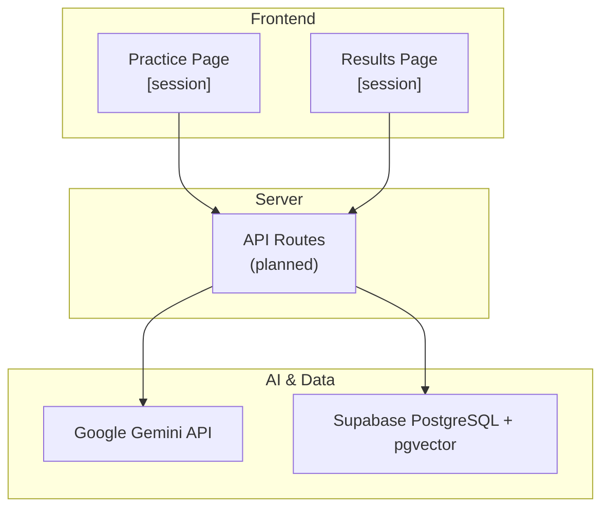
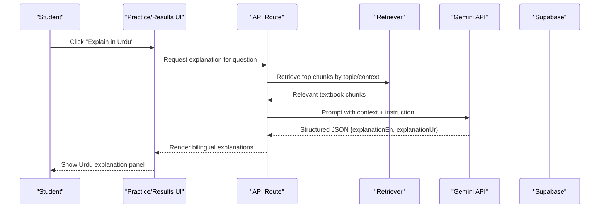
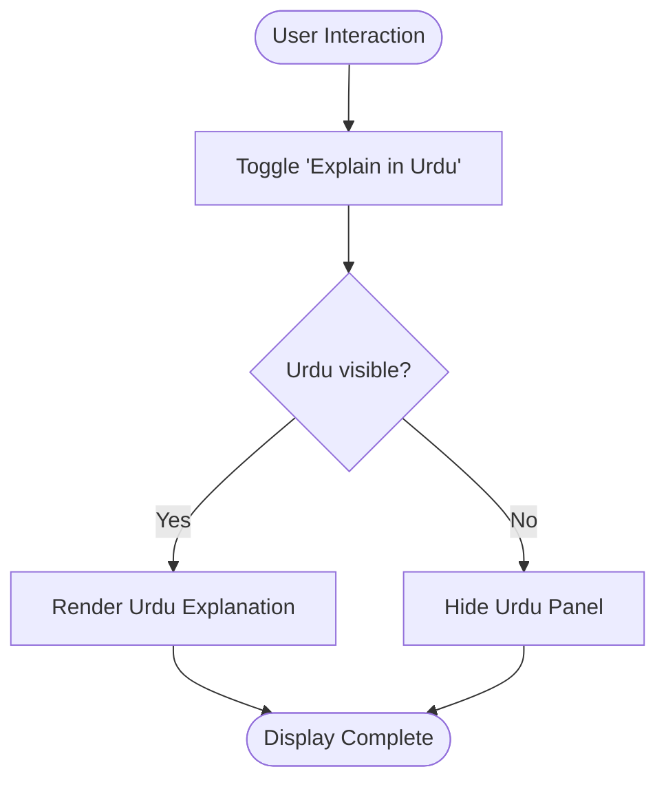
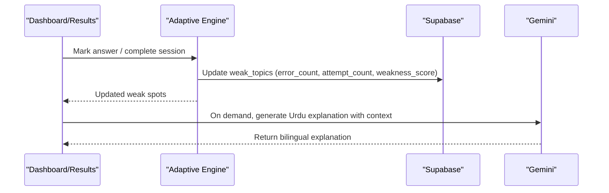
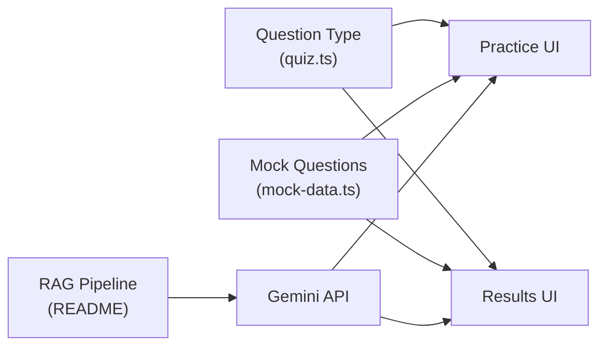

# Urdu Explanation Generation

<cite>
**Referenced Files in This Document**
- [README.md](file://README.md)
- [quiz.ts](file://src/types/quiz.ts)
- [mock-data.ts](file://src/lib/mock-data.ts)
- [practice session page.tsx](file://src/app/practice/[session]/page.tsx)
- [results session page.tsx](file://src/app/results/[session]/page.tsx)
</cite>

## Table of Contents
1. Introduction
2. Project Structure
3. Core Components
4. Architecture Overview
5. Detailed Component Analysis
6. Dependency Analysis
7. Performance Considerations
8. Troubleshooting Guide
9. Conclusion

## Introduction
This document explains how MedAce AI generates Urdu explanations for MDCAT practice questions using Google Gemini. The system uses a multilingual prompting strategy to produce code-mixed Urdu-English explanations that keep technical terms in English while explaining reasoning in Urdu. It covers prompt templates, context sources (incorrect answers, student performance data, topic knowledge), response formatting for UI display, integration with the practice engine, and quality assurance measures including content filtering and localization considerations for Pakistani students.

## Project Structure
The project is a Next.js 15 application with React components for the practice and results flows. The explanation feature integrates into:
- Practice flow: on-demand “Explain in Urdu” toggle per question
- Results flow: per-question Urdu explanation toggle after completion
- Data model: Question type includes both English and Urdu explanations
- RAG pipeline: textbook chunks indexed via embeddings; Gemini used for generation

**Diagram sources**
- [README.md:25-55](file://README.md#L25-L55)
- [practice session page.tsx:195-213](file://src/app/practice/[session]/page.tsx#L195-L213)
- [results session page.tsx:258-284](file://src/app/results/[session]/page.tsx#L258-L284)

**Section sources**
- [README.md:25-55](file://README.md#L25-L55)
- [README.md:79-122](file://README.md#L79-L122)

## Core Components
- Question model with bilingual explanations:
  - Fields include question text, options, correct answer, difficulty, topic, and both English and Urdu explanations.
- Mock data demonstrates realistic bilingual explanations for Nervous System topics.
- UI toggles allow students to reveal Urdu explanations during practice and results.

Key responsibilities:
- Types define the contract for explanations (both languages).
- Mock data provides sample bilingual explanations for development and testing.
- Practice and Results pages render explanations conditionally based on user interaction.

**Section sources**
- [quiz.ts:15-28](file://src/types/quiz.ts#L15-L28)
- [mock-data.ts:69-210](file://src/lib/mock-data.ts#L69-L210)
- [practice session page.tsx:195-213](file://src/app/practice/[session]/page.tsx#L195-L213)
- [results session page.tsx:258-284](file://src/app/results/[session]/page.tsx#L258-L284)

## Architecture Overview
The explanation generation follows a Retrieval-Augmented Generation (RAG) approach:
- Build-time indexing: textbook chapters are cleaned, chunked by SLO codes/headings, embedded with Gemini embeddings, and stored in pgvector.
- Query-time generation: when a student needs an explanation, the system retrieves relevant textbook chunks, builds a Gemini prompt with context and instructions, and returns structured output containing both English and Urdu explanations.

**Diagram sources**
- [README.md:79-122](file://README.md#L79-L122)
- [practice session page.tsx:195-213](file://src/app/practice/[session]/page.tsx#L195-L213)
- [results session page.tsx:258-284](file://src/app/results/[session]/page.tsx#L258-L284)

## Detailed Component Analysis

### Multilingual Prompting Strategy
- Goal: Generate code-mixed Urdu-English explanations where technical terms remain in English and reasoning is explained in Urdu.
- Inputs to the prompt:
  - Context from incorrect answers and weak-spot signals
  - Student performance data (topic accuracy, error counts)
  - Topic-specific knowledge retrieved from textbook chunks
- Output format: Structured JSON with fields for English and Urdu explanations, ensuring consistent rendering across UI.

Implementation notes:
- The README documents the query-time pipeline that builds a Gemini prompt with system instruction, retrieved context, and output schema including explanation fields.
- The types and mock data confirm the presence of both explanation fields and demonstrate code-mixed style.

**Section sources**
- [README.md:79-122](file://README.md#L79-L122)
- [quiz.ts:15-28](file://src/types/quiz.ts#L15-L28)
- [mock-data.ts:69-210](file://src/lib/mock-data.ts#L69-L210)

### Prompt Templates
- System role: Instructs the model to act as an MDCAT biology MCQ/explanation generator aligned with the syllabus.
- Context injection: Retrieved textbook chunks relevant to the topic and question.
- Instruction: Generate structured output with both English and Urdu explanations, preserving technical terms in English and explaining reasoning in Urdu.
- Output schema: JSON with fields for explanationEn and explanationUr, validated at runtime.

Note: The exact template strings are not included here; refer to the repository’s prompt definitions referenced in the README’s architecture section.

**Section sources**
- [README.md:79-122](file://README.md#L79-L122)

### Response Formatting for UI Display
- Bilingual fields: Both explanationEn and explanationUr are part of the Question type.
- UI behavior:
  - Practice page: Toggle button shows/hides Urdu explanation panel per question.
  - Results page: Toggle button reveals Urdu explanation for each question post-session.
- Rendering:
  - Urdu panels use RTL-friendly attributes and styling for readability.
  - Technical terms remain in English within Urdu text, matching pedagogical goals.

**Diagram sources**
- [practice session page.tsx:195-213](file://src/app/practice/[session]/page.tsx#L195-L213)
- [results session page.tsx:258-284](file://src/app/results/[session]/page.tsx#L258-L284)

**Section sources**
- [quiz.ts:15-28](file://src/types/quiz.ts#L15-L28)
- [practice session page.tsx:195-213](file://src/app/practice/[session]/page.tsx#L195-L213)
- [results session page.tsx:258-284](file://src/app/results/[session]/page.tsx#L258-L284)

### Integration Points with Practice Engine
- Weak-spot detection: Dashboard and results surfaces weak topics and updates them after sessions.
- Triggering explanations:
  - During practice: Students can request Urdu explanations per question.
  - After results: Students can view Urdu explanations for any question.
- Adaptive loop: Repeated mistakes in a topic increase weakness scores, which can be used to prioritize retrieval and tailor prompts for more targeted explanations.

**Diagram sources**
- [dashboard page.tsx:90-138](file://src/app/dashboard/page.tsx#L90-L138)
- [results session page.tsx:129-138](file://src/app/results/[session]/page.tsx#L129-L138)
- [README.md:79-122](file://README.md#L79-L122)

**Section sources**
- [dashboard page.tsx:90-138](file://src/app/dashboard/page.tsx#L90-L138)
- [results session page.tsx:129-138](file://src/app/results/[session]/page.tsx#L129-L138)
- [README.md:79-122](file://README.md#L79-L122)

### Quality Assurance, Content Filtering, and Localization
- Validation:
  - Use Zod to validate Gemini outputs against the expected schema before storing or rendering.
- Content filtering:
  - Ensure explanations avoid sensitive or inappropriate content; enforce educational tone aligned with MDCAT standards.
- Localization:
  - Preserve technical terms in English to match exam language.
  - Explain reasoning in code-mixed Urdu suitable for Pakistani students.
  - Use RTL-friendly rendering for Urdu panels.

**Section sources**
- [README.md:79-122](file://README.md#L79-L122)
- [quiz.ts:15-28](file://src/types/quiz.ts#L15-L28)
- [practice session page.tsx:195-213](file://src/app/practice/[session]/page.tsx#L195-L213)
- [results session page.tsx:258-284](file://src/app/results/[session]/page.tsx#L258-L284)

## Dependency Analysis
- Frontend components depend on the Question type for bilingual fields.
- Mock data provides example explanations for development and testing.
- The RAG pipeline depends on textbook chunks and Gemini for generation.
- The practice and results pages integrate with the explanation feature via UI toggles.

**Diagram sources**
- [quiz.ts:15-28](file://src/types/quiz.ts#L15-L28)
- [mock-data.ts:69-210](file://src/lib/mock-data.ts#L69-L210)
- [README.md:79-122](file://README.md#L79-L122)
- [practice session page.tsx:195-213](file://src/app/practice/[session]/page.tsx#L195-L213)
- [results session page.tsx:258-284](file://src/app/results/[session]/page.tsx#L258-L284)

**Section sources**
- [quiz.ts:15-28](file://src/types/quiz.ts#L15-L28)
- [mock-data.ts:69-210](file://src/lib/mock-data.ts#L69-L210)
- [README.md:79-122](file://README.md#L79-L122)

## Performance Considerations
- Caching: Cache generated explanations per question/topic to reduce repeated calls to Gemini.
- Chunk size: Keep textbook chunks concise (as documented) to improve retrieval relevance and reduce token usage.
- Streaming: Consider streaming responses for faster perceived latency in UI.
- Rate limiting: Implement server-side rate limits to protect Gemini API quotas.

[No sources needed since this section provides general guidance]

## Troubleshooting Guide
- Missing Urdu field:
  - Ensure the Question type includes explanationUr and that the Gemini output schema enforces it.
- Incorrect rendering:
  - Verify RTL attributes and font classes are applied to Urdu panels.
- Weak spot triggers not surfacing explanations:
  - Confirm weak_topic updates occur after sessions and that retrieval logic uses updated scores.
- Validation failures:
  - Check Zod schemas and ensure Gemini output matches expected structure.

**Section sources**
- [quiz.ts:15-28](file://src/types/quiz.ts#L15-L28)
- [practice session page.tsx:195-213](file://src/app/practice/[session]/page.tsx#L195-L213)
- [results session page.tsx:258-284](file://src/app/results/[session]/page.tsx#L258-L284)
- [README.md:79-122](file://README.md#L79-L122)

## Conclusion
MedAce AI’s Urdu explanation generation leverages a multilingual prompting strategy grounded in RAG to deliver code-mixed explanations tailored for Pakistani students. The system preserves technical terms in English while explaining reasoning in Urdu, integrates seamlessly into the practice and results flows, and supports adaptive learning through weak-spot tracking. With validation, filtering, and localization safeguards, the feature enhances understanding without compromising the authenticity of the exam experience.