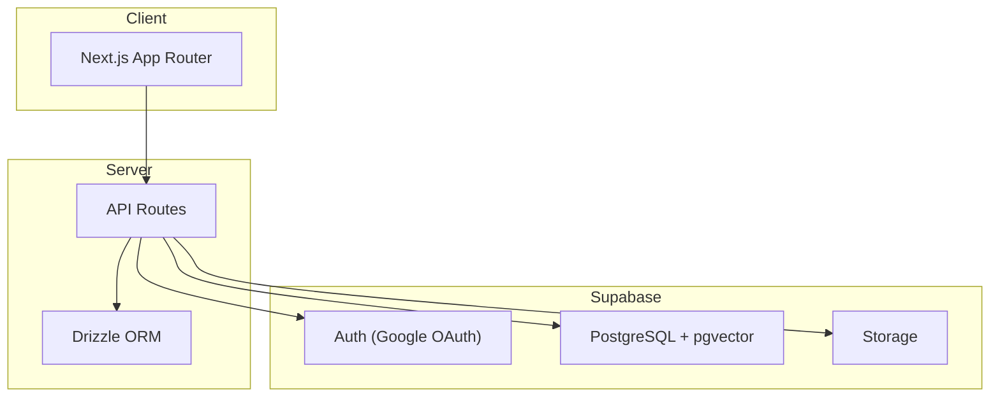
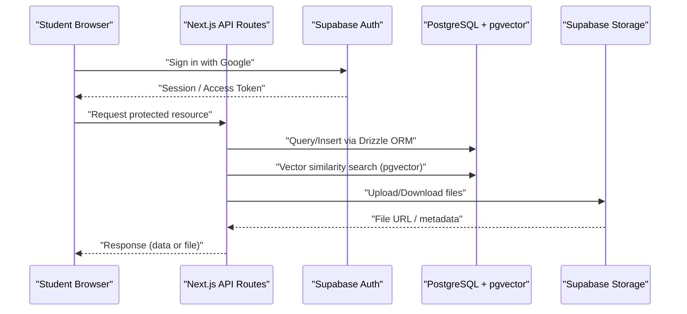
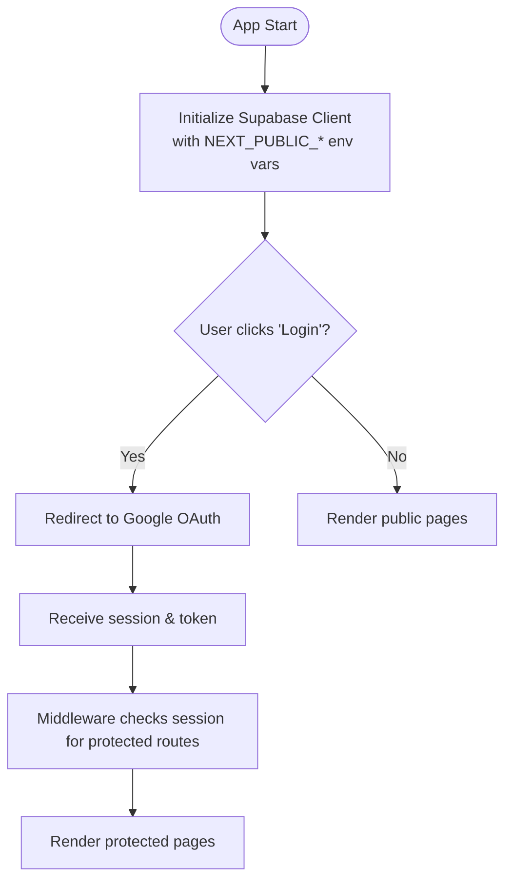
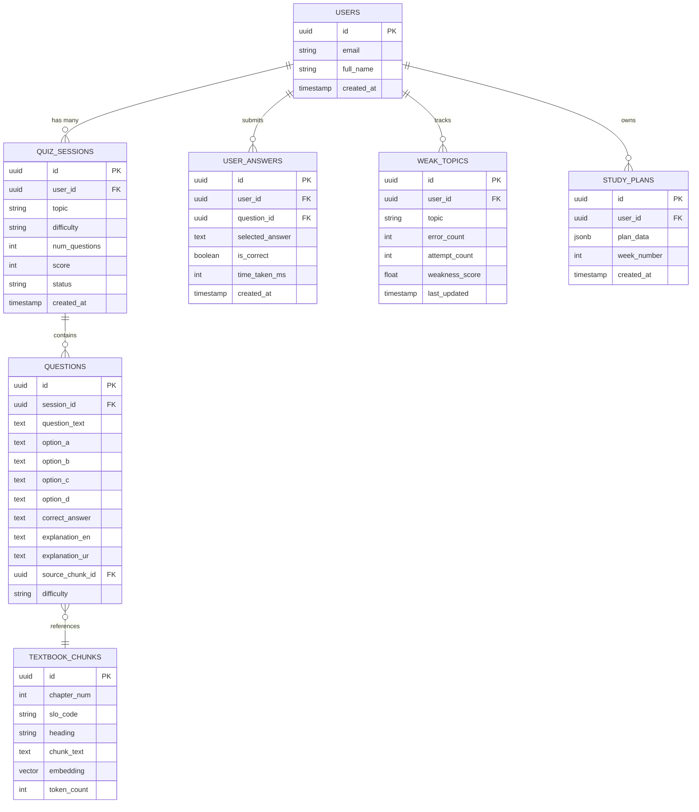
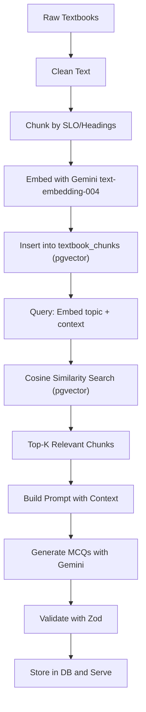
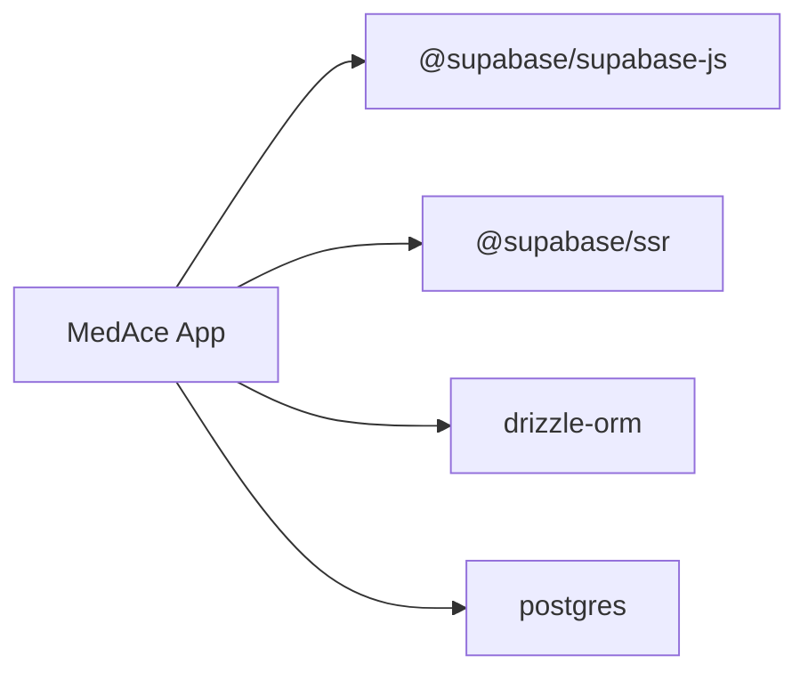

# Supabase Backend Integration

<cite>
**Referenced Files in This Document**
- [README.md](file://README.md)
- [package.json](file://package.json)
- [src/middleware.ts](file://src/middleware.ts)
- [src/components/auth/AuthProvider.tsx](file://src/components/auth/AuthProvider.tsx)
</cite>

## Table of Contents
1. Introduction
2. Project Structure
3. Core Components
4. Architecture Overview
5. Detailed Component Analysis
6. Dependency Analysis
7. Performance Considerations
8. Troubleshooting Guide
9. Conclusion
10. Appendices

## Introduction
This document provides comprehensive guidance for integrating Supabase into the MedAce AI application, focusing on authentication, database operations with Drizzle ORM and pgvector, storage capabilities, security policies, and production readiness. It consolidates environment configuration, schema design, RAG pipeline integration, and operational best practices to help teams implement secure, scalable, and maintainable backend flows using Supabase PostgreSQL, Auth, Storage, and Vector search.

## Project Structure
The project is a Next.js 15 application that integrates Supabase for authentication, database (PostgreSQL), vector search (pgvector), and storage. The README outlines the intended architecture and file layout, including API routes for quiz generation, explanations, study plans, and OAuth callbacks, as well as Drizzle ORM usage for type-safe database access.

**Diagram sources**
- [README.md:25-54](file://README.md#L25-L54)

**Section sources**
- [README.md:163-226](file://README.md#L163-L226)

## Core Components
- Authentication: Supabase Auth with Google OAuth; client-side setup via NEXT_PUBLIC_SUPABASE_URL and NEXT_PUBLIC_SUPABASE_ANON_KEY; server-side protected operations using SUPABASE_SERVICE_ROLE_KEY.
- Database: PostgreSQL with Drizzle ORM for migrations and type-safe queries; schema includes users, quiz_sessions, questions, user_answers, weak_topics, textbook_chunks, and study_plans.
- Vector Search: pgvector enables cosine similarity retrieval for RAG-based MCQ generation from textbook chunks.
- Storage: Supabase Storage for file uploads and downloads with row-level security and policies.
- Middleware: Route protection scaffolding for future Supabase session checks.

**Section sources**
- [README.md:228-244](file://README.md#L228-L244)
- [README.md:124-161](file://README.md#L124-L161)
- [README.md:80-122](file://README.md#L80-L122)
- [src/middleware.ts:4-35](file://src/middleware.ts#L4-L35)

## Architecture Overview
The system uses Next.js API routes to orchestrate Supabase services. Client apps authenticate via Supabase Auth (Google OAuth). Server-side logic performs database operations through Drizzle ORM and leverages pgvector for similarity search. Storage handles files securely with policies and row-level security.

**Diagram sources**
- [README.md:25-54](file://README.md#L25-L54)
- [README.md:80-122](file://README.md#L80-L122)

## Detailed Component Analysis

### Authentication with Supabase Auth (Google OAuth)
- Client configuration: Initialize the Supabase client using NEXT_PUBLIC_SUPABASE_URL and NEXT_PUBLIC_SUPABASE_ANON_KEY. Use these variables for browser-side auth flows and public table access governed by Row-Level Security.
- Server-side configuration: Use SUPABASE_SERVICE_ROLE_KEY in server-only code paths to perform privileged operations bypassing RLS where appropriate (e.g., admin tasks, background jobs).
- Frontend state: The current AuthProvider returns a mock user for development; integrate Supabase’s onAuthStateChange to manage real sessions when wiring up the backend.
- Route protection: Middleware defines protected routes and includes commented logic to enforce session checks via cookies in production.

**Diagram sources**
- [src/middleware.ts:4-35](file://src/middleware.ts#L4-L35)
- [src/components/auth/AuthProvider.tsx:31-42](file://src/components/auth/AuthProvider.tsx#L31-L42)

**Section sources**
- [README.md:228-244](file://README.md#L228-L244)
- [src/middleware.ts:4-35](file://src/middleware.ts#L4-L35)
- [src/components/auth/AuthProvider.tsx:11-57](file://src/components/auth/AuthProvider.tsx#L11-L57)

### Database Schema and Drizzle ORM Integration
- Schema tables:
  - users: id, email, full_name, created_at
  - quiz_sessions: id, user_id, topic, difficulty, num_questions, score, status, created_at
  - questions: id, session_id, question_text, option_a/b/c/d, correct_answer, explanation_en, explanation_ur, source_chunk_id, difficulty
  - user_answers: id, user_id, question_id, selected_answer, is_correct, time_taken_ms, created_at
  - weak_topics: id, user_id, topic, error_count, attempt_count, weakness_score, last_updated
  - textbook_chunks: id, chapter_num, slo_code, heading, chunk_text, embedding (vector), token_count
  - study_plans: id, user_id, plan_data (jsonb), week_number, created_at
- Drizzle ORM:
  - Define schemas and types for type safety.
  - Generate and run migrations using drizzle-kit.
  - Query patterns include joins across sessions/questions/answers and aggregations for weak topics.

**Diagram sources**
- [README.md:124-161](file://README.md#L124-L161)

**Section sources**
- [README.md:124-161](file://README.md#L124-L161)
- [README.md:292-314](file://README.md#L292-L314)

### pgvector Integration for RAG
- Build-time indexing: Clean textbook text, chunk by SLO codes/headings, embed with Gemini text-embedding-004 (768-dim vectors), and upload into textbook_chunks.
- Query-time retrieval: Embed the query, perform cosine similarity search over textbook_chunks using pgvector, retrieve top-k relevant chunks, and feed them into Gemini prompts to generate MCQs grounded in syllabus content.

**Diagram sources**
- [README.md:80-122](file://README.md#L80-L122)

**Section sources**
- [README.md:80-122](file://README.md#L80-L122)

### File Storage Operations and Security Policies
- Upload/Download: Use Supabase Storage to handle user-uploaded materials or generated assets. Ensure proper bucket permissions and CORS settings.
- Row-Level Security (RLS): Enforce per-user access to stored files and database rows. For example, restrict textbook_chunks reads to authenticated users and ensure only authorized roles can write sensitive data.
- Policies: Define policies to allow users to read/write their own records and prevent cross-user data leakage.

[No sources needed since this section provides general guidance]

### Common Database Operations and Query Patterns
- Create sessions and questions: Insert quiz_session and associated questions with references to textbook_chunks.
- Record answers and update metrics: Insert user_answers, compute correctness, and update weak_topics aggregates.
- Retrieve study plans: Query study_plans by user_id and week_number.
- Vector similarity: Use pgvector functions to find relevant textbook_chunks based on embeddings.

[No sources needed since this section provides general guidance]

### Error Handling, Connection Pooling, and Monitoring
- Error handling: Wrap API route handlers with try/catch blocks; return standardized error responses; log errors with correlation IDs.
- Connection pooling: Configure Drizzle client connection pool size and timeouts suitable for serverless environments; reuse connections within request lifecycle.
- Monitoring: Track API latency, error rates, and database query performance; use Vercel Analytics for frontend metrics and Supabase logs for backend insights.

[No sources needed since this section provides general guidance]

## Dependency Analysis
Key dependencies related to Supabase and database tooling are declared in package.json. These include Supabase JS client, SSR helpers, Drizzle ORM, and Postgres driver.

**Diagram sources**
- [package.json:11-26](file://package.json#L11-L26)

**Section sources**
- [package.json:11-26](file://package.json#L11-L26)

## Performance Considerations
- Vector search optimization: Index pgvector columns appropriately; tune top-k retrieval and batch embedding calls.
- Query efficiency: Use selective projections, indexed foreign keys, and avoid N+1 queries by batching or joining where possible.
- Cold starts: Prefer Drizzle ORM for lighter footprint and faster cold starts on serverless platforms.
- Caching: Leverage TanStack Query for client-side caching and optimistic updates to reduce redundant requests.

[No sources needed since this section provides general guidance]

## Troubleshooting Guide
- Authentication issues:
  - Verify NEXT_PUBLIC_SUPABASE_URL and NEXT_PUBLIC_SUPABASE_ANON_KEY are correctly set.
  - Ensure Google OAuth provider is enabled in Supabase dashboard and redirect URLs match your domain.
  - Check middleware for protected routes and confirm session cookie presence in production.
- Database connectivity:
  - Confirm DATABASE_URL points to the correct Supabase instance.
  - Validate Drizzle migrations have been applied successfully.
- Vector search:
  - Ensure textbook_chunks.embedding column exists and contains valid vectors.
  - Confirm embedding dimension matches model output (768 for text-embedding-004).
- Storage:
  - Check bucket policies and CORS configuration if uploads fail.
  - Validate RLS policies to ensure users can access their own resources.

**Section sources**
- [README.md:228-244](file://README.md#L228-L244)
- [src/middleware.ts:4-35](file://src/middleware.ts#L4-L35)

## Conclusion
This guide outlines how to integrate Supabase Auth, PostgreSQL with Drizzle ORM, pgvector for RAG, and Storage into the MedAce AI application. By following the recommended environment setup, schema design, security policies, and operational practices, teams can build a robust, secure, and scalable backend that supports adaptive learning and personalized study experiences.

## Appendices

### Environment Variables Reference
- NEXT_PUBLIC_SUPABASE_URL: Supabase project URL exposed to the client.
- NEXT_PUBLIC_SUPABASE_ANON_KEY: Anon key for client-side operations under RLS.
- SUPABASE_SERVICE_ROLE_KEY: Service role key for server-side privileged operations.
- DATABASE_URL: Direct database connection string for Drizzle ORM.
- GEMINI_API_KEY: API key for Gemini models used in RAG.
- NEXT_PUBLIC_APP_URL: Base URL for redirects and callbacks.

**Section sources**
- [README.md:228-244](file://README.md#L228-L244)