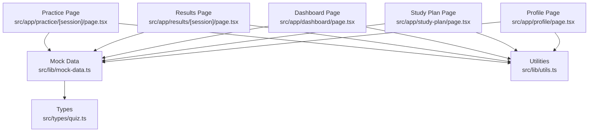
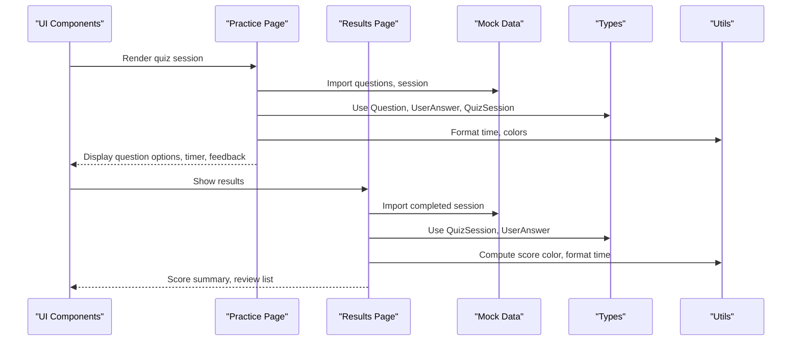
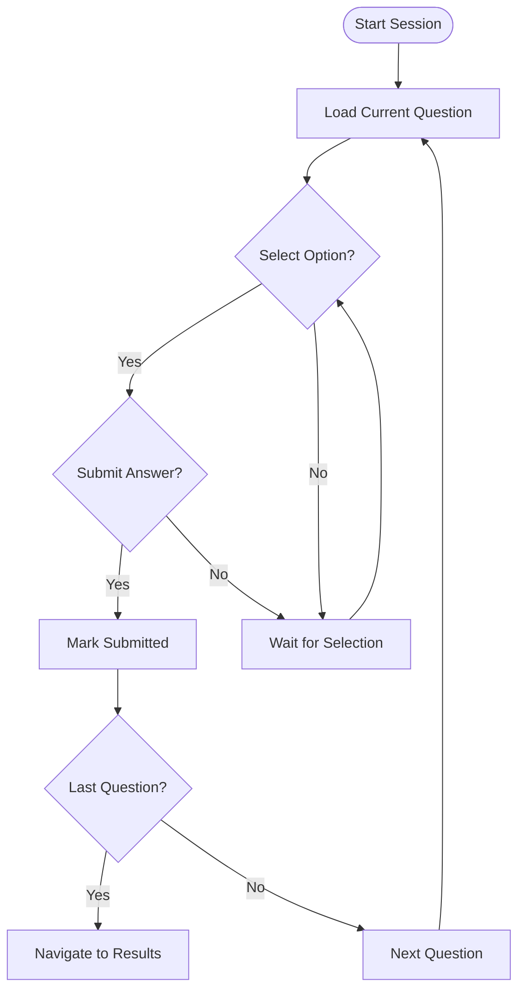
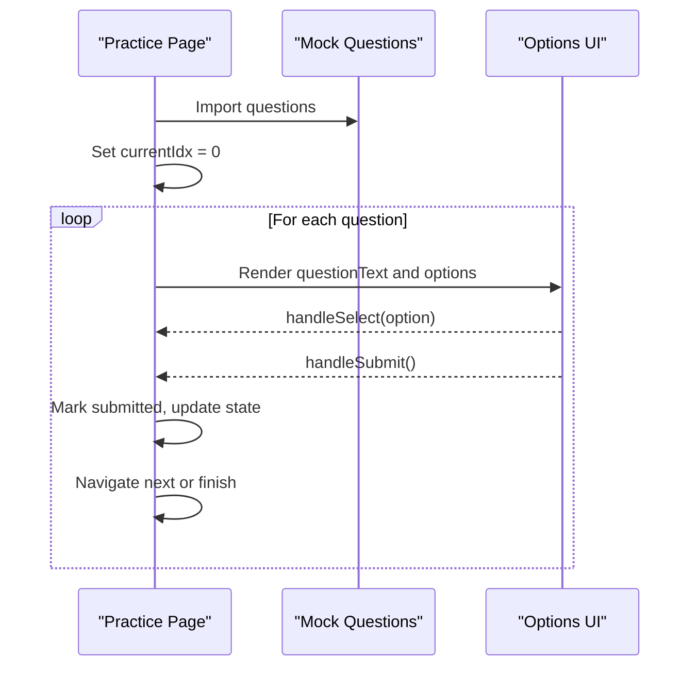
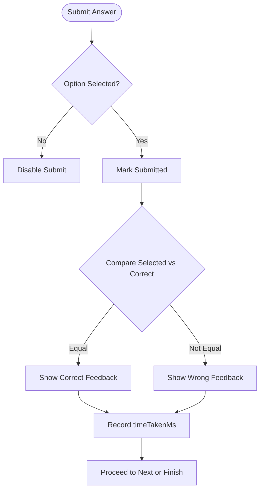
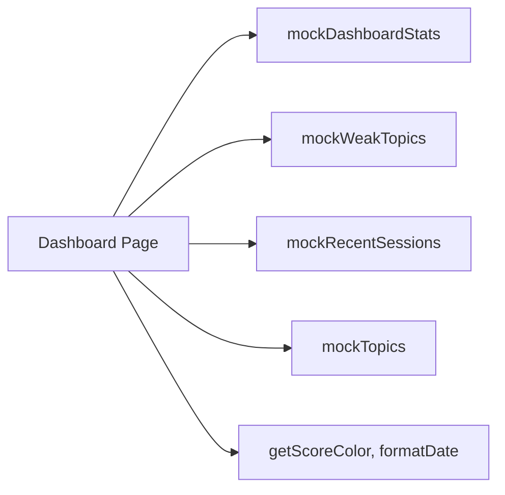
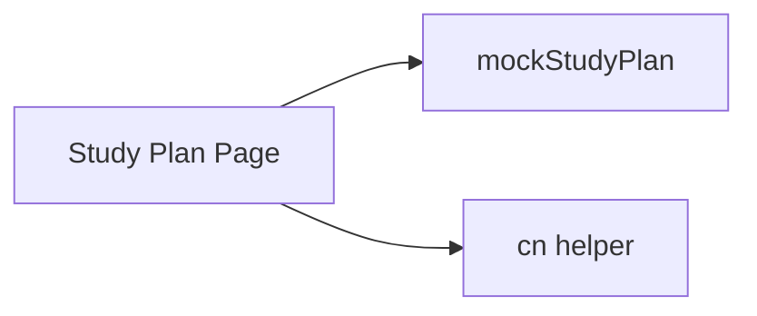
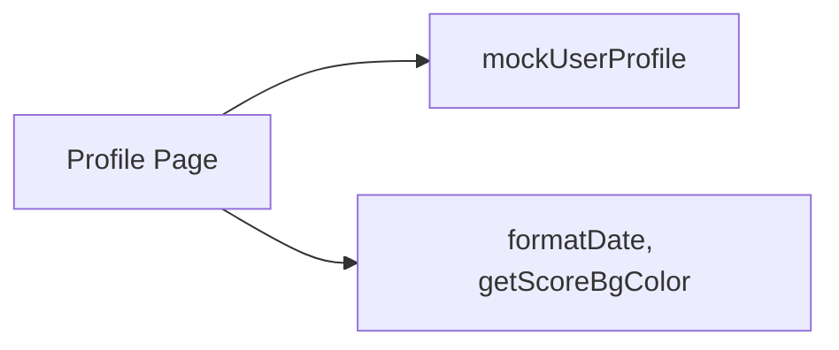
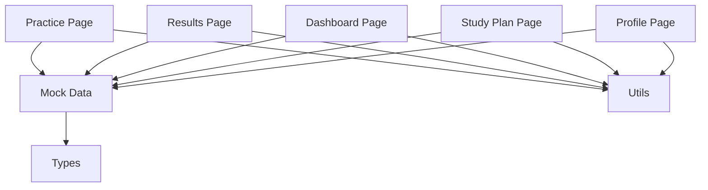

# Internal APIs

<cite>
**Referenced Files in This Document**
- [mock-data.ts](file://src/lib/mock-data.ts)
- [quiz.ts](file://src/types/quiz.ts)
- [page.tsx (Practice Session)](file://src/app/practice/[session]/page.tsx)
- [page.tsx (Results)](file://src/app/results/[session]/page.tsx)
- [page.tsx (Dashboard)](file://src/app/dashboard/page.tsx)
- [page.tsx (Study Plan)](file://src/app/study-plan/page.tsx)
- [page.tsx (Profile)](file://src/app/profile/page.tsx)
- [utils.ts](file://src/lib/utils.ts)
</cite>

## Table of Contents
1. Introduction
2. Project Structure
3. Core Components
4. Architecture Overview
5. Detailed Component Analysis
6. Dependency Analysis
7. Performance Considerations
8. Troubleshooting Guide
9. Conclusion
10. Appendices

## Introduction
This document describes MedAce AI’s internal API layer implemented as a mock data service. It simulates backend services for quiz generation, user profile management, progress tracking, and study plan creation. The mock layer provides consistent interfaces consumed by UI components across the application, enabling development and testing without external dependencies. It also documents session management, question delivery mechanisms, answer validation patterns, and TypeScript interface definitions used throughout the system.

## Project Structure
The internal API layer is centered around:
- A shared types file defining all data models
- A mock data module exporting static datasets and session objects
- Pages that consume these exports to render practice sessions, results, dashboard, study plans, and profiles

**Diagram sources**
- [mock-data.ts:1-313](file://src/lib/mock-data.ts#L1-L313)
- [quiz.ts:1-107](file://src/types/quiz.ts#L1-L107)
- [page.tsx (Practice Session):1-352](file://src/app/practice/[session]/page.tsx#L1-L352)
- [page.tsx (Results):1-315](file://src/app/results/[session]/page.tsx#L1-L315)
- [page.tsx (Dashboard):1-239](file://src/app/dashboard/page.tsx#L1-L239)
- [page.tsx (Study Plan):1-192](file://src/app/study-plan/page.tsx#L1-L192)
- [page.tsx (Profile):1-224](file://src/app/profile/page.tsx#L1-L224)
- [utils.ts:1-34](file://src/lib/utils.ts#L1-L34)

**Section sources**
- [mock-data.ts:1-313](file://src/lib/mock-data.ts#L1-L313)
- [quiz.ts:1-107](file://src/types/quiz.ts#L1-L107)
- [utils.ts:1-34](file://src/lib/utils.ts#L1-L34)

## Core Components
The internal API layer exposes typed data models and mock datasets:
- Topics and weak topics for performance insights
- Question bank with bilingual explanations and difficulty levels
- Quiz sessions (in-progress and completed) with answers and timing
- Study plan with weekly schedule and rationale
- User profile with chapter-wise performance
- Dashboard stats and recent sessions

These are consumed by pages to render practice flows, results, dashboards, study plans, and profiles.

**Section sources**
- [mock-data.ts:15-313](file://src/lib/mock-data.ts#L15-L313)
- [quiz.ts:5-107](file://src/types/quiz.ts#L5-L107)

## Architecture Overview
The architecture follows a simple client-side pattern:
- Types define contracts for all entities
- Mock data module provides static datasets and session objects
- Pages import types and mock data to render UI and manage local state
- Utilities provide formatting helpers used across pages

**Diagram sources**
- [page.tsx (Practice Session):1-352](file://src/app/practice/[session]/page.tsx#L1-L352)
- [page.tsx (Results):1-315](file://src/app/results/[session]/page.tsx#L1-L315)
- [mock-data.ts:215-256](file://src/lib/mock-data.ts#L215-L256)
- [quiz.ts:15-50](file://src/types/quiz.ts#L15-L50)
- [utils.ts:17-33](file://src/lib/utils.ts#L17-L33)

## Detailed Component Analysis

### Data Models (TypeScript Interfaces)
All data models are defined in a single types file and used consistently across the app:
- Topic: identifies chapters, categories, subtopic counts, accuracy, and weakness flags
- Question: includes text, four options, correct answer, bilingual explanations, difficulty, and topic
- UserAnswer: captures selected answer, correctness, and time taken per question
- QuizSession: represents an active or completed session with metadata, questions, and answers
- WeakTopic: tracks per-topic weakness metrics
- StudyPlanDay and StudyPlan: define weekly schedules, rationale, and insights
- DashboardStats and RecentSession: summarize overall progress and history
- UserProfile: aggregates personal stats and chapter performance

Complexity notes:
- Most operations on these models are O(n) over arrays (e.g., filtering answers, computing averages)
- Searching by ID is O(1) if using maps; current usage relies on array scans which are acceptable given small dataset sizes

Error handling patterns:
- No runtime errors are thrown by the mock layer; it returns stable datasets
- Validation is enforced via TypeScript types at compile time
- UI handles edge cases (e.g., missing selections, skipped questions) locally

**Section sources**
- [quiz.ts:5-107](file://src/types/quiz.ts#L5-L107)

### Mock Data Layer
The mock data module centralizes all static datasets and session states:
- Topics and weak topics for dashboard and recommendations
- Question bank for the Nervous System chapter with bilingual explanations
- In-progress and completed quiz sessions for practice and results pages
- Study plan with daily tasks, rationale, and insights
- User profile with performance breakdowns
- Dashboard stats and recent sessions for overview

Usage examples:
- Practice page imports the question bank directly
- Results page imports a completed session with pre-populated answers
- Dashboard imports stats, weak topics, recent sessions, and topics
- Study plan page imports the weekly plan
- Profile page imports the user profile

**Section sources**
- [mock-data.ts:15-313](file://src/lib/mock-data.ts#L15-L313)

### Session Management
Session lifecycle is managed locally within the practice page:
- State tracks current index, answers, submission status, and timer
- Timer resets per question and stops after submission
- Navigation moves forward/backward and finishes when last question is reached
- Exit modal warns about losing progress

**Diagram sources**
- [page.tsx (Practice Session):25-86](file://src/app/practice/[session]/page.tsx#L25-L86)
- [page.tsx (Practice Session):42-55](file://src/app/practice/[session]/page.tsx#L42-L55)
- [page.tsx (Practice Session):57-82](file://src/app/practice/[session]/page.tsx#L57-L82)

**Section sources**
- [page.tsx (Practice Session):25-86](file://src/app/practice/[session]/page.tsx#L25-L86)
- [page.tsx (Practice Session):42-55](file://src/app/practice/[session]/page.tsx#L42-L55)
- [page.tsx (Practice Session):57-82](file://src/app/practice/[session]/page.tsx#L57-L82)

### Question Delivery Mechanism
Question delivery is straightforward:
- The practice page imports the full question array from mock data
- It renders one question at a time based on current index
- Options are presented with dynamic styling based on selection and submission
- Bilingual explanations are toggled per question

**Diagram sources**
- [page.tsx (Practice Session):27-36](file://src/app/practice/[session]/page.tsx#L27-L36)
- [page.tsx (Practice Session):57-74](file://src/app/practice/[session]/page.tsx#L57-L74)
- [page.tsx (Practice Session):88-108](file://src/app/practice/[session]/page.tsx#L88-L108)

**Section sources**
- [page.tsx (Practice Session):27-36](file://src/app/practice/[session]/page.tsx#L27-L36)
- [page.tsx (Practice Session):57-74](file://src/app/practice/[session]/page.tsx#L57-L74)
- [page.tsx (Practice Session):88-108](file://src/app/practice/[session]/page.tsx#L88-L108)

### Answer Validation Process
Validation occurs locally:
- Users select an option before submitting
- After submission, options show correct/incorrect feedback
- Correctness is determined by comparing selected answer to the question’s correctAnswer
- Time taken per question is tracked in the completed session model

**Diagram sources**
- [page.tsx (Practice Session):68-74](file://src/app/practice/[session]/page.tsx#L68-L74)
- [page.tsx (Practice Session):88-100](file://src/app/practice/[session]/page.tsx#L88-L100)
- [mock-data.ts:244-256](file://src/lib/mock-data.ts#L244-L256)

**Section sources**
- [page.tsx (Practice Session):68-74](file://src/app/practice/[session]/page.tsx#L68-L74)
- [page.tsx (Practice Session):88-100](file://src/app/practice/[session]/page.tsx#L88-L100)
- [mock-data.ts:244-256](file://src/lib/mock-data.ts#L244-L256)

### Dashboard Integration
The dashboard consumes mock data to display:
- Overall stats (total questions, accuracy rate, sessions completed, streak)
- Weak topics with progress bars and error/attempt counts
- Recent sessions with scores and dates
- Quick-start cards for continuing practice

**Diagram sources**
- [page.tsx (Dashboard):21-23](file://src/app/dashboard/page.tsx#L21-L23)
- [page.tsx (Dashboard):91-177](file://src/app/dashboard/page.tsx#L91-L177)
- [mock-data.ts:47-64](file://src/lib/mock-data.ts#L47-L64)
- [utils.ts:8-27](file://src/lib/utils.ts#L8-L27)

**Section sources**
- [page.tsx (Dashboard):21-23](file://src/app/dashboard/page.tsx#L21-L23)
- [page.tsx (Dashboard):91-177](file://src/app/dashboard/page.tsx#L91-L177)
- [mock-data.ts:47-64](file://src/lib/mock-data.ts#L47-L64)
- [utils.ts:8-27](file://src/lib/utils.ts#L8-L27)

### Study Plan Integration
The study plan page uses mock data to present:
- Weekly schedule with day cards showing topics, estimated minutes, and status
- Today’s tasks with start buttons linking to practice
- Completed tasks with visual indicators
- Rationale and insights explaining plan logic

**Diagram sources**
- [page.tsx (Study Plan):18-21](file://src/app/study-plan/page.tsx#L18-L21)
- [page.tsx (Study Plan):39-96](file://src/app/study-plan/page.tsx#L39-L96)
- [page.tsx (Study Plan):99-161](file://src/app/study-plan/page.tsx#L99-L161)
- [page.tsx (Study Plan):164-187](file://src/app/study-plan/page.tsx#L164-L187)
- [mock-data.ts:261-281](file://src/lib/mock-data.ts#L261-L281)

**Section sources**
- [page.tsx (Study Plan):18-21](file://src/app/study-plan/page.tsx#L18-L21)
- [page.tsx (Study Plan):39-96](file://src/app/study-plan/page.tsx#L39-L96)
- [page.tsx (Study Plan):99-161](file://src/app/study-plan/page.tsx#L99-L161)
- [page.tsx (Study Plan):164-187](file://src/app/study-plan/page.tsx#L164-L187)
- [mock-data.ts:261-281](file://src/lib/mock-data.ts#L261-L281)

### Profile Integration
The profile page displays:
- Personal info and membership date
- Overall statistics (questions attempted, sessions completed, accuracy, best/worst topics, streak)
- Chapter performance chart with color-coded bars
- Settings and account deletion flow

**Diagram sources**
- [page.tsx (Profile):18-23](file://src/app/profile/page.tsx#L18-L23)
- [page.tsx (Profile):42-90](file://src/app/profile/page.tsx#L42-L90)
- [page.tsx (Profile):93-127](file://src/app/profile/page.tsx#L93-L127)
- [page.tsx (Profile):130-173](file://src/app/profile/page.tsx#L130-L173)
- [page.tsx (Profile):176-220](file://src/app/profile/page.tsx#L176-L220)
- [mock-data.ts:286-312](file://src/lib/mock-data.ts#L286-L312)
- [utils.ts:8-33](file://src/lib/utils.ts#L8-L33)

**Section sources**
- [page.tsx (Profile):18-23](file://src/app/profile/page.tsx#L18-L23)
- [page.tsx (Profile):42-90](file://src/app/profile/page.tsx#L42-L90)
- [page.tsx (Profile):93-127](file://src/app/profile/page.tsx#L93-L127)
- [page.tsx (Profile):130-173](file://src/app/profile/page.tsx#L130-L173)
- [page.tsx (Profile):176-220](file://src/app/profile/page.tsx#L176-L220)
- [mock-data.ts:286-312](file://src/lib/mock-data.ts#L286-L312)
- [utils.ts:8-33](file://src/lib/utils.ts#L8-L33)

## Dependency Analysis
The mock data layer depends only on type definitions and is consumed by multiple pages. Utilities are shared helpers for formatting and styling. There are no circular dependencies; the flow is strictly one-way from pages to mock data and types.

**Diagram sources**
- [mock-data.ts:1-10](file://src/lib/mock-data.ts#L1-L10)
- [quiz.ts:1-107](file://src/types/quiz.ts#L1-L107)
- [utils.ts:1-34](file://src/lib/utils.ts#L1-L34)
- [page.tsx (Practice Session):1-352](file://src/app/practice/[session]/page.tsx#L1-L352)
- [page.tsx (Results):1-315](file://src/app/results/[session]/page.tsx#L1-L315)
- [page.tsx (Dashboard):1-239](file://src/app/dashboard/page.tsx#L1-L239)
- [page.tsx (Study Plan):1-192](file://src/app/study-plan/page.tsx#L1-L192)
- [page.tsx (Profile):1-224](file://src/app/profile/page.tsx#L1-L224)

**Section sources**
- [mock-data.ts:1-10](file://src/lib/mock-data.ts#L1-L10)
- [quiz.ts:1-107](file://src/types/quiz.ts#L1-L107)
- [utils.ts:1-34](file://src/lib/utils.ts#L1-L34)

## Performance Considerations
- Dataset size is small; array scans and filters are efficient enough for current usage
- Avoid unnecessary re-renders by keeping state minimal and using memoization where appropriate
- Timer intervals should be cleared on unmount to prevent memory leaks
- Formatting utilities are lightweight and reused across pages

[No sources needed since this section provides general guidance]

## Troubleshooting Guide
Common issues and resolutions:
- Missing option selection prevents submission; ensure selection state is set before submit
- Timer not resetting on question change; verify effect dependencies reset timer correctly
- Incorrect feedback display; confirm comparison between selected answer and correctAnswer
- Results page filtering; validate tab-based filtering logic for correct/wrong/skipped
- Date formatting inconsistencies; use provided formatDate utility for consistency

**Section sources**
- [page.tsx (Practice Session):42-55](file://src/app/practice/[session]/page.tsx#L42-L55)
- [page.tsx (Practice Session):57-74](file://src/app/practice/[session]/page.tsx#L57-L74)
- [page.tsx (Results):48-55](file://src/app/results/[session]/page.tsx#L48-L55)
- [utils.ts:8-21](file://src/lib/utils.ts#L8-L21)

## Conclusion
MedAce AI’s internal API layer provides a robust mock data foundation that abstracts backend services behind consistent TypeScript interfaces. It supports quiz generation, session management, answer validation, progress tracking, and study planning. Pages consume this layer to deliver a cohesive user experience while remaining decoupled from external dependencies. The design enables easy replacement with real services later without altering UI logic.

[No sources needed since this section summarizes without analyzing specific files]

## Appendices

### API Surface Summary
- Topics: list of chapters with category, subtopics count, accuracy, and weakness flag
- Questions: multiple-choice items with bilingual explanations and difficulty
- Sessions: in-progress and completed states with answers and timing
- Study Plan: weekly schedule with rationale and insights
- Profile: user stats and chapter performance
- Dashboard: aggregated stats, weak topics, recent sessions

**Section sources**
- [mock-data.ts:15-313](file://src/lib/mock-data.ts#L15-L313)
- [quiz.ts:5-107](file://src/types/quiz.ts#L5-L107)