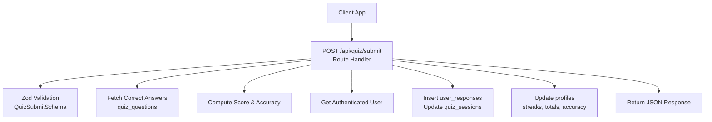
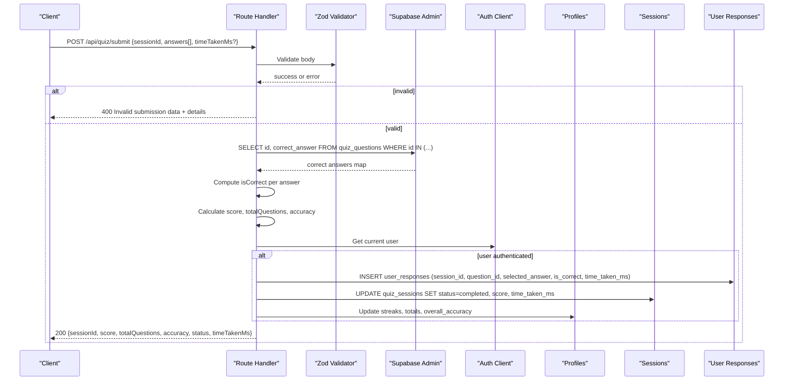
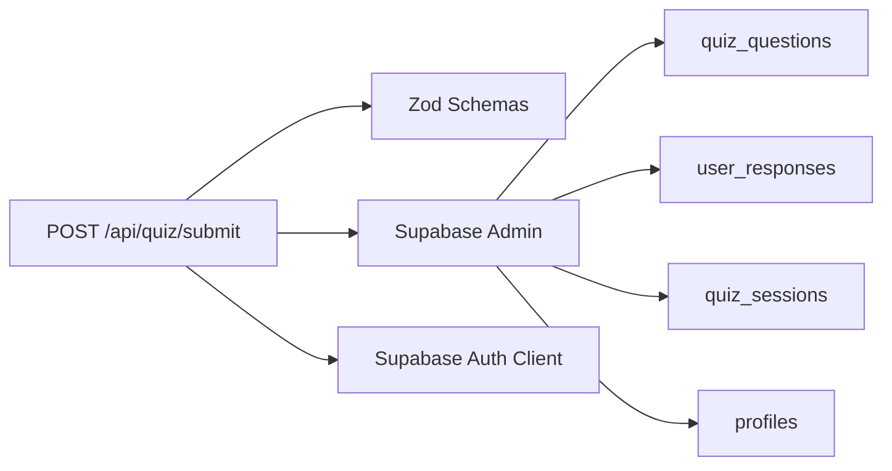

# Answer Submission API

<cite>
**Referenced Files in This Document**
- [route.ts](file://src/app/api/quiz/submit/route.ts)
- [schemas.ts](file://src/lib/validations/schemas.ts)
- [quiz.ts](file://src/types/quiz.ts)
- [progress-tracker.ts](file://src/lib/progress-tracker.ts)
- [schema.sql](file://supabase/schema.sql)
- [route.ts (dashboard stats)](file://src/app/api/dashboard/stats/route.ts)
</cite>

## Table of Contents
1. [Introduction](#introduction)
2. [Project Structure](#project-structure)
3. [Core Components](#core-components)
4. [Architecture Overview](#architecture-overview)
5. [Detailed Component Analysis](#detailed-component-analysis)
6. [Dependency Analysis](#dependency-analysis)
7. [Performance Considerations](#performance-considerations)
8. [Troubleshooting Guide](#troubleshooting-guide)
9. [Conclusion](#conclusion)

## Introduction
This document provides detailed API documentation for the POST /api/quiz/submit endpoint used to submit quiz answers and update user progress. It covers request schema, processing logic, scoring calculations, response structure, integration with the progress tracking system, authentication considerations, and error handling patterns.

## Project Structure
The submission endpoint is implemented as a Next.js Route Handler under src/app/api/quiz/submit. It validates input using Zod schemas, verifies answers against stored correct answers, records responses, updates session status, and refreshes user profile statistics. Related types and utilities are defined in src/types and src/lib.

**Diagram sources**
- [route.ts:6-140](file://src/app/api/quiz/submit/route.ts#L6-L140)
- [schemas.ts:19-25](file://src/lib/validations/schemas.ts#L19-L25)
- [schema.sql:47-99](file://supabase/schema.sql#L47-L99)

**Section sources**
- [route.ts:1-141](file://src/app/api/quiz/submit/route.ts#L1-L141)
- [schemas.ts:1-47](file://src/lib/validations/schemas.ts#L1-L47)
- [schema.sql:47-99](file://supabase/schema.sql#L47-L99)

## Core Components
- Request validation: Enforces required fields and types for session ID, answers array, and optional time taken.
- Answer verification: Compares selected answers to correct answers stored in the database; falls back to client-provided correctness if not found.
- Scoring: Computes number of correct answers, total questions, and percentage accuracy.
- Persistence: Inserts per-question responses and updates the quiz session status and timing.
- Progress tracking: Updates user profile metrics including streaks, total questions, sessions, and overall accuracy.

**Section sources**
- [route.ts:8-132](file://src/app/api/quiz/submit/route.ts#L8-L132)
- [schemas.ts:12-25](file://src/lib/validations/schemas.ts#L12-L25)
- [schema.sql:47-99](file://supabase/schema.sql#L47-L99)

## Architecture Overview
The endpoint follows a clear pipeline: validate → verify → score → persist → update profile → respond. It uses Supabase Admin for privileged writes and reads, and the authenticated client to identify the current user when present.

**Diagram sources**
- [route.ts:6-140](file://src/app/api/quiz/submit/route.ts#L6-L140)
- [schema.sql:47-99](file://supabase/schema.sql#L47-L99)

## Detailed Component Analysis

### Endpoint: POST /api/quiz/submit
- Purpose: Submit answers for a quiz session, compute results, persist responses, and update user progress.
- Authentication: The handler attempts to retrieve the current user via the authenticated client. If a user exists, it persists responses and updates profile metrics. If no user is authenticated, it still computes and returns results but skips persistent writes that require a user context.
- Input validation: Uses a strict schema to ensure required fields and correct types.

Request Schema
- sessionId: string (required) — Unique identifier for the quiz session.
- answers: array of objects (required) — Each object contains:
  - questionId: string (required)
  - selectedAnswer: "A" | "B" | "C" | "D" | null (optional)
  - isCorrect: boolean (optional, default false) — Used only if correct answer cannot be resolved from DB.
  - timeTakenMs: number (optional, default 0) — Time spent on this question.
- timeTakenMs: number (optional) — Total time taken for the session.

Processing Logic
- Validates the request body.
- Fetches correct answers for all submitted question IDs from the database.
- Determines correctness per answer by comparing selectedAnswer to the stored correct_answer; if not available, uses the provided isCorrect flag.
- Calculates:
  - correctCount: number of correct answers
  - totalQuestions: length of answers array
  - accuracy: rounded percentage of correct answers
- Persists:
  - Per-question responses into user_responses
  - Session completion into quiz_sessions (status, score, time_taken_ms)
  - User profile updates (streaks, totals, overall_accuracy) when authenticated

Response Structure
- sessionId: string
- score: number — Count of correct answers
- totalQuestions: number
- accuracy: number — Percentage (0–100)
- status: "completed"
- timeTakenMs: number — Total session time

Error Handling
- 400 Bad Request: Invalid submission data with validation details.
- 500 Internal Server Error: Unexpected server-side errors with message.

Example Requests and Responses
- Example request payload:
  - {
      "sessionId": "uuid-or-session-id",
      "answers": [
        {"questionId": "q1", "selectedAnswer": "B", "timeTakenMs": 15000},
        {"questionId": "q2", "selectedAnswer": "A", "timeTakenMs": 22000}
      ],
      "timeTakenMs": 37000
    }
- Example success response:
  - {
      "sessionId": "uuid-or-session-id",
      "score": 1,
      "totalQuestions": 2,
      "accuracy": 50,
      "status": "completed",
      "timeTakenMs": 37000
    }

Notes on Weak Spots and Study Recommendations
- This endpoint does not return weak spot analysis or study recommendations directly. Those are computed elsewhere (e.g., dashboard stats) based on persisted responses and sessions.

**Section sources**
- [route.ts:6-140](file://src/app/api/quiz/submit/route.ts#L6-L140)
- [schemas.ts:12-25](file://src/lib/validations/schemas.ts#L12-L25)
- [schema.sql:47-99](file://supabase/schema.sql#L47-L99)

### Data Models and Types
- Question and UserAnswer types define the shape of questions and answers used across the application.
- QuizSession includes fields like topic, difficulty, numQuestions, score, totalQuestions, status, createdAt, timeTakenMs, questions, and answers.
- DashboardStats and UserProfile provide structures for analytics and user metrics.

Key Fields
- Question: id, sessionId, questionText, options, correctAnswer, explanationEn, explanationUr, difficulty, topic.
- UserAnswer: questionId, selectedAnswer, isCorrect, timeTakenMs.
- QuizSession: id, topic, chapterNum, difficulty, numQuestions, score, totalQuestions, status, createdAt, timeTakenMs, questions, answers.

**Section sources**
- [quiz.ts:15-50](file://src/types/quiz.ts#L15-L50)
- [quiz.ts:78-106](file://src/types/quiz.ts#L78-L106)

### Database Integration
- Tables involved:
  - quiz_sessions: stores session metadata, status, score, total_questions, time_taken_ms.
  - quiz_questions: stores question content and correct_answer used for verification.
  - user_responses: stores per-question submissions with correctness and timing.
  - profiles: stores user-level metrics such as streaks, totals, and overall accuracy.
- Row Level Security policies restrict access to authenticated users’ own data.

Updates Performed
- Insert user_responses for each answer.
- Update quiz_sessions to completed with score and time.
- Update profiles with streak logic, total_questions, total_sessions, and recalculated overall_accuracy.

**Section sources**
- [schema.sql:47-99](file://supabase/schema.sql#L47-L99)
- [schema.sql:155-229](file://supabase/schema.sql#L155-L229)
- [route.ts:52-122](file://src/app/api/quiz/submit/route.ts#L52-L122)

### Progress Tracking Integration
- Local progress tracker utility computes aggregated stats, recent sessions, weak topics, and chapter performance from stored sessions.
- Dashboard stats endpoint aggregates persisted data to produce weak topics and performance insights used for personalized recommendations elsewhere in the app.

How It Relates to Submission
- After submission, persisted responses and updated sessions feed into these analytics endpoints and utilities to generate weak spot identification and study recommendations.

**Section sources**
- [progress-tracker.ts:37-191](file://src/lib/progress-tracker.ts#L37-L191)
- [route.ts (dashboard stats):6-172](file://src/app/api/dashboard/stats/route.ts#L6-L172)

## Dependency Analysis
- The submission route depends on:
  - Zod validation schemas for input enforcement.
  - Supabase Admin client for reading correct answers and writing responses and profile updates.
  - Supabase authenticated client for identifying the current user.
  - Database tables for persistence and security policies.

**Diagram sources**
- [route.ts:1-140](file://src/app/api/quiz/submit/route.ts#L1-L140)
- [schemas.ts:19-25](file://src/lib/validations/schemas.ts#L19-L25)
- [schema.sql:47-99](file://supabase/schema.sql#L47-L99)

**Section sources**
- [route.ts:1-140](file://src/app/api/quiz/submit/route.ts#L1-L140)
- [schemas.ts:19-25](file://src/lib/validations/schemas.ts#L19-L25)
- [schema.sql:47-99](file://supabase/schema.sql#L47-L99)

## Performance Considerations
- Batch operations: The endpoint inserts multiple user_responses in one call and updates the session once, minimizing round trips.
- Indexing: Database indexes on user_id and session_id improve query performance for responses and sessions.
- Correctness resolution: Fetching correct answers in a single query reduces latency compared to per-question lookups.
- Optional auth path: When unauthenticated, the endpoint avoids unnecessary profile updates, reducing write load.

[No sources needed since this section provides general guidance]

## Troubleshooting Guide
Common Errors
- 400 Invalid submission data: Occurs when the request body fails validation. Check that sessionId is present, answers is an array of objects with required fields, and timeTakenMs is a non-negative number if provided.
- 500 Internal Server Error: Indicates unexpected server-side issues. Review logs for database connectivity or permission errors.

Validation Details
- Ensure selectedAnswer values are among "A", "B", "C", "D" or null.
- Ensure questionId strings are non-empty.
- Ensure timeTakenMs values are numbers greater than or equal to zero.

Authentication Notes
- If no user is authenticated, the endpoint still computes and returns results but will not persist responses or update profile metrics due to missing user context.

Database Policies
- Row Level Security enforces that users can only access their own data. Ensure requests originate from authenticated contexts when expecting persistent writes.

**Section sources**
- [route.ts:11-16](file://src/app/api/quiz/submit/route.ts#L11-L16)
- [route.ts:133-139](file://src/app/api/quiz/submit/route.ts#L133-L139)
- [schema.sql:155-229](file://supabase/schema.sql#L155-L229)

## Conclusion
The POST /api/quiz/submit endpoint provides a robust mechanism for submitting quiz answers, computing scores, and updating user progress. It integrates tightly with the database to persist responses and maintain accurate user statistics. While it does not directly return weak spot analysis or study recommendations, its outputs feed into other parts of the system that compute those insights for personalized learning paths. Proper validation, secure authentication checks, and efficient database operations ensure reliable and scalable performance.