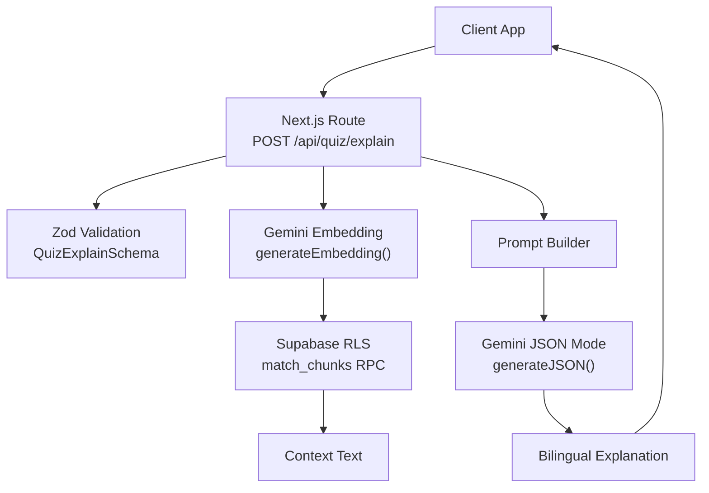
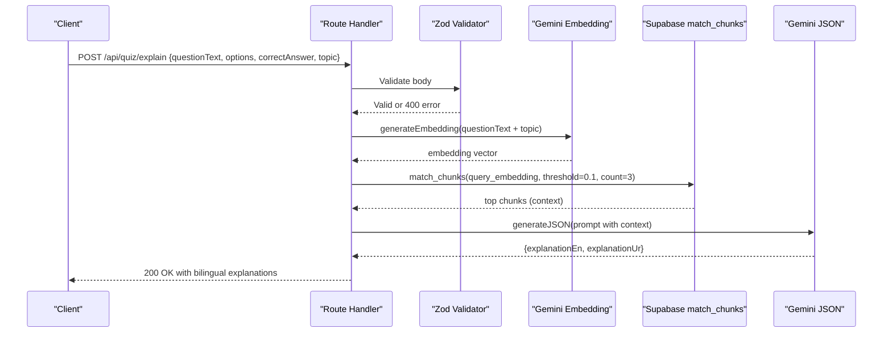
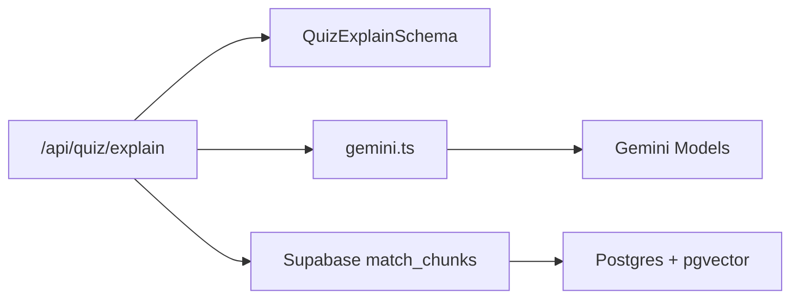

# Explanation Retrieval API

<cite>
**Referenced Files in This Document**
- [route.ts](file://src/app/api/quiz/explain/route.ts)
- [schemas.ts](file://src/lib/validations/schemas.ts)
- [gemini.ts](file://src/lib/ai/gemini.ts)
- [api-client.ts](file://src/lib/api-client.ts)
- [schema.sql](file://supabase/schema.sql)
- [middleware.ts](file://src/middleware.ts)
</cite>

## Table of Contents
1. Introduction
2. Project Structure
3. Core Components
4. Architecture Overview
5. Detailed Component Analysis
6. Dependency Analysis
7. Performance Considerations
8. Troubleshooting Guide
9. Conclusion
10. Appendices

## Introduction
This document provides detailed API documentation for the POST /api/quiz/explain endpoint, which retrieves bilingual explanations (English and Urdu) for quiz questions using Gemini AI. It covers request schema, processing logic, response structure, example usage for medical topics, caching considerations, rate limiting guidance, authentication notes, and error handling.

## Project Structure
The endpoint is implemented as a Next.js Route Handler under src/app/api/quiz/explain/route.ts. It validates input with Zod schemas, performs vector similarity search via Supabase to retrieve relevant textbook context, and uses Gemini AI to generate bilingual explanations. The client-side integration is provided by src/lib/api-client.ts.

**Diagram sources**
- [route.ts:1-79](file://src/app/api/quiz/explain/route.ts#L1-L79)
- [schemas.ts:27-40](file://src/lib/validations/schemas.ts#L27-L40)
- [gemini.ts:29-59](file://src/lib/ai/gemini.ts#L29-L59)
- [schema.sql:145-150](file://supabase/schema.sql#L145-L150)

**Section sources**
- [route.ts:1-79](file://src/app/api/quiz/explain/route.ts#L1-L79)
- [schemas.ts:27-40](file://src/lib/validations/schemas.ts#L27-L40)
- [gemini.ts:29-59](file://src/lib/ai/gemini.ts#L29-L59)
- [schema.sql:145-150](file://supabase/schema.sql#L145-L150)

## Core Components
- Request validation: Uses QuizExplainSchema to enforce required fields and types.
- Context retrieval: Generates an embedding from question text and topic, then queries Supabase via match_chunks RPC to fetch relevant textbook chunks.
- AI generation: Builds a prompt combining question details and context, then calls Gemini in JSON mode to return bilingual explanations.
- Response formatting: Returns explanationEn and explanationUr with safe fallbacks if AI output is missing.

Key responsibilities and behaviors are defined in:
- Input validation schema
- Vector similarity search flow
- Gemini JSON generation
- Error handling and status codes

**Section sources**
- [schemas.ts:27-40](file://src/lib/validations/schemas.ts#L27-L40)
- [route.ts:20-35](file://src/app/api/quiz/explain/route.ts#L20-L35)
- [route.ts:37-70](file://src/app/api/quiz/explain/route.ts#L37-L70)
- [gemini.ts:45-59](file://src/lib/ai/gemini.ts#L45-L59)

## Architecture Overview
The endpoint follows a clear pipeline: validate input, enrich with contextual knowledge via vector search, generate bilingual explanations with Gemini, and return structured JSON.

**Diagram sources**
- [route.ts:6-70](file://src/app/api/quiz/explain/route.ts#L6-L70)
- [gemini.ts:29-59](file://src/lib/ai/gemini.ts#L29-L59)
- [schema.sql:145-150](file://supabase/schema.sql#L145-L150)

## Detailed Component Analysis

### Endpoint: POST /api/quiz/explain
- Purpose: Generate bilingual explanations for a given multiple-choice question.
- Authentication: No explicit auth check in this route; middleware currently allows all routes through. If needed, integrate session checks similar to other endpoints.
- Rate limiting: Not implemented in this route. Apply at gateway or middleware level if required.

Request Schema
- Fields:
  - questionId: string (optional)
  - questionText: string (required)
  - options: object with A, B, C, D strings (required)
  - correctAnswer: enum "A" | "B" | "C" | "D" (required)
  - topic: string (optional)
- Validation: Enforced by QuizExplainSchema; invalid requests return 400 with details.

Processing Logic
- Step 1: Validate request body.
- Step 2: Create embedding from questionText and topic.
- Step 3: Retrieve up to 3 most relevant textbook chunks via Supabase match_chunks RPC with threshold 0.1.
- Step 4: Build a prompt that includes question, options, correct answer, and truncated context.
- Step 5: Call Gemini in JSON mode to produce explanationEn and explanationUr.
- Step 6: Return JSON with both explanations; provide safe fallbacks if AI returns empty values.

Response Schema
- Fields:
  - explanationEn: string (English explanation)
  - explanationUr: string (Urdu explanation)
- Status Codes:
  - 200: Success
  - 400: Invalid request payload
  - 500: Internal server error (e.g., AI service failure)

Example Requests
- Digestive System disorders:
  - Provide questionText describing a digestive disorder scenario, options A-D, correctAnswer, and topic "Digestive System disorders".
- Cardiovascular anatomy:
  - Provide questionText about cardiovascular anatomy, options A-D, correctAnswer, and topic "Cardiovascular anatomy".

Notes on Examples
- Use the same schema fields as above. Ensure options cover plausible distractors and correctAnswer matches one of A-D.

**Section sources**
- [route.ts:6-70](file://src/app/api/quiz/explain/route.ts#L6-L70)
- [schemas.ts:27-40](file://src/lib/validations/schemas.ts#L27-L40)
- [api-client.ts:82-98](file://src/lib/api-client.ts#L82-L98)

### Validation Schema: QuizExplainSchema
- Ensures presence and type correctness of questionText, options, correctAnswer, and optional topic/questionId.
- Returns structured validation errors for client-side feedback.

**Section sources**
- [schemas.ts:27-40](file://src/lib/validations/schemas.ts#L27-L40)

### AI Integration: Gemini Embeddings and JSON Generation
- Embeddings: generateEmbedding creates a vector representation used for semantic search over textbook chunks.
- JSON Generation: generateJSON calls Gemini with jsonMode enabled and parses the response into typed objects.
- Environment: Requires GEMINI_API_KEY; missing key raises an error.

**Section sources**
- [gemini.ts:29-59](file://src/lib/ai/gemini.ts#L29-L59)

### Database Integration: Vector Similarity Search
- Uses Supabase RPC match_chunks to find relevant textbook content based on embeddings.
- Parameters: query_embedding, match_threshold (0.1), match_count (3).
- Row Level Security policies allow authenticated and anonymous users to read textbook_chunks for RAG.

**Section sources**
- [schema.sql:145-150](file://supabase/schema.sql#L145-L150)
- [schema.sql:175-179](file://supabase/schema.sql#L175-L179)

### Client Integration
- explainQuestion helper encapsulates fetching /api/quiz/explain with proper headers and error handling.
- Returns bilingual explanations to the caller.

**Section sources**
- [api-client.ts:82-98](file://src/lib/api-client.ts#L82-L98)

## Dependency Analysis
- Route depends on:
  - Validation schema for input integrity
  - Gemini utilities for embeddings and JSON generation
  - Supabase admin client for vector search
- External dependencies:
  - Google Generative AI SDK for Gemini models
  - Supabase for vector similarity and RLS policies

**Diagram sources**
- [route.ts:1-79](file://src/app/api/quiz/explain/route.ts#L1-L79)
- [schemas.ts:27-40](file://src/lib/validations/schemas.ts#L27-L40)
- [gemini.ts:1-59](file://src/lib/ai/gemini.ts#L1-L59)
- [schema.sql:145-150](file://supabase/schema.sql#L145-L150)

**Section sources**
- [route.ts:1-79](file://src/app/api/quiz/explain/route.ts#L1-L79)
- [gemini.ts:1-59](file://src/lib/ai/gemini.ts#L1-L59)
- [schema.sql:145-150](file://supabase/schema.sql#L145-L150)

## Performance Considerations
- Vector search: match_count=3 limits results to reduce latency and token usage.
- Context truncation: Context text is truncated to a reasonable length before prompting to control token costs.
- Model selection: gemini-2.5-flash is optimized for speed and cost-efficiency.
- Recommendations:
  - Implement request-level caching (e.g., Redis) keyed by normalized inputs (questionText, options, correctAnswer, topic) to avoid repeated AI calls for identical requests.
  - Add rate limiting at the API gateway or middleware layer to protect against bursts and excessive usage.
  - Monitor Gemini API quotas and implement exponential backoff on transient failures.

[No sources needed since this section provides general guidance]

## Troubleshooting Guide
Common issues and resolutions:
- Missing API key:
  - Symptom: Errors indicating GEMINI_API_KEY not configured.
  - Resolution: Set GEMINI_API_KEY in environment variables.
- Invalid request:
  - Symptom: 400 error with validation details.
  - Resolution: Ensure questionText, options, correctAnswer are present and correctly typed.
- AI service unavailability:
  - Symptom: 500 Internal Server Error.
  - Resolution: Retry with backoff; verify network connectivity and quota; log error messages for diagnostics.
- No matching context:
  - Symptom: Fallback context used.
  - Resolution: Verify textbook chunks ingestion and embeddings; adjust match_threshold if necessary.

Authentication and Middleware Notes:
- Current middleware does not enforce authentication for API routes; consider adding session checks if exposing to untrusted clients.

**Section sources**
- [gemini.ts:6-8](file://src/lib/ai/gemini.ts#L6-L8)
- [gemini.ts:29-43](file://src/lib/ai/gemini.ts#L29-L43)
- [route.ts:71-77](file://src/app/api/quiz/explain/route.ts#L71-L77)
- [middleware.ts:14-35](file://src/middleware.ts#L14-L35)

## Conclusion
The POST /api/quiz/explain endpoint delivers high-quality bilingual explanations by combining validated inputs, contextual retrieval via vector similarity search, and Gemini-powered generation. It returns structured English and Urdu explanations suitable for educational use. For production readiness, add caching, rate limiting, and robust authentication while monitoring AI service health and quotas.

[No sources needed since this section summarizes without analyzing specific files]

## Appendices

### Request and Response Examples
- Example request for Digestive System disorders:
  - Include questionText describing a digestive disorder scenario, options A-D, correctAnswer set to the correct option, and topic "Digestive System disorders".
- Example request for Cardiovascular anatomy:
  - Include questionText about cardiovascular anatomy, options A-D, correctAnswer set accordingly, and topic "Cardiovascular anatomy".
- Response:
  - Contains explanationEn and explanationUr with concise, accurate explanations tailored to the question.

[No sources needed since this section provides conceptual examples]