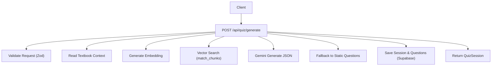
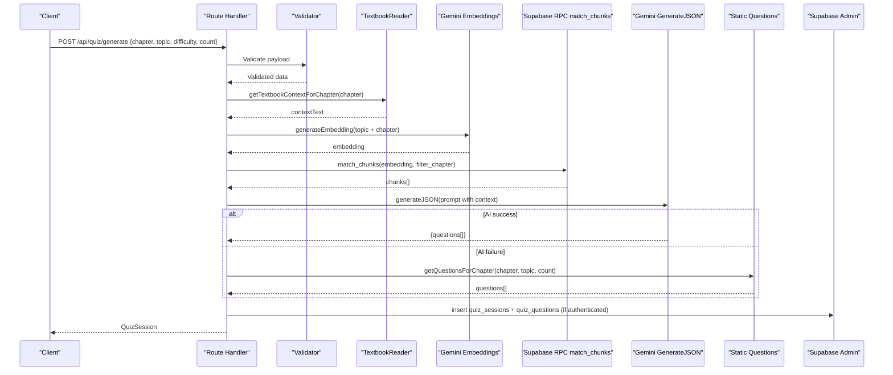
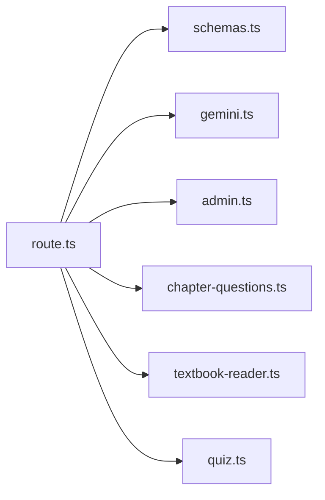

# Question Generation API

<cite>
**Referenced Files in This Document**
- [route.ts](file://src/app/api/quiz/generate/route.ts)
- [schemas.ts](file://src/lib/validations/schemas.ts)
- [gemini.ts](file://src/lib/ai/gemini.ts)
- [chapter-questions.ts](file://src/lib/chapter-questions.ts)
- [textbook-reader.ts](file://src/lib/textbook-reader.ts)
- [admin.ts](file://src/lib/supabase/admin.ts)
- [schema.sql](file://supabase/schema.sql)
- [quiz.ts](file://src/types/quiz.ts)
</cite>

## Table of Contents
1. [Introduction](#introduction)
2. [Project Structure](#project-structure)
3. [Core Components](#core-components)
4. [Architecture Overview](#architecture-overview)
5. [Detailed Component Analysis](#detailed-component-analysis)
6. [Dependency Analysis](#dependency-analysis)
7. [Performance Considerations](#performance-considerations)
8. [Troubleshooting Guide](#troubleshooting-guide)
9. [Conclusion](#conclusion)

## Introduction
This document provides detailed API documentation for the POST /api/quiz/generate endpoint that generates AI-powered MDCAT multiple-choice questions. It explains the request schema, RAG pipeline combining textbook content with vector database search, Gemini AI integration for bilingual explanations, fallback to static question databases, authentication via Supabase JWT tokens, and error handling patterns with HTTP status codes.

## Project Structure
The endpoint is implemented as a Next.js Route Handler under src/app/api/quiz/generate. It orchestrates:
- Request validation using Zod schemas
- Textbook context retrieval from local extracted files
- Optional vector similarity search via Supabase RPC
- AI question generation using Gemini JSON mode
- Fallback to chapter-specific static questions
- Session persistence to Supabase when authenticated

**Diagram sources**
- [route.ts:10-187](file://src/app/api/quiz/generate/route.ts#L10-L187)
- [schemas.ts:3-8](file://src/lib/validations/schemas.ts#L3-L8)
- [textbook-reader.ts:9-45](file://src/lib/textbook-reader.ts#L9-L45)
- [gemini.ts:29-59](file://src/lib/ai/gemini.ts#L29-L59)
- [schema.sql:116-150](file://supabase/schema.sql#L116-L150)
- [admin.ts:1-22](file://src/lib/supabase/admin.ts#L1-L22)

**Section sources**
- [route.ts:10-187](file://src/app/api/quiz/generate/route.ts#L10-L187)
- [schemas.ts:3-8](file://src/lib/validations/schemas.ts#L3-L8)

## Core Components
- Request Validation: Enforces required fields and types for chapter, topic, difficulty, and count.
- Textbook Reader: Loads relevant textbook text for the specified chapter.
- RAG Pipeline: Generates embeddings and performs vector similarity search to enrich context.
- AI Generation: Uses Gemini in JSON mode to produce structured MCQs with bilingual explanations.
- Fallback Mechanism: If AI fails or returns no questions, uses prebuilt chapter questions.
- Persistence: Saves session and questions to Supabase tables when authenticated.

Key data models:
- Question: id, sessionId, questionText, options A-D, correctAnswer, explanationEn, explanationUr, difficulty, topic
- QuizSession: id, topic, chapterNum, difficulty, numQuestions, score, totalQuestions, status, createdAt, timeTakenMs, questions, answers

**Section sources**
- [quiz.ts:15-50](file://src/types/quiz.ts#L15-L50)
- [route.ts:10-187](file://src/app/api/quiz/generate/route.ts#L10-L187)

## Architecture Overview
The endpoint follows a layered flow:
1. Parse and validate request body.
2. Load textbook context for the chapter.
3. Optionally enhance context via vector search using embeddings.
4. Generate questions with Gemini in strict JSON mode.
5. If AI fails, fall back to static chapter questions.
6. Persist session and questions if user is authenticated.
7. Return a QuizSession object.

**Diagram sources**
- [route.ts:10-187](file://src/app/api/quiz/generate/route.ts#L10-L187)
- [gemini.ts:29-59](file://src/lib/ai/gemini.ts#L29-L59)
- [schema.sql:116-150](file://supabase/schema.sql#L116-L150)
- [admin.ts:1-22](file://src/lib/supabase/admin.ts#L1-L22)

## Detailed Component Analysis

### Endpoint: POST /api/quiz/generate
- Purpose: Generate high-yield MDCAT MCQs for a given chapter/topic/difficulty/count.
- Authentication: Optional; if a Supabase user is authenticated, the session and generated questions are persisted to the database.
- Error Handling: Returns 400 for invalid payloads, 500 for internal errors.

Request Schema
- chapter: string or number (e.g., "1", 2). Internally parsed to an integer chapter number.
- topic: string (required), e.g., "Digestive System of Man".
- difficulty: enum ["Easy", "Medium", "Hard", "Mixed"], default "Mixed".
- count: integer between 1 and 100, default 20.

Response Model
- QuizSession containing:
  - id: UUID
  - topic: string
  - chapterNum: number
  - difficulty: "Easy" | "Medium" | "Hard" | "Mixed"
  - numQuestions: number
  - score: number | null
  - totalQuestions: number
  - status: "in-progress" | "completed"
  - createdAt: ISO timestamp
  - timeTakenMs?: number
  - questions: array of Question objects
  - answers: array of UserAnswer objects

Example Requests
- Digestive System (Chapter 1):
  - { "chapter": 1, "topic": "Digestive System of Man", "difficulty": "Mixed", "count": 10 }
- Blood Circulatory System (Chapter 2):
  - { "chapter": 2, "topic": "Blood Circulatory System of Man", "difficulty": "Hard", "count": 15 }

Example Responses
- Success: 200 OK with a QuizSession object including generated questions and metadata.
- Validation Error: 400 Bad Request with error details.
- Server Error: 500 Internal Server Error with message.

RAG Pipeline Details
- Textbook Context: Reads extracted textbook file for the chapter and optionally samples up to a configured character limit.
- Vector Enhancement: Generates an embedding for the query and calls Supabase RPC match_chunks to retrieve similar chunks filtered by chapter.
- Prompt Construction: Combines enriched context with instructions to produce exactly the requested number of unique, high-yield MCQs with bilingual explanations.

AI Integration (Gemini)
- Models:
  - Text model: gemini-2.5-flash
  - Embedding model: gemini-embedding-001
- JSON Mode: Ensures responses conform to a strict schema for questions and explanations.
- Environment: Requires GEMINI_API_KEY to be set; otherwise throws configuration errors.

Fallback Mechanism
- If AI generation fails or returns no questions, the endpoint falls back to a built-in repository of chapter-specific questions.
- The fallback preserves session association and metadata.

Persistence (Supabase)
- When authenticated, inserts:
  - quiz_sessions: tracks topic, chapter, difficulty, counts, status
  - quiz_questions: stores each question with options, correct answer, bilingual explanations, difficulty, topic, chapter, and chunk_ids
- Row-Level Security policies restrict access to user-owned data.

Authentication Requirements
- Supabase JWT: The endpoint uses createClient() to obtain the current user. If present, it persists session and questions.
- Service Role Key: Used server-side for admin operations (inserting into tables).

Error Handling Patterns
- 400: Invalid request payload (validation failures).
- 500: Unexpected server errors with message.
- Graceful Degradation: Vector search and AI generation are optional; failures do not block returning questions via fallback.

**Section sources**
- [route.ts:10-187](file://src/app/api/quiz/generate/route.ts#L10-L187)
- [schemas.ts:3-8](file://src/lib/validations/schemas.ts#L3-L8)
- [textbook-reader.ts:9-45](file://src/lib/textbook-reader.ts#L9-L45)
- [gemini.ts:29-59](file://src/lib/ai/gemini.ts#L29-L59)
- [chapter-questions.ts:7-12](file://src/lib/chapter-questions.ts#L7-L12)
- [schema.sql:47-83](file://supabase/schema.sql#L47-L83)
- [admin.ts:1-22](file://src/lib/supabase/admin.ts#L1-L22)

## Dependency Analysis
- route.ts depends on:
  - validations/schemas.ts for input validation
  - ai/gemini.ts for embeddings and JSON generation
  - supabase/admin.ts for database writes
  - chapter-questions.ts for fallback questions
  - textbook-reader.ts for textbook context
  - types/quiz.ts for data structures

**Diagram sources**
- [route.ts:1-8](file://src/app/api/quiz/generate/route.ts#L1-L8)
- [schemas.ts:3-8](file://src/lib/validations/schemas.ts#L3-L8)
- [gemini.ts:1-61](file://src/lib/ai/gemini.ts#L1-L61)
- [admin.ts:1-22](file://src/lib/supabase/admin.ts#L1-L22)
- [chapter-questions.ts:1-12](file://src/lib/chapter-questions.ts#L1-L12)
- [textbook-reader.ts:1-46](file://src/lib/textbook-reader.ts#L1-L46)
- [quiz.ts:15-50](file://src/types/quiz.ts#L15-L50)

**Section sources**
- [route.ts:1-8](file://src/app/api/quiz/generate/route.ts#L1-L8)

## Performance Considerations
- Textbook Sampling: Limits context size to reduce token usage and latency.
- Vector Search: Uses HNSW index for fast cosine similarity search; filters by chapter to narrow results.
- AI Calls: JSON mode reduces parsing overhead; ensure environment keys are configured to avoid retries.
- Fallback Efficiency: Static questions provide immediate availability without external dependencies.
- Database Writes: Batch insertion of questions improves write performance.

[No sources needed since this section provides general guidance]

## Troubleshooting Guide
Common Issues and Resolutions
- Missing GEMINI_API_KEY:
  - Symptom: AI generation fails with configuration error.
  - Resolution: Set GEMINI_API_KEY in environment variables.
- No Textbook File Found:
  - Symptom: Empty context returned; AI may still work but with limited context.
  - Resolution: Ensure textbook files exist under rag/textbooks with expected naming conventions.
- Vector Search Errors:
  - Symptom: RPC match_chunks fails or returns no chunks.
  - Resolution: Verify Supabase vector extension and indexes; confirm embeddings are ingested.
- Authentication Failures:
  - Symptom: Session not persisted.
  - Resolution: Ensure Supabase client is initialized and user is logged in; check service role key for admin writes.
- Validation Errors:
  - Symptom: 400 response with details.
  - Resolution: Check request payload against schema requirements.

HTTP Status Codes
- 200: Successful generation and return of QuizSession.
- 400: Invalid request payload.
- 500: Internal server error.

**Section sources**
- [route.ts:15-20](file://src/app/api/quiz/generate/route.ts#L15-L20)
- [route.ts:188-194](file://src/app/api/quiz/generate/route.ts#L188-L194)
- [gemini.ts:30-48](file://src/lib/ai/gemini.ts#L30-L48)
- [textbook-reader.ts:10-45](file://src/lib/textbook-reader.ts#L10-L45)
- [schema.sql:116-150](file://supabase/schema.sql#L116-L150)

## Conclusion
The POST /api/quiz/generate endpoint delivers robust, context-aware MDCAT question generation by combining textbook content, vector similarity search, and Gemini AI. It gracefully handles failures through a static fallback, supports bilingual explanations, and persists sessions when authenticated. Proper configuration of environment variables and Supabase setup ensures reliable operation across varying conditions.

[No sources needed since this section summarizes without analyzing specific files]