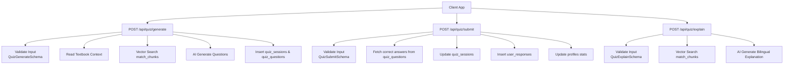
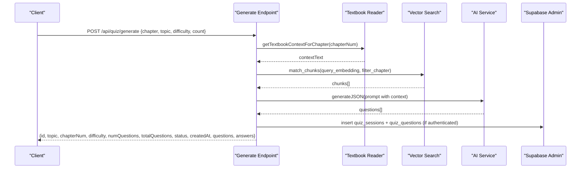
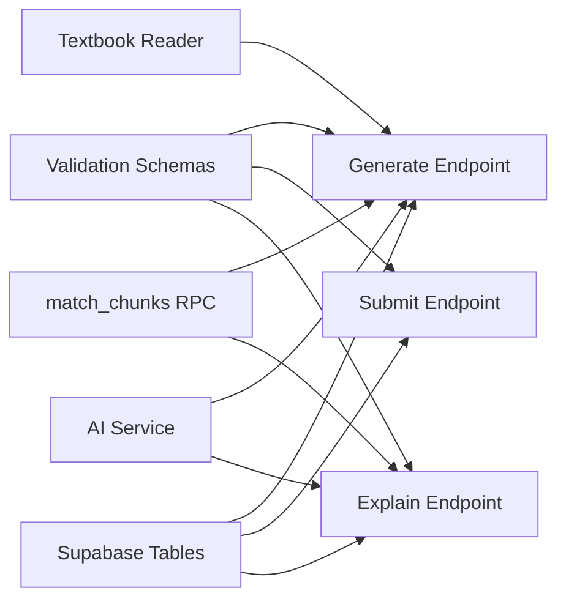

# Quiz APIs

<cite>
**Referenced Files in This Document**
- [route.ts](file://src/app/api/quiz/generate/route.ts)
- [route.ts](file://src/app/api/quiz/submit/route.ts)
- [route.ts](file://src/app/api/quiz/explain/route.ts)
- [schemas.ts](file://src/lib/validations/schemas.ts)
- [quiz.ts](file://src/types/quiz.ts)
- [schema.sql](file://supabase/schema.sql)
- [chapter-questions.ts](file://src/lib/chapter-questions.ts)
- [textbook-reader.ts](file://src/lib/textbook-reader.ts)
- [middleware.ts](file://src/middleware.ts)
</cite>

## Table of Contents
1. Introduction
2. Project Structure
3. Core Components
4. Architecture Overview
5. Detailed Component Analysis
6. Dependency Analysis
7. Performance Considerations
8. Troubleshooting Guide
9. Conclusion

## Introduction
This document provides API documentation for MedAce-AI’s quiz-related endpoints focused on:
- Generating practice questions (POST /api/quiz/generate)
- Submitting answers and tracking performance (POST /api/quiz/submit)
- Retrieving bilingual explanations in English and Urdu (POST /api/quiz/explain)

It includes request/response schemas, authentication notes, error handling patterns, HTTP status codes, and concrete example calls for MDCAT practice questions.

## Project Structure
The quiz endpoints are implemented as Next.js Route Handlers under src/app/api/quiz. Each endpoint validates input using Zod schemas, interacts with Supabase for persistence and vector search, and uses AI services to generate or enrich content.

**Diagram sources**
- [route.ts:10-195](file://src/app/api/quiz/generate/route.ts#L10-L195)
- [route.ts:6-141](file://src/app/api/quiz/submit/route.ts#L6-L141)
- [route.ts:6-79](file://src/app/api/quiz/explain/route.ts#L6-L79)
- [schemas.ts:3-40](file://src/lib/validations/schemas.ts#L3-L40)
- [schema.sql:46-99](file://supabase/schema.sql#L46-L99)

**Section sources**
- [route.ts:10-195](file://src/app/api/quiz/generate/route.ts#L10-L195)
- [route.ts:6-141](file://src/app/api/quiz/submit/route.ts#L6-L141)
- [route.ts:6-79](file://src/app/api/quiz/explain/route.ts#L6-L79)
- [schemas.ts:3-40](file://src/lib/validations/schemas.ts#L3-L40)
- [schema.sql:46-99](file://supabase/schema.sql#L46-L99)

## Core Components
- POST /api/quiz/generate: Creates a new quiz session and returns questions based on chapter/topic/difficulty/count. Uses textbook context and optional vector similarity search; falls back to built-in question bank if needed. Persists sessions and questions when authenticated.
- POST /api/quiz/submit: Validates answers, calculates correctness and score, updates session status, records responses, and updates user profile statistics.
- POST /api/quiz/explain: Generates bilingual explanations (English and Urdu) using AI with contextual retrieval via vector similarity search.

Authentication:
- The middleware currently allows all routes through for development. When Supabase auth is enabled, requests should include a valid Supabase JWT token in the Authorization header (Bearer <token>) so that server-side Supabase clients can identify the user.

Error handling:
- Validation failures return 400 with details.
- Internal errors return 500 with message.

**Section sources**
- [route.ts:10-195](file://src/app/api/quiz/generate/route.ts#L10-L195)
- [route.ts:6-141](file://src/app/api/quiz/submit/route.ts#L6-L141)
- [route.ts:6-79](file://src/app/api/quiz/explain/route.ts#L6-L79)
- [middleware.ts:14-35](file://src/middleware.ts#L14-L35)

## Architecture Overview
The system combines local textbook context, vector-based retrieval, and AI generation to produce high-quality MDCAT questions and explanations. Persistence is handled by Supabase tables for sessions, questions, responses, and user profiles.

**Diagram sources**
- [route.ts:10-195](file://src/app/api/quiz/generate/route.ts#L10-L195)
- [textbook-reader.ts:9-45](file://src/lib/textbook-reader.ts#L9-L45)
- [schema.sql:116-150](file://supabase/schema.sql#L116-L150)

## Detailed Component Analysis

### POST /api/quiz/generate
Purpose:
- Create a quiz session and generate practice questions tailored to a chapter, topic, difficulty, and count.

Request schema:
- chapter: string | number (e.g., "1", 2)
- topic: string (required)
- difficulty: enum ["Easy", "Medium", "Hard", "Mixed"], default "Mixed"
- count: integer 1–100, default 20

Response schema:
- id: string (session ID)
- topic: string
- chapterNum: number
- difficulty: string
- numQuestions: number
- score: null
- totalQuestions: number
- status: "in-progress"
- createdAt: string (ISO timestamp)
- timeTakenMs?: number
- questions: array of Question objects
- answers: array of UserAnswer objects

Question object fields:
- id: string
- sessionId: string
- questionText: string
- optionA: string
- optionB: string
- optionC: string
- optionD: string
- correctAnswer: "A" | "B" | "C" | "D"
- explanationEn: string
- explanationUr: string
- difficulty: "Easy" | "Medium" | "Hard"
- topic: string

Behavior highlights:
- Loads textbook context for the chapter and optionally augments it via vector similarity search.
- Calls AI to generate JSON-structured questions; maps Mixed difficulty to alternating Easy/Medium when needed.
- Persists session and questions into Supabase when authenticated.
- Falls back to built-in question bank if AI generation fails or is unavailable.

Example call:
- Method: POST
- URL: /api/quiz/generate
- Headers: Content-Type: application/json
- Body:
  - chapter: "1"
  - topic: "Digestive System of Man"
  - difficulty: "Mixed"
  - count: 10

Expected response:
- Returns a QuizSession object with generated questions and an in-progress status.

Error handling:
- 400: Invalid payload (validation error).
- 500: Internal server error.

**Section sources**
- [schemas.ts:3-10](file://src/lib/validations/schemas.ts#L3-L10)
- [route.ts:10-195](file://src/app/api/quiz/generate/route.ts#L10-L195)
- [quiz.ts:15-50](file://src/types/quiz.ts#L15-L50)
- [chapter-questions.ts:7-12](file://src/lib/chapter-questions.ts#L7-L12)
- [textbook-reader.ts:9-45](file://src/lib/textbook-reader.ts#L9-L45)
- [schema.sql:46-83](file://supabase/schema.sql#L46-L83)

### POST /api/quiz/submit
Purpose:
- Submit answers for a quiz session, calculate correctness and score, update session status, record responses, and update user profile statistics.

Request schema:
- sessionId: string (required)
- answers: array of answer objects
  - questionId: string (required)
  - selectedAnswer: "A" | "B" | "C" | "D" | null
  - isCorrect: boolean (default false)
  - timeTakenMs: number (default 0)
- timeTakenMs?: number (optional)

Response schema:
- sessionId: string
- score: number (count of correct answers)
- totalQuestions: number
- accuracy: number (percentage)
- status: "completed"
- timeTakenMs: number

Behavior highlights:
- Fetches correct answers from quiz_questions to validate submissions.
- Calculates score and percentage.
- Updates quiz_sessions to completed with score and time taken.
- Inserts user_responses for each answer.
- Updates user profile streaks, totals, and overall accuracy.

Example call:
- Method: POST
- URL: /api/quiz/submit
- Headers: Content-Type: application/json
- Body:
  - sessionId: "<generated-session-id>"
  - answers: [
      { "questionId": "<q1>", "selectedAnswer": "A", "timeTakenMs": 12000 },
      { "questionId": "<q2>", "selectedAnswer": "C", "timeTakenMs": 15000 }
    ]
  - timeTakenMs: 27000

Expected response:
- Returns completion summary including score, totalQuestions, accuracy, and status.

Error handling:
- 400: Invalid submission data.
- 500: Internal server error.

**Section sources**
- [schemas.ts:12-25](file://src/lib/validations/schemas.ts#L12-L25)
- [route.ts:6-141](file://src/app/api/quiz/submit/route.ts#L6-L141)
- [schema.sql:46-99](file://supabase/schema.sql#L46-L99)

### POST /api/quiz/explain
Purpose:
- Retrieve bilingual explanations (English and Urdu) for a given question, leveraging contextual retrieval and AI generation.

Request schema:
- questionId?: string (optional)
- questionText: string (required)
- options: object
  - A: string
  - B: string
  - C: string
  - D: string
- correctAnswer: "A" | "B" | "C" | "D"
- topic?: string (optional)

Response schema:
- explanationEn: string
- explanationUr: string

Behavior highlights:
- Performs vector similarity search to retrieve relevant textbook chunks.
- Calls AI to generate detailed bilingual explanation based on context and question.

Example call:
- Method: POST
- URL: /api/quiz/explain
- Headers: Content-Type: application/json
- Body:
  - questionText: "Which component of gastric juice provides the acidic medium necessary for pepsinogen activation?"
  - options: {
      "A": "Hydrochloric acid (HCl)",
      "B": "Sodium bicarbonate",
      "C": "Mucus",
      "D": "Intrinsic factor"
    }
  - correctAnswer: "A"
  - topic: "Digestive System of Man"

Expected response:
- Returns explanationEn and explanationUr strings.

Error handling:
- 400: Invalid explanation request.
- 500: Internal server error.

**Section sources**
- [schemas.ts:27-40](file://src/lib/validations/schemas.ts#L27-L40)
- [route.ts:6-79](file://src/app/api/quiz/explain/route.ts#L6-L79)

## Dependency Analysis
Key dependencies and relationships:
- Validation schemas define strict contracts for inputs across endpoints.
- Database schema defines tables for sessions, questions, responses, and profiles, plus vector search function.
- Chapter question generator provides fallback content.
- Textbook reader loads localized chapter content for context enrichment.

**Diagram sources**
- [schemas.ts:3-40](file://src/lib/validations/schemas.ts#L3-L40)
- [route.ts:10-195](file://src/app/api/quiz/generate/route.ts#L10-L195)
- [route.ts:6-141](file://src/app/api/quiz/submit/route.ts#L6-L141)
- [route.ts:6-79](file://src/app/api/quiz/explain/route.ts#L6-L79)
- [schema.sql:116-150](file://supabase/schema.sql#L116-L150)

**Section sources**
- [schemas.ts:3-40](file://src/lib/validations/schemas.ts#L3-L40)
- [schema.sql:46-99](file://supabase/schema.sql#L46-L99)
- [chapter-questions.ts:7-12](file://src/lib/chapter-questions.ts#L7-L12)
- [textbook-reader.ts:9-45](file://src/lib/textbook-reader.ts#L9-L45)

## Performance Considerations
- Vector similarity search uses HNSW indexing for fast cosine similarity queries; ensure embeddings are properly configured and thresholds are tuned to balance relevance and latency.
- Textbook context is limited to a maximum character window to control prompt size and reduce token usage.
- Fallback mechanisms (built-in question bank) prevent service degradation when AI or vector search is unavailable.
- Batch inserts for questions and responses minimize database round-trips.
- Profile updates compute streaks and accuracy incrementally to avoid heavy recalculations.

[No sources needed since this section provides general guidance]

## Troubleshooting Guide
Common issues and resolutions:
- 400 Validation Errors: Ensure request payloads conform to the specified schemas. Check required fields like topic, chapter, difficulty, count, and answer arrays.
- 500 Internal Server Error: Review server logs for AI service or database connectivity issues. Verify environment variables for AI keys and Supabase credentials.
- Missing Textbook Context: Confirm that textbook files exist in rag/textbooks and follow naming conventions (e.g., Chapter_<number>_...).
- Vector Search Failures: Validate embedding dimensions and match thresholds; ensure the match_chunks RPC is available and indexed.
- Authentication Issues: When enabling Supabase auth, include a valid Supabase JWT token in the Authorization header for server-side user resolution.

**Section sources**
- [route.ts:10-195](file://src/app/api/quiz/generate/route.ts#L10-L195)
- [route.ts:6-141](file://src/app/api/quiz/submit/route.ts#L6-L141)
- [route.ts:6-79](file://src/app/api/quiz/explain/route.ts#L6-L79)
- [middleware.ts:14-35](file://src/middleware.ts#L14-L35)

## Conclusion
MedAce-AI’s quiz APIs provide a robust pipeline for generating MDCAT practice questions, submitting answers with performance tracking, and retrieving bilingual explanations enriched by textbook context and vector search. The endpoints enforce strict validation, persist state in Supabase, and integrate AI services to deliver high-quality educational content. Proper configuration of AI keys, Supabase credentials, and textbook resources ensures reliable operation.

[No sources needed since this section summarizes without analyzing specific files]