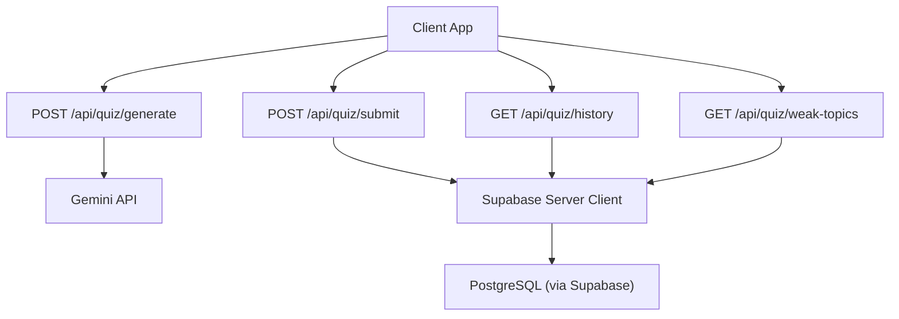
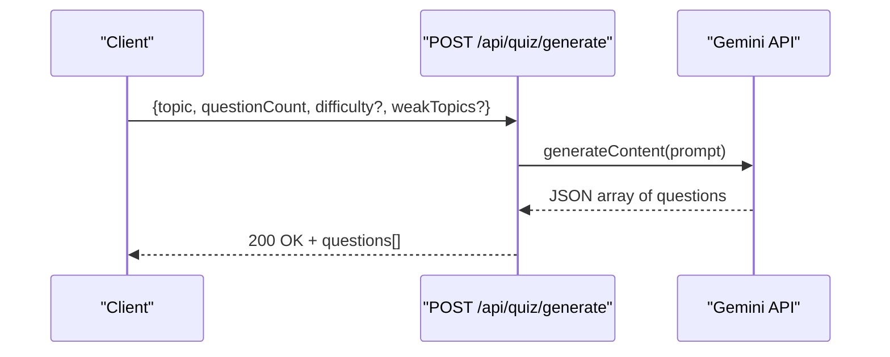
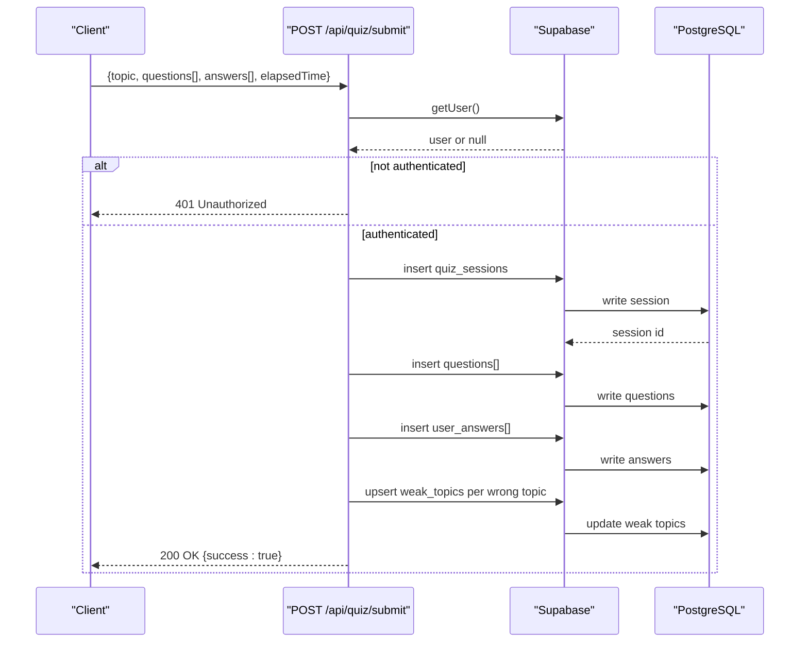
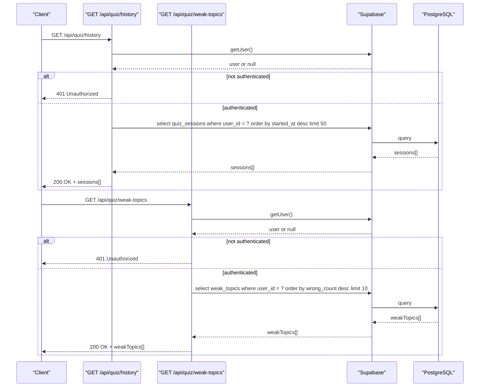
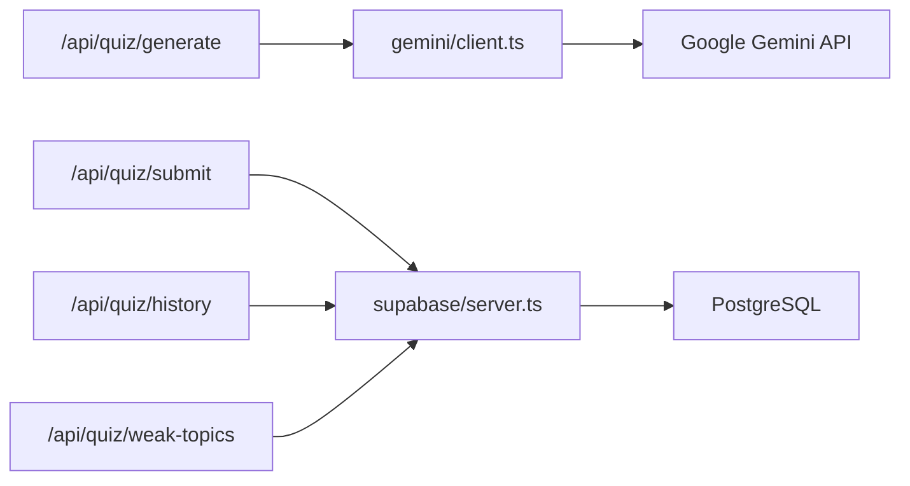

# Quiz Endpoints

<cite>
**Referenced Files in This Document**
- [route.ts](file://Next-app/src/app/api/quiz/generate/route.ts)
- [route.ts](file://Next-app/src/app/api/quiz/submit/route.ts)
- [route.ts](file://Next-app/src/app/api/quiz/history/route.ts)
- [route.ts](file://Next-app/src/app/api/quiz/weak-topics/route.ts)
- [client.ts](file://Next-app/src/lib/gemini/client.ts)
- [server.ts](file://Next-app/src/lib/supabase/server.ts)
- [schema.ts](file://Next-app/src/lib/drizzle/schema.ts)
- [quiz.ts](file://Next-app/src/types/quiz.ts)
- [middleware.ts](file://Next-app/src/middleware.ts)
</cite>

## Table of Contents
1. [Introduction](#introduction)
2. [Project Structure](#project-structure)
3. [Core Components](#core-components)
4. [Architecture Overview](#architecture-overview)
5. [Detailed Component Analysis](#detailed-component-analysis)
6. [Dependency Analysis](#dependency-analysis)
7. [Performance Considerations](#performance-considerations)
8. [Troubleshooting Guide](#troubleshooting-guide)
9. [Conclusion](#conclusion)

## Introduction
This document provides detailed API documentation for all quiz-related endpoints in the application. It covers:
- POST /api/quiz/generate: Generate MDCAT questions with topic, questionCount, difficulty, and weakTopics parameters.
- POST /api/quiz/submit: Submit quiz answers and calculate scores.
- GET /api/quiz/history: Retrieve user’s quiz history (limited to a fixed number of recent sessions).
- GET /api/quiz/weak-topics: Identify user’s weak areas based on performance analysis.

Each endpoint includes request/response schemas, authentication requirements, error handling, and example usage patterns.

## Project Structure
The quiz endpoints are implemented as Next.js Route Handlers under src/app/api/quiz. They interact with:
- Supabase for authentication and persistence (quiz_sessions, questions, user_answers, weak_topics).
- Google Gemini API for generating questions and explanations.
- Drizzle schema definitions for database tables.

**Diagram sources**
- [route.ts:4-30](file://Next-app/src/app/api/quiz/generate/route.ts#L4-L30)
- [route.ts:4-112](file://Next-app/src/app/api/quiz/submit/route.ts#L4-L112)
- [route.ts:4-32](file://Next-app/src/app/api/quiz/history/route.ts#L4-L32)
- [route.ts:4-32](file://Next-app/src/app/api/quiz/weak-topics/route.ts#L4-L32)
- [client.ts:31-75](file://Next-app/src/lib/gemini/client.ts#L31-L75)
- [server.ts:4-30](file://Next-app/src/lib/supabase/server.ts#L4-L30)

**Section sources**
- [route.ts:4-30](file://Next-app/src/app/api/quiz/generate/route.ts#L4-L30)
- [route.ts:4-112](file://Next-app/src/app/api/quiz/submit/route.ts#L4-L112)
- [route.ts:4-32](file://Next-app/src/app/api/quiz/history/route.ts#L4-L32)
- [route.ts:4-32](file://Next-app/src/app/api/quiz/weak-topics/route.ts#L4-L32)
- [client.ts:31-75](file://Next-app/src/lib/gemini/client.ts#L31-L75)
- [server.ts:4-30](file://Next-app/src/lib/supabase/server.ts#L4-L30)

## Core Components
- Authentication: All protected endpoints use Supabase server client to retrieve the current user from cookies. If no user is found, they return 401 Unauthorized.
- Data models: Types define Question, UserAnswer, QuizSession, etc., used by the frontend and APIs.
- Database schema: Tables include quiz_sessions, questions, user_answers, weak_topics, users, study_plans.

Key responsibilities:
- generate: Validates input, calls Gemini to produce questions, returns JSON array of questions.
- submit: Authenticates user, calculates accuracy, persists session/questions/answers, updates weak topics, returns success.
- history: Returns recent quiz sessions for the authenticated user.
- weak-topics: Returns top weak topics for the authenticated user.

**Section sources**
- [quiz.ts:1-47](file://Next-app/src/types/quiz.ts#L1-L47)
- [schema.ts:11-77](file://Next-app/src/lib/drizzle/schema.ts#L11-L77)
- [server.ts:4-30](file://Next-app/src/lib/supabase/server.ts#L4-L30)

## Architecture Overview
The quiz system integrates three main layers:
- API layer: Route handlers validate requests, enforce auth, orchestrate flows.
- Service layer: Gemini client generates content; Supabase client persists data.
- Storage layer: PostgreSQL via Supabase stores sessions, questions, answers, and weak topics.

**Diagram sources**
- [route.ts:4-30](file://Next-app/src/app/api/quiz/generate/route.ts#L4-L30)
- [client.ts:31-75](file://Next-app/src/lib/gemini/client.ts#L31-L75)

**Diagram sources**
- [route.ts:4-112](file://Next-app/src/app/api/quiz/submit/route.ts#L4-L112)
- [schema.ts:19-67](file://Next-app/src/lib/drizzle/schema.ts#L19-L67)

**Diagram sources**
- [route.ts:4-32](file://Next-app/src/app/api/quiz/history/route.ts#L4-L32)
- [route.ts:4-32](file://Next-app/src/app/api/quiz/weak-topics/route.ts#L4-L32)
- [schema.ts:19-67](file://Next-app/src/lib/drizzle/schema.ts#L19-L67)

## Detailed Component Analysis

### POST /api/quiz/generate
Generates MDCAT multiple-choice questions using Gemini based on provided parameters.

- Authentication: Not enforced in this route handler.
- Rate limiting: None implemented at the API level.
- Request body:
  - topic: string (required)
  - questionCount: number (required)
  - difficulty: string (optional; defaults to "medium")
  - weakTopics: string[] (optional)
- Response:
  - 200 OK: Array of Question objects
  - 400 Bad Request: Missing required fields
  - 500 Internal Server Error: Generation failure
- Error handling:
  - Validates presence of topic and questionCount.
  - Catches errors from Gemini integration and returns 500 with an error message.

Example request:
- Method: POST
- URL: /api/quiz/generate
- Body: { "topic": "Biology", "questionCount": 10, "difficulty": "hard", "weakTopics": ["Genetics", "Cell Biology"] }

Example response:
- 200 OK: [Question, Question, ...]

Notes:
- The Gemini client enforces a strict JSON format and parses only the JSON portion of the response.
- Difficulty values accepted include "easy", "medium", "hard".

**Section sources**
- [route.ts:4-30](file://Next-app/src/app/api/quiz/generate/route.ts#L4-L30)
- [client.ts:31-75](file://Next-app/src/lib/gemini/client.ts#L31-L75)

### POST /api/quiz/submit
Submits quiz answers, calculates score and accuracy, persists results, and updates weak topics.

- Authentication: Required. Uses Supabase server client to get the current user.
- Rate limiting: None implemented at the API level.
- Request body:
  - topic: string
  - questions: Question[] (as generated by /generate)
  - answers: UserAnswer[] (with selectedAnswer index, isCorrect flag, timeTaken seconds)
  - elapsedTime: number (seconds taken for the quiz)
- Response:
  - 200 OK: { success: true }
  - 401 Unauthorized: No authenticated user
  - 500 Internal Server Error: Persistence or processing failure
- Processing logic:
  - Calculates correct count and accuracy percentage.
  - Inserts quiz session with topic, question count, score, accuracy, and timestamps.
  - Inserts questions and user answers linked to the session.
  - Aggregates wrong answers by topic and upserts weak_topics records per topic.

Example request:
- Method: POST
- URL: /api/quiz/submit
- Body: { "topic": "Biology", "questions": [...], "answers": [...], "elapsedTime": 300 }

Example response:
- 200 OK: { success: true }

Error handling:
- Returns 401 if user is not authenticated.
- Logs and returns 500 on unexpected errors during submission.

**Section sources**
- [route.ts:4-112](file://Next-app/src/app/api/quiz/submit/route.ts#L4-L112)
- [schema.ts:19-67](file://Next-app/src/lib/drizzle/schema.ts#L19-L67)

### GET /api/quiz/history
Retrieves the authenticated user’s recent quiz sessions.

- Authentication: Required.
- Pagination: Fixed limit of 50 most recent sessions ordered by started_at descending.
- Response:
  - 200 OK: Array of quiz session objects
  - 401 Unauthorized: No authenticated user
  - 500 Internal Server Error: Unexpected error (returns empty array)
- Notes:
  - On fetch errors, returns an empty array rather than failing the request.

Example request:
- Method: GET
- URL: /api/quiz/history

Example response:
- 200 OK: [QuizSession, QuizSession, ...]

**Section sources**
- [route.ts:4-32](file://Next-app/src/app/api/quiz/history/route.ts#L4-L32)
- [schema.ts:19-30](file://Next-app/src/lib/drizzle/schema.ts#L19-L30)

### GET /api/quiz/weak-topics
Identifies the user’s weak topics based on accumulated wrong answers.

- Authentication: Required.
- Response:
  - 200 OK: Array of weak topic records sorted by wrong_count descending, limited to 10
  - 401 Unauthorized: No authenticated user
  - 500 Internal Server Error: Unexpected error (returns empty array)
- Notes:
  - Errors during fetch result in an empty array response.

Example request:
- Method: GET
- URL: /api/quiz/weak-topics

Example response:
- 200 OK: [{ topic, wrongCount, totalCount, lastUpdated }, ...]

**Section sources**
- [route.ts:4-32](file://Next-app/src/app/api/quiz/weak-topics/route.ts#L4-L32)
- [schema.ts:58-67](file://Next-app/src/lib/drizzle/schema.ts#L58-L67)

## Dependency Analysis
- Route handlers depend on:
  - Supabase server client for authentication and database operations.
  - Gemini client for question generation.
- Shared types define consistent interfaces across components.
- Middleware applies session updates globally but does not enforce authentication per route; each route checks user presence explicitly.

**Diagram sources**
- [route.ts:4-30](file://Next-app/src/app/api/quiz/generate/route.ts#L4-L30)
- [route.ts:4-112](file://Next-app/src/app/api/quiz/submit/route.ts#L4-L112)
- [route.ts:4-32](file://Next-app/src/app/api/quiz/history/route.ts#L4-L32)
- [route.ts:4-32](file://Next-app/src/app/api/quiz/weak-topics/route.ts#L4-L32)
- [client.ts:31-75](file://Next-app/src/lib/gemini/client.ts#L31-L75)
- [server.ts:4-30](file://Next-app/src/lib/supabase/server.ts#L4-L30)

**Section sources**
- [middleware.ts:4-12](file://Next-app/src/middleware.ts#L4-L12)
- [server.ts:4-30](file://Next-app/src/lib/supabase/server.ts#L4-L30)
- [client.ts:31-75](file://Next-app/src/lib/gemini/client.ts#L31-L75)

## Performance Considerations
- Gemini API latency: Question generation depends on external LLM calls; consider caching or rate-limiting strategies at the gateway level.
- Database writes: Submit endpoint performs multiple inserts; batching or transactional semantics could improve reliability.
- History and weak-topics queries: Use appropriate indexes on user_id and ordering columns to optimize performance.
- Error responses: For history and weak-topics, returning empty arrays avoids cascading failures but may hide issues; consider logging and metrics.

[No sources needed since this section provides general guidance]

## Troubleshooting Guide
Common issues and resolutions:
- 401 Unauthorized: Ensure the client sends valid authentication cookies/tokens so Supabase can resolve the user.
- 400 Bad Request (generate): Provide both topic and questionCount in the request body.
- 500 Internal Server Error:
  - Check environment variables for Supabase URL and keys.
  - Verify Gemini API key configuration and network access.
  - Inspect logs for database constraint violations or malformed payloads.

Operational notes:
- The middleware updates sessions globally but does not block unauthenticated requests; each route must check for a user.
- On database errors, some endpoints return empty arrays to maintain UI stability; monitor logs to detect underlying issues.

**Section sources**
- [server.ts:4-30](file://Next-app/src/lib/supabase/server.ts#L4-L30)
- [route.ts:4-30](file://Next-app/src/app/api/quiz/generate/route.ts#L4-L30)
- [route.ts:4-112](file://Next-app/src/app/api/quiz/submit/route.ts#L4-L112)
- [route.ts:4-32](file://Next-app/src/app/api/quiz/history/route.ts#L4-L32)
- [route.ts:4-32](file://Next-app/src/app/api/quiz/weak-topics/route.ts#L4-L32)

## Conclusion
The quiz endpoints provide a cohesive flow for generating questions, submitting answers, tracking history, and identifying weak topics. Authentication is enforced on protected routes via Supabase, while the generate endpoint currently allows anonymous access. Robust error handling ensures graceful degradation, and the database schema supports comprehensive analytics for personalized learning. Future enhancements may include explicit rate limiting, pagination for history, and richer error diagnostics.