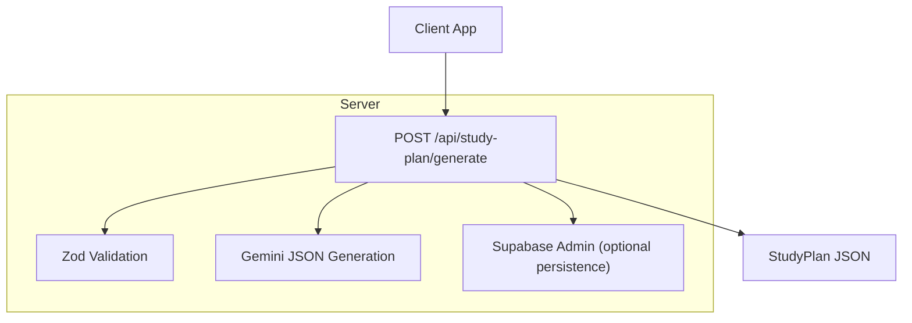
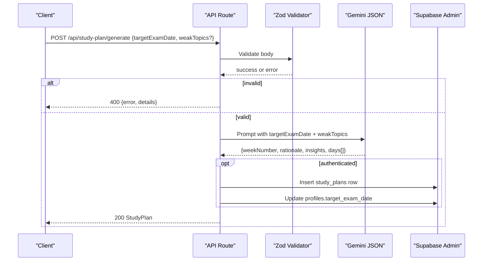
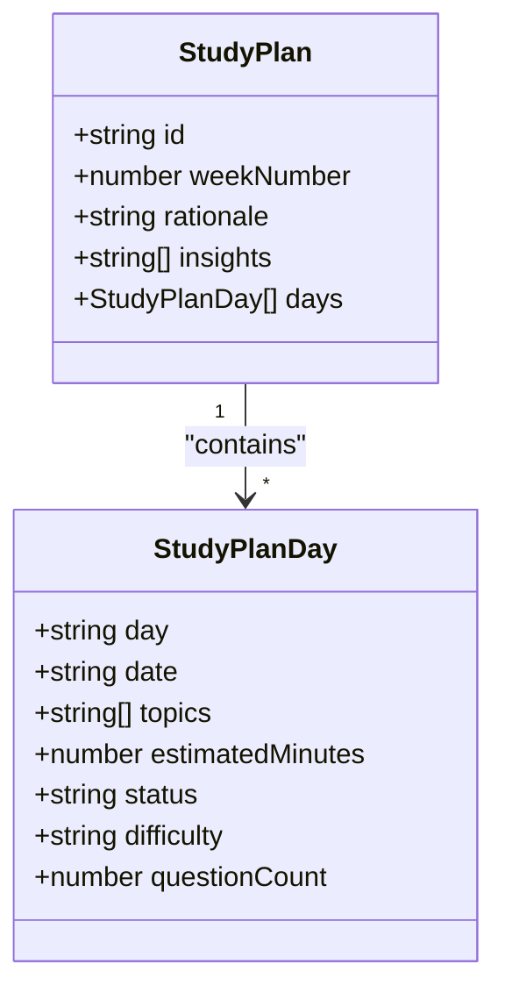
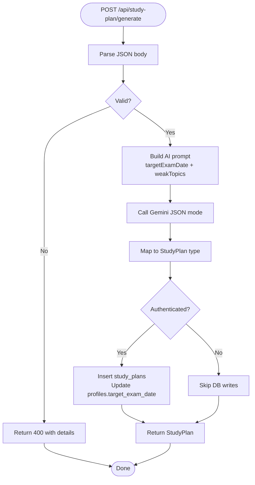
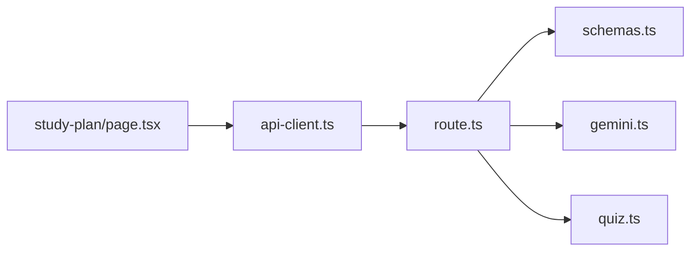

# Study Plan APIs

<cite>
**Referenced Files in This Document**
- [route.ts](file://src/app/api/study-plan/generate/route.ts)
- [schemas.ts](file://src/lib/validations/schemas.ts)
- [quiz.ts](file://src/types/quiz.ts)
- [api-client.ts](file://src/lib/api-client.ts)
- [gemini.ts](file://src/lib/ai/gemini.ts)
- [study-plan/page.tsx](file://src/app/study-plan/page.tsx)
- [middleware.ts](file://src/middleware.ts)
</cite>

## Table of Contents
1. [Introduction](#introduction)
2. [Project Structure](#project-structure)
3. [Core Components](#core-components)
4. [Architecture Overview](#architecture-overview)
5. [Detailed Component Analysis](#detailed-component-analysis)
6. [Dependency Analysis](#dependency-analysis)
7. [Performance Considerations](#performance-considerations)
8. [Troubleshooting Guide](#troubleshooting-guide)
9. [Conclusion](#conclusion)

## Introduction
This document provides API documentation for MedAce-AI’s study plan generation endpoint that creates personalized weekly MDCAT study schedules. The endpoint leverages AI to produce a 7-day plan tailored to the user’s target exam date and weak topics, returning structured daily tasks with topic prioritization and actionable insights. It also covers authentication considerations, error handling patterns, and integration notes for client applications.

## Project Structure
The study plan feature spans an API route, validation schemas, types, an AI integration layer, and a frontend page that calls the API.

**Diagram sources**
- [route.ts:8-122](file://src/app/api/study-plan/generate/route.ts#L8-L122)
- [schemas.ts:42-47](file://src/lib/validations/schemas.ts#L42-L47)
- [gemini.ts:45-59](file://src/lib/ai/gemini.ts#L45-L59)

**Section sources**
- [route.ts:1-123](file://src/app/api/study-plan/generate/route.ts#L1-L123)
- [schemas.ts:1-48](file://src/lib/validations/schemas.ts#L1-L48)
- [quiz.ts:60-76](file://src/types/quiz.ts#L60-L76)
- [gemini.ts:1-61](file://src/lib/ai/gemini.ts#L1-L61)

## Core Components
- POST /api/study-plan/generate: Validates input, builds an AI prompt using target exam date and optional weak topics, generates a 7-day plan via Gemini, and returns a typed StudyPlan object. Optionally persists the plan and updates the user’s target exam date if authenticated.
- Validation schema: Ensures request body conforms to expected structure and formats.
- Types: Define StudyPlan and StudyPlanDay structures used across the app.
- AI integration: Uses Gemini in JSON mode to return structured output.
- Frontend client: Provides a typed function to call the endpoint from the UI.

**Section sources**
- [route.ts:8-122](file://src/app/api/study-plan/generate/route.ts#L8-L122)
- [schemas.ts:42-47](file://src/lib/validations/schemas.ts#L42-L47)
- [quiz.ts:60-76](file://src/types/quiz.ts#L60-L76)
- [api-client.ts:119-132](file://src/lib/api-client.ts#L119-L132)
- [gemini.ts:45-59](file://src/lib/ai/gemini.ts#L45-L59)

## Architecture Overview
The endpoint follows a clear pipeline: receive and validate request, construct a focused prompt, generate a JSON plan with Gemini, map to internal types, optionally persist to Supabase, and return the response.

**Diagram sources**
- [route.ts:8-122](file://src/app/api/study-plan/generate/route.ts#L8-L122)
- [schemas.ts:42-47](file://src/lib/validations/schemas.ts#L42-L47)
- [gemini.ts:45-59](file://src/lib/ai/gemini.ts#L45-L59)

## Detailed Component Analysis

### Endpoint: POST /api/study-plan/generate
- Purpose: Generate a personalized 7-day MDCAT study plan based on target exam date and optional weak topics.
- Authentication: Not enforced at the route level; if a user is authenticated, the generated plan is saved to the database and the user’s profile target exam date is updated.
- Request body:
  - targetExamDate: string, required, format YYYY-MM-DD
  - weakTopics: array of strings, optional
- Response: StudyPlan object containing weekNumber, rationale, insights, and days array. Each day includes day label, date, topics, estimatedMinutes, status, difficulty, and questionCount.

Request parameters
- targetExamDate
  - Type: string
  - Required: yes
  - Format: YYYY-MM-DD
  - Description: Target MDCAT exam date used to tailor pacing and focus.
- weakTopics
  - Type: string[]
  - Required: no
  - Description: List of specific topics to emphasize. If omitted, default high-yield topics are used.

Response schema
- StudyPlan
  - id: string
  - weekNumber: number
  - rationale: string
  - insights: string[]
  - days: StudyPlanDay[]
- StudyPlanDay
  - day: string (e.g., "Day 1")
  - date: string (YYYY-MM-DD)
  - topics: string[]
  - estimatedMinutes: number
  - status: "completed" | "today" | "upcoming"
  - difficulty: "Easy" | "Medium" | "Hard" | "Mixed"
  - questionCount: number

Error responses
- 400 Bad Request: Invalid request body (validation failure). Returns { error, details }.
- 500 Internal Server Error: Unexpected server-side error. Returns { error, message }.

Integration notes
- If authenticated, the endpoint persists the plan under study_plans and updates the user’s target exam date in profiles.
- The AI model is configured for JSON output to ensure consistent schema compliance.

Example usage (client)
- The frontend client exposes generateStudyPlan(params) which posts to this endpoint and returns a StudyPlan.

**Section sources**
- [route.ts:8-122](file://src/app/api/study-plan/generate/route.ts#L8-L122)
- [schemas.ts:42-47](file://src/lib/validations/schemas.ts#L42-L47)
- [quiz.ts:60-76](file://src/types/quiz.ts#L60-L76)
- [api-client.ts:119-132](file://src/lib/api-client.ts#L119-L132)
- [gemini.ts:45-59](file://src/lib/ai/gemini.ts#L45-L59)

### Data Models

**Diagram sources**
- [quiz.ts:60-76](file://src/types/quiz.ts#L60-L76)

**Section sources**
- [quiz.ts:60-76](file://src/types/quiz.ts#L60-L76)

### Request Flow and Processing Logic

**Diagram sources**
- [route.ts:8-122](file://src/app/api/study-plan/generate/route.ts#L8-L122)
- [schemas.ts:42-47](file://src/lib/validations/schemas.ts#L42-L47)
- [gemini.ts:45-59](file://src/lib/ai/gemini.ts#L45-L59)

### Authentication and Profile Integration
- The route attempts to fetch the current user via Supabase client. If present, it:
  - Inserts a new study plan record into study_plans with plan_data JSON and week_number.
  - Updates the user’s target_exam_date in profiles to match the provided targetExamDate.
- Middleware currently allows all routes through during development; production should enforce session checks as needed.

**Section sources**
- [route.ts:94-112](file://src/app/api/study-plan/generate/route.ts#L94-L112)
- [middleware.ts:1-41](file://src/middleware.ts#L1-L41)

### Frontend Integration
- The study plan page loads a stored plan or generates one locally, and offers a “Customize Plan” modal that calls generateStudyPlan with targetExamDate. On success, it saves the returned plan to local storage and displays it.

**Section sources**
- [study-plan/page.tsx:67-90](file://src/app/study-plan/page.tsx#L67-L90)
- [api-client.ts:119-132](file://src/lib/api-client.ts#L119-L132)

## Dependency Analysis

**Diagram sources**
- [route.ts:1-123](file://src/app/api/study-plan/generate/route.ts#L1-L123)
- [schemas.ts:1-48](file://src/lib/validations/schemas.ts#L1-L48)
- [gemini.ts:1-61](file://src/lib/ai/gemini.ts#L1-L61)
- [quiz.ts:1-107](file://src/types/quiz.ts#L1-L107)
- [api-client.ts:1-133](file://src/lib/api-client.ts#L1-L133)
- [study-plan/page.tsx:1-335](file://src/app/study-plan/page.tsx#L1-L335)

**Section sources**
- [route.ts:1-123](file://src/app/api/study-plan/generate/route.ts#L1-L123)
- [api-client.ts:1-133](file://src/lib/api-client.ts#L1-L133)
- [study-plan/page.tsx:1-335](file://src/app/study-plan/page.tsx#L1-L335)

## Performance Considerations
- AI latency: Gemini JSON generation can be slow; consider client-side loading states and timeouts.
- Input size: Keep weakTopics concise to reduce prompt length and improve response time.
- Database writes: Optional persistence only occurs when authenticated; avoid unnecessary writes by batching or caching where appropriate.
- Caching: Consider caching recent plans per user to reduce redundant AI calls.

[No sources needed since this section provides general guidance]

## Troubleshooting Guide
Common issues and resolutions:
- 400 Invalid study plan request: Ensure targetExamDate matches YYYY-MM-DD and weakTopics is an array of strings if provided.
- 500 Internal Server Error: Check server logs for errors in AI or database operations. Verify environment variables for Gemini and Supabase credentials.
- Missing weak topics: If not provided, the endpoint uses default high-yield topics; include weakTopics to personalize the plan.
- Auth-dependent persistence: Without authentication, plans are still generated but not persisted; authenticate to enable saving and profile updates.

**Section sources**
- [route.ts:13-18](file://src/app/api/study-plan/generate/route.ts#L13-L18)
- [route.ts:115-121](file://src/app/api/study-plan/generate/route.ts#L115-L121)
- [schemas.ts:42-47](file://src/lib/validations/schemas.ts#L42-L47)

## Conclusion
The POST /api/study-plan/generate endpoint delivers a robust, AI-powered mechanism to create personalized weekly MDCAT study plans. It validates inputs, constructs targeted prompts, returns a well-structured StudyPlan, and integrates with user profiles when authenticated. Clients can easily call the endpoint via the provided api-client function and render the results in the study plan interface.