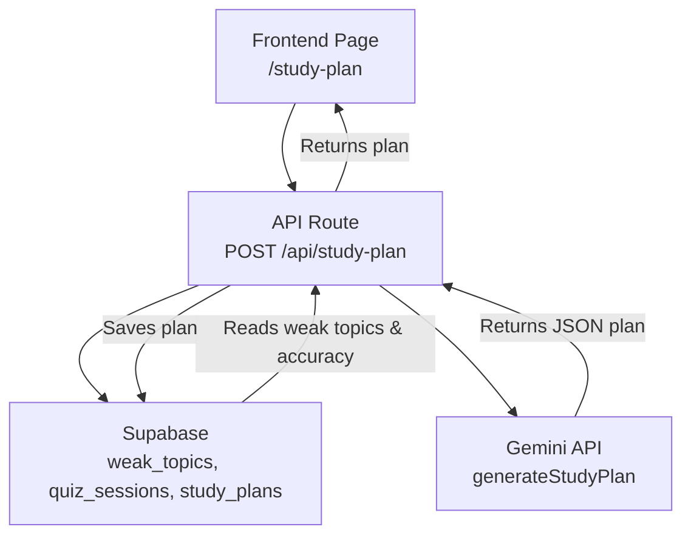
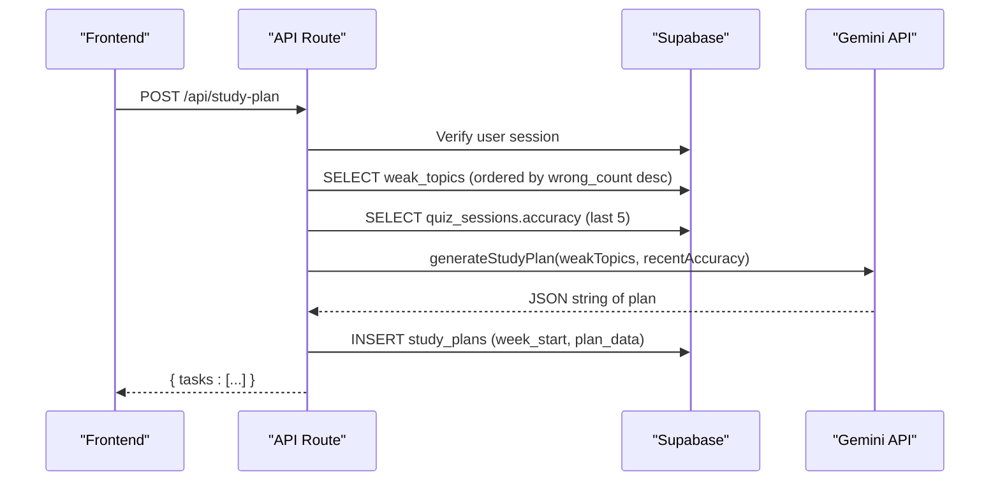
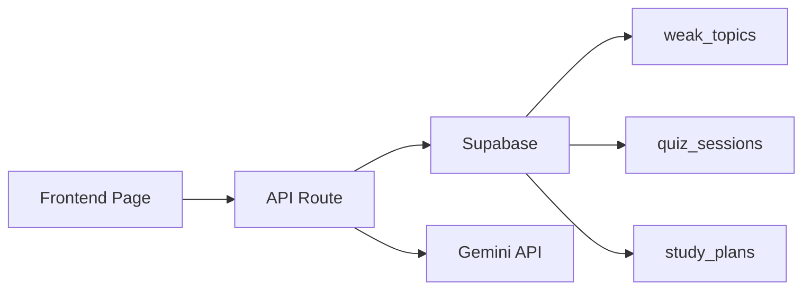

# Study Plan Endpoint

<cite>
**Referenced Files in This Document**
- [route.ts](file://Next-app/src/app/api/study-plan/route.ts)
- [client.ts](file://Next-app/src/lib/gemini/client.ts)
- [page.tsx](file://Next-app/src/app/(dashboard)/study-plan/page.tsx)
- [user.ts](file://Next-app/src/types/user.ts)
- [schema.ts](file://Next-app/src/lib/drizzle/schema.ts)
</cite>

## Table of Contents
1. [Introduction](#introduction)
2. [Project Structure](#project-structure)
3. [Core Components](#core-components)
4. [Architecture Overview](#architecture-overview)
5. [Detailed Component Analysis](#detailed-component-analysis)
6. [Dependency Analysis](#dependency-analysis)
7. [Performance Considerations](#performance-considerations)
8. [Troubleshooting Guide](#troubleshooting-guide)
9. [Conclusion](#conclusion)

## Introduction
This document provides detailed API documentation for the study plan generation endpoint that creates personalized weekly study schedules based on a user’s weak topics and recent performance. It covers request/response schemas, error handling, integration patterns with the frontend, and how data flows through the system to produce actionable daily tasks.

## Project Structure
The study plan feature is implemented as a Next.js App Router API route backed by Supabase and an AI service (Gemini). The frontend displays and manages generated plans.

**Diagram sources**
- [route.ts:5-77](file://Next-app/src/app/api/study-plan/route.ts#L5-L77)
- [client.ts:94-134](file://Next-app/src/lib/gemini/client.ts#L94-L134)
- [schema.ts:58-77](file://Next-app/src/lib/drizzle/schema.ts#L58-L77)

**Section sources**
- [route.ts:1-115](file://Next-app/src/app/api/study-plan/route.ts#L1-L115)
- [page.tsx:22-54](file://Next-app/src/app/(dashboard)/study-plan/page.tsx#L22-L54)

## Core Components
- API Route: POST /api/study-plan generates a weekly plan using weak topics and recent accuracy; GET /api/study-plan retrieves the latest plan.
- Gemini Client: generateStudyPlan builds a prompt from weak topics and recent accuracy and returns a JSON string representing the plan.
- Database Schema: Stores weak topics, quiz sessions, and generated study plans.
- Frontend Integration: Fetches and renders the plan, supports regenerating and toggling task completion.

Key responsibilities:
- Authentication and authorization via Supabase.
- Aggregation of weak topics and recent accuracy.
- AI-driven plan generation with structured JSON output.
- Persistence of generated plans per week.
- UI interaction for viewing and refreshing plans.

**Section sources**
- [route.ts:5-77](file://Next-app/src/app/api/study-plan/route.ts#L5-L77)
- [client.ts:94-134](file://Next-app/src/lib/gemini/client.ts#L94-L134)
- [schema.ts:58-77](file://Next-app/src/lib/drizzle/schema.ts#L58-L77)
- [page.tsx:22-54](file://Next-app/src/app/(dashboard)/study-plan/page.tsx#L22-L54)

## Architecture Overview
The endpoint performs the following steps:
1. Authenticate the user via Supabase.
2. Retrieve weak topics ordered by wrong count.
3. Compute recent accuracy from the last five quiz sessions.
4. Call Gemini to generate a weekly plan JSON.
5. Persist the plan into study_plans with the current week start date.
6. Return the plan JSON to the client.

**Diagram sources**
- [route.ts:5-77](file://Next-app/src/app/api/study-plan/route.ts#L5-L77)
- [client.ts:94-134](file://Next-app/src/lib/gemini/client.ts#L94-L134)
- [schema.ts:58-77](file://Next-app/src/lib/drizzle/schema.ts#L58-L77)

## Detailed Component Analysis

### API Endpoint: POST /api/study-plan
Purpose: Generate a personalized weekly study plan based on weak topics and recent accuracy.

Request:
- Method: POST
- Path: /api/study-plan
- Body: Not required. The endpoint derives inputs internally:
  - Weak topics: fetched from the weak_topics table for the authenticated user.
  - Recent accuracy: computed from the last five quiz_sessions entries.
  - Hours per day: defaults to 2 hours if not provided.

Response:
- Success (200): JSON object containing a tasks array. Each task includes:
  - day: string (e.g., weekday name)
  - topic: string
  - activity: "read" | "quiz" | "review"
  - estimatedMinutes: number
  - completed: boolean
  - summary: string (optional)

Error responses:
- 401 Unauthorized: Missing or invalid authentication.
- 500 Internal Server Error: Unexpected failure during generation or persistence.

Notes:
- The endpoint persists the generated plan under the current week’s start date.
- If Gemini returns malformed content, the endpoint falls back to an empty tasks array.

**Section sources**
- [route.ts:5-77](file://Next-app/src/app/api/study-plan/route.ts#L5-L77)
- [client.ts:94-134](file://Next-app/src/lib/gemini/client.ts#L94-L134)
- [schema.ts:58-77](file://Next-app/src/lib/drizzle/schema.ts#L58-L77)

### API Endpoint: GET /api/study-plan
Purpose: Retrieve the latest study plan for the authenticated user.

Response:
- Success (200): JSON object with fields:
  - id: string
  - userId: string
  - weekStart: string (ISO date)
  - tasks: array of task objects (same schema as POST response)
  - generatedAt: string (timestamp)
- No plan found (200): null

Error responses:
- 401 Unauthorized: Missing or invalid authentication.

**Section sources**
- [route.ts:80-114](file://Next-app/src/app/api/study-plan/route.ts#L80-L114)

### Data Models and Types
- StudyPlanTask: Represents a single daily task with day, topic, activity type, estimated minutes, completion status, and optional summary.
- StudyPlan: Envelope for a saved plan including metadata like id, userId, weekStart, tasks, and generatedAt.

These types align with the persisted structure and the Gemini-generated JSON.

**Section sources**
- [user.ts:17-32](file://Next-app/src/types/user.ts#L17-L32)
- [schema.ts:58-77](file://Next-app/src/lib/drizzle/schema.ts#L58-L77)

### Gemini Integration: generateStudyPlan
Inputs:
- weakTopics: Array of objects with topic, wrongCount, totalCount.
- recentAccuracy: Number representing percentage accuracy from recent sessions.
- hoursPerDay: Optional number (defaults to 2).

Output:
- A JSON string describing a 7-day plan with tasks array matching the StudyPlanTask schema.

Behavior:
- Constructs a prompt emphasizing weak topics and recent accuracy.
- Expects only JSON in the response; extracts JSON via regex parsing.
- Throws errors on non-OK HTTP responses from Gemini.

**Section sources**
- [client.ts:94-134](file://Next-app/src/lib/gemini/client.ts#L94-L134)

### Frontend Integration
The dashboard page:
- Fetches the latest plan via GET /api/study-plan.
- Triggers generation via POST /api/study-plan when the user requests a new plan.
- Displays tasks with activity badges, estimated minutes, and completion toggles.
- Uses React Query to manage state and invalidate queries after mutation.

Integration pattern:
- Use query key ["study-plan"] to cache and refetch.
- On successful mutation, update local tasks and invalidate the query to refresh the UI.

**Section sources**
- [page.tsx:22-54](file://Next-app/src/app/(dashboard)/study-plan/page.tsx#L22-L54)
- [page.tsx:64-70](file://Next-app/src/app/(dashboard)/study-plan/page.tsx#L64-L70)

## Dependency Analysis
The endpoint depends on:
- Supabase for authentication and data access (weak_topics, quiz_sessions, study_plans).
- Gemini API for AI-driven plan generation.
- Frontend components for rendering and user interactions.

**Diagram sources**
- [route.ts:5-77](file://Next-app/src/app/api/study-plan/route.ts#L5-L77)
- [schema.ts:58-77](file://Next-app/src/lib/drizzle/schema.ts#L58-L77)

**Section sources**
- [route.ts:5-77](file://Next-app/src/app/api/study-plan/route.ts#L5-L77)
- [schema.ts:58-77](file://Next-app/src/lib/drizzle/schema.ts#L58-L77)

## Performance Considerations
- Caching: The frontend caches the plan using React Query keys to minimize redundant fetches.
- Database queries: Only the last five quiz sessions are used to compute recent accuracy, limiting I/O.
- AI latency: Gemini calls can be slow; consider loading states and retries in the frontend.
- Parsing robustness: The endpoint parses JSON from Gemini with fallback to empty tasks to avoid crashes.

[No sources needed since this section provides general guidance]

## Troubleshooting Guide
Common issues and resolutions:
- 401 Unauthorized: Ensure the user is authenticated before calling the endpoint. Check Supabase session validity.
- Empty tasks: If Gemini returns unexpected content, the endpoint may return an empty tasks array. Validate Gemini configuration and retry.
- Network errors: Handle timeouts and retries gracefully in the frontend. Show appropriate feedback to users.
- Database write failures: If saving the plan fails, the endpoint still returns the generated plan but it won’t persist. Check Supabase permissions and schema.

**Section sources**
- [route.ts:71-77](file://Next-app/src/app/api/study-plan/route.ts#L71-L77)
- [client.ts:22-28](file://Next-app/src/lib/gemini/client.ts#L22-L28)

## Conclusion
The POST /api/study-plan endpoint provides a robust mechanism to generate personalized weekly study plans using weak topics and recent performance metrics. It integrates seamlessly with Supabase and Gemini, persists plans per week, and exposes a simple interface for the frontend to display and interact with tasks. Proper error handling and caching ensure a smooth user experience.

[No sources needed since this section summarizes without analyzing specific files]