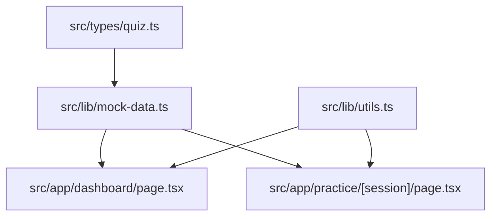
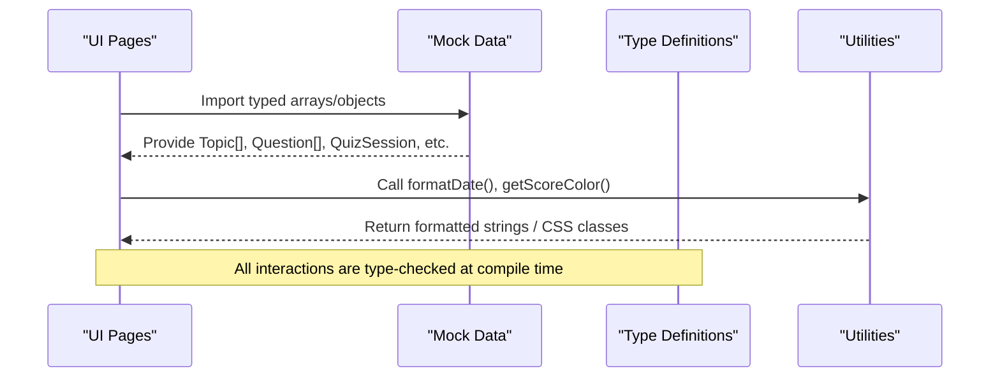
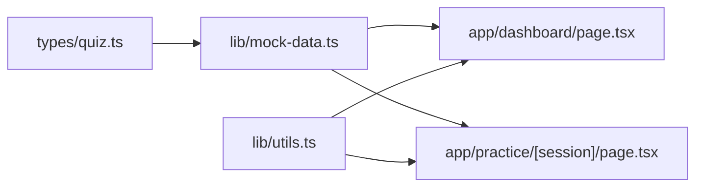

# TypeScript Type Definitions

<cite>
**Referenced Files in This Document**
- [quiz.ts](file://src/types/quiz.ts)
- [mock-data.ts](file://src/lib/mock-data.ts)
- [utils.ts](file://src/lib/utils.ts)
- [dashboard/page.tsx](file://src/app/dashboard/page.tsx)
- [practice/[session]/page.tsx](file://src/app/practice/[session]/page.tsx)
</cite>

## Table of Contents
1. [Introduction](#introduction)
2. [Project Structure](#project-structure)
3. [Core Components](#core-components)
4. [Architecture Overview](#architecture-overview)
5. [Detailed Component Analysis](#detailed-component-analysis)
6. [Dependency Analysis](#dependency-analysis)
7. [Performance Considerations](#performance-considerations)
8. [Troubleshooting Guide](#troubleshooting-guide)
9. [Conclusion](#conclusion)

## Introduction
This document explains MedAce AI’s TypeScript type system that powers quiz sessions, user progress tracking, and study planning. It covers all exported interfaces, their relationships, field constraints, validation rules via string literal unions, and how these types are used across the application to ensure type-safe interactions between UI components, mock data, and utilities.

## Project Structure
The type definitions live in a single dedicated module and are consumed by mock data and UI pages:
- Types: src/types/quiz.ts
- Mock data: src/lib/mock-data.ts
- Utilities: src/lib/utils.ts
- Usage examples: src/app/dashboard/page.tsx, src/app/practice/[session]/page.tsx

**Diagram sources**
- [quiz.ts:1-107](file://src/types/quiz.ts#L1-L107)
- [mock-data.ts:1-313](file://src/lib/mock-data.ts#L1-L313)
- [utils.ts:1-34](file://src/lib/utils.ts#L1-L34)
- [dashboard/page.tsx:1-239](file://src/app/dashboard/page.tsx#L1-L239)
- [practice/[session]/page.tsx:1-352](file://src/app/practice/[session]/page.tsx#L1-L352)

**Section sources**
- [quiz.ts:1-107](file://src/types/quiz.ts#L1-L107)
- [mock-data.ts:1-313](file://src/lib/mock-data.ts#L1-L313)
- [utils.ts:1-34](file://src/lib/utils.ts#L1-L34)
- [dashboard/page.tsx:1-239](file://src/app/dashboard/page.tsx#L1-L239)
- [practice/[session]/page.tsx:1-352](file://src/app/practice/[session]/page.tsx#L1-L352)

## Core Components
Below is a summary of each exported interface, its purpose, key fields, and constraints.

- Topic
  - Purpose: Represents a chapter/topic with category and optional performance metrics.
  - Key fields: id, chapterNum, name, category (string literal union), subtopicsCount, accuracy (optional percentage), isWeak (optional flag).
  - Constraints: category must be one of three allowed values; accuracy is optional and represents 0–100 when present.

- Question
  - Purpose: Models a multiple-choice question with bilingual explanations and difficulty.
  - Key fields: id, sessionId, questionText, optionA/B/C/D, correctAnswer (A–D), explanationEn, explanationUr, difficulty (Easy/Medium/Hard), topic.
  - Constraints: correctAnswer and difficulty are constrained to specific string literals.

- UserAnswer
  - Purpose: Captures a user’s response to a question including correctness and timing.
  - Key fields: questionId, selectedAnswer (A–D or null), isCorrect, timeTakenMs.
  - Constraints: selectedAnswer allows null for unanswered questions.

- QuizSession
  - Purpose: Aggregates a set of questions, answers, and session metadata.
  - Key fields: id, topic, chapterNum, difficulty (Easy/Medium/Hard/Mixed), numQuestions, score (nullable), totalQuestions, status (in-progress/completed), createdAt, timeTakenMs (optional), questions (array of Question), answers (array of UserAnswer).
  - Constraints: status and difficulty use string literal unions; score is nullable until completion.

- WeakTopic
  - Purpose: Tracks topics where the user struggles, with metrics to guide focus.
  - Key fields: topic, chapterNum, weaknessScore (0–100), errorCount, attemptCount.
  - Constraints: weaknessScore is a percentage-like metric.

- StudyPlanDay
  - Purpose: Represents a single day’s plan within a weekly study plan.
  - Key fields: day, date, topics (string[]), estimatedMinutes, status (completed/today/upcoming), difficulty (Easy/Medium/Hard/Mixed), questionCount.
  - Constraints: status and difficulty use string literal unions.

- StudyPlan
  - Purpose: Weekly plan containing days, rationale, and insights.
  - Key fields: id, weekNumber, days (StudyPlanDay[]), rationale, insights (string[]).

- DashboardStats
  - Purpose: High-level metrics for the dashboard overview.
  - Key fields: totalQuestions, questionsThisWeek, accuracyRate, sessionsCompleted, studyStreak.

- RecentSession
  - Purpose: Summary of recent quiz sessions for quick review.
  - Key fields: id, topic, score, totalQuestions, date.

- UserProfile
  - Purpose: User profile with aggregated performance and history.
  - Key fields: id, fullName, email, memberSince, totalQuestions, totalSessions, overallAccuracy, bestTopic, worstTopic, longestStreak, chapterPerformance (array of {chapter, accuracy}).

**Section sources**
- [quiz.ts:5-106](file://src/types/quiz.ts#L5-L106)

## Architecture Overview
The type system forms the contract between data and UI:
- Types define strict shapes for domain entities (Topic, Question, UserAnswer, etc.).
- Mock data provides typed sample datasets conforming to those shapes.
- UI pages consume typed data and utilities to render dashboards, practice flows, and results.

**Diagram sources**
- [mock-data.ts:1-313](file://src/lib/mock-data.ts#L1-L313)
- [quiz.ts:1-107](file://src/types/quiz.ts#L1-L107)
- [utils.ts:1-34](file://src/lib/utils.ts#L1-L34)
- [dashboard/page.tsx:1-239](file://src/app/dashboard/page.tsx#L1-L239)
- [practice/[session]/page.tsx:1-352](file://src/app/practice/[session]/page.tsx#L1-L352)

## Detailed Component Analysis

### Topic
- Role: Chapter/topic entity with category and optional performance indicators.
- Relationships: Used to display topic cards on the dashboard and filter weak/new topics.
- Field constraints:
  - category: restricted to "Human Physiology", "Modern Topics", "Pharmacology".
  - accuracy: optional number representing 0–100; undefined indicates not attempted.
  - isWeak: optional boolean marking weak areas.
- Example usage:
  - Filtering and mapping topics on the dashboard to show weak/new items and progress bars.

**Section sources**
- [quiz.ts:5-13](file://src/types/quiz.ts#L5-L13)
- [mock-data.ts:15-31](file://src/lib/mock-data.ts#L15-L31)
- [dashboard/page.tsx:192-233](file://src/app/dashboard/page.tsx#L192-L233)

### Question
- Role: Single multiple-choice question with options, correct answer, explanations, difficulty, and topic association.
- Relationships: Embedded in QuizSession.questions; referenced by UserAnswer.questionId.
- Field constraints:
  - correctAnswer: "A" | "B" | "C" | "D".
  - difficulty: "Easy" | "Medium" | "Hard".
- Example usage:
  - Rendered in the practice player; difficulty badge shown; explanations toggled.

**Section sources**
- [quiz.ts:15-28](file://src/types/quiz.ts#L15-L28)
- [mock-data.ts:69-210](file://src/lib/mock-data.ts#L69-L210)
- [practice/[session]/page.tsx:167-267](file://src/app/practice/[session]/page.tsx#L167-L267)

### UserAnswer
- Role: Records a user’s selection, correctness, and time taken per question.
- Relationships: Part of QuizSession.answers; links to Question via questionId.
- Field constraints:
  - selectedAnswer: "A" | "B" | "C" | "D" | null (null if not answered).
  - isCorrect: boolean computed from comparing selectedAnswer to Question.correctAnswer.
- Example usage:
  - Populated in completed session mock data; used in results view to compute stats.

**Section sources**
- [quiz.ts:30-35](file://src/types/quiz.ts#L30-L35)
- [mock-data.ts:244-256](file://src/lib/mock-data.ts#L244-L256)
- [practice/[session]/page.tsx:165-174](file://src/app/practice/[session]/page.tsx#L165-L174)

### QuizSession
- Role: Container for a set of questions and answers along with session metadata.
- Relationships: Contains arrays of Question and UserAnswer; references topic/chapter/difficulty.
- Field constraints:
  - difficulty: "Easy" | "Medium" | "Hard" | "Mixed".
  - status: "in-progress" | "completed".
  - score: number | null (null until completion).
  - timeTakenMs: optional number.
- Example usage:
  - Mock sessions represent active and completed states; drive navigation to results.

**Section sources**
- [quiz.ts:37-50](file://src/types/quiz.ts#L37-L50)
- [mock-data.ts:215-256](file://src/lib/mock-data.ts#L215-L256)

### WeakTopic
- Role: Identifies topics needing more practice based on errors and attempts.
- Relationships: Displayed on dashboard to highlight focus areas; drives study plan insights.
- Field constraints:
  - weaknessScore: 0–100 (higher means weaker).
- Example usage:
  - Dashboard lists weak topics with progress bars and wrong counts.

**Section sources**
- [quiz.ts:52-58](file://src/types/quiz.ts#L52-L58)
- [mock-data.ts:36-42](file://src/lib/mock-data.ts#L36-L42)
- [dashboard/page.tsx:108-136](file://src/app/dashboard/page.tsx#L108-L136)

### StudyPlanDay and StudyPlan
- Role: Plan structure for weekly learning schedule.
- Relationships: StudyPlan contains an array of StudyPlanDay; each day has topics, difficulty, and status.
- Field constraints:
  - StudyPlanDay.status: "completed" | "today" | "upcoming".
  - StudyPlanDay.difficulty: "Easy" | "Medium" | "Hard" | "Mixed".
- Example usage:
  - Mock study plan demonstrates daily tasks and rationale/insights.

**Section sources**
- [quiz.ts:60-76](file://src/types/quiz.ts#L60-L76)
- [mock-data.ts:261-281](file://src/lib/mock-data.ts#L261-L281)

### DashboardStats
- Role: Aggregated metrics for dashboard overview.
- Fields: totalQuestions, questionsThisWeek, accuracyRate, sessionsCompleted, studyStreak.
- Example usage:
  - Dashboard renders stat cards using these values.

**Section sources**
- [quiz.ts:78-84](file://src/types/quiz.ts#L78-L84)
- [mock-data.ts:47-53](file://src/lib/mock-data.ts#L47-L53)
- [dashboard/page.tsx:47-88](file://src/app/dashboard/page.tsx#L47-L88)

### RecentSession
- Role: Compact representation of recent quiz sessions.
- Fields: id, topic, score, totalQuestions, date.
- Example usage:
  - Dashboard lists recent sessions with formatted dates and scores.

**Section sources**
- [quiz.ts:86-92](file://src/types/quiz.ts#L86-L92)
- [mock-data.ts:58-64](file://src/lib/mock-data.ts#L58-L64)
- [dashboard/page.tsx:151-174](file://src/app/dashboard/page.tsx#L151-L174)

### UserProfile
- Role: User profile with performance summaries and chapter-wise accuracy.
- Fields: id, fullName, email, memberSince, totalQuestions, totalSessions, overallAccuracy, bestTopic, worstTopic, longestStreak, chapterPerformance (array of {chapter, accuracy}).
- Example usage:
  - Mock profile shows aggregated stats and chapter performance list.

**Section sources**
- [quiz.ts:94-106](file://src/types/quiz.ts#L94-L106)
- [mock-data.ts:286-312](file://src/lib/mock-data.ts#L286-L312)

## Dependency Analysis
- Centralized types: All domain models are defined in src/types/quiz.ts.
- Mock data depends on types to provide strongly-typed sample data.
- UI pages depend on both mock data and utility functions for formatting and styling.
- Utility functions operate on primitive types and return styled class names or formatted strings.

**Diagram sources**
- [quiz.ts:1-107](file://src/types/quiz.ts#L1-L107)
- [mock-data.ts:1-313](file://src/lib/mock-data.ts#L1-L313)
- [utils.ts:1-34](file://src/lib/utils.ts#L1-L34)
- [dashboard/page.tsx:1-239](file://src/app/dashboard/page.tsx#L1-L239)
- [practice/[session]/page.tsx:1-352](file://src/app/practice/[session]/page.tsx#L1-L352)

**Section sources**
- [quiz.ts:1-107](file://src/types/quiz.ts#L1-L107)
- [mock-data.ts:1-313](file://src/lib/mock-data.ts#L1-L313)
- [utils.ts:1-34](file://src/lib/utils.ts#L1-L34)
- [dashboard/page.tsx:1-239](file://src/app/dashboard/page.tsx#L1-L239)
- [practice/[session]/page.tsx:1-352](file://src/app/practice/[session]/page.tsx#L1-L352)

## Performance Considerations
- Prefer immutable updates to stateful structures like AnswerState to avoid unnecessary re-renders.
- Use memoization (e.g., useCallback) for handlers that interact with large arrays of questions.
- Avoid recomputing derived data inside render loops; precompute once and reuse.
- Keep arrays of questions and answers reasonably sized; paginate or virtualize if needed.

[No sources needed since this section provides general guidance]

## Troubleshooting Guide
Common issues and how the type system helps prevent them:
- Incorrect answer selection: The type system enforces selectedAnswer to be "A" | "B" | "C" | "D" | null, preventing invalid inputs.
- Mismatched difficulty/status: String literal unions catch typos at compile time for fields like difficulty and status.
- Null safety: Optional fields like accuracy and timeTakenMs require explicit checks before use.
- Formatting helpers: Ensure you pass valid numeric ranges to utility functions expecting percentages or seconds.

Validation patterns observed in usage:
- Conditional rendering based on optional fields (e.g., checking accuracy presence).
- Guarding against nulls before accessing properties.
- Using utility functions for consistent formatting and styling.

**Section sources**
- [quiz.ts:5-50](file://src/types/quiz.ts#L5-L50)
- [utils.ts:8-33](file://src/lib/utils.ts#L8-L33)
- [dashboard/page.tsx:192-233](file://src/app/dashboard/page.tsx#L192-L233)
- [practice/[session]/page.tsx:57-86](file://src/app/practice/[session]/page.tsx#L57-L86)

## Conclusion
MedAce AI’s TypeScript type system centralizes domain modeling through well-defined interfaces and string literal unions, ensuring robust, type-safe interactions across mock data and UI layers. By leveraging these types consistently, developers can build reliable features for quizzes, dashboards, and study plans while minimizing runtime errors and improving developer experience.

[No sources needed since this section summarizes without analyzing specific files]