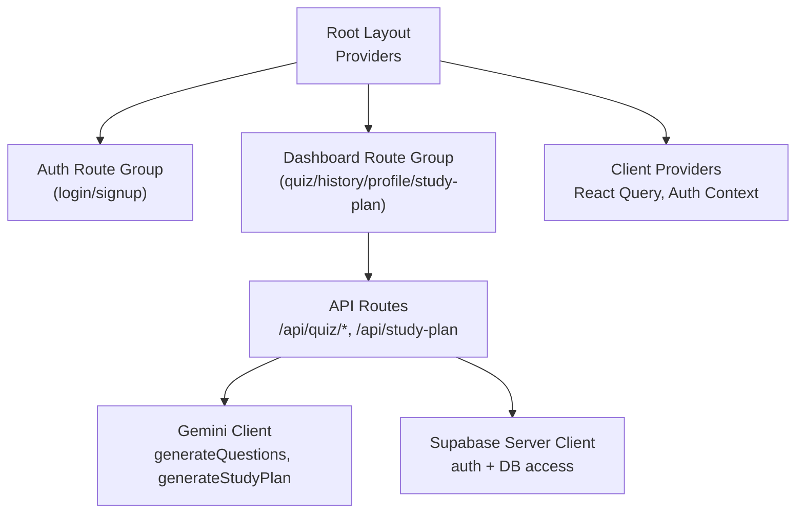
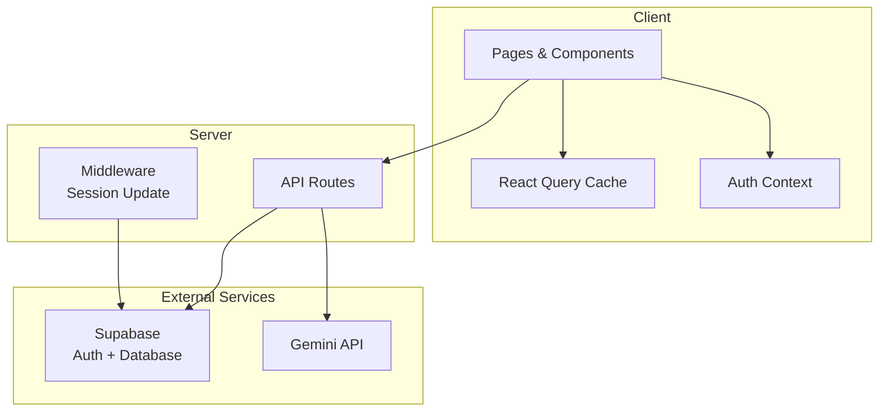
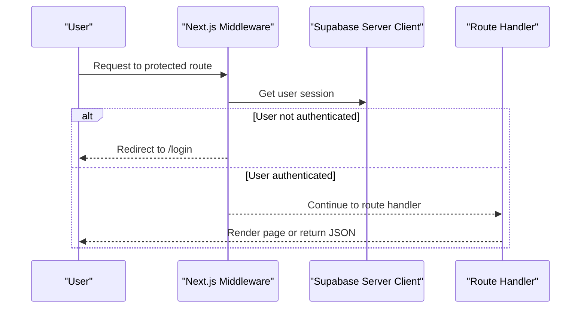
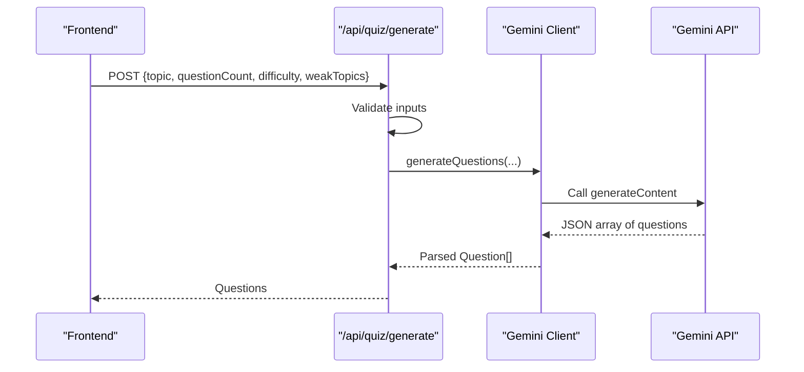
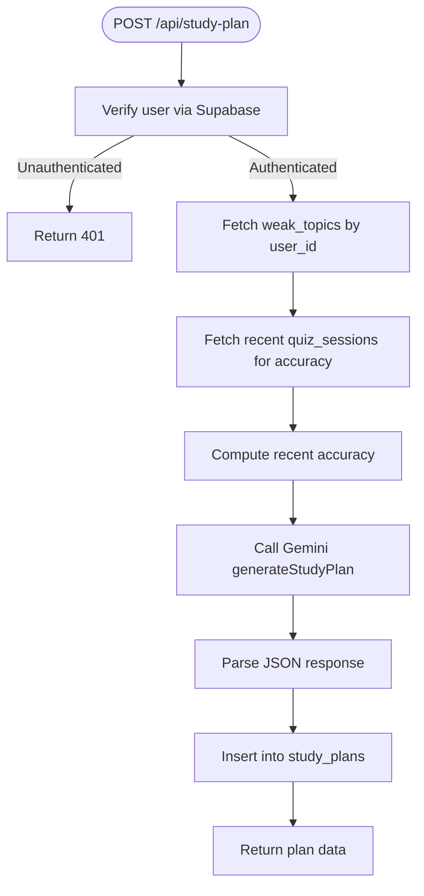
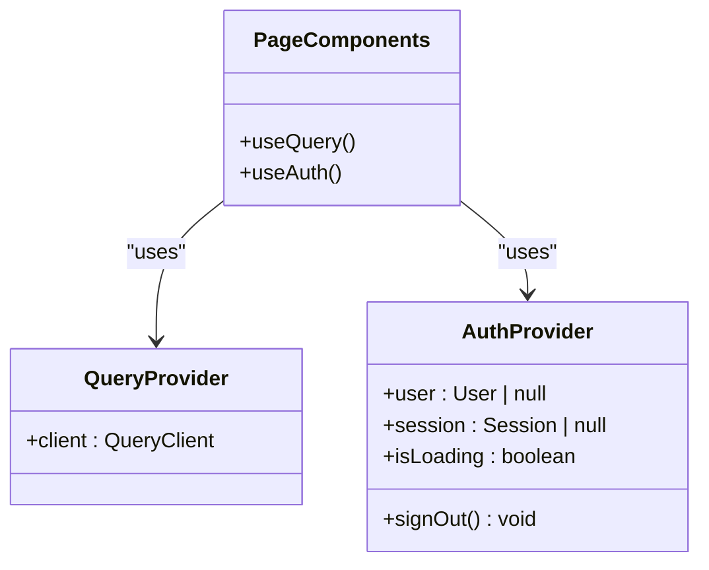
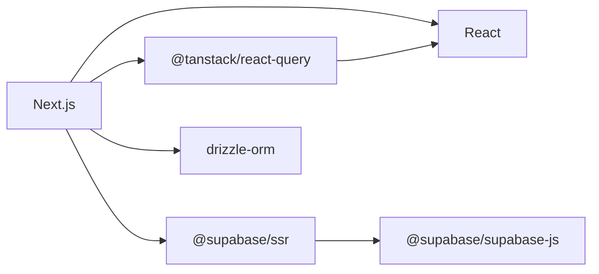

# Architecture Overview

<cite>
**Referenced Files in This Document**
- [layout.tsx](file://Next-app/src/app/layout.tsx)
- [middleware.ts](file://Next-app/src/middleware.ts)
- [AuthProvider.tsx](file://Next-app/src/providers/AuthProvider.tsx)
- [QueryProvider.tsx](file://Next-app/src/providers/QueryProvider.tsx)
- [dashboard layout.tsx](file://Next-app/src/app/(dashboard)/layout.tsx)
- [auth layout.tsx](file://Next-app/src/app/(auth)/layout.tsx)
- [quiz generate route.ts](file://Next-app/src/app/api/quiz/generate/route.ts)
- [study plan route.ts](file://Next-app/src/app/api/study-plan/route.ts)
- [gemini client.ts](file://Next-app/src/lib/gemini/client.ts)
- [supabase server.ts](file://Next-app/src/lib/supabase/server.ts)
- [supabase middleware.ts](file://Next-app/src/lib/supabase/middleware.ts)
- [package.json](file://Next-app/package.json)
</cite>

## Table of Contents
1. Introduction
2. Project Structure
3. Core Components
4. Architecture Overview
5. Detailed Component Analysis
6. Dependency Analysis
7. Performance Considerations
8. Troubleshooting Guide
9. Conclusion

## Introduction
This document explains the system architecture of MedAce-AI, a Next.js application that delivers AI-powered MDCAT preparation with quizzes and personalized study plans. It covers the high-level architecture using the Next.js App Router, component hierarchy, data flow patterns, and integration points with Supabase (authentication and persistence) and the Gemini API (AI content generation). It also documents the separation between client-side and server-side logic, authentication middleware, route groups, state management patterns, and scalability considerations.

## Project Structure
MedAce-AI is organized around Next.js App Router conventions:
- Root layout wraps the app with global providers for data fetching and authentication.
- Route groups separate public auth flows from protected dashboard features.
- API routes encapsulate server-side logic for quiz generation and study plan creation.
- Shared libraries provide reusable clients for Supabase and Gemini.
- UI components are grouped by feature and shared primitives live under a common UI set.

**Diagram sources**
- [layout.tsx:12-22](file://Next-app/src/app/layout.tsx#L12-L22)
- [dashboard layout.tsx:12-60](file://Next-app/src/app/(dashboard)/layout.tsx#L12-L60)
- [auth layout.tsx:1-8](file://Next-app/src/app/(auth)/layout.tsx#L1-L8)
- [quiz generate route.ts:4-31](file://Next-app/src/app/api/quiz/generate/route.ts#L4-L31)
- [study plan route.ts:5-78](file://Next-app/src/app/api/study-plan/route.ts#L5-L78)
- [gemini client.ts:6-28](file://Next-app/src/lib/gemini/client.ts#L6-L28)
- [supabase server.ts:4-30](file://Next-app/src/lib/supabase/server.ts#L4-L30)

**Section sources**
- [layout.tsx:12-22](file://Next-app/src/app/layout.tsx#L12-L22)
- [dashboard layout.tsx:12-60](file://Next-app/src/app/(dashboard)/layout.tsx#L12-L60)
- [auth layout.tsx:1-8](file://Next-app/src/app/(auth)/layout.tsx#L1-L8)

## Core Components
- Root Providers: The root layout composes React Query and Auth providers to supply global state and caching to all pages.
- Authentication Provider: Manages user session state on the client via Supabase, exposing user, session, loading status, and sign-out.
- Dashboard Layout: Enforces authentication for protected routes, renders navigation chrome, and guards against unauthenticated access.
- API Routes: Implement server-only operations such as generating quizzes and study plans, integrating with Gemini and Supabase.
- Gemini Client: Encapsulates prompts and calls to the Gemini API for question generation, explanations, and study planning.
- Supabase Clients: Provide server-side client for authenticated requests and middleware-based session handling.

**Section sources**
- [layout.tsx:12-22](file://Next-app/src/app/layout.tsx#L12-L22)
- [AuthProvider.tsx:27-78](file://Next-app/src/providers/AuthProvider.tsx#L27-L78)
- [dashboard layout.tsx:12-60](file://Next-app/src/app/(dashboard)/layout.tsx#L12-L60)
- [quiz generate route.ts:4-31](file://Next-app/src/app/api/quiz/generate/route.ts#L4-L31)
- [study plan route.ts:5-78](file://Next-app/src/app/api/study-plan/route.ts#L5-L78)
- [gemini client.ts:30-134](file://Next-app/src/lib/gemini/client.ts#L30-L134)
- [supabase server.ts:4-30](file://Next-app/src/lib/supabase/server.ts#L4-L30)
- [supabase middleware.ts:4-67](file://Next-app/src/lib/supabase/middleware.ts#L4-L67)

## Architecture Overview
The application follows a layered architecture:
- Presentation Layer: Pages and components render UI and manage local state.
- Application Layer: Route handlers orchestrate business logic, calling external services and persisting data.
- Integration Layer: Supabase and Gemini clients abstract external dependencies.
- Infrastructure: Next.js App Router, middleware, and environment variables configure runtime behavior.

**Diagram sources**
- [middleware.ts:4-12](file://Next-app/src/middleware.ts#L4-L12)
- [supabase middleware.ts:4-67](file://Next-app/src/lib/supabase/middleware.ts#L4-L67)
- [quiz generate route.ts:4-31](file://Next-app/src/app/api/quiz/generate/route.ts#L4-L31)
- [study plan route.ts:5-78](file://Next-app/src/app/api/study-plan/route.ts#L5-L78)
- [gemini client.ts:6-28](file://Next-app/src/lib/gemini/client.ts#L6-L28)
- [supabase server.ts:4-30](file://Next-app/src/lib/supabase/server.ts#L4-L30)

## Detailed Component Analysis

### Authentication Flow and Middleware
- Global middleware updates sessions and enforces route protection. Unauthenticated users accessing protected paths are redirected to login; authenticated users are redirected away from auth pages.
- The dashboard layout performs client-side checks to guard protected areas and display loading states while resolving auth state.

**Diagram sources**
- [middleware.ts:4-12](file://Next-app/src/middleware.ts#L4-L12)
- [supabase middleware.ts:4-67](file://Next-app/src/lib/supabase/middleware.ts#L4-L67)
- [dashboard layout.tsx:17-37](file://Next-app/src/app/(dashboard)/layout.tsx#L17-L37)

**Section sources**
- [middleware.ts:4-12](file://Next-app/src/middleware.ts#L4-L12)
- [supabase middleware.ts:4-67](file://Next-app/src/lib/supabase/middleware.ts#L4-L67)
- [dashboard layout.tsx:17-37](file://Next-app/src/app/(dashboard)/layout.tsx#L17-L37)

### Quiz Generation Flow
- Client triggers a POST to the quiz generation endpoint with topic, count, difficulty, and optional weak topics.
- Server validates input, calls Gemini to generate questions, and returns structured results.

**Diagram sources**
- [quiz generate route.ts:4-31](file://Next-app/src/app/api/quiz/generate/route.ts#L4-L31)
- [gemini client.ts:30-75](file://Next-app/src/lib/gemini/client.ts#L30-L75)

**Section sources**
- [quiz generate route.ts:4-31](file://Next-app/src/app/api/quiz/generate/route.ts#L4-L31)
- [gemini client.ts:30-75](file://Next-app/src/lib/gemini/client.ts#L30-L75)

### Study Plan Generation Flow
- Client calls the study plan endpoint.
- Server retrieves user’s weak topics and recent accuracy from Supabase, generates a weekly plan via Gemini, persists it, and returns the plan.

**Diagram sources**
- [study plan route.ts:5-78](file://Next-app/src/app/api/study-plan/route.ts#L5-L78)
- [gemini client.ts:94-134](file://Next-app/src/lib/gemini/client.ts#L94-L134)
- [supabase server.ts:4-30](file://Next-app/src/lib/supabase/server.ts#L4-L30)

**Section sources**
- [study plan route.ts:5-78](file://Next-app/src/app/api/study-plan/route.ts#L5-L78)
- [gemini client.ts:94-134](file://Next-app/src/lib/gemini/client.ts#L94-L134)
- [supabase server.ts:4-30](file://Next-app/src/lib/supabase/server.ts#L4-L30)

### State Management Patterns
- React Query: Centralized caching and background refetching for data-heavy features.
- Auth Context: Lightweight client-side state for user/session and sign-out actions.
- Local UI State: Components manage transient UI state (e.g., modals, toggles) without polluting global state.

**Diagram sources**
- [QueryProvider.tsx:6-23](file://Next-app/src/providers/QueryProvider.tsx#L6-L23)
- [AuthProvider.tsx:27-78](file://Next-app/src/providers/AuthProvider.tsx#L27-L78)

**Section sources**
- [QueryProvider.tsx:6-23](file://Next-app/src/providers/QueryProvider.tsx#L6-L23)
- [AuthProvider.tsx:27-78](file://Next-app/src/providers/AuthProvider.tsx#L27-L78)

### Separation of Client and Server Logic
- Client: UI components, routing, and state hooks operate in the browser. They call API routes and consume context/state.
- Server: API routes handle sensitive operations, enforce authentication, and integrate with external services.
- Middleware: Updates sessions and enforces route-level protections before reaching route handlers.

**Section sources**
- [dashboard layout.tsx:17-37](file://Next-app/src/app/(dashboard)/layout.tsx#L17-L37)
- [quiz generate route.ts:4-31](file://Next-app/src/app/api/quiz/generate/route.ts#L4-L31)
- [study plan route.ts:5-78](file://Next-app/src/app/api/study-plan/route.ts#L5-L78)
- [supabase middleware.ts:4-67](file://Next-app/src/lib/supabase/middleware.ts#L4-L67)

## Dependency Analysis
Key runtime dependencies include Next.js, React, Supabase SDKs, React Query, and Drizzle ORM. These enable serverless API routes, real-time auth, caching, and database interactions.

**Diagram sources**
- [package.json:11-23](file://Next-app/package.json#L11-L23)

**Section sources**
- [package.json:11-23](file://Next-app/package.json#L11-L23)

## Performance Considerations
- Caching: React Query provides configurable stale times and retries to reduce network load and improve perceived performance.
- Server-Side Validation: Input validation in API routes prevents unnecessary downstream calls and reduces error propagation.
- External API Limits: Gemini calls should be rate-limited and cached where appropriate to minimize cost and latency.
- Database Queries: Use selective queries and indexes on frequently filtered columns (e.g., user_id) to optimize read/write performance.
- Environment Configuration: Ensure Supabase and Gemini credentials are correctly configured to avoid runtime errors during builds or deployments.

[No sources needed since this section provides general guidance]

## Troubleshooting Guide
- Missing Supabase Credentials: Server client throws an error if environment variables are not set; verify NEXT_PUBLIC_SUPABASE_URL and NEXT_PUBLIC_SUPABASE_ANON_KEY.
- Unauthorized Access: Protected routes redirect to login when no user is present; ensure middleware is active and cookies are properly handled.
- Gemini API Errors: Non-OK responses raise errors; check API key validity and payload formatting.
- Invalid Gemini Response: If Gemini does not return expected JSON structure, parsing will fail; add robust fallbacks and logging.

**Section sources**
- [supabase server.ts:9-11](file://Next-app/src/lib/supabase/server.ts#L9-L11)
- [supabase middleware.ts:4-11](file://Next-app/src/lib/supabase/middleware.ts#L4-L11)
- [gemini client.ts:22-28](file://Next-app/src/lib/gemini/client.ts#L22-L28)
- [gemini client.ts:68-74](file://Next-app/src/lib/gemini/client.ts#L68-L74)

## Conclusion
MedAce-AI leverages Next.js App Router to cleanly separate concerns across presentation, application, and integration layers. Authentication is enforced at both middleware and layout levels, ensuring secure access to protected features. Data flows from user input through API routes to Supabase and Gemini, with React Query managing client-side state and caching. The modular design supports scalability by isolating external integrations, centralizing configuration, and enabling independent evolution of UI and backend logic.

[No sources needed since this section summarizes without analyzing specific files]