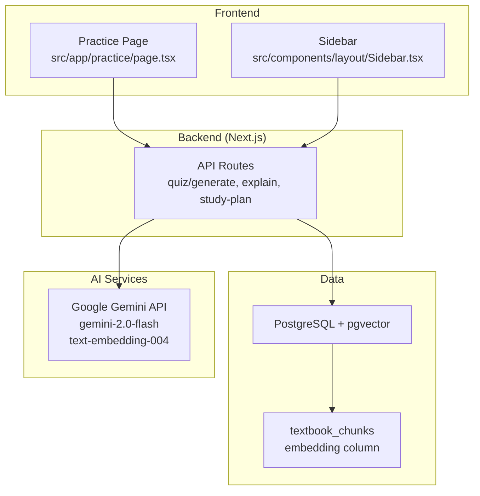
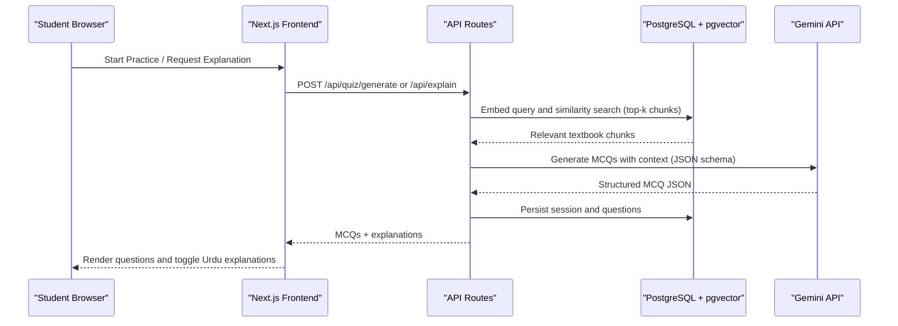
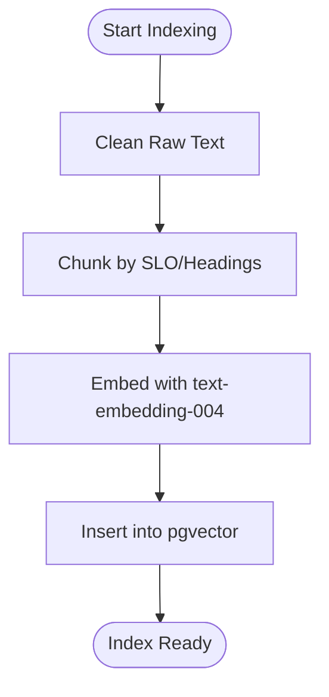
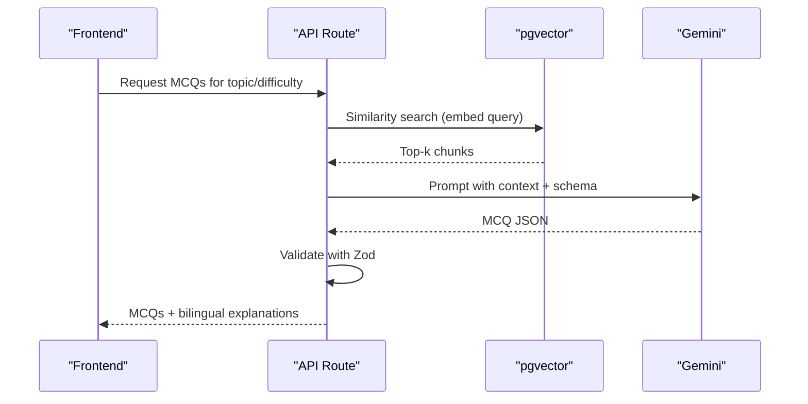
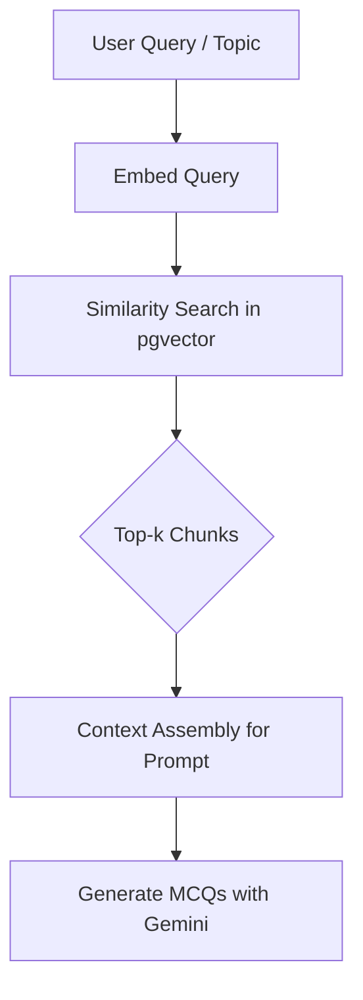
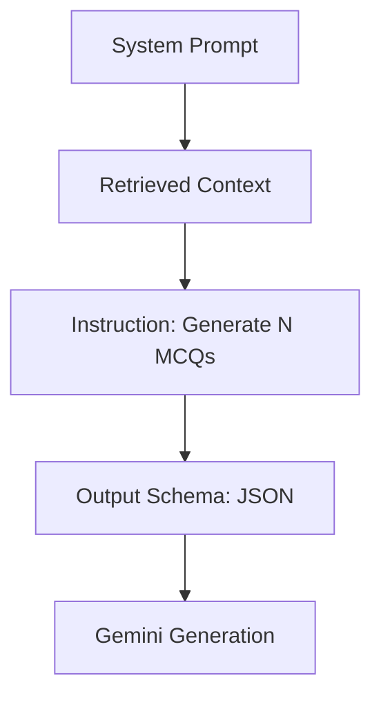
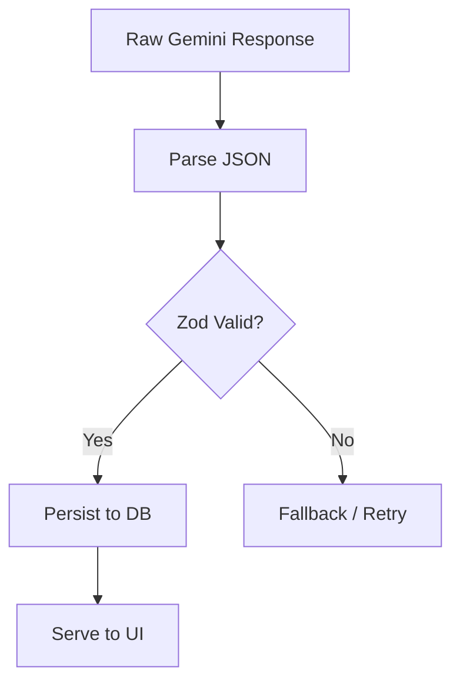
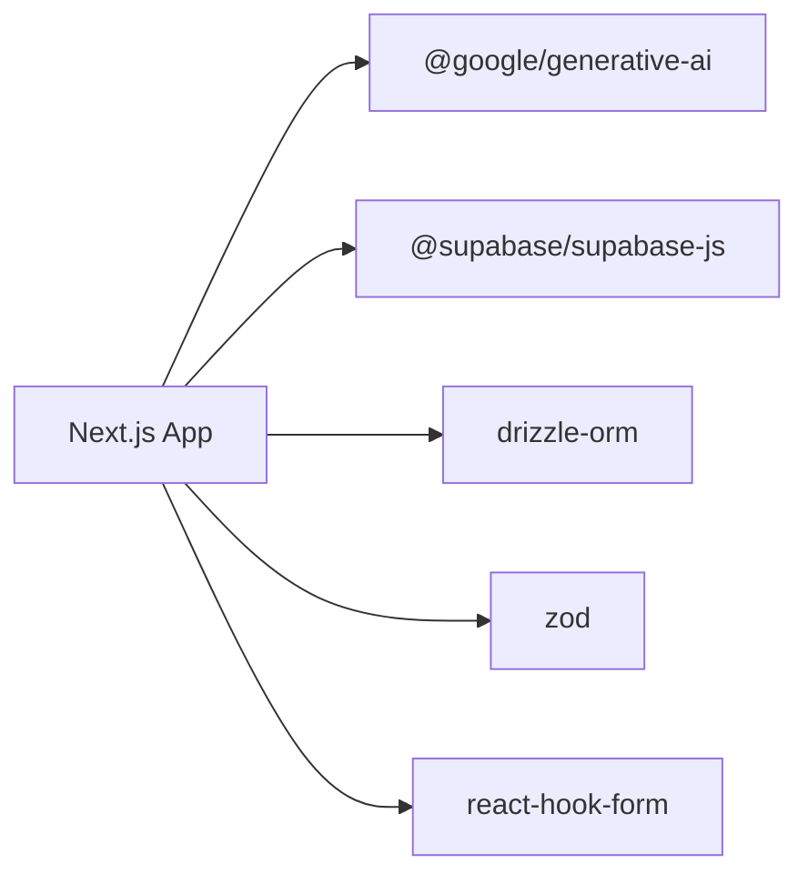

# AI Integration Patterns

<cite>
**Referenced Files in This Document**
- [README.md](file://README.md)
- [package.json](file://package.json)
- [Sidebar.tsx](file://src/components/layout/Sidebar.tsx)
- [page.tsx](file://src/app/practice/page.tsx)
</cite>

## Table of Contents
1. [Introduction](#introduction)
2. [Project Structure](#project-structure)
3. [Core Components](#core-components)
4. [Architecture Overview](#architecture-overview)
5. [Detailed Component Analysis](#detailed-component-analysis)
6. [Dependency Analysis](#dependency-analysis)
7. [Performance Considerations](#performance-considerations)
8. [Troubleshooting Guide](#troubleshooting-guide)
9. [Conclusion](#conclusion)
10. [Appendices](#appendices)

## Introduction
This document explains MedAce AI’s AI integration patterns using Google Gemini API and a Retrieval-Augmented Generation (RAG) architecture. It details how textbook content from rag/textbooks is processed into embeddings, stored in pgvector, and retrieved at query time to generate high-quality MCQs with bilingual explanations (English questions with Urdu explanations). It also covers prompt engineering strategies, response parsing, error handling, rate limiting, caching, and fallback mechanisms for AI service failures.

## Project Structure
The project is a Next.js application that integrates:
- A RAG pipeline that indexes FSc Biology textbook chapters into a vector store (pgvector)
- API routes for MCQ generation and on-demand Urdu explanations
- UI components that surface AI-generated content to students

**Diagram sources**
- [README.md:25-55](file://README.md#L25-L55)
- [README.md:163-226](file://README.md#L163-L226)

**Section sources**
- [README.md:163-226](file://README.md#L163-L226)

## Core Components
- Textbook ingestion and indexing:
  - Clean raw text, chunk by SLO codes/headings, embed via Gemini text-embedding-004, upload vectors to pgvector
- Query-time retrieval:
  - Embed user query/topic, perform cosine similarity search in pgvector, retrieve top-k chunks
- Generation:
  - Build structured prompts with retrieved context, call Gemini 2.0 Flash to produce MCQ JSON with English questions and Urdu explanations
- Validation and storage:
  - Validate responses with Zod, persist sessions/questions, serve to the UI

Key references:
- RAG pipeline overview and data source
- Database schema including textbook_chunks and questions tables
- Environment variables for Gemini and Supabase

**Section sources**
- [README.md:83-122](file://README.md#L83-L122)
- [README.md:124-161](file://README.md#L124-L161)
- [README.md:228-244](file://README.md#L228-L244)

## Architecture Overview
MedAce AI uses a server-side Next.js API layer to orchestrate retrieval and generation:
- The frontend triggers practice sessions or explanation requests
- The API embeds the query, retrieves relevant textbook chunks from pgvector, and constructs a prompt
- Gemini generates structured MCQs; responses are validated and stored
- UI renders questions and toggles Urdu explanations when needed

**Diagram sources**
- [README.md:25-55](file://README.md#L25-L55)
- [README.md:104-122](file://README.md#L104-L122)

## Detailed Component Analysis

### RAG Indexing Pipeline (Build-Time)
- Input: rag/textbooks/*.txt (15 chapters)
- Steps:
  - Text cleaning to remove OCR artifacts and page markers
  - Chunking by SLO codes and headings (~400–600 tokens per chunk with overlap)
  - Embedding via Gemini text-embedding-004 (768-dim vectors)
  - Upload to pgvector table textbook_chunks

**Diagram sources**
- [README.md:90-102](file://README.md#L90-L102)

**Section sources**
- [README.md:90-102](file://README.md#L90-L102)

### Question Generation Pipeline (Query-Time)
- Triggered when a student starts a practice session or selects a topic
- Steps:
  - Embed the query (topic + difficulty context)
  - Retrieve top-k relevant chunks via pgvector cosine similarity
  - Build a Gemini prompt with system instructions, retrieved context, and output schema
  - Generate MCQ JSON (question, options, answer, explanation_en, explanation_ur)
  - Validate with Zod, store results, and return to UI

**Diagram sources**
- [README.md:104-122](file://README.md#L104-L122)

**Section sources**
- [README.md:104-122](file://README.md#L104-L122)

### Context Retrieval Mechanism
- Uses pgvector cosine similarity to find textbook chunks most relevant to the user’s query and learning objectives
- Ensures generated questions are grounded in the MDCAT syllabus rather than hallucinated

**Diagram sources**
- [README.md:104-122](file://README.md#L104-L122)

**Section sources**
- [README.md:104-122](file://README.md#L104-L122)

### Prompt Engineering Strategies
- System role defines an MDCAT biology MCQ generator persona
- Context includes retrieved textbook chunks to ground answers
- Instruction specifies generating N MCQs with four options each
- Output schema enforces structured JSON fields: question, options, answer, explanation_en, explanation_ur

**Diagram sources**
- [README.md:113-121](file://README.md#L113-L121)

**Section sources**
- [README.md:113-121](file://README.md#L113-L121)

### Response Parsing and Validation
- Use Zod to validate Gemini’s structured JSON output before storing or serving
- Ensures type safety and consistent shape across all generated MCQs

**Diagram sources**
- [README.md:117-122](file://README.md#L117-L122)

**Section sources**
- [README.md:117-122](file://README.md#L117-L122)

### Error Handling and Fallbacks
- Handle AI service failures (timeouts, rate limits, invalid responses)
- Implement retries with exponential backoff
- Provide fallbacks such as cached MCQs or static content when AI is unavailable
- Surface user-friendly errors and continue the flow gracefully

[No sources needed since this section provides general guidance]

### Rate Limiting and Caching
- Rate limiting:
  - Apply client-side throttling and server-side request caps to respect Gemini quotas
  - Batch similar queries where possible to reduce calls
- Caching:
  - Cache frequent topic queries and their resulting MCQs in memory or database
  - Use TanStack Query for efficient client-side caching and revalidation

[No sources needed since this section provides general guidance]

### Bilingual Explanations (English Questions, Urdu Explanations)
- Gemini generates English MCQs aligned with exam language
- Urdu explanations are produced alongside English ones to aid comprehension
- UI allows toggling between languages for explanations while keeping questions in English

**Section sources**
- [README.md:117-121](file://README.md#L117-L121)

## Dependency Analysis
MedAce AI depends on:
- Next.js for full-stack routing and server functions
- @google/generative-ai for Gemini interactions
- Supabase client libraries for PostgreSQL and pgvector
- Drizzle ORM for type-safe database access
- Zod for runtime validation
- React Hook Form for form handling

**Diagram sources**
- [package.json:11-26](file://package.json#L11-L26)

**Section sources**
- [package.json:11-26](file://package.json#L11-L26)

## Performance Considerations
- Chunk size and overlap:
  - ~400–600 tokens per chunk with 50-token overlap balances retrieval precision and cost
- Embedding dimensionality:
  - 768-dim vectors reduce storage and improve query performance
- Retrieval strategy:
  - Cosine similarity in pgvector for fast, SQL-native vector search
- Model selection:
  - Gemini 2.0 Flash offers speed, cost efficiency, and strong multilingual output
- Caching:
  - Leverage TanStack Query to cache repeated topic queries and avoid redundant AI calls

[No sources needed since this section provides general guidance]

## Troubleshooting Guide
Common issues and resolutions:
- Missing environment variables:
  - Ensure NEXT_PUBLIC_SUPABASE_URL, NEXT_PUBLIC_SUPABASE_ANON_KEY, SUPABASE_SERVICE_ROLE_KEY, DATABASE_URL, and GEMINI_API_KEY are set
- Database connectivity:
  - Verify DATABASE_URL and pgvector extension availability
- Gemini API errors:
  - Check GEMINI_API_KEY validity and quota; implement retries and fallbacks
- Invalid responses:
  - Validate with Zod; if validation fails, retry or fall back to cached content

**Section sources**
- [README.md:228-244](file://README.md#L228-L244)

## Conclusion
MedAce AI integrates Google Gemini with a robust RAG pipeline to deliver syllabus-aligned MCQs and bilingual explanations. By embedding textbook content into pgvector and retrieving relevant context at query time, the system ensures accuracy and relevance. Prompt engineering, strict response validation, and resilient error handling provide a reliable experience even under service constraints.

## Appendices

### Environment Variables Reference
- NEXT_PUBLIC_SUPABASE_URL
- NEXT_PUBLIC_SUPABASE_ANON_KEY
- SUPABASE_SERVICE_ROLE_KEY
- DATABASE_URL
- GEMINI_API_KEY
- NEXT_PUBLIC_APP_URL

**Section sources**
- [README.md:228-244](file://README.md#L228-L244)

### User-Facing Notes
- The practice page indicates that questions are AI-generated from real textbook content using RAG retrieval
- The sidebar highlights that the app is powered by Gemini

**Section sources**
- [page.tsx:175-183](file://src/app/practice/page.tsx#L175-L183)
- [Sidebar.tsx:65-70](file://src/components/layout/Sidebar.tsx#L65-L70)