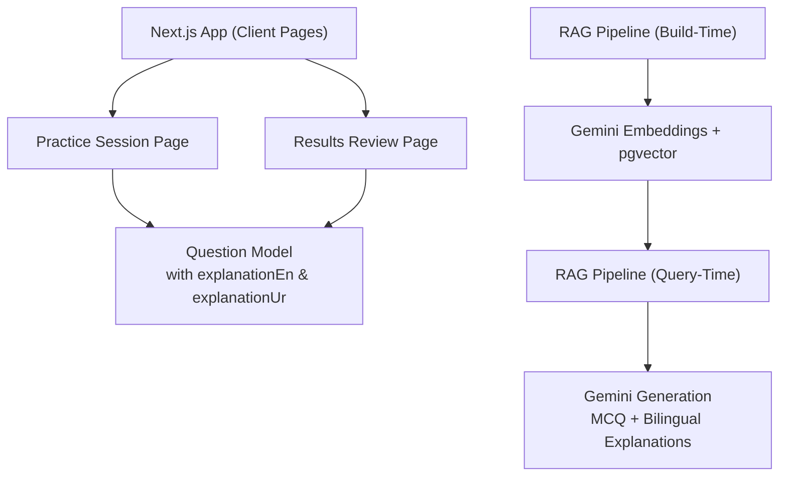
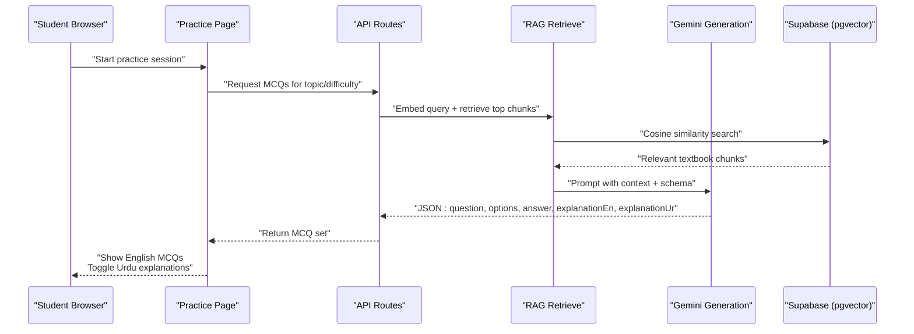
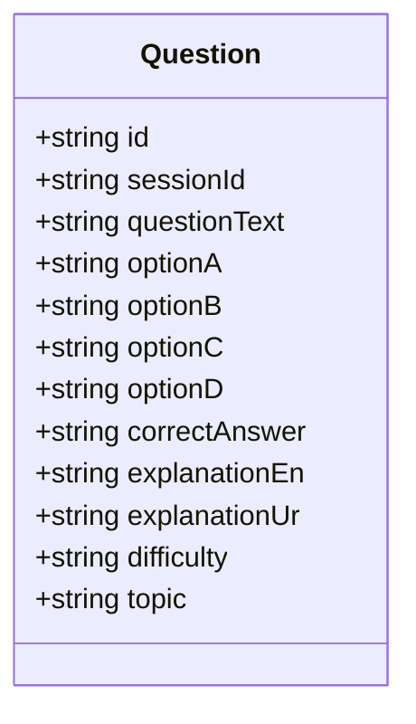
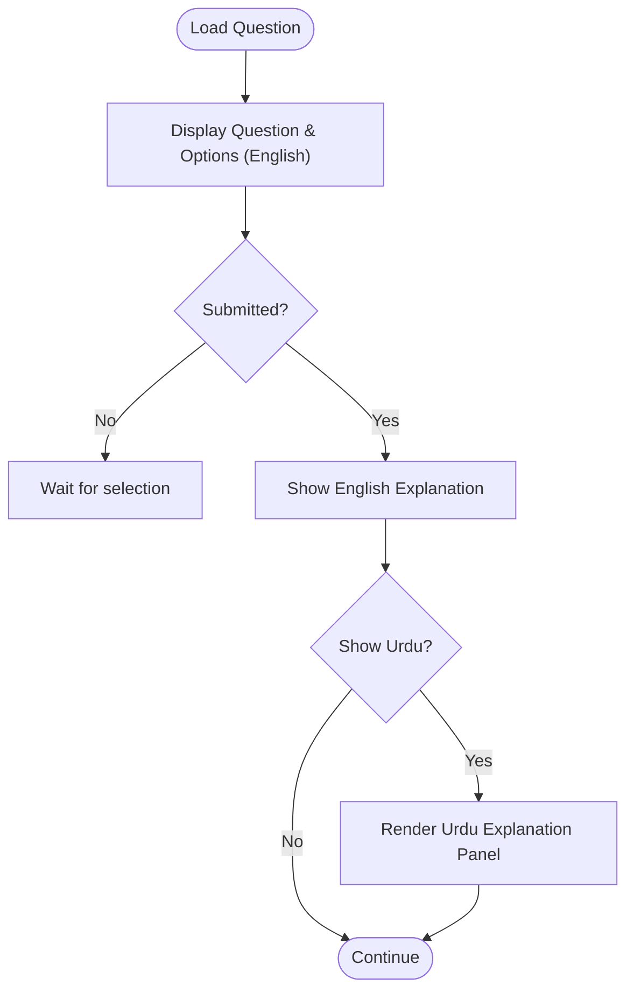
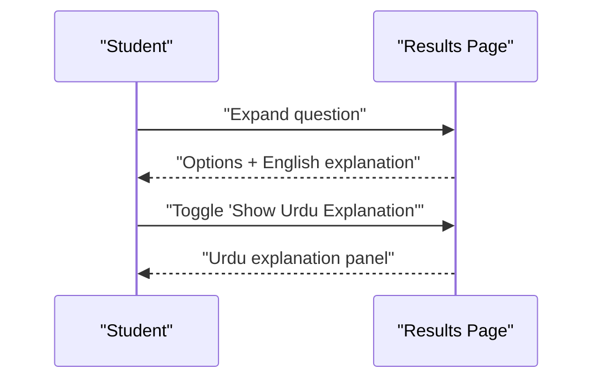
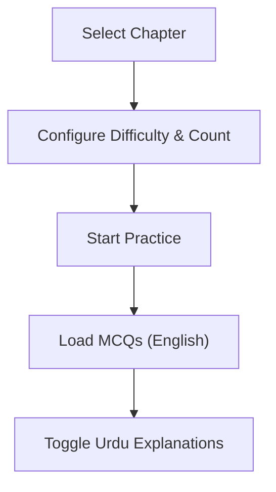
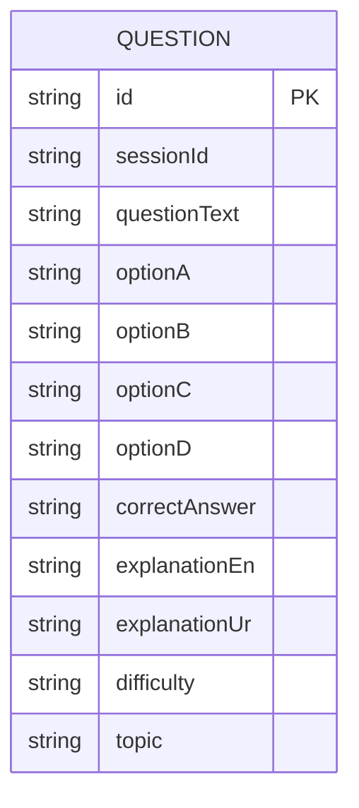
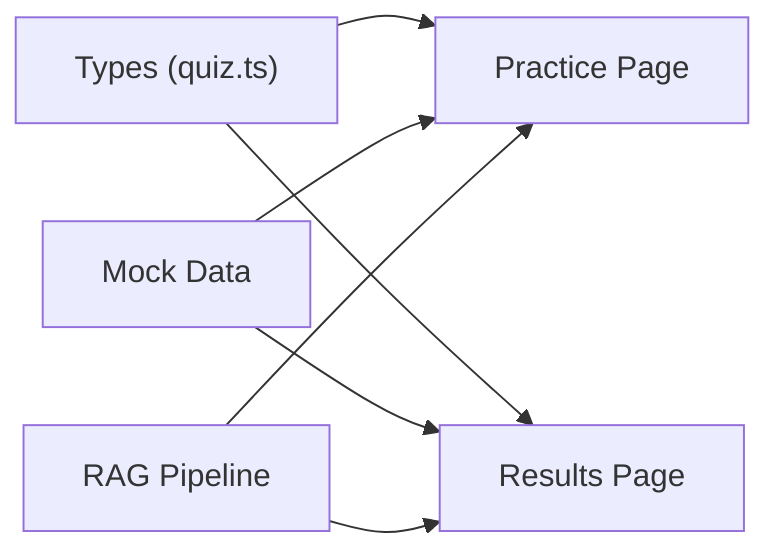

# Bilingual Content Processing

<cite>
**Referenced Files in This Document**
- [README.md](file://README.md)
- [package.json](file://package.json)
- [src/types/quiz.ts](file://src/types/quiz.ts)
- [src/lib/mock-data.ts](file://src/lib/mock-data.ts)
- [src/app/layout.tsx](file://src/app/layout.tsx)
- [src/components/Providers.tsx](file://src/components/Providers.tsx)
- [src/app/practice/page.tsx](file://src/app/practice/page.tsx)
- [src/app/practice/[session]/page.tsx](file://src/app/practice/[session]/page.tsx)
- [src/app/results/[session]/page.tsx](file://src/app/results/[session]/page.tsx)
</cite>

## Table of Contents
1. Introduction
2. Project Structure
3. Core Components
4. Architecture Overview
5. Detailed Component Analysis
6. Dependency Analysis
7. Performance Considerations
8. Troubleshooting Guide
9. Conclusion
10. Appendices

## Introduction
MedAce AI is an adaptive MDCAT prep coach that preserves exam authenticity by keeping the interface and all MCQ content in English, while offering conceptual understanding through code-mixed Urdu explanations on demand. The system ensures that technical terms such as “enzyme” or “osmosis” remain intact, with reasoning explained in Urdu to match how students think and study. Explanations are attached per question and can be toggled during practice and review, enabling a seamless bilingual learning experience without altering the exam-like environment.

## Project Structure
The application is a Next.js 15 app with React 19 and TypeScript. It uses Tailwind CSS for styling and TanStack Query for state/data management. The bilingual flow centers around:
- Practice session UI where questions appear in English and Urdu explanations are available via toggle
- Results page that shows both English and Urdu explanations per question
- Data models that include both explanation fields per question
- RAG pipeline documentation describing how MCQs and explanations are generated from textbook chunks using Gemini embeddings and generation

**Diagram sources**
- [README.md:79-122](file://README.md#L79-L122)
- [src/types/quiz.ts:15-28](file://src/types/quiz.ts#L15-L28)
- [src/app/practice/[session]/page.tsx:185-213](file://src/app/practice/[session]/page.tsx#L185-L213)
- [src/app/results/[session]/page.tsx:252-284](file://src/app/results/[session]/page.tsx#L252-L284)

**Section sources**
- [README.md:23-78](file://README.md#L23-L78)
- [README.md:79-122](file://README.md#L79-L122)
- [README.md:163-226](file://README.md#L163-L226)
- [package.json:1-42](file://package.json#L1-L42)

## Core Components
- Question model: Each question includes English text, four options, correct answer, difficulty, topic, and two explanation fields: one in English and one in Urdu. This structure enables bilingual display without changing the exam-like interface.
- Mock data: Provides example questions with both explanationEn and explanationUr to demonstrate the bilingual capability in practice and results views.
- Practice session: Displays the question and options in English; after answering, shows the English explanation by default and offers an “Explain in Urdu” toggle to reveal the Urdu explanation.
- Results review: Shows each question’s English explanation and provides a per-question toggle to show the Urdu explanation.

Key responsibilities:
- Maintain English-only exam experience (questions, options, interface)
- Provide optional Urdu explanations to build conceptual understanding
- Keep technical terms unchanged while explaining reasoning in Urdu

**Section sources**
- [src/types/quiz.ts:15-28](file://src/types/quiz.ts#L15-L28)
- [src/lib/mock-data.ts:69-210](file://src/lib/mock-data.ts#L69-L210)
- [src/app/practice/[session]/page.tsx:185-213](file://src/app/practice/[session]/page.tsx#L185-L213)
- [src/app/results/[session]/page.tsx:252-284](file://src/app/results/[session]/page.tsx#L252-L284)

## Architecture Overview
The bilingual system integrates with a Retrieval-Augmented Generation (RAG) pipeline grounded in FSc Biology textbook content. At build time, textbook chapters are cleaned, chunked by SLO codes/headings, embedded with Gemini embeddings, and stored in Supabase pgvector. At query time, a student’s topic/difficulty context is embedded, relevant chunks are retrieved, and Gemini generates structured MCQs with both English and Urdu explanations. The client renders these in English, with Urdu explanations exposed via toggles.

**Diagram sources**
- [README.md:79-122](file://README.md#L79-L122)
- [README.md:124-161](file://README.md#L124-L161)
- [src/app/practice/[session]/page.tsx:185-213](file://src/app/practice/[session]/page.tsx#L185-L213)
- [src/app/results/[session]/page.tsx:252-284](file://src/app/results/[session]/page.tsx#L252-L284)

## Detailed Component Analysis

### Question Model and Bilingual Fields
The Question type defines the core bilingual contract:
- questionText, optionA–D, correctAnswer, difficulty, topic
- explanationEn and explanationUr for parallel explanations
This design ensures the exam remains English-first while enabling immediate access to Urdu explanations when needed.

**Diagram sources**
- [src/types/quiz.ts:15-28](file://src/types/quiz.ts#L15-L28)

**Section sources**
- [src/types/quiz.ts:15-28](file://src/types/quiz.ts#L15-L28)

### Practice Session: On-Demand Urdu Explanations
During practice:
- Questions and options are shown in English
- After submission, the English explanation appears by default
- A toggle reveals the Urdu explanation for the current question
- The toggle resets when moving to the next question

**Diagram sources**
- [src/app/practice/[session]/page.tsx:185-213](file://src/app/practice/[session]/page.tsx#L185-L213)
- [src/app/practice/[session]/page.tsx:257-267](file://src/app/practice/[session]/page.tsx#L257-L267)

**Section sources**
- [src/app/practice/[session]/page.tsx:185-213](file://src/app/practice/[session]/page.tsx#L185-L213)
- [src/app/practice/[session]/page.tsx:257-267](file://src/app/practice/[session]/page.tsx#L257-L267)

### Results Review: Per-Question Language Toggle
On the results page:
- Each question expands to show options and the English explanation
- A per-question toggle reveals the Urdu explanation
- This supports targeted review and language preference per item

**Diagram sources**
- [src/app/results/[session]/page.tsx:252-284](file://src/app/results/[session]/page.tsx#L252-L284)

**Section sources**
- [src/app/results/[session]/page.tsx:252-284](file://src/app/results/[session]/page.tsx#L252-L284)

### Topic Selection and Session Configuration
The topic selection page allows filtering by category and configuring session parameters (difficulty, number of questions). While it does not directly handle language logic, it sets the context for generating bilingual MCQs via the RAG pipeline.

**Diagram sources**
- [src/app/practice/page.tsx:120-192](file://src/app/practice/page.tsx#L120-L192)

**Section sources**
- [src/app/practice/page.tsx:120-192](file://src/app/practice/page.tsx#L120-L192)

### Data Models and Examples
Mock data demonstrates the bilingual structure with concrete examples of explanationEn and explanationUr for multiple questions, illustrating how technical terms are preserved while reasoning is explained in Urdu.

**Diagram sources**
- [src/types/quiz.ts:15-28](file://src/types/quiz.ts#L15-L28)
- [src/lib/mock-data.ts:69-210](file://src/lib/mock-data.ts#L69-L210)

**Section sources**
- [src/lib/mock-data.ts:69-210](file://src/lib/mock-data.ts#L69-L210)

## Dependency Analysis
- Client pages depend on shared types and mock data during development and demonstration
- The bilingual feature depends on the presence of both explanationEn and explanationUr in the Question model
- The RAG pipeline (documented in README) supplies the bilingual content at runtime via Gemini generation and retrieval

**Diagram sources**
- [src/types/quiz.ts:15-28](file://src/types/quiz.ts#L15-L28)
- [src/lib/mock-data.ts:69-210](file://src/lib/mock-data.ts#L69-L210)
- [README.md:79-122](file://README.md#L79-L122)

**Section sources**
- [src/types/quiz.ts:15-28](file://src/types/quiz.ts#L15-L28)
- [src/lib/mock-data.ts:69-210](file://src/lib/mock-data.ts#L69-L210)
- [README.md:79-122](file://README.md#L79-L122)

## Performance Considerations
- Rendering bilingual explanations only on demand reduces initial payload and improves perceived performance
- Using a per-question toggle avoids rendering Urdu panels until requested
- RAG retrieval limits context to top-k chunks, minimizing prompt size and latency
- Storing bilingual explanations alongside questions avoids repeated translation calls during review

[No sources needed since this section provides general guidance]

## Troubleshooting Guide
Common issues and resolutions:
- Missing Urdu explanation: Ensure the Question object includes explanationUr; verify mock data or API response contains both explanation fields
- Incorrect language direction: Use appropriate text direction attributes for Urdu content to ensure proper rendering
- Toggle not resetting: Confirm that moving to the next question resets the Urdu toggle state to avoid stale panels
- RAG retrieval failures: Validate embedding and vector search steps; confirm textbook chunks exist in pgvector

**Section sources**
- [src/app/practice/[session]/page.tsx:185-213](file://src/app/practice/[session]/page.tsx#L185-L213)
- [src/app/results/[session]/page.tsx:252-284](file://src/app/results/[session]/page.tsx#L252-L284)
- [README.md:79-122](file://README.md#L79-L122)

## Conclusion
MedAce AI’s bilingual content processing maintains exam authenticity by keeping the interface and MCQs in English, while providing on-demand Urdu explanations that preserve technical terms and explain reasoning in a familiar code-mixed style. The architecture leverages a RAG pipeline to generate grounded, bilingual content, and the UI exposes language toggles at key moments—during practice and review—to support personalized learning without compromising the exam-like experience.

[No sources needed since this section summarizes without analyzing specific files]

## Appendices

### Environment and Stack Notes
- Framework and libraries are defined in package.json, including Next.js, React, TanStack Query, and Google Generative AI integration
- Root layout sets language and direction for the app; bilingual content relies on proper text direction handling in components

**Section sources**
- [package.json:1-42](file://package.json#L1-L42)
- [src/app/layout.tsx:1-56](file://src/app/layout.tsx#L1-L56)
- [src/components/Providers.tsx:1-23](file://src/components/Providers.tsx#L1-L23)