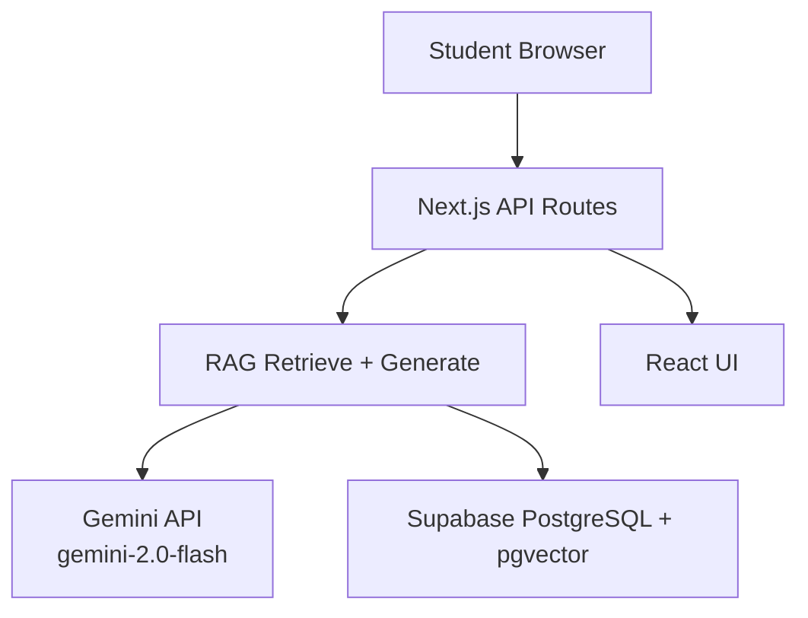
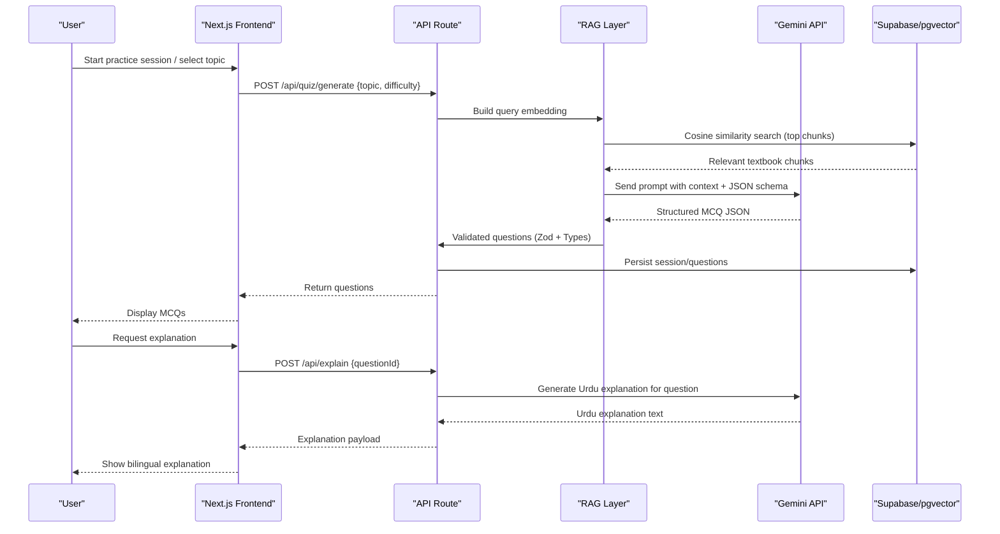
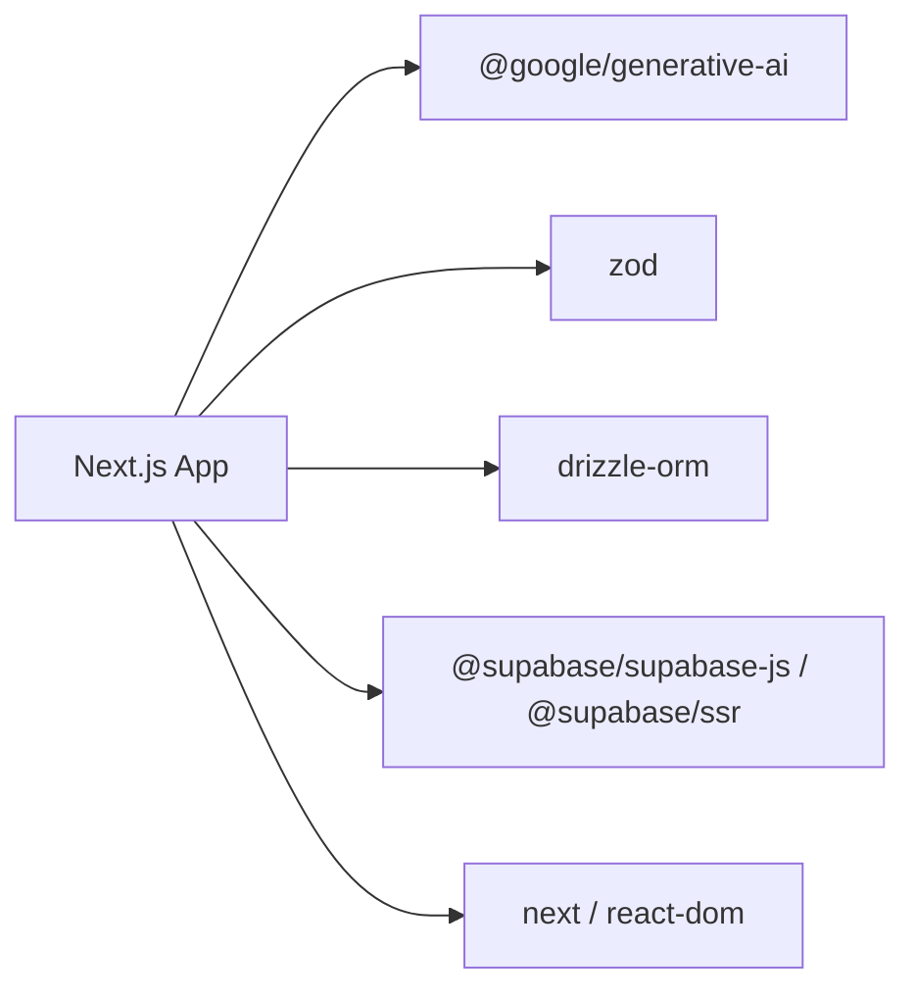

# Google Gemini API Integration

<cite>
**Referenced Files in This Document**
- [README.md](file://README.md)
- [package.json](file://package.json)
- [src/types/quiz.ts](file://src/types/quiz.ts)
- [src/lib/utils.ts](file://src/lib/utils.ts)
- [src/components/layout/Sidebar.tsx](file://src/components/layout/Sidebar.tsx)
</cite>

## Table of Contents
1. Introduction
2. Project Structure
3. Core Components
4. Architecture Overview
5. Detailed Component Analysis
6. Dependency Analysis
7. Performance Considerations
8. Troubleshooting Guide
9. Conclusion
10. Appendices

## Introduction
This document explains how MedAce AI integrates with the Google Gemini API to power two core features:
- MCQ generation in English using gemini-2.0-flash, grounded by Retrieval-Augmented Generation (RAG) over textbook content.
- Bilingual explanations that pair English questions with Urdu explanations for deeper understanding.

The project’s README outlines a RAG pipeline that retrieves relevant textbook chunks and instructs Gemini to produce structured JSON containing questions, four options each, correct answers, and both English and Urdu explanations. The system uses Zod for schema validation and TypeScript types to ensure data integrity end-to-end.

**Section sources**
- [README.md:23-77](file://README.md#L23-L77)
- [README.md:104-122](file://README.md#L104-L122)

## Project Structure
MedAce AI is a Next.js 15 application with server-side API routes intended to orchestrate RAG retrieval and Gemini calls. The README documents the planned structure including:
- API routes for quiz generation and on-demand explanations
- A Gemini client and prompt templates under src/lib/gemini
- RAG utilities for retrieval and generation logic
- Database integration via Drizzle ORM and Supabase pgvector

**Diagram sources**
- [README.md:163-225](file://README.md#L163-L225)

**Section sources**
- [README.md:163-225](file://README.md#L163-L225)

## Core Components
- Gemini model selection: gemini-2.0-flash is used for MCQ generation and bilingual explanations due to speed, cost efficiency, multilingual quality, and large context window.
- RAG pipeline: Embed queries, retrieve top relevant textbook chunks from pgvector, build prompts with retrieved context, and request structured JSON output.
- Validation and typing: Zod validates Gemini responses; TypeScript types define Question, QuizSession, and related structures.
- Environment configuration: GEMINI_API_KEY is required for server-side calls.

Key responsibilities:
- Prompt engineering: System instructions, retrieved context, explicit JSON schema requirements, and bilingual explanation fields.
- Response parsing: Validate and coerce Gemini output into typed Question objects.
- Error handling: Surface user-friendly errors when Gemini fails or returns invalid payloads.
- Rate limiting and retries: Implement backoff and throttling at the API route layer to protect against bursts.
- Caching: Cache repeated topic/difficulty combinations to reduce redundant calls.
- Cost optimization: Use gemini-2.0-flash, limit context size, and cache aggressively.

**Section sources**
- [README.md:23-77](file://README.md#L23-L77)
- [README.md:104-122](file://README.md#L104-L122)
- [README.md:228-244](file://README.md#L228-L244)
- [src/types/quiz.ts:15-28](file://src/types/quiz.ts#L15-L28)

## Architecture Overview
The end-to-end flow for generating MCQs and explanations:

**Diagram sources**
- [README.md:104-122](file://README.md#L104-L122)
- [README.md:190-198](file://README.md#L190-L198)

## Detailed Component Analysis

### Gemini Client and Prompts
- Model: gemini-2.0-flash for fast, cost-effective generation and strong multilingual support.
- Prompts:
  - System role defines an MDCAT biology MCQ generator persona.
  - Context includes retrieved textbook chunks to ground answers.
  - Instruction requests N MCQs with exactly four options each and a strict JSON schema including fields for English and Urdu explanations.
- Output schema:
  - Each question includes questionText, optionA/B/C/D, correctAnswer, explanationEn, explanationUr, difficulty, and topic.

Implementation notes:
- Enforce JSON mode or structured outputs to simplify parsing.
- Include explicit constraints in prompts to avoid missing options or extra fields.
- Keep context concise to minimize token usage and cost.

**Section sources**
- [README.md:104-122](file://README.md#L104-L122)
- [README.md:280-285](file://README.md#L280-L285)

### Data Models and Validation
- TypeScript types define the shape of Question and QuizSession, ensuring consistent handling across layers.
- Zod schemas validate Gemini responses before persisting or rendering.
- Consistency between Zod and TypeScript reduces runtime errors and improves developer experience.

Typical validation steps:
- Parse raw Gemini response to JSON.
- Validate against Zod schema.
- Map validated data to TypeScript interfaces.
- Persist to database and return to frontend.

**Section sources**
- [src/types/quiz.ts:15-28](file://src/types/quiz.ts#L15-L28)
- [README.md:72-75](file://README.md#L72-L75)

### API Routes and Flow Control
Planned API routes:
- /api/quiz/generate: Orchestrates RAG retrieval, builds prompt, calls Gemini, validates, persists, and returns MCQs.
- /api/explain: On-demand Urdu explanation for a specific question.

Flow control considerations:
- Input validation for topic, difficulty, and number of questions.
- Rate limiting per user/session to prevent abuse.
- Retry with exponential backoff for transient failures.
- Timeout handling to avoid hanging requests.

**Section sources**
- [README.md:190-198](file://README.md#L190-L198)

### RAG Retrieval and Prompt Construction
- Embedding: Convert topic and difficulty context into a vector.
- Retrieval: Query pgvector for top-k similar textbook chunks.
- Prompt assembly: Combine system instruction, retrieved context, and explicit JSON schema requirements.
- Output: Structured JSON with bilingual explanations.

Optimization tips:
- Limit chunk count to balance accuracy and cost.
- Deduplicate or summarize overlapping chunks.
- Cache frequent topics to reduce repeated embeddings and retrievals.

**Section sources**
- [README.md:104-122](file://README.md#L104-L122)

### Error Handling Patterns
Common failure modes:
- Network errors or timeouts from Gemini API.
- Invalid JSON or schema violations from model output.
- Missing or malformed fields in generated content.

Recommended patterns:
- Wrap Gemini calls in try/catch with structured error logging.
- If JSON parse fails, attempt recovery by re-prompting with stricter schema.
- Return user-friendly messages and fallback content when necessary.
- Track error rates and latency for monitoring.

**Section sources**
- [README.md:104-122](file://README.md#L104-L122)

### Rate Limiting and Retries
- Implement per-user rate limits at the API route level.
- Use exponential backoff with jitter for retries on transient errors.
- Respect Gemini API quotas and adjust concurrency accordingly.
- Expose metrics for requests, successes, failures, and latency.

**Section sources**
- [README.md:280-285](file://README.md#L280-L285)

### Caching Strategies
- Cache repeated topic/difficulty combinations to avoid redundant Gemini calls.
- Cache embeddings and retrieved chunks for identical queries.
- Use short TTLs for dynamic content and longer TTLs for stable reference material.
- Invalidate caches when source materials change.

**Section sources**
- [README.md:104-122](file://README.md#L104-L122)

### Cost Optimization Techniques
- Prefer gemini-2.0-flash for speed and lower cost while maintaining quality.
- Minimize prompt length by trimming context and removing redundancy.
- Batch requests where feasible and avoid unnecessary retries.
- Monitor token usage and adjust parameters to stay within budget.

**Section sources**
- [README.md:280-285](file://README.md#L280-L285)

### Monitoring and Observability
- Log key events: request start/end, input sizes, token counts, latency, success/failure.
- Track error categories and frequencies.
- Measure performance metrics: time-to-first-token, total response time.
- Integrate with Vercel Analytics for web vitals and usage tracking.

**Section sources**
- [README.md:72-77](file://README.md#L72-L77)

## Dependency Analysis
MedAce AI depends on several libraries to enable Gemini integration and robust data handling:
- @google/generative-ai: SDK for calling Gemini models.
- zod: Runtime schema validation for inputs and outputs.
- drizzle-orm: Type-safe database interactions.
- supabase-js/ssr: Server and browser clients for Supabase services.
- next/react-dom: Framework and UI runtime.

**Diagram sources**
- [package.json:11-26](file://package.json#L11-L26)

**Section sources**
- [package.json:11-26](file://package.json#L11-L26)

## Performance Considerations
- Choose gemini-2.0-flash for faster responses and reduced costs.
- Keep prompts concise and context minimal to reduce token consumption.
- Use caching to avoid repeated work for common queries.
- Implement retries with backoff to handle transient network issues gracefully.
- Monitor latency and error rates to identify bottlenecks.

[No sources needed since this section provides general guidance]

## Troubleshooting Guide
Common issues and resolutions:
- Missing GEMINI_API_KEY: Ensure environment variables are set in your deployment platform.
- Invalid JSON from Gemini: Add strict schema enforcement and retry with refined prompts.
- High latency or timeouts: Reduce context size, implement caching, and tune concurrency.
- Schema validation failures: Inspect Zod errors and refine prompt instructions to match expected output.

Operational checks:
- Verify API keys and permissions.
- Confirm database connectivity and vector store availability.
- Review logs for error patterns and performance anomalies.

**Section sources**
- [README.md:228-244](file://README.md#L228-L244)

## Conclusion
MedAce AI leverages Google Gemini’s gemini-2.0-flash to generate high-quality, syllabus-grounded MCQs and provide bilingual explanations that bridge the language gap for students. By combining RAG retrieval, strict schema validation, robust error handling, caching, and cost-conscious design, the system delivers reliable, scalable, and affordable AI-powered learning experiences.

[No sources needed since this section summarizes without analyzing specific files]

## Appendices

### Example Prompt Template Outline
- System: Define role as an MDCAT biology MCQ generator.
- Context: Inject retrieved textbook chunks relevant to the topic.
- Instruction: Request N MCQs with exactly four options each and a JSON schema including fields for English and Urdu explanations.
- Constraints: Enforce strict formatting and field presence.

[No sources needed since this section provides conceptual guidance]

### Example Response Structure
- Array of questions, each with:
  - questionText
  - optionA, optionB, optionC, optionD
  - correctAnswer ("A" | "B" | "C" | "D")
  - explanationEn
  - explanationUr
  - difficulty ("Easy" | "Medium" | "Hard")
  - topic

**Section sources**
- [src/types/quiz.ts:15-28](file://src/types/quiz.ts#L15-L28)

### Utility Helpers
- Shared helpers like cn() for class merging and formatting utilities support UI rendering and consistency.

**Section sources**
- [src/lib/utils.ts:1-34](file://src/lib/utils.ts#L1-L34)

### Branding Note
- The sidebar indicates the app is powered by Gemini, aligning with the documented use of gemini-2.0-flash for generation tasks.

**Section sources**
- [src/components/layout/Sidebar.tsx:65-70](file://src/components/layout/Sidebar.tsx#L65-L70)